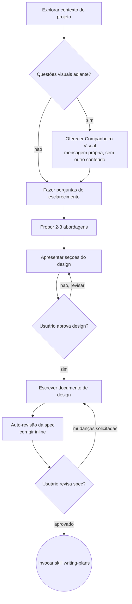

# Brainstorming de Ideias até Designs

Ajude a transformar ideias em designs e especificações completamente formados através de diálogo colaborativo natural.

Comece entendendo o contexto atual do projeto, depois faça perguntas uma de cada vez para refinar a ideia. Uma vez que você entenda o que está construindo, apresente o design e obtenha aprovação do usuário.

<HARD-GATE>
NÃO invoque nenhuma skill de implementação, escreva código, faça scaffold de projeto ou tome qualquer ação de implementação até ter apresentado um design e o usuário tê-lo aprovado. Isso se aplica a TODOS os projetos independentemente da simplicidade percebida.
</HARD-GATE>

## Anti-Padrão: "Isso É Simples Demais para Precisar de um Design"

Todo projeto passa por esse processo. Uma lista de tarefas, um utilitário de função única, uma mudança de configuração — todos eles. Projetos "simples" são onde suposições não examinadas causam mais trabalho desperdiçado. O design pode ser curto (algumas frases para projetos verdadeiramente simples), mas você DEVE apresentá-lo e obter aprovação.

## Checklist

Você DEVE criar uma tarefa para cada um desses itens e completá-los em ordem:

1. **Explorar contexto do projeto** — verificar arquivos, docs, commits recentes
2. **Oferecer companheiro visual** (se o tópico envolverá questões visuais) — esta é sua própria mensagem, não combinada com uma pergunta de esclarecimento. Veja a seção Companheiro Visual abaixo.
3. **Fazer perguntas de esclarecimento** — uma de cada vez, entender propósito/restrições/critérios de sucesso
4. **Propor 2-3 abordagens** — com trade-offs e sua recomendação
5. **Apresentar design** — em seções dimensionadas à sua complexidade, obter aprovação do usuário após cada seção
6. **Escrever documento de design** — salvar em `docs/superpowers/specs/YYYY-MM-DD-<tópico>-design.md` e commitar
7. **Auto-revisão da spec** — verificação rápida inline por placeholders, contradições, ambiguidade, escopo (veja abaixo)
8. **Usuário revisa spec escrita** — pedir ao usuário para revisar o arquivo de spec antes de prosseguir
9. **Transição para implementação** — invocar skill writing-plans para criar plano de implementação

## Fluxo do Processo

**O estado terminal é invocar writing-plans.** NÃO invoque frontend-design, mcp-builder ou qualquer outra skill de implementação. A ÚNICA skill que você invoca após o brainstorming é writing-plans.

## O Processo

**Entendendo a ideia:**

- Verifique o estado atual do projeto primeiro (arquivos, docs, commits recentes)
- Antes de fazer perguntas detalhadas, avalie o escopo: se a solicitação descreve múltiplos subsistemas independentes (ex.: "construa uma plataforma com chat, armazenamento de arquivos, cobrança e analytics"), sinalize isso imediatamente. Não gaste perguntas refinando detalhes de um projeto que precisa ser decomposto primeiro.
- Se o projeto for grande demais para uma única spec, ajude o usuário a decompor em sub-projetos: quais são as peças independentes, como elas se relacionam, em que ordem devem ser construídas? Então faça brainstorming do primeiro sub-projeto pelo fluxo normal de design. Cada sub-projeto tem seu próprio ciclo spec → plano → implementação.
- Para projetos de escopo apropriado, faça perguntas uma de cada vez para refinar a ideia
- Prefira perguntas de múltipla escolha quando possível, mas perguntas abertas também são válidas
- Apenas uma pergunta por mensagem — se um tópico precisar de mais exploração, divida em múltiplas perguntas
- Foco em entender: propósito, restrições, critérios de sucesso

**Explorando abordagens:**

- Proponha 2-3 abordagens diferentes com trade-offs
- Apresente opções de forma conversacional com sua recomendação e raciocínio
- Lidere com sua opção recomendada e explique o porquê

**Apresentando o design:**

- Uma vez que você acredita entender o que está construindo, apresente o design
- Dimensione cada seção à sua complexidade: algumas frases se for simples, até 200-300 palavras se for complexo
- Pergunte após cada seção se parece correto até agora
- Cubra: arquitetura, componentes, fluxo de dados, tratamento de erros, testes
- Esteja pronto para voltar e esclarecer se algo não fizer sentido

**Design para isolamento e clareza:**

- Quebre o sistema em unidades menores que cada uma tenha um propósito claro, se comuniquem através de interfaces bem definidas e possam ser entendidas e testadas independentemente
- Para cada unidade, você deve ser capaz de responder: o que ela faz, como você a usa e do que ela depende?
- Alguém pode entender o que uma unidade faz sem ler seus internos? Você pode mudar os internos sem quebrar consumidores? Se não, os limites precisam de trabalho.
- Unidades menores e bem delimitadas também são mais fáceis para você trabalhar — você raciocina melhor sobre código que pode manter em contexto de uma vez, e suas edições são mais confiáveis quando os arquivos são focados. Quando um arquivo cresce muito, isso geralmente é um sinal de que está fazendo muito.

**Trabalhando em codebases existentes:**

- Explore a estrutura atual antes de propor mudanças. Siga os padrões existentes.
- Onde o código existente tem problemas que afetam o trabalho (ex.: um arquivo que cresceu demais, limites pouco claros, responsabilidades entrelaçadas), inclua melhorias direcionadas como parte do design — da forma como um bom desenvolvedor melhora o código em que está trabalhando.
- Não proponha refatorações não relacionadas. Mantenha o foco no que serve ao objetivo atual.

## Após o Design

**Documentação:**

- Escreva o design validado (spec) em `docs/superpowers/specs/YYYY-MM-DD-<tópico>-design.md`
  - (Preferências do usuário para localização da spec substituem esse padrão)
- Use a skill elements-of-style:writing-clearly-and-concisely se disponível
- Faça commit do documento de design no git

**Auto-Revisão da Spec:**
Após escrever o documento de spec, olhe com olhos frescos:

1. **Varredura por placeholders:** Algum "TBD", "TODO", seções incompletas ou requisitos vagos? Corrija-os.
2. **Consistência interna:** Alguma seção contradiz outra? A arquitetura corresponde às descrições de funcionalidades?
3. **Verificação de escopo:** Isso é focado o suficiente para um único plano de implementação, ou precisa de decomposição?
4. **Verificação de ambiguidade:** Algum requisito pode ser interpretado de duas maneiras diferentes? Se sim, escolha uma e torne-a explícita.

Corrija quaisquer problemas inline. Não é necessário re-revisar — apenas corrija e siga em frente.

**Portão de Revisão do Usuário:**
Após o loop de revisão da spec passar, peça ao usuário para revisar a spec escrita antes de prosseguir:

> "Spec escrita e commitada em `<caminho>`. Por favor, revise-a e me diga se quer fazer alguma mudança antes de começarmos a escrever o plano de implementação."

Aguarde a resposta do usuário. Se solicitarem mudanças, faça-as e re-execute o loop de revisão da spec. Só prossiga após o usuário aprovar.

**Implementação:**

- Invoque a skill writing-plans para criar um plano de implementação detalhado
- NÃO invoque nenhuma outra skill. writing-plans é o próximo passo.

## Princípios Chave

- **Uma pergunta por vez** — Não sobrecarregue com múltiplas perguntas
- **Múltipla escolha preferida** — Mais fácil de responder do que aberta quando possível
- **YAGNI implacavelmente** — Remova funcionalidades desnecessárias de todos os designs
- **Explore alternativas** — Sempre proponha 2-3 abordagens antes de decidir
- **Validação incremental** — Apresente o design, obtenha aprovação antes de prosseguir
- **Seja flexível** — Volte e esclareça quando algo não fizer sentido

## Companheiro Visual

Um companheiro baseado em navegador para mostrar mockups, diagramas e opções visuais durante o brainstorming. Disponível como ferramenta — não como modo. Aceitar o companheiro significa que ele está disponível para questões que se beneficiam de tratamento visual; NÃO significa que toda pergunta passa pelo navegador.

**Oferecendo o companheiro:** Quando você antecipa que as próximas perguntas envolverão conteúdo visual (mockups, layouts, diagramas), ofereça uma vez para obter consentimento:
> "Algumas das coisas em que estamos trabalhando podem ser mais fáceis de explicar se eu puder mostrar no navegador da web. Posso preparar mockups, diagramas, comparações e outros visuais conforme avançamos. Esse recurso ainda é novo e pode ser intensivo em tokens. Quer tentar? (Requer abrir uma URL local)"

**Essa oferta DEVE ser sua própria mensagem.** Não a combine com perguntas de esclarecimento, resumos de contexto ou qualquer outro conteúdo. A mensagem deve conter APENAS a oferta acima e nada mais. Aguarde a resposta do usuário antes de continuar. Se recusarem, prossiga com brainstorming somente em texto.

**Decisão por pergunta:** Mesmo após o usuário aceitar, decida PARA CADA PERGUNTA se usar o navegador ou terminal. O teste: **o usuário entenderia isso melhor vendo do que lendo?**

- **Use o navegador** para conteúdo que É visual — mockups, wireframes, comparações de layout, diagramas de arquitetura, designs visuais lado a lado
- **Use o terminal** para conteúdo que é texto — perguntas de requisitos, escolhas conceituais, listas de trade-offs, opções de texto A/B/C/D, decisões de escopo

Uma pergunta sobre um tópico de UI não é automaticamente uma pergunta visual. "O que significa personalidade neste contexto?" é uma pergunta conceitual — use o terminal. "Qual layout de wizard funciona melhor?" é uma pergunta visual — use o navegador.

Se aceitarem o companheiro, leia o guia detalhado antes de prosseguir:
`skills/brainstorming/visual-companion.md`
