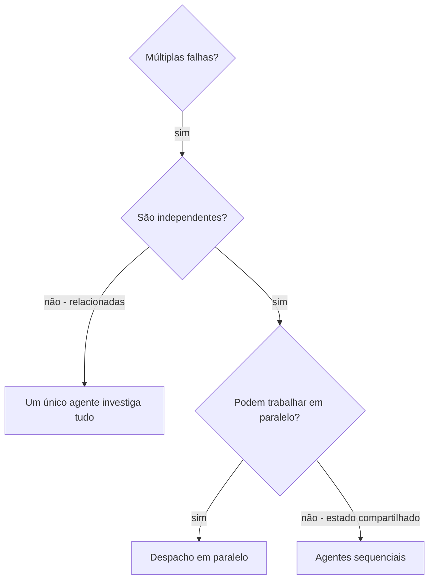

# Despachando Agentes em Paralelo

## Visão Geral

Você delega tarefas a agentes especializados com contexto isolado. Ao elaborar com precisão suas instruções e contexto, você garante que eles permaneçam focados e tenham sucesso na tarefa. Eles nunca devem herdar o contexto ou o histórico da sua sessão — você constrói exatamente o que eles precisam. Isso também preserva seu próprio contexto para o trabalho de coordenação.

Quando você tem múltiplas falhas não relacionadas (arquivos de teste diferentes, subsistemas diferentes, bugs diferentes), investigá-las sequencialmente é desperdício de tempo. Cada investigação é independente e pode acontecer em paralelo.

**Princípio fundamental:** Despache um agente por domínio de problema independente. Deixe-os trabalhar de forma concorrente.

## Quando Usar



**Use quando:**
- 3+ arquivos de teste falhando com diferentes causas raiz
- Múltiplos subsistemas quebrados de forma independente
- Cada problema pode ser entendido sem contexto dos outros
- Sem estado compartilhado entre as investigações

**Não use quando:**
- Falhas estão relacionadas (consertar uma pode consertar outras)
- Precisar entender o estado completo do sistema
- Agentes interferirem entre si

## O Padrão

### 1. Identificar Domínios Independentes

Agrupe as falhas pelo que está quebrado:
- Arquivo A de testes: Fluxo de aprovação de ferramenta
- Arquivo B de testes: Comportamento de conclusão em lote
- Arquivo C de testes: Funcionalidade de aborto

Cada domínio é independente — corrigir a aprovação de ferramenta não afeta os testes de aborto.

### 2. Criar Tarefas Focadas para os Agentes

Cada agente recebe:
- **Escopo específico:** Um arquivo de teste ou subsistema
- **Objetivo claro:** Fazer esses testes passarem
- **Restrições:** Não alterar outros códigos
- **Saída esperada:** Resumo do que foi encontrado e corrigido

### 3. Despachar em Paralelo

```typescript
// No ambiente Claude Code / IA
Task("Corrigir falhas em agent-tool-abort.test.ts")
Task("Corrigir falhas em batch-completion-behavior.test.ts")
Task("Corrigir falhas em tool-approval-race-conditions.test.ts")
// Os três rodam de forma concorrente
```

### 4. Revisar e Integrar

Quando os agentes retornarem:
- Leia cada resumo
- Verifique se as correções não conflitam
- Execute a suite de testes completa
- Integre todas as mudanças

## Estrutura do Prompt do Agente

Bons prompts de agente são:
1. **Focados** — Um domínio de problema claro
2. **Auto-contidos** — Todo o contexto necessário para entender o problema
3. **Específicos sobre a saída** — O que o agente deve retornar?

```markdown
Corrija os 3 testes falhando em src/agents/agent-tool-abort.test.ts:

1. "should abort tool with partial output capture" - espera 'interrupted at' na mensagem
2. "should handle mixed completed and aborted tools" - ferramenta rápida abortada em vez de concluída
3. "should properly track pendingToolCount" - espera 3 resultados, recebe 0

Esses são problemas de temporização/condição de corrida. Sua tarefa:

1. Leia o arquivo de teste e entenda o que cada teste verifica
2. Identifique a causa raiz — problemas de tempo ou bugs reais?
3. Corrija:
   - Substituindo timeouts arbitrários por espera baseada em eventos
   - Corrigindo bugs na implementação de aborto, se encontrados
   - Ajustando expectativas do teste se o comportamento mudou

NÃO apenas aumente os timeouts — encontre o problema real.

Retorne: Resumo do que encontrou e o que corrigiu.
```

## Erros Comuns

**❌ Muito amplo:** "Corrija todos os testes" — agente se perde
**✅ Específico:** "Corrija agent-tool-abort.test.ts" — escopo focado

**❌ Sem contexto:** "Corrija a condição de corrida" — agente não sabe onde
**✅ Com contexto:** Cole as mensagens de erro e nomes dos testes

**❌ Sem restrições:** Agente pode refatorar tudo
**✅ Com restrições:** "NÃO altere o código de produção" ou "Corrija apenas os testes"

**❌ Saída vaga:** "Corrija" — você não sabe o que mudou
**✅ Específico:** "Retorne resumo da causa raiz e das mudanças"

## Quando NÃO Usar

**Falhas relacionadas:** Corrigir uma pode corrigir outras — investigue juntas primeiro
**Precisar de contexto completo:** Entender requer ver o sistema inteiro
**Depuração exploratória:** Você ainda não sabe o que está quebrado
**Estado compartilhado:** Agentes interfeririam (editando os mesmos arquivos, usando os mesmos recursos)

## Exemplo Real da Sessão

**Cenário:** 6 falhas de teste em 3 arquivos após refatoração maior

**Falhas:**
- agent-tool-abort.test.ts: 3 falhas (problemas de temporização)
- batch-completion-behavior.test.ts: 2 falhas (ferramentas não executando)
- tool-approval-race-conditions.test.ts: 1 falha (contagem de execução = 0)

**Decisão:** Domínios independentes — lógica de aborto separada de conclusão em lote separada de condições de corrida

**Despacho:**
```
Agente 1 → Corrigir agent-tool-abort.test.ts
Agente 2 → Corrigir batch-completion-behavior.test.ts
Agente 3 → Corrigir tool-approval-race-conditions.test.ts
```

**Resultados:**
- Agente 1: Substituiu timeouts por espera baseada em eventos
- Agente 2: Corrigiu bug na estrutura de eventos (threadId no lugar errado)
- Agente 3: Adicionou espera para a execução assíncrona de ferramenta concluir

**Integração:** Todas as correções independentes, sem conflitos, suite completa verde

**Tempo economizado:** 3 problemas resolvidos em paralelo vs. sequencialmente

## Benefícios Principais

1. **Paralelização** — Múltiplas investigações acontecem simultaneamente
2. **Foco** — Cada agente tem escopo estreito, menos contexto para rastrear
3. **Independência** — Agentes não interferem entre si
4. **Velocidade** — 3 problemas resolvidos no tempo de 1

## Verificação

Após os agentes retornarem:
1. **Revise cada resumo** — Entenda o que mudou
2. **Verifique conflitos** — Os agentes editaram o mesmo código?
3. **Execute a suite completa** — Verifique se todas as correções funcionam juntas
4. **Inspeção pontual** — Agentes podem cometer erros sistemáticos

## Impacto no Mundo Real

De sessão de depuração (2025-10-03):
- 6 falhas em 3 arquivos
- 3 agentes despachados em paralelo
- Todas as investigações concluídas de forma concorrente
- Todas as correções integradas com sucesso
- Zero conflitos entre mudanças dos agentes
