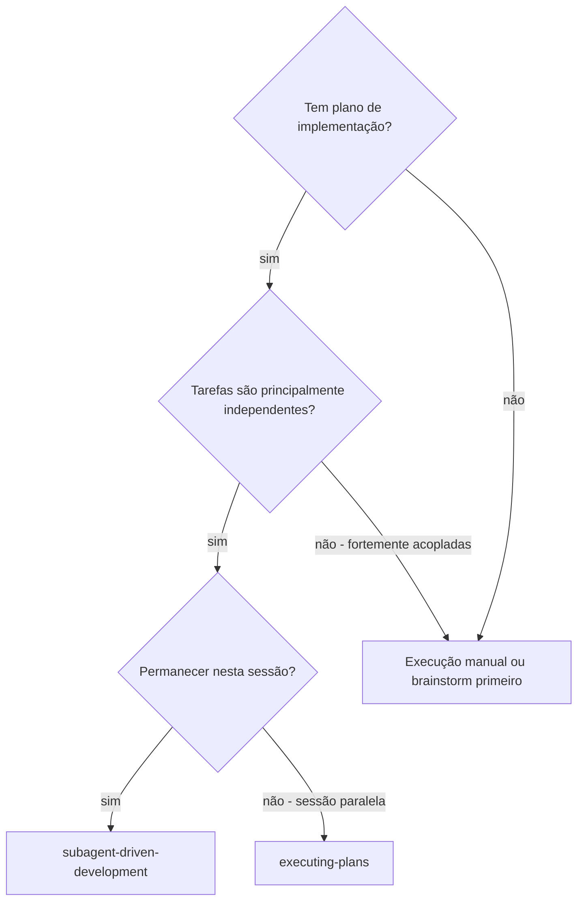
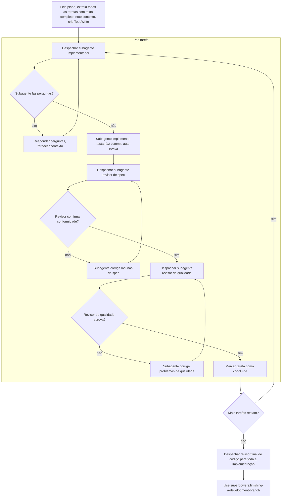

# Desenvolvimento Orientado por Subagentes

Execute o plano despachando um subagente fresco por tarefa, com revisão em dois estágios após cada uma: primeiro revisão de conformidade com a spec, depois revisão de qualidade de código.

**Por que subagentes:** Você delega tarefas a agentes especializados com contexto isolado. Ao elaborar com precisão suas instruções e contexto, você garante que eles permaneçam focados e tenham sucesso na tarefa. Eles nunca devem herdar o contexto ou histórico da sua sessão — você constrói exatamente o que eles precisam. Isso também preserva seu próprio contexto para o trabalho de coordenação.

**Princípio fundamental:** Subagente fresco por tarefa + revisão em dois estágios (spec depois qualidade) = alta qualidade, iteração rápida

**Execução contínua:** Não pause para verificar com seu parceiro humano entre as tarefas. Execute todas as tarefas do plano sem parar. As únicas razões para parar são: status BLOCKED que você não consegue resolver, ambiguidade que genuinamente impede o progresso, ou todas as tarefas concluídas. Prompts "Devo continuar?" e resumos de progresso desperdiçam o tempo deles — eles pediram para você executar o plano, então execute-o.

## Quando Usar



**vs. Executando Planos (sessão paralela):**
- Mesma sessão (sem troca de contexto)
- Subagente fresco por tarefa (sem contaminação de contexto)
- Revisão em dois estágios após cada tarefa: conformidade com spec primeiro, depois qualidade de código
- Iteração mais rápida (sem humano no loop entre tarefas)

## O Processo



## Seleção de Modelo

Use o modelo menos poderoso que consiga lidar com cada papel para conservar custos e aumentar a velocidade.

**Tarefas de implementação mecânica** (funções isoladas, specs claras, 1-2 arquivos): use um modelo rápido e barato. A maioria das tarefas de implementação é mecânica quando o plano é bem especificado.

**Tarefas de integração e julgamento** (coordenação multi-arquivo, correspondência de padrões, depuração): use um modelo padrão.

**Tarefas de arquitetura, design e revisão:** use o modelo mais capaz disponível.

**Sinais de complexidade da tarefa:**
- Toca 1-2 arquivos com spec completa → modelo barato
- Toca múltiplos arquivos com preocupações de integração → modelo padrão
- Requer julgamento de design ou entendimento amplo da base de código → modelo mais capaz

## Tratando Status do Implementador

Os subagentes implementadores reportam um de quatro status. Trate cada um adequadamente:

**DONE:** Prossiga para a revisão de conformidade com a spec.

**DONE_WITH_CONCERNS:** O implementador completou o trabalho mas sinalizou dúvidas. Leia as preocupações antes de prosseguir. Se as preocupações forem sobre correção ou escopo, trate-as antes da revisão. Se forem observações (por exemplo, "este arquivo está ficando grande"), anote-as e prossiga para a revisão.

**NEEDS_CONTEXT:** O implementador precisa de informações que não foram fornecidas. Forneça o contexto ausente e re-despache.

**BLOCKED:** O implementador não consegue completar a tarefa. Avalie o bloqueio:
1. Se for um problema de contexto, forneça mais contexto e re-despache com o mesmo modelo
2. Se a tarefa requer mais raciocínio, re-despache com um modelo mais capaz
3. Se a tarefa for muito grande, divida em partes menores
4. Se o plano em si estiver errado, escale para o humano

**Nunca** ignore um escalonamento ou force o mesmo modelo a tentar novamente sem mudanças. Se o implementador disse que está travado, algo precisa mudar.

## Templates de Prompt

- `./implementer-prompt.md` — Despachar subagente implementador
- `./spec-reviewer-prompt.md` — Despachar subagente revisor de conformidade com spec
- `./code-quality-reviewer-prompt.md` — Despachar subagente revisor de qualidade de código

## Exemplo de Workflow

```
Você: Estou usando Desenvolvimento Orientado por Subagentes para executar este plano.

[Leia o arquivo do plano uma vez: docs/superpowers/plans/feature-plan.md]
[Extraia todas as 5 tarefas com texto completo e contexto]
[Crie TodoWrite com todas as tarefas]

Tarefa 1: Script de instalação do hook

[Obtenha texto e contexto da Tarefa 1 (já extraídos)]
[Despache subagente de implementação com texto completo da tarefa + contexto]

Implementador: "Antes de começar — o hook deve ser instalado no nível do usuário ou do sistema?"

Você: "Nível do usuário (~/.config/superpowers/hooks/)"

Implementador: "Entendido. Implementando agora..."
[Depois] Implementador:
  - Implementou o comando install-hook
  - Adicionou testes, 5/5 passando
  - Auto-revisão: Percebi que perdi a flag --force, adicionei
  - Commit feito

[Despache revisor de conformidade com spec]
Revisor de spec: ✅ Conforme com spec — todos os requisitos atendidos, nada extra

[Obtenha SHAs do git, despache revisor de qualidade de código]
Revisor de código: Pontos fortes: Boa cobertura de testes, limpo. Problemas: Nenhum. Aprovado.

[Marque Tarefa 1 como concluída]

Tarefa 2: Modos de recuperação
...
```

## Vantagens

**vs. Execução manual:**
- Subagentes seguem TDD naturalmente
- Contexto fresco por tarefa (sem confusão)
- Paralelo-seguro (subagentes não interferem)
- Subagente pode fazer perguntas (antes E durante o trabalho)

**vs. Executando Planos:**
- Mesma sessão (sem transferência)
- Progresso contínuo (sem espera)
- Checkpoints de revisão automáticos

**Eficiência:**
- Sem overhead de leitura de arquivos (controlador fornece texto completo)
- Controlador curte exatamente o contexto necessário
- Subagente recebe informações completas antecipadamente
- Perguntas surgem antes do início do trabalho (não depois)

**Portais de qualidade:**
- Auto-revisão captura problemas antes da transferência
- Revisão em dois estágios: conformidade com spec, depois qualidade de código
- Loops de revisão garantem que as correções realmente funcionem
- Conformidade com spec evita over/under-building
- Qualidade de código garante que a implementação está bem construída

## Sinais de Alerta

**Nunca:**
- Comece a implementação no branch main/master sem consentimento explícito do usuário
- Pule revisões (conformidade com spec OU qualidade de código)
- Prossiga com problemas não corrigidos
- Despache múltiplos subagentes de implementação em paralelo (conflitos)
- Faça o subagente ler o arquivo do plano (forneça o texto completo em vez disso)
- Pule o contexto de definição de cena (o subagente precisa entender onde a tarefa se encaixa)
- Ignore perguntas do subagente (responda antes de deixá-los prosseguir)
- Aceite "próximo o suficiente" na conformidade com spec (revisor encontrou problemas = não concluído)
- Pule loops de revisão (revisor encontrou problemas = implementador corrige = revisa novamente)
- Deixe a auto-revisão do implementador substituir a revisão real (ambas são necessárias)
- **Comece a revisão de qualidade de código antes da conformidade com spec ser ✅** (ordem errada)
- Passe para a próxima tarefa enquanto qualquer revisão tiver problemas em aberto
