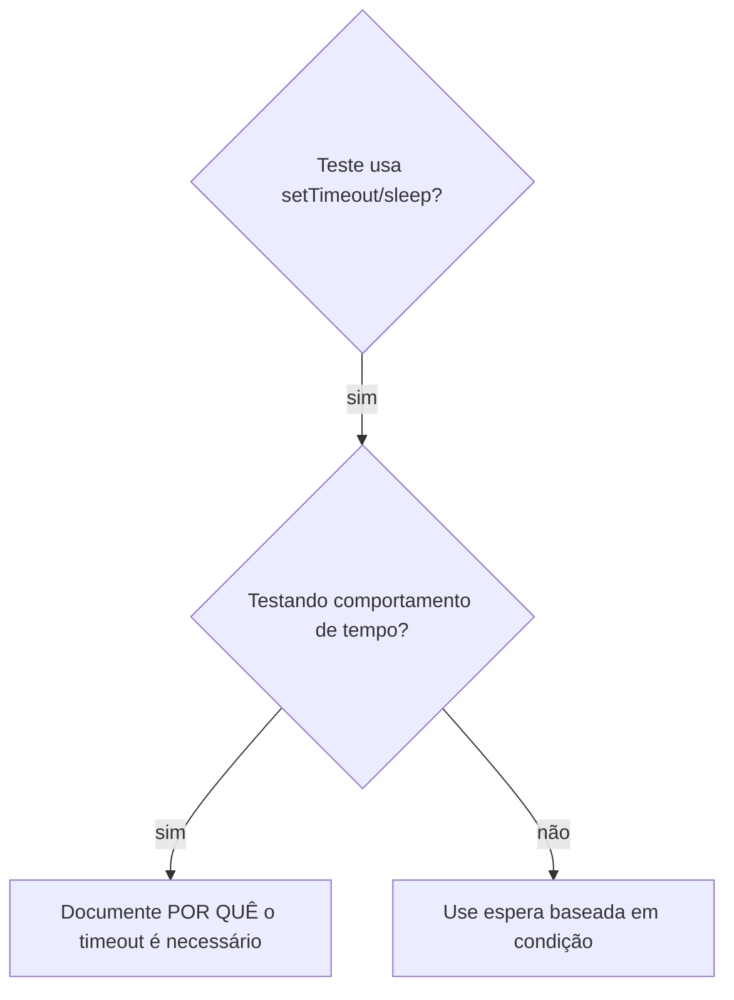

# Espera Baseada em Condição

## Visão Geral

Testes instáveis geralmente tentam adivinhar o tempo com atrasos arbitrários. Isso cria condições de corrida onde os testes passam em máquinas rápidas, mas falham sob carga ou no CI.

**Princípio fundamental:** Espere pela condição real que você se importa, não uma estimativa de quanto tempo leva.

## Quando Usar



**Use quando:**
- Testes têm atrasos arbitrários (`setTimeout`, `sleep`, `time.sleep()`)
- Testes são instáveis (passam às vezes, falham sob carga)
- Testes fazem timeout quando executados em paralelo
- Aguardando operações assíncronas completarem

**Não use quando:**
- Testando comportamento de tempo real (debounce, intervalos de throttle)
- Sempre documente POR QUÊ se usar timeout arbitrário

## Padrão Principal

```typescript
// ❌ ANTES: Adivinhando o tempo
await new Promise(r => setTimeout(r, 50));
const result = getResult();
expect(result).toBeDefined();

// ✅ DEPOIS: Esperando a condição
await waitFor(() => getResult() !== undefined);
const result = getResult();
expect(result).toBeDefined();
```

## Padrões Rápidos

| Cenário | Padrão |
|---------|---------|
| Espere por evento | `waitFor(() => events.find(e => e.type === 'DONE'))` |
| Espere por estado | `waitFor(() => machine.state === 'ready')` |
| Espere por contagem | `waitFor(() => items.length >= 5)` |
| Espere por arquivo | `waitFor(() => fs.existsSync(path))` |
| Condição complexa | `waitFor(() => obj.ready && obj.value > 10)` |

## Implementação

Função de polling genérica:
```typescript
async function waitFor<T>(
  condition: () => T | undefined | null | false,
  description: string,
  timeoutMs = 5000
): Promise<T> {
  const startTime = Date.now();

  while (true) {
    const result = condition();
    if (result) return result;

    if (Date.now() - startTime > timeoutMs) {
      throw new Error(`Timeout aguardando ${description} após ${timeoutMs}ms`);
    }

    await new Promise(r => setTimeout(r, 10)); // Faz polling a cada 10ms
  }
}
```

Veja `condition-based-waiting-example.ts` neste diretório para implementação completa com helpers específicos de domínio (`waitForEvent`, `waitForEventCount`, `waitForEventMatch`) de sessão de depuração real.

## Erros Comuns

**❌ Polling muito rápido:** `setTimeout(check, 1)` — desperdiça CPU
**✅ Correção:** Faça polling a cada 10ms

**❌ Sem timeout:** Loop infinito se a condição nunca for atendida
**✅ Correção:** Sempre inclua timeout com erro claro

**❌ Dados antigos:** Armazena estado em cache antes do loop
**✅ Correção:** Chame o getter dentro do loop para dados frescos

## Quando Timeout Arbitrário É CORRETO

```typescript
// Ferramenta faz tick a cada 100ms — precisa de 2 ticks para verificar saída parcial
await waitForEvent(manager, 'TOOL_STARTED'); // Primeiro: aguarde a condição
await new Promise(r => setTimeout(r, 200));   // Depois: aguarde comportamento temporizado
// 200ms = 2 ticks a 100ms de intervalo — documentado e justificado
```

**Requisitos:**
1. Primeiro aguarde a condição de gatilho
2. Baseado em timing conhecido (não adivinhando)
3. Comentário explicando POR QUÊ

## Impacto no Mundo Real

De sessão de depuração (2025-10-03):
- Corrigidos 15 testes instáveis em 3 arquivos
- Taxa de aprovação: 60% → 100%
- Tempo de execução: 40% mais rápido
- Zero condições de corrida
