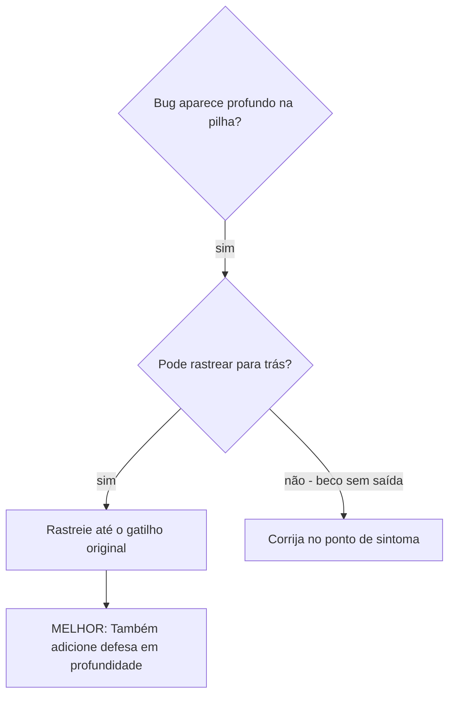
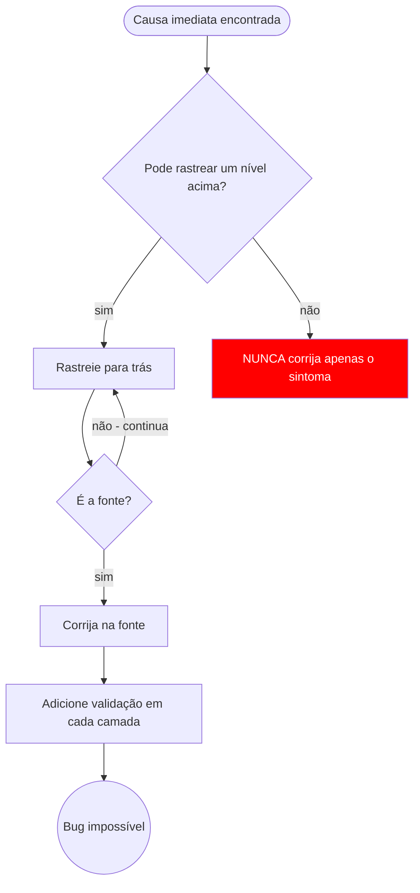

# Rastreamento de Causa Raiz

## Visão Geral

Bugs geralmente se manifestam profundamente no call stack (git init no diretório errado, arquivo criado no local errado, banco de dados aberto com caminho errado). Seu instinto é corrigir onde o erro aparece, mas isso é tratar um sintoma.

**Princípio fundamental:** Rastreie de volta pela cadeia de chamadas até encontrar o gatilho original, depois corrija na fonte.

## Quando Usar



**Use quando:**
- Erro acontece profundo na execução (não no ponto de entrada)
- Stack trace mostra longa cadeia de chamadas
- Não está claro de onde dados inválidos se originaram
- Precisar encontrar qual teste/código aciona o problema

## O Processo de Rastreamento

### 1. Observe o Sintoma
```
Erro: git init falhou em ~/project/packages/core
```

### 2. Encontre a Causa Imediata
**Que código diretamente causa isso?**
```typescript
await execFileAsync('git', ['init'], { cwd: projectDir });
```

### 3. Pergunte: O Que Chamou Isso?
```typescript
WorktreeManager.createSessionWorktree(projectDir, sessionId)
  → chamado por Session.initializeWorkspace()
  → chamado por Session.create()
  → chamado por teste em Project.create()
```

### 4. Continue Rastreando
**Qual valor foi passado?**
- `projectDir = ''` (string vazia!)
- String vazia como `cwd` resolve para `process.cwd()`
- Esse é o diretório do código-fonte!

### 5. Encontre o Gatilho Original
**De onde veio a string vazia?**
```typescript
const context = setupCoreTest(); // Retorna { tempDir: '' }
Project.create('name', context.tempDir); // Acessado antes do beforeEach!
```

## Adicionando Stack Traces

Quando não consegue rastrear manualmente, adicione instrumentação:

```typescript
// Antes da operação problemática
async function gitInit(directory: string) {
  const stack = new Error().stack;
  console.error('DEBUG git init:', {
    directory,
    cwd: process.cwd(),
    nodeEnv: process.env.NODE_ENV,
    stack,
  });

  await execFileAsync('git', ['init'], { cwd: directory });
}
```

**Crítico:** Use `console.error()` em testes (não logger — pode não aparecer)

**Execute e capture:**
```bash
npm test 2>&1 | grep 'DEBUG git init'
```

**Analise os stack traces:**
- Procure nomes de arquivos de teste
- Encontre o número de linha que aciona a chamada
- Identifique o padrão (mesmo teste? mesmo parâmetro?)

## Encontrando Qual Teste Causa Poluição

Se algo aparece durante os testes mas você não sabe qual teste:

Use o script de bisecção `find-polluter.sh` neste diretório:

```bash
./find-polluter.sh '.git' 'src/**/*.test.ts'
```

Executa testes um por um, para no primeiro poluidor. Veja o script para uso.

## Exemplo Real: projectDir Vazio

**Sintoma:** `.git` criado em `packages/core/` (código-fonte)

**Cadeia de rastreamento:**
1. `git init` executa em `process.cwd()` ← parâmetro cwd vazio
2. WorktreeManager chamado com projectDir vazio
3. Session.create() passou string vazia
4. Teste acessou `context.tempDir` antes do beforeEach
5. setupCoreTest() retorna `{ tempDir: '' }` inicialmente

**Causa raiz:** Inicialização de variável de nível superior acessando valor vazio

**Correção:** Tornou tempDir um getter que lança exceção se acessado antes do beforeEach

**Também adicionou defesa em profundidade:**
- Camada 1: Project.create() valida diretório
- Camada 2: WorkspaceManager valida não vazio
- Camada 3: Guard de NODE_ENV recusa git init fora de tmpdir
- Camada 4: Logging de stack trace antes de git init

## Princípio Fundamental



**NUNCA corrija apenas onde o erro aparece.** Rastreie de volta para encontrar o gatilho original.

## Dicas de Stack Trace

**Em testes:** Use `console.error()` não o logger — o logger pode estar suprimido
**Antes da operação:** Log antes da operação perigosa, não depois que ela falha
**Inclua contexto:** Diretório, cwd, variáveis de ambiente, timestamps
**Capture stack:** `new Error().stack` mostra a cadeia de chamadas completa

## Impacto no Mundo Real

De sessão de depuração (2025-10-03):
- Causa raiz encontrada através de rastreamento de 5 níveis
- Corrigida na fonte (validação com getter)
- 4 camadas de defesa adicionadas
- 1847 testes passaram, zero poluição
