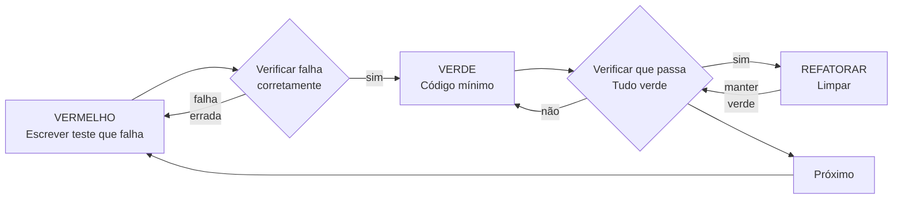

# Desenvolvimento Orientado a Testes (TDD)

## Visão Geral

Escreva o teste primeiro. Observe-o falhar. Escreva o código mínimo para passar.

**Princípio fundamental:** Se você não observou o teste falhar, você não sabe se ele testa a coisa certa.

**Violar a letra das regras é violar o espírito das regras.**

## Quando Usar

**Sempre:**
- Novas funcionalidades
- Correções de bugs
- Refatorações
- Mudanças de comportamento

**Exceções (pergunte ao seu parceiro humano):**
- Protótipos descartáveis
- Código gerado
- Arquivos de configuração

Pensando "pular TDD só dessa vez"? Pare. Isso é racionalização.

## A Lei de Ferro

```
SEM CÓDIGO DE PRODUÇÃO SEM UM TESTE QUE FALHA PRIMEIRO
```

Escreveu código antes do teste? Delete-o. Comece de novo.

**Sem exceções:**
- Não mantenha como "referência"
- Não o "adapte" enquanto escreve testes
- Não o olhe
- Deletar significa deletar

Implemente do zero a partir dos testes. Ponto final.

## Vermelho-Verde-Refatorar



### VERMELHO - Escrever Teste que Falha

Escreva um teste mínimo mostrando o que deve acontecer.

**Bom:**
```typescript
test('tenta operações com falha 3 vezes', async () => {
  let tentativas = 0;
  const operacao = () => {
    tentativas++;
    if (tentativas < 3) throw new Error('falha');
    return 'sucesso';
  };

  const resultado = await tentarOperacao(operacao);

  expect(resultado).toBe('sucesso');
  expect(tentativas).toBe(3);
});
```
Nome claro, testa comportamento real, uma coisa

**Ruim:**
```typescript
test('retry funciona', async () => {
  const mock = jest.fn()
    .mockRejectedValueOnce(new Error())
    .mockRejectedValueOnce(new Error())
    .mockResolvedValueOnce('sucesso');
  await tentarOperacao(mock);
  expect(mock).toHaveBeenCalledTimes(3);
});
```
Nome vago, testa mock não código

**Requisitos:**
- Um comportamento
- Nome claro
- Código real (sem mocks a menos que inevitável)

### Verificar VERMELHO - Observe Falhar

**OBRIGATÓRIO. Nunca pule.**

```bash
npm test caminho/para/test.test.ts
```

Confirme:
- O teste falha (não gera erros)
- A mensagem de falha é esperada
- Falha porque a funcionalidade está ausente (não por erros de digitação)

**Teste passa?** Você está testando comportamento existente. Corrija o teste.

**Teste gera erros?** Corrija o erro, re-execute até falhar corretamente.

### VERDE - Código Mínimo

Escreva o código mais simples para passar o teste.

**Bom:**
```typescript
async function tentarOperacao<T>(fn: () => Promise<T>): Promise<T> {
  for (let i = 0; i < 3; i++) {
    try {
      return await fn();
    } catch (e) {
      if (i === 2) throw e;
    }
  }
  throw new Error('inatingível');
}
```
Apenas o suficiente para passar

**Ruim:**
```typescript
async function tentarOperacao<T>(
  fn: () => Promise<T>,
  opcoes?: {
    maxTentativas?: number;
    backoff?: 'linear' | 'exponencial';
    aoTentar?: (tentativa: number) => void;
  }
): Promise<T> {
  // YAGNI
}
```
Over-engineered

Não adicione funcionalidades, refatore outro código ou "melhore" além do teste.

### Verificar VERDE - Observe Passar

**OBRIGATÓRIO.**

```bash
npm test caminho/para/test.test.ts
```

Confirme:
- O teste passa
- Outros testes ainda passam
- Saída limpa (sem erros, avisos)

**Teste falha?** Corrija o código, não o teste.

**Outros testes falham?** Corrija agora.

### REFATORAR - Limpar

Após o verde apenas:
- Remova duplicação
- Melhore nomes
- Extraia helpers

Mantenha os testes verdes. Não adicione comportamento.

### Repita

Próximo teste com falha para a próxima funcionalidade.

## Bons Testes

| Qualidade | Bom | Ruim |
|-----------|-----|------|
| **Mínimo** | Uma coisa. "e" no nome? Divida. | `test('valida email e domínio e espaços em branco')` |
| **Claro** | Nome descreve comportamento | `test('test1')` |
| **Mostra intenção** | Demonstra a API desejada | Obscurece o que o código deve fazer |

## Por Que a Ordem Importa

**"Vou escrever testes depois para verificar que funciona"**

Testes escritos após o código passam imediatamente. Passar imediatamente não prova nada:
- Pode testar a coisa errada
- Pode testar implementação, não comportamento
- Pode perder casos extremos que você esqueceu
- Você nunca viu capturar o bug

Testar primeiro força você a ver o teste falhar, provando que realmente testa algo.

**"Já testei manualmente todos os casos extremos"**

Testes manuais são ad-hoc. Você acha que testou tudo, mas:
- Sem registro do que foi testado
- Não pode re-executar quando o código muda
- Fácil esquecer casos sob pressão
- "Funcionou quando tentei" ≠ abrangente

Testes automatizados são sistemáticos. Executam da mesma forma toda vez.

**"Deletar X horas de trabalho é desperdício"**

Falácia do custo irrecuperável. O tempo já foi embora. Sua escolha agora:
- Deletar e reescrever com TDD (X horas a mais, alta confiança)
- Manter e adicionar testes depois (30 min, baixa confiança, bugs prováveis)

O "desperdício" é manter código em que não pode confiar. Código funcionando sem testes reais é dívida técnica.

**"TDD é dogmático, ser pragmático significa adaptar"**

TDD É pragmático:
- Encontra bugs antes do commit (mais rápido do que depurar depois)
- Previne regressões (testes capturam quebras imediatamente)
- Documenta comportamento (testes mostram como usar o código)
- Permite refatoração (mude livremente, testes capturam quebras)

Atalhos "pragmáticos" = depuração em produção = mais lento.

**"Testes depois alcançam os mesmos objetivos — é o espírito não o ritual"**

Não. Testes-depois respondem "O que isso faz?" Testes-primeiro respondem "O que isso deve fazer?"

Testes-depois são tendenciosos pela sua implementação. Você testa o que construiu, não o que é exigido. Você verifica casos extremos lembrados, não descobertos.

Testes-primeiro forçam a descoberta de casos extremos antes de implementar. Testes-depois verificam se você se lembrou de tudo (não se lembrou).

30 minutos de testes depois ≠ TDD. Você obtém cobertura, perde prova de que os testes funcionam.

## Racionalizações Comuns

| Desculpa | Realidade |
|----------|-----------|
| "Simples demais para testar" | Código simples quebra. Teste leva 30 segundos. |
| "Vou testar depois" | Testes passando imediatamente não provam nada. |
| "Testes depois alcançam os mesmos objetivos" | Testes-depois = "o que isso faz?" Testes-primeiro = "o que isso deve fazer?" |
| "Já testei manualmente" | Ad-hoc ≠ sistemático. Sem registro, não pode re-executar. |
| "Deletar X horas é desperdício" | Falácia do custo irrecuperável. Manter código não verificado é dívida técnica. |
| "Manter como referência, escrever testes primeiro" | Você vai adaptá-lo. Isso é testar depois. Deletar significa deletar. |
| "Preciso explorar primeiro" | Tudo bem. Jogue fora a exploração, comece com TDD. |
| "Teste difícil = design pouco claro" | Ouça o teste. Difícil de testar = difícil de usar. |
| "TDD vai me atrasar" | TDD mais rápido do que depurar. Pragmático = test-first. |
| "Teste manual mais rápido" | Manual não prova casos extremos. Vai re-testar a cada mudança. |
| "Código existente não tem testes" | Você está melhorando-o. Adicione testes para código existente. |

## Sinais de Alerta — PARE e Recomece

- Código antes do teste
- Teste após a implementação
- Teste passa imediatamente
- Não consegue explicar por que o teste falhou
- Testes adicionados "depois"
- Racionalizando "só dessa vez"
- "Já testei manualmente"
- "Testes depois alcançam o mesmo propósito"
- "É sobre o espírito não o ritual"
- "Manter como referência" ou "adaptar código existente"
- "Já gastei X horas, deletar é desperdício"
- "TDD é dogmático, estou sendo pragmático"
- "Isso é diferente porque..."

**Todos esses significam: Delete o código. Recomece com TDD.**

## Exemplo: Correção de Bug

**Bug:** Email vazio aceito

**VERMELHO**
```typescript
test('rejeita email vazio', async () => {
  const resultado = await enviarFormulario({ email: '' });
  expect(resultado.error).toBe('Email obrigatório');
});
```

**Verificar VERMELHO**
```bash
$ npm test
FAIL: expected 'Email obrigatório', got undefined
```

**VERDE**
```typescript
function enviarFormulario(dados: DadosFormulario) {
  if (!dados.email?.trim()) {
    return { error: 'Email obrigatório' };
  }
  // ...
}
```

**Verificar VERDE**
```bash
$ npm test
PASS
```

**REFATORAR**
Extraia validação para múltiplos campos se necessário.

## Checklist de Verificação

Antes de marcar o trabalho como completo:

- [ ] Toda nova função/método tem um teste
- [ ] Observei cada teste falhar antes de implementar
- [ ] Cada teste falhou pelo motivo esperado (funcionalidade ausente, não erro de digitação)
- [ ] Escrevi código mínimo para passar cada teste
- [ ] Todos os testes passam
- [ ] Saída limpa (sem erros, avisos)
- [ ] Testes usam código real (mocks apenas se inevitável)
- [ ] Casos extremos e erros cobertos

Não consegue marcar todas as caixas? Você pulou TDD. Recomece.

## Quando Travado

| Problema | Solução |
|----------|---------|
| Não sabe como testar | Escreva a API desejada. Escreva a assertion primeiro. Pergunte ao seu parceiro humano. |
| Teste muito complicado | Design muito complicado. Simplifique a interface. |
| Deve mockar tudo | Código muito acoplado. Use injeção de dependência. |
| Setup do teste enorme | Extraia helpers. Ainda complexo? Simplifique o design. |

## Integração com Depuração

Bug encontrado? Escreva um teste com falha reproduzindo-o. Siga o ciclo TDD. O teste prova a correção e previne regressão.

Nunca corrija bugs sem um teste.

## Anti-Padrões de Teste

Ao adicionar mocks ou utilitários de teste, leia @testing-anti-patterns.md para evitar armadilhas comuns:
- Testar comportamento do mock em vez do comportamento real
- Adicionar métodos apenas para teste em classes de produção
- Mockar sem entender dependências

## Regra Final

```
Código de produção → teste existe e falhou primeiro
Caso contrário → não é TDD
```

Sem exceções sem permissão do seu parceiro humano.
