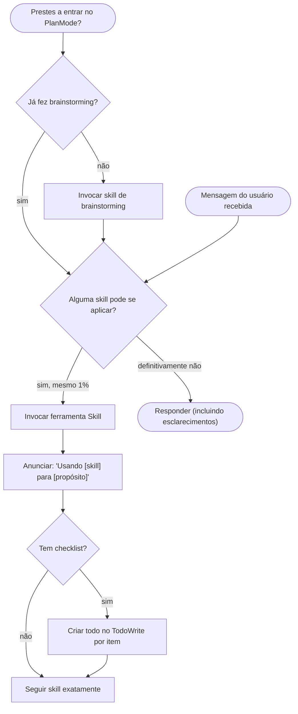

<SUBAGENT-STOP>
Se você foi despachado como um subagente para executar uma tarefa específica, pule esta skill.
</SUBAGENT-STOP>

<EXTREMAMENTE-IMPORTANTE>
Se você acha que há mesmo 1% de chance de que uma skill possa se aplicar ao que você está fazendo, você ABSOLUTAMENTE DEVE invocar a skill.

SE UMA SKILL SE APLICA À SUA TAREFA, VOCÊ NÃO TEM ESCOLHA. VOCÊ DEVE USÁ-LA.

Isso não é negociável. Isso não é opcional. Você não pode racionalizar para sair disso.
</EXTREMAMENTE-IMPORTANTE>

## Prioridade de Instruções

Skills do Superpowers sobrepõem o comportamento padrão do system prompt, mas **instruções do usuário sempre têm precedência**:

1. **Instruções explícitas do usuário** (CLAUDE.md, GEMINI.md, AGENTS.md, solicitações diretas) — maior prioridade
2. **Skills do Superpowers** — sobrepõem comportamento padrão do sistema onde conflitam
3. **System prompt padrão** — menor prioridade

Se CLAUDE.md, GEMINI.md ou AGENTS.md diz "não use TDD" e uma skill diz "sempre use TDD," siga as instruções do usuário. O usuário está no controle.

## Como Acessar Skills

**No Claude Code:** Use a ferramenta `Skill`. Quando você invoca uma skill, seu conteúdo é carregado e apresentado a você — siga-o diretamente. Nunca use a ferramenta Read em arquivos de skill.

**No Copilot CLI:** Use a ferramenta `skill`. Skills são auto-descobertas a partir de plugins instalados. A ferramenta `skill` funciona da mesma forma que a ferramenta `Skill` do Claude Code.

**No Gemini CLI:** Skills são ativadas via ferramenta `activate_skill`. O Gemini carrega metadados de skill no início da sessão e ativa o conteúdo completo sob demanda.

**Em outros ambientes:** Verifique a documentação da sua plataforma sobre como skills são carregadas.

## Adaptação de Plataforma

Skills usam nomes de ferramentas do Claude Code. Plataformas não-CC: veja `references/copilot-tools.md` (Copilot CLI), `references/codex-tools.md` (Codex) para equivalentes de ferramentas. Usuários do Gemini CLI obtêm o mapeamento de ferramentas carregado automaticamente via GEMINI.md.

# Usando Skills

## A Regra

**Invoque skills relevantes ou solicitadas ANTES de qualquer resposta ou ação.** Mesmo uma chance de 1% de que uma skill possa se aplicar significa que você deve invocar a skill para verificar. Se uma skill invocada acabar sendo errada para a situação, você não precisa usá-la.

## Sinais de Alerta

Esses pensamentos significam PARE — você está racionalizando:

| Pensamento | Realidade |
|------------|-----------|
| "Esta é apenas uma pergunta simples" | Perguntas são tarefas. Verifique skills. |
| "Preciso de mais contexto primeiro" | Verificação de skill vem ANTES das perguntas de esclarecimento. |
| "Deixa eu explorar o codebase primeiro" | Skills dizem COMO explorar. Verifique primeiro. |
| "Posso verificar git/arquivos rapidamente" | Arquivos carecem de contexto de conversa. Verifique skills. |
| "Deixa eu reunir informações primeiro" | Skills dizem COMO reunir informações. |
| "Isso não precisa de uma skill formal" | Se uma skill existe, use-a. |
| "Lembro desta skill" | Skills evoluem. Leia a versão atual. |
| "Isso não conta como uma tarefa" | Ação = tarefa. Verifique skills. |
| "A skill é exagero" | Coisas simples ficam complexas. Use-a. |
| "Vou fazer só essa coisa primeiro" | Verifique ANTES de fazer qualquer coisa. |
| "Isso parece produtivo" | Ação indisciplinada desperdiça tempo. Skills previnem isso. |
| "Sei o que isso significa" | Conhecer o conceito ≠ usar a skill. Invoque-a. |

## Prioridade de Skills

Quando múltiplas skills podem se aplicar, use esta ordem:

1. **Skills de processo primeiro** (brainstorming, debugging) — determinam COMO abordar a tarefa
2. **Skills de implementação depois** (frontend-design, mcp-builder) — guiam a execução

"Vamos construir X" → brainstorming primeiro, depois skills de implementação.
"Corrija este bug" → debugging primeiro, depois skills específicas de domínio.

## Tipos de Skills

**Rígidas** (TDD, debugging): Siga exatamente. Não adapte eliminando a disciplina.

**Flexíveis** (padrões): Adapte princípios ao contexto.

A própria skill diz qual é.

## Instruções do Usuário

Instruções dizem O QUÊ, não COMO. "Adicione X" ou "Corrija Y" não significa pular workflows.
