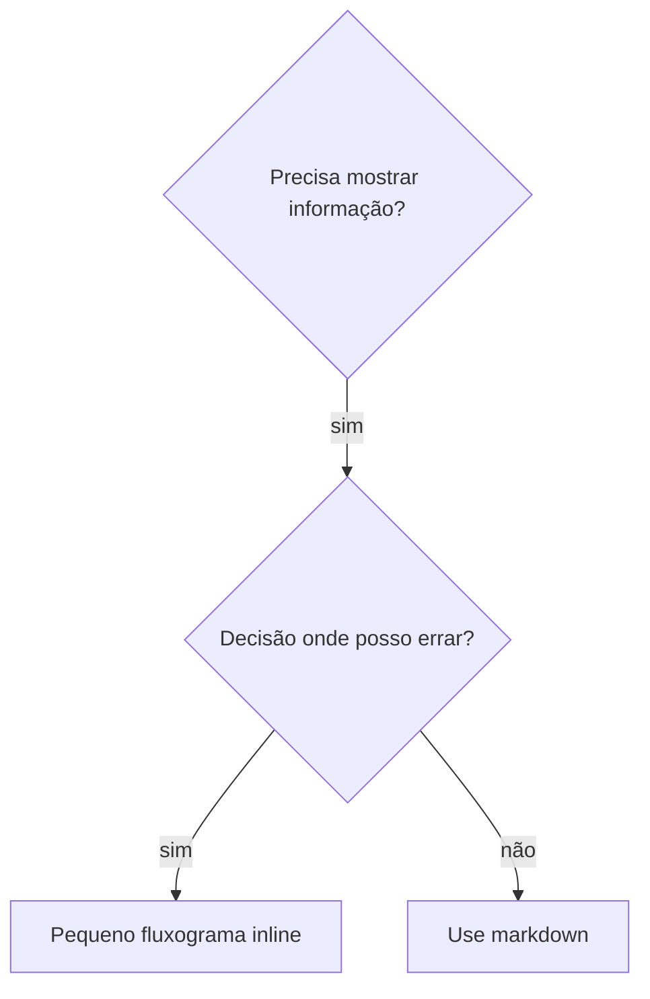

# Escrevendo Skills

## Visão Geral

**Escrever skills É Desenvolvimento Orientado a Testes aplicado à documentação de processos.**

**Skills pessoais vivem em diretórios específicos do agente (`~/.claude/skills` para Claude Code, `~/.agents/skills/` para Codex)**

Você escreve casos de teste (cenários de pressão com subagentes), observa-os falhar (comportamento de baseline), escreve a skill (documentação), observa os testes passarem (agentes cumprem) e refatora (fecha brechas).

**Princípio fundamental:** Se você não observou um agente falhar sem a skill, você não sabe se a skill ensina a coisa certa.

**CONTEXTO OBRIGATÓRIO:** Você DEVE entender superpowers:test-driven-development antes de usar esta skill. Essa skill define o ciclo fundamental VERMELHO-VERDE-REFATORAR. Esta skill adapta TDD à documentação.

**Guia oficial:** Para as melhores práticas oficiais de autoria de skill da Anthropic, veja anthropic-best-practices.md. Este documento fornece padrões e diretrizes adicionais que complementam a abordagem focada em TDD desta skill.

## O Que é uma Skill?

Uma **skill** é um guia de referência para técnicas, padrões ou ferramentas comprovados. Skills ajudam futuras instâncias do Claude a encontrar e aplicar abordagens eficazes.

**Skills são:** Técnicas reutilizáveis, padrões, ferramentas, guias de referência

**Skills NÃO são:** Narrativas sobre como você resolveu um problema uma vez

## Mapeamento TDD para Skills

| Conceito TDD | Criação de Skill |
|--------------|-----------------|
| **Caso de teste** | Cenário de pressão com subagente |
| **Código de produção** | Documento de skill (SKILL.md) |
| **Teste falha (VERMELHO)** | Agente viola regra sem skill (baseline) |
| **Teste passa (VERDE)** | Agente cumpre com skill presente |
| **Refatorar** | Fechar brechas mantendo conformidade |
| **Escrever teste primeiro** | Executar cenário baseline ANTES de escrever skill |
| **Observar falhar** | Documentar racionalizações exatas do agente |
| **Código mínimo** | Escrever skill abordando essas violações específicas |
| **Observar passar** | Verificar que agente agora cumpre |
| **Ciclo de refatoração** | Encontrar novas racionalizações → tapar → re-verificar |

Todo o processo de criação de skill segue VERMELHO-VERDE-REFATORAR.

## Quando Criar uma Skill

**Crie quando:**
- Técnica não foi intuitivamente óbvia para você
- Você referenciaria isso novamente em projetos
- Padrão se aplica amplamente (não específico do projeto)
- Outros se beneficiariam

**Não crie para:**
- Soluções únicas
- Práticas padrão bem documentadas em outro lugar
- Convenções específicas do projeto (coloque no CLAUDE.md)
- Restrições mecânicas (se for aplicável com regex/validação, automatize — economize documentação para julgamentos)

## Tipos de Skills

### Técnica
Método concreto com passos a seguir (condition-based-waiting, root-cause-tracing)

### Padrão
Forma de pensar sobre problemas (flatten-with-flags, test-invariants)

### Referência
Documentação de API, guias de sintaxe, documentação de ferramentas (office docs)

## Estrutura de Diretório

```
skills/
  nome-da-skill/
    SKILL.md              # Referência principal (obrigatório)
    arquivo-de-suporte.*  # Apenas se necessário
```

**Namespace plano** — todas as skills em um namespace pesquisável

**Arquivos separados para:**
1. **Referência pesada** (100+ linhas) — docs de API, sintaxe abrangente
2. **Ferramentas reutilizáveis** — Scripts, utilitários, templates

**Mantenha inline:**
- Princípios e conceitos
- Padrões de código (< 50 linhas)
- Todo o resto

## Estrutura do SKILL.md

**Frontmatter (YAML):**
- Dois campos obrigatórios: `name` e `description` (veja [agentskills.io/specification](https://agentskills.io/specification) para todos os campos suportados)
- Máximo de 1024 caracteres total
- `name`: Use apenas letras, números e hífens (sem parênteses, caracteres especiais)
- `description`: Terceira pessoa, descreve APENAS quando usar (NÃO o que faz)
  - Comece com "Use quando..." para focar nas condições de gatilho
  - Inclua sintomas, situações e contextos específicos
  - **NUNCA resuma o processo ou fluxo de trabalho da skill** (veja a seção CSO para saber o porquê)
  - Mantenha abaixo de 500 caracteres se possível

```markdown
---
name: Nome-Da-Skill-Com-Hífens
description: Use quando [condições específicas de gatilho e sintomas]
---

# Nome da Skill

## Visão Geral
O que é isso? Princípio central em 1-2 frases.

## Quando Usar
[Pequeno fluxograma inline SE a decisão for não-óbvia]

Lista de SINTOMAS e casos de uso
Quando NÃO usar

## Padrão Principal (para técnicas/padrões)
Comparação de código antes/depois

## Referência Rápida
Tabela ou marcadores para escanear operações comuns

## Implementação
Código inline para padrões simples
Link para arquivo para referência pesada ou ferramentas reutilizáveis

## Erros Comuns
O que dá errado + correções

## Impacto no Mundo Real (opcional)
Resultados concretos
```

## Otimização de Busca do Claude (CSO)

**Crítico para descoberta:** O Claude futuro precisa ENCONTRAR sua skill

### 1. Campo de Descrição Rico

**Propósito:** O Claude lê a descrição para decidir quais skills carregar para uma tarefa. Faça-a responder: "Devo ler esta skill agora?"

**Formato:** Comece com "Use quando..." para focar nas condições de gatilho

**CRÍTICO: Descrição = Quando Usar, NÃO O Que a Skill Faz**

A descrição deve descrever APENAS condições de gatilho. NÃO resuma o processo ou fluxo de trabalho da skill na descrição.

**Por que isso importa:** Testes revelaram que quando uma descrição resume o fluxo de trabalho da skill, o Claude pode seguir a descrição em vez de ler o conteúdo completo da skill. Uma descrição dizendo "revisão de código entre tarefas" fez o Claude fazer UMA revisão, mesmo que o fluxograma da skill mostrasse claramente DUAS revisões (conformidade com spec e depois qualidade de código).

Quando a descrição foi alterada para apenas "Use quando executar planos de implementação com tarefas independentes" (sem resumo de fluxo de trabalho), o Claude corretamente leu o fluxograma e seguiu o processo de revisão em dois estágios.

**A armadilha:** Descrições que resumem o fluxo de trabalho criam um atalho que o Claude tomará. O corpo da skill se torna documentação que o Claude pula.

```yaml
# ❌ RUIM: Resume fluxo de trabalho — Claude pode seguir isso em vez de ler a skill
description: Use quando executar planos — despacha subagente por tarefa com revisão de código entre tarefas

# ❌ RUIM: Muito detalhe de processo
description: Use para TDD — escreva teste primeiro, observe falhar, escreva código mínimo, refatore

# ✅ BOM: Apenas condições de gatilho, sem resumo de fluxo de trabalho
description: Use quando executar planos de implementação com tarefas independentes na sessão atual

# ✅ BOM: Apenas condições de gatilho
description: Use quando implementar qualquer funcionalidade ou correção de bug, antes de escrever código de implementação
```

**Conteúdo:**
- Use gatilhos concretos, sintomas e situações que sinalizam que esta skill se aplica
- Descreva o *problema* (condições de corrida, comportamento inconsistente) não *sintomas específicos de linguagem* (setTimeout, sleep)
- Mantenha gatilhos agnósticos de tecnologia a menos que a skill em si seja específica de tecnologia
- Se a skill for específica de tecnologia, deixe isso explícito no gatilho
- Escreva em terceira pessoa (injetado no system prompt)
- **NUNCA resuma o processo ou fluxo de trabalho da skill**

### 2. Cobertura de Palavras-Chave

Use palavras que o Claude pesquisaria:
- Mensagens de erro: "Hook timed out", "ENOTEMPTY", "race condition"
- Sintomas: "instável", "travado", "zumbi", "poluição"
- Sinônimos: "timeout/hang/freeze", "cleanup/teardown/afterEach"
- Ferramentas: Comandos reais, nomes de biblioteca, tipos de arquivo

### 3. Nomenclatura Descritiva

**Use voz ativa, verbo primeiro:**
- ✅ `creating-skills` não `skill-creation`
- ✅ `condition-based-waiting` não `async-test-helpers`

### 4. Eficiência de Token (Crítico)

**Problema:** Skills getting-started e referenciadas frequentemente carregam em TODA conversa. Cada token conta.

**Contagens de palavras alvo:**
- Fluxos de trabalho getting-started: <150 palavras cada
- Skills frequentemente carregadas: <200 palavras total
- Outras skills: <500 palavras (ainda seja conciso)

**Técnicas:**

**Mova detalhes para o help da ferramenta:**
```bash
# ❌ RUIM: Documente todas as flags no SKILL.md
search-conversations suporta --text, --both, --after DATE, --before DATE, --limit N

# ✅ BOM: Referencie --help
search-conversations suporta múltiplos modos e filtros. Execute --help para detalhes.
```

**Use referências cruzadas:**
```markdown
# ❌ RUIM: Repita detalhes do fluxo de trabalho
Ao pesquisar, despache subagente com template...
[20 linhas de instruções repetidas]

# ✅ BOM: Referencie outra skill
Sempre use subagentes (50-100x economia de contexto). OBRIGATÓRIO: Use [nome-de-outra-skill] para o fluxo de trabalho.
```

**Comprima exemplos:**
```markdown
# ❌ RUIM: Exemplo verboso (42 palavras)
seu parceiro humano: "Como lidamos com erros de autenticação no React Router antes?"
Você: Vou pesquisar conversas anteriores por padrões de autenticação do React Router.
[Despache subagente com consulta de busca: "React Router authentication error handling 401"]

# ✅ BOM: Exemplo mínimo (20 palavras)
Parceiro: "Como lidamos com erros de auth no React Router?"
Você: Pesquisando...
[Despache subagente → síntese]
```

### 4. Referências Cruzadas para Outras Skills

**Ao escrever documentação que referencia outras skills:**

Use apenas o nome da skill, com marcadores de requisito explícitos:
- ✅ Bom: `**SUB-SKILL OBRIGATÓRIA:** Use superpowers:test-driven-development`
- ✅ Bom: `**CONTEXTO OBRIGATÓRIO:** Você DEVE entender superpowers:systematic-debugging`
- ❌ Ruim: `Veja skills/testing/test-driven-development` (não está claro se é obrigatório)
- ❌ Ruim: `@skills/testing/test-driven-development/SKILL.md` (força carregamento, queima contexto)

**Por que sem links @:** A sintaxe `@` força carregamento imediato, consumindo mais de 200k de contexto antes que você precise.

## Uso de Fluxograma



**Use fluxogramas APENAS para:**
- Pontos de decisão não-óbvios
- Loops de processo onde você pode parar cedo demais
- Decisões "Quando usar A vs B"

**Nunca use fluxogramas para:**
- Material de referência → Tabelas, listas
- Exemplos de código → Blocos markdown
- Instruções lineares → Listas numeradas
- Rótulos sem significado semântico (step1, helper2)

Veja @graphviz-conventions.dot para regras de estilo graphviz.

**Visualizando para seu parceiro humano:** Use `render-graphs.js` neste diretório para renderizar fluxogramas de uma skill em SVG:
```bash
./render-graphs.js ../alguma-skill           # Cada diagrama separadamente
./render-graphs.js ../alguma-skill --combine # Todos os diagramas em um SVG
```

## Exemplos de Código

**Um excelente exemplo supera muitos mediocres**

Escolha a linguagem mais relevante:
- Técnicas de teste → TypeScript/JavaScript
- Depuração de sistema → Shell/Python
- Processamento de dados → Python

**Bom exemplo:**
- Completo e executável
- Bem comentado explicando POR QUÊ
- De cenário real
- Mostra o padrão claramente
- Pronto para adaptar (não template genérico)

**Não:**
- Implemente em 5+ linguagens
- Crie templates de preencher
- Escreva exemplos forçados

Você é bom em portar — um ótimo exemplo é suficiente.

## Organização de Arquivos

### Skill Autocontida
```
defense-in-depth/
  SKILL.md    # Tudo inline
```
Quando: Todo o conteúdo cabe, sem referência pesada necessária

### Skill com Ferramenta Reutilizável
```
condition-based-waiting/
  SKILL.md    # Visão geral + padrões
  example.ts  # Helpers funcionando para adaptar
```
Quando: A ferramenta é código reutilizável, não apenas narrativa

### Skill com Referência Pesada
```
pptx/
  SKILL.md       # Visão geral + fluxos de trabalho
  pptxgenjs.md   # 600 linhas de referência de API
  ooxml.md       # 500 linhas de estrutura XML
  scripts/       # Ferramentas executáveis
```
Quando: Material de referência muito grande para inline

## A Lei de Ferro (Igual ao TDD)

```
SEM SKILL SEM TESTE QUE FALHA PRIMEIRO
```

Isso se aplica a skills NOVAS E EDIÇÕES em skills existentes.

Escrever skill antes de testar? Delete-a. Recomece.
Editar skill sem testar? Mesma violação.

**Sem exceções:**
- Não para "adições simples"
- Não para "apenas adicionando uma seção"
- Não para "atualizações de documentação"
- Não mantenha mudanças não testadas como "referência"
- Não "adapte" enquanto executa testes
- Deletar significa deletar

**CONTEXTO OBRIGATÓRIO:** A skill superpowers:test-driven-development explica por que isso importa. Os mesmos princípios se aplicam à documentação.

## Testando Todos os Tipos de Skills

Diferentes tipos de skills precisam de diferentes abordagens de teste:

### Skills de Imposição de Disciplina (regras/requisitos)

**Exemplos:** TDD, verification-before-completion, designing-before-coding

**Teste com:**
- Perguntas acadêmicas: Eles entendem as regras?
- Cenários de pressão: Eles cumprem sob estresse?
- Múltiplas pressões combinadas: tempo + custo irrecuperável + exaustão
- Identifique racionalizações e adicione contadores explícitos

**Critério de sucesso:** Agente segue a regra sob máxima pressão

### Skills de Técnica (guias de como fazer)

**Exemplos:** condition-based-waiting, root-cause-tracing, defensive-programming

**Teste com:**
- Cenários de aplicação: Eles conseguem aplicar a técnica corretamente?
- Cenários de variação: Eles lidam com casos extremos?
- Testes de informação faltando: As instruções têm lacunas?

**Critério de sucesso:** Agente aplica técnica com sucesso a novo cenário

### Skills de Padrão (modelos mentais)

**Exemplos:** reducing-complexity, information-hiding concepts

**Teste com:**
- Cenários de reconhecimento: Eles reconhecem quando o padrão se aplica?
- Cenários de aplicação: Eles conseguem usar o modelo mental?
- Contra-exemplos: Eles sabem quando NÃO aplicar?

**Critério de sucesso:** Agente identifica corretamente quando/como aplicar o padrão

### Skills de Referência (documentação/APIs)

**Exemplos:** Documentação de API, referências de comando, guias de biblioteca

**Teste com:**
- Cenários de recuperação: Eles conseguem encontrar a informação certa?
- Cenários de aplicação: Eles conseguem usar o que encontraram corretamente?
- Teste de lacunas: Casos de uso comuns estão cobertos?

**Critério de sucesso:** Agente encontra e aplica corretamente a informação de referência

## Racionalizações Comuns para Pular Testes

| Desculpa | Realidade |
|----------|-----------|
| "Skill é obviamente clara" | Clara para você ≠ clara para outros agentes. Teste. |
| "É apenas uma referência" | Referências podem ter lacunas, seções pouco claras. Teste recuperação. |
| "Testar é exagero" | Skills não testadas têm problemas. Sempre. 15 min de teste economiza horas. |
| "Vou testar se problemas surgirem" | Problemas = agentes não conseguem usar a skill. Teste ANTES de implantar. |
| "Muito tedioso testar" | Testar é menos tedioso do que depurar skill ruim em produção. |
| "Estou confiante de que está boa" | Excesso de confiança garante problemas. Teste assim mesmo. |
| "Revisão acadêmica é suficiente" | Ler ≠ usar. Teste cenários de aplicação. |
| "Sem tempo para testar" | Implantar skill não testada desperdiça mais tempo corrigindo depois. |

**Todos esses significam: Teste antes de implantar. Sem exceções.**

## Blindando Skills Contra Racionalização

Skills que impõem disciplina (como TDD) precisam resistir à racionalização. Agentes são inteligentes e encontrarão brechas sob pressão.

**Nota psicológica:** Entender POR QUE técnicas de persuasão funcionam ajuda você a aplicá-las sistematicamente. Veja persuasion-principles.md para a base de pesquisa (Cialdini, 2021; Meincke et al., 2025) sobre princípios de autoridade, comprometimento, escassez, prova social e unidade.

### Feche Cada Brecha Explicitamente

Não apenas declare a regra — proíba soluções alternativas específicas:

**Ruim:**
```markdown
Escreveu código antes do teste? Delete-o.
```

**Bom:**
```markdown
Escreveu código antes do teste? Delete-o. Recomece.

**Sem exceções:**
- Não o mantenha como "referência"
- Não o "adapte" enquanto escreve testes
- Não o olhe
- Deletar significa deletar
```

### Aborde Argumentos "Espírito vs Letra"

Adicione princípio fundamental no início:

```markdown
**Violar a letra das regras é violar o espírito das regras.**
```

Isso corta toda uma classe de racionalizações "Estou seguindo o espírito".

### Construa Tabela de Racionalização

Capture racionalizações dos testes de baseline (veja a seção Testes abaixo). Cada desculpa que os agentes usam vai na tabela:

```markdown
| Desculpa | Realidade |
|----------|-----------|
| "Simples demais para testar" | Código simples quebra. Teste leva 30 segundos. |
| "Vou testar depois" | Testes passando imediatamente não provam nada. |
| "Testes depois alcançam os mesmos objetivos" | Testes-depois = "o que isso faz?" Testes-primeiro = "o que isso deve fazer?" |
```

### Crie Lista de Sinais de Alerta

Facilite para agentes se auto-verificarem quando estão racionalizando:

```markdown
## Sinais de Alerta — PARE e Recomece

- Código antes do teste
- "Já testei manualmente"
- "Testes depois alcançam o mesmo propósito"
- "É sobre o espírito não o ritual"
- "Isso é diferente porque..."

**Todos esses significam: Delete o código. Recomece com TDD.**
```

## VERMELHO-VERDE-REFATORAR para Skills

Siga o ciclo TDD:

### VERMELHO: Escreva Teste que Falha (Baseline)

Execute cenário de pressão com subagente SEM a skill. Documente o comportamento exato:
- Que escolhas eles fizeram?
- Que racionalizações eles usaram (literalmente)?
- Quais pressões desencadearam violações?

Este é "observe o teste falhar" — você deve ver o que os agentes fazem naturalmente antes de escrever a skill.

### VERDE: Escreva Skill Mínima

Escreva skill que aborde essas racionalizações específicas. Não adicione conteúdo extra para casos hipotéticos.

Execute os mesmos cenários COM a skill. O agente deve agora cumprir.

### REFATORAR: Feche Brechas

Agente encontrou nova racionalização? Adicione contador explícito. Re-teste até estar blindado.

**Metodologia de teste:** Veja @testing-skills-with-subagents.md para a metodologia completa de teste:
- Como escrever cenários de pressão
- Tipos de pressão (tempo, custo irrecuperável, autoridade, exaustão)
- Tapando buracos sistematicamente
- Técnicas de meta-teste

## Anti-Padrões

### ❌ Exemplo Narrativo
"Na sessão 2025-10-03, descobrimos que projectDir vazio causou..."
**Por que é ruim:** Muito específico, não reutilizável

### ❌ Diluição Multi-Linguagem
example-js.js, example-py.py, example-go.go
**Por que é ruim:** Qualidade medíocre, carga de manutenção

### ❌ Código em Fluxogramas
```dot
step1 [label="import fs"];
step2 [label="read file"];
```
**Por que é ruim:** Não se pode copiar-colar, difícil de ler

### ❌ Rótulos Genéricos
helper1, helper2, step3, pattern4
**Por que é ruim:** Rótulos devem ter significado semântico

## PARE: Antes de Avançar para a Próxima Skill

**Após escrever QUALQUER skill, você DEVE PARAR e completar o processo de implantação.**

**NÃO:**
- Crie múltiplas skills em lote sem testar cada uma
- Avance para a próxima skill antes que a atual seja verificada
- Pule testes porque "lote é mais eficiente"

**A checklist de implantação abaixo é OBRIGATÓRIA para CADA skill.**

Implantar skills não testadas = implantar código não testado. É uma violação dos padrões de qualidade.

## Checklist de Criação de Skill (TDD Adaptado)

**IMPORTANTE: Use TodoWrite para criar todos para CADA item da checklist abaixo.**

**Fase VERMELHO — Escreva Teste que Falha:**
- [ ] Crie cenários de pressão (3+ pressões combinadas para skills de disciplina)
- [ ] Execute cenários SEM skill — documente comportamento baseline literalmente
- [ ] Identifique padrões em racionalizações/falhas

**Fase VERDE — Escreva Skill Mínima:**
- [ ] Nome usa apenas letras, números, hífens (sem parênteses/caracteres especiais)
- [ ] YAML frontmatter com campos `name` e `description` obrigatórios (máx 1024 chars; veja [spec](https://agentskills.io/specification))
- [ ] Descrição começa com "Use quando..." e inclui gatilhos/sintomas específicos
- [ ] Descrição escrita em terceira pessoa
- [ ] Palavras-chave ao longo para busca (erros, sintomas, ferramentas)
- [ ] Visão geral clara com princípio central
- [ ] Aborde falhas de baseline específicas identificadas no VERMELHO
- [ ] Código inline OU link para arquivo separado
- [ ] Um excelente exemplo (não multi-linguagem)
- [ ] Execute cenários COM skill — verifique que agentes agora cumprem

**Fase REFATORAR — Feche Brechas:**
- [ ] Identifique NOVAS racionalizações dos testes
- [ ] Adicione contadores explícitos (se skill de disciplina)
- [ ] Construa tabela de racionalização de todas as iterações de teste
- [ ] Crie lista de sinais de alerta
- [ ] Re-teste até estar blindado

**Verificações de Qualidade:**
- [ ] Pequeno fluxograma apenas se a decisão for não-óbvia
- [ ] Tabela de referência rápida
- [ ] Seção de erros comuns
- [ ] Sem narrativa de histórias
- [ ] Arquivos de suporte apenas para ferramentas ou referência pesada

**Implantação:**
- [ ] Comite skill no git e faça push para seu fork (se configurado)
- [ ] Considere contribuir de volta via PR (se amplamente útil)

## Fluxo de Descoberta

Como o Claude futuro encontra sua skill:

1. **Encontra o problema** ("testes são instáveis")
2. **Encontra a SKILL** (descrição corresponde)
3. **Escaneia a visão geral** (isso é relevante?)
4. **Lê os padrões** (tabela de referência rápida)
5. **Carrega o exemplo** (apenas ao implementar)

**Otimize para este fluxo** — coloque termos pesquisáveis cedo e com frequência.

## O Resumo Final

**Criar skills É TDD para documentação de processos.**

Mesma Lei de Ferro: Sem skill sem teste que falha primeiro.
Mesmo ciclo: VERMELHO (baseline) → VERDE (escrever skill) → REFATORAR (fechar brechas).
Mesmos benefícios: Melhor qualidade, menos surpresas, resultados blindados.

Se você segue TDD para código, siga-o para skills. É a mesma disciplina aplicada à documentação.
