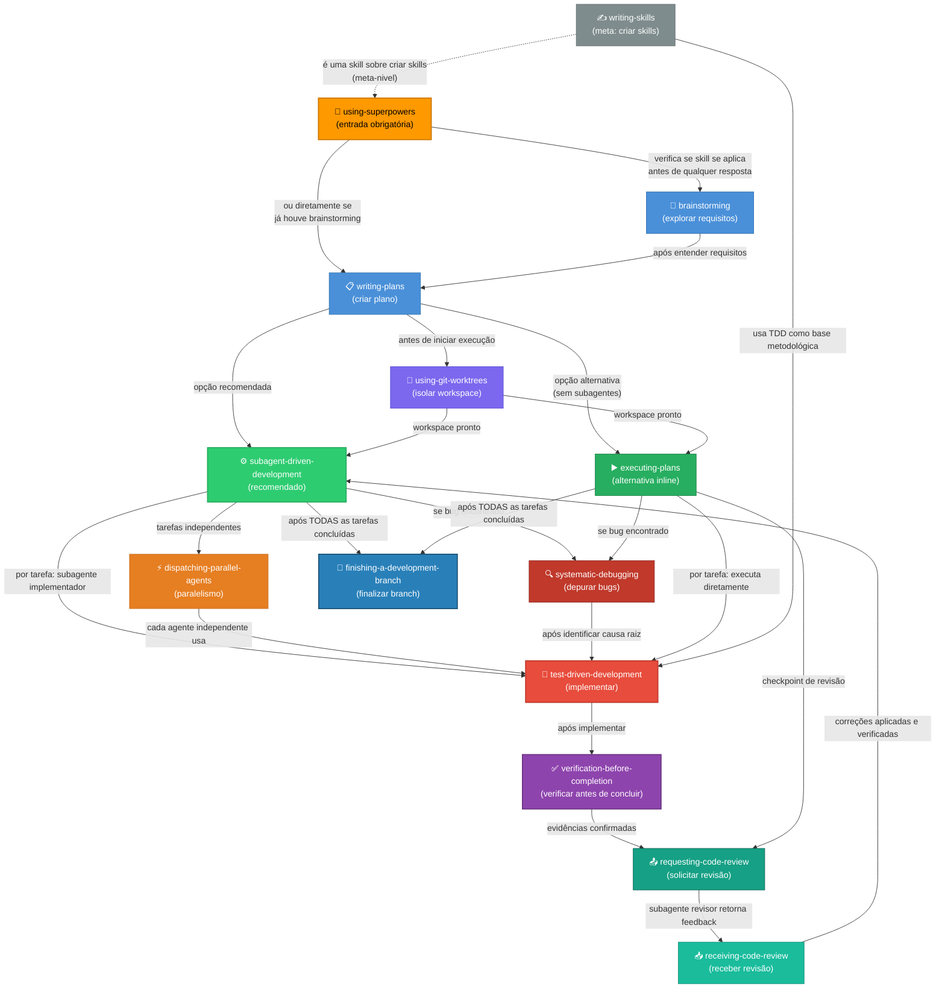
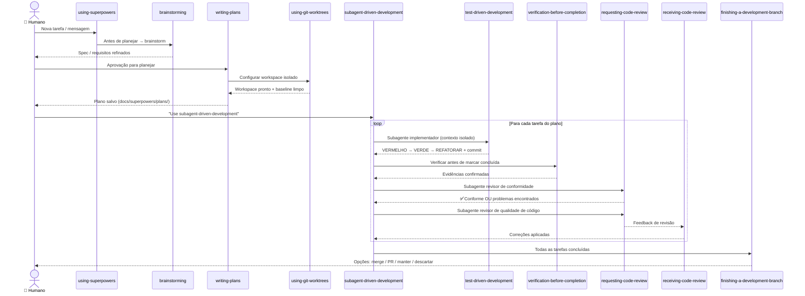

# Relatório de Relações entre Skills

> Mapeamento completo da ordem de execução e interdependências das 14 skills em `.agents/_skills/`

---

## Resumo Executivo

As 14 skills formam um **ecossistema coeso de desenvolvimento orientado por agentes**. Elas se organizam em três categorias:

- **Skills de Entrada/Controle**: governam quando e como todas as outras são invocadas
- **Skills de Ciclo de Desenvolvimento**: cobrem o fluxo completo do código (planejamento → execução → finalização)
- **Skills de Qualidade**: garantem correção, revisão e rastreabilidade a cada etapa

A skill `using-superpowers` atua como **portão único de entrada**: é a primeira a ser invocada em qualquer conversa e define a obrigatoriedade de usar as demais.

---

## Diagrama Geral de Relações

---

## Fluxo Principal de Desenvolvimento (Passo a Passo)

---

## Descrição Detalhada de Cada Skill e Suas Relações

### 🔑 `using-superpowers` — Portão de Entrada Universal

**Papel:** Meta-skill que governa todo o ecossistema. É invocada automaticamente no **início de qualquer conversa** e estabelece a regra de que skills relevantes devem ser usadas antes de qualquer resposta.

**Chama (downstream):**
- `brainstorming` — se a tarefa envolver criação de funcionalidade nova
- Qualquer outra skill relevante para a tarefa atual

**Recebida por:** Nenhuma (é o ponto de partida)

**Regra central:** Se há 1% de chance de que uma skill se aplique, ela DEVE ser invocada.

---

### 🧠 `brainstorming` — Exploração de Requisitos

**Papel:** Explora intenções e requisitos do usuário antes de qualquer implementação. Previne construir a coisa errada.

**Chama (downstream):**
- `writing-plans` — após entender e validar os requisitos

**Recebida por:**
- `using-superpowers` — que a invoca antes de entrar em modo de planejamento

**Quando usar:** Antes de qualquer trabalho criativo ou de implementação de funcionalidade.

---

### 📋 `writing-plans` — Criação do Plano de Implementação

**Papel:** Transforma spec/requisitos em um plano detalhado com tarefas granulares (passos de 2-5 min cada), caminhos de arquivo exatos, código completo e comandos.

**Chama (downstream):**
- `using-git-worktrees` — contexto: workspace isolado deve existir
- `subagent-driven-development` — execução recomendada
- `executing-plans` — execução alternativa inline

**Recebida por:**
- `brainstorming` → depois de spec validada
- `executing-plans` → lê e executa o plano criado
- `subagent-driven-development` → lê e executa o plano criado

**Saída:** Arquivo `docs/superpowers/plans/YYYY-MM-DD-<feature>.md`

---

### 🌿 `using-git-worktrees` — Isolamento de Workspace

**Papel:** Garante que o desenvolvimento aconteça em um branch/worktree isolado, sem contaminar o `main`. Detecta isolamento existente antes de criar um novo.

**Chama (downstream):** Nenhuma (é uma skill de infraestrutura)

**Recebida por:**
- `writing-plans` — referencia que worktree deve existir ao executar
- `executing-plans` — declara como dependência obrigatória
- `subagent-driven-development` — declara que branch não deve ser `main/master`

**Saída:** Worktree pronto + baseline de testes limpo

---

### ⚙️ `subagent-driven-development` — Execução Orientada por Subagentes *(Recomendada)*

**Papel:** Orquestra a execução do plano despachando **um subagente fresco por tarefa**, com revisão em dois estágios (conformidade com spec → qualidade de código) após cada tarefa.

**Chama (downstream):**
- `test-driven-development` — cada subagente implementador usa TDD
- `systematic-debugging` — se bug for encontrado durante implementação
- `dispatching-parallel-agents` — se houver tarefas independentes paralelas
- `requesting-code-review` — após cada tarefa (revisor de spec + revisor de qualidade)
- `finishing-a-development-branch` — após todas as tarefas concluídas

**Recebida por:**
- `writing-plans` → é a execução recomendada do plano
- `executing-plans` → a skill sugere usar subagent-driven-development quando subagentes estão disponíveis

---

### ▶️ `executing-plans` — Execução Inline *(Alternativa)*

**Papel:** Executa o plano na mesma sessão (sem subagentes), tarefa a tarefa, com checkpoints de revisão.

**Chama (downstream):**
- `test-driven-development` — para cada tarefa de implementação
- `systematic-debugging` — se bug encontrado
- `requesting-code-review` — em checkpoints naturais
- `finishing-a-development-branch` — após conclusão

**Recebida por:**
- `writing-plans` → é a execução alternativa quando não há suporte a subagentes

---

### ⚡ `dispatching-parallel-agents` — Paralelismo de Agentes

**Papel:** Divide problemas independentes em múltiplos agentes rodando simultaneamente. Usado quando há 2+ falhas em domínios distintos sem estado compartilhado.

**Chama (downstream):**
- `test-driven-development` — cada agente paralelo usa TDD internamente

**Recebida por:**
- `subagent-driven-development` — quando tarefas de um plano são independentes
- Diretamente pelo orquestrador quando há múltiplas falhas de testes em arquivos diferentes

---

### 🧪 `test-driven-development` — Ciclo VERMELHO-VERDE-REFATORAR

**Papel:** Regra de ouro da implementação. Nenhum código de produção sem teste falhando primeiro. Ciclo estrito: escrever teste → observar falhar → implementar mínimo → refatorar.

**Chama (downstream):**
- `verification-before-completion` — após cada ciclo VERDE, antes de commitar
- `systematic-debugging` — se o teste não falhar da forma esperada (causa raiz investigada)

**Recebida por:**
- `subagent-driven-development` — cada subagente implementador obrigatoriamente usa TDD
- `executing-plans` — cada tarefa de implementação usa TDD
- `dispatching-parallel-agents` — cada agente paralelo usa TDD
- `writing-skills` — usa TDD como base metodológica para testar skills

---

### 🔍 `systematic-debugging` — Depuração Sistemática

**Papel:** Proibida a tentativa de correção sem investigar a causa raiz. Quatro fases: investigar → formular hipótese → testar → corrigir.

**Chama (downstream):**
- `test-driven-development` — após identificar a causa raiz, implementa a correção via TDD (escreve teste de regressão → corrige → verifica)

**Recebida por:**
- `test-driven-development` — quando o teste não falha como esperado
- `subagent-driven-development` — quando subagente retorna BLOCKED por bug
- `executing-plans` — quando uma etapa falha repetidamente

---

### ✅ `verification-before-completion` — Evidências Antes de Afirmações

**Papel:** Impõe que nenhuma afirmação de "concluído", "passando" ou "corrigido" seja feita sem executar o comando de verificação naquele momento e ler a saída completa.

**Chama (downstream):**
- `requesting-code-review` — após confirmação com evidências de que tudo passa

**Recebida por:**
- `test-driven-development` — antes de marcar ciclo como VERDE
- `subagent-driven-development` — antes de marcar tarefa como concluída
- `executing-plans` — antes de avançar para próxima tarefa
- `finishing-a-development-branch` — verifica testes antes de oferecer opções de merge

---

### 📤 `requesting-code-review` — Solicitar Revisão de Código

**Papel:** Despacha um subagente revisor com contexto precisamente elaborado (SHAs do git, descrição, requisitos). Nunca o histórico completo da sessão — apenas o produto do trabalho.

**Chama (downstream):**
- `receiving-code-review` — quando o feedback chega, o agente deve processá-lo

**Recebida por:**
- `subagent-driven-development` — após cada tarefa (revisor de spec + revisor de qualidade)
- `executing-plans` — em checkpoints naturais
- `finishing-a-development-branch` — antes de merge/PR

---

### 📥 `receiving-code-review` — Receber Revisão de Código

**Papel:** Define como processar feedback de revisão: verificar → avaliar tecnicamente → discordar quando correto → implementar um item por vez → testar cada um.

**Chama (downstream):**
- `subagent-driven-development` → retorna para o loop de tarefas com correções aplicadas

**Recebida por:**
- `requesting-code-review` → é a skill que processa o feedback gerado pelo revisor

---

### 🚀 `finishing-a-development-branch` — Finalizar Branch

**Papel:** Conclui o ciclo de desenvolvimento com verificação de testes → detecção de ambiente → apresentação de exatamente 4 opções estruturadas (merge / PR / manter / descartar) → execução da escolha → limpeza de worktree.

**Chama (downstream):** Nenhuma (é o ponto final do ciclo)

**Recebida por:**
- `subagent-driven-development` — após todas as tarefas concluídas
- `executing-plans` — após todas as tarefas concluídas

---

### ✍️ `writing-skills` — Criar Novas Skills *(Meta-nível)*

**Papel:** Skill para criar outras skills, aplicando TDD à documentação de processos. Ciclo VERMELHO (agente falha sem a skill) → VERDE (agente cumpre com a skill) → REFATORAR (fechar brechas).

**Chama (downstream):**
- `test-driven-development` — usa a mesma metodologia como base

**Recebida por:**
- Invocada diretamente quando se quer criar/editar uma skill
- Referenciada por `using-superpowers` como parte do ecossistema

---

## Mapa de Dependências por Skill

| Skill | Chama | Chamada por |
|-------|-------|-------------|
| `using-superpowers` | brainstorming, qualquer skill relevante | — (entrada universal) |
| `brainstorming` | writing-plans | using-superpowers |
| `writing-plans` | using-git-worktrees, subagent-driven-development, executing-plans | brainstorming, using-superpowers |
| `using-git-worktrees` | — | writing-plans, executing-plans |
| `subagent-driven-development` | TDD, systematic-debugging, dispatching-parallel-agents, requesting-code-review, finishing-a-development-branch | writing-plans |
| `executing-plans` | TDD, systematic-debugging, requesting-code-review, finishing-a-development-branch | writing-plans |
| `dispatching-parallel-agents` | TDD | subagent-driven-development |
| `test-driven-development` | verification-before-completion, systematic-debugging | subagent-driven-development, executing-plans, dispatching-parallel-agents, writing-skills |
| `systematic-debugging` | TDD | test-driven-development, subagent-driven-development, executing-plans |
| `verification-before-completion` | requesting-code-review | TDD, subagent-driven-development, executing-plans, finishing-a-development-branch |
| `requesting-code-review` | receiving-code-review | verification-before-completion, subagent-driven-development, executing-plans |
| `receiving-code-review` | subagent-driven-development | requesting-code-review |
| `finishing-a-development-branch` | — (ponto final) | subagent-driven-development, executing-plans |
| `writing-skills` | TDD | (invocação direta) |

---

## Fluxo Completo por Fase

```mermaid
flowchart LR
    subgraph INIT["🚀 FASE 0: INICIALIZAÇÃO"]
        US["using-superpowers"]
    end

    subgraph PLAN["📐 FASE 1: PLANEJAMENTO"]
        BR["brainstorming"]
        WP["writing-plans"]
        GW["using-git-worktrees"]
    end

    subgraph EXEC["⚙️ FASE 2: EXECUÇÃO"]
        SDD["subagent-driven-development"]
        EP["executing-plans"]
        DPA["dispatching-parallel-agents"]
    end

    subgraph IMPL["🔨 FASE 3: IMPLEMENTAÇÃO (por tarefa)"]
        TDD["test-driven-development"]
        SD["systematic-debugging"]
        VBC["verification-before-completion"]
    end

    subgraph REVIEW["🔎 FASE 4: REVISÃO"]
        RCRq["requesting-code-review"]
        RCRv["receiving-code-review"]
    end

    subgraph CLOSE["✅ FASE 5: FINALIZAÇÃO"]
        FDB["finishing-a-development-branch"]
    end

    subgraph META["🛠️ META-NÍVEL"]
        WS["writing-skills"]
    end

    INIT --> PLAN
    PLAN --> EXEC
    EXEC --> IMPL
    IMPL --> REVIEW
    REVIEW -->|"correções → volta ao loop"| IMPL
    REVIEW --> CLOSE
    META -.->|"cria/melhora skills do ecossistema"| INIT
```

---

## Insights sobre o Design do Ecossistema

### 1. Princípio de Contexto Isolado
Todas as skills que despacham subagentes (`subagent-driven-development`, `dispatching-parallel-agents`, `requesting-code-review`) enfatizam que **o subagente recebe apenas o contexto necessário**, nunca o histórico completo da sessão. Isso garante foco e evita contaminação de contexto.

### 2. Portões de Qualidade em Cascata
Cada fase tem seu próprio portão de qualidade:
- **TDD** garante que código funciona antes de ser commitado
- **verification-before-completion** garante evidências antes de afirmações
- **requesting-code-review** garante revisão externa antes de prosseguir
- **finishing-a-development-branch** garante testes passando antes de merge

### 3. Skills "Rígidas" vs "Flexíveis"
- **Rígidas** (`TDD`, `systematic-debugging`, `verification-before-completion`): seguidas exatamente, sem adaptação
- **Flexíveis** (`writing-plans`, `brainstorming`): adaptam princípios ao contexto

### 4. Loop de Melhoria Contínua
`writing-skills` fecha o ciclo do ecossistema: quando uma skill falha em guiar um agente corretamente, `writing-skills` é usada para melhorá-la aplicando TDD à própria documentação.

### 5. Dois Caminhos de Execução
O ecossistema oferece dois caminhos para executar um plano:
- **Subagent-driven** (recomendado): paralelismo real, contexto fresco por tarefa, revisão automática
- **Inline** (fallback): quando subagentes não estão disponíveis, execução sequencial na mesma sessão
