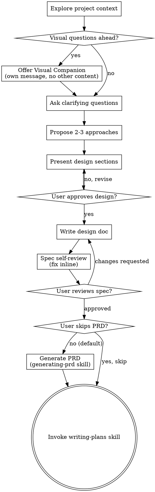

# Brainstorming Ideas Into Designs

Help turn ideas into fully formed designs and specs through natural collaborative dialogue.

Start by understanding the current project context, then ask questions one at a time to refine the idea. Once you understand what you're building, present the design and get user approval.

<HARD-GATE>
Do NOT invoke any implementation skill, write any code, scaffold any project, or take any implementation action until you have presented a design and the user has approved it. This applies to EVERY project regardless of perceived simplicity.
</HARD-GATE>

## Anti-Pattern: "This Is Too Simple To Need A Design"

Every project goes through this process. A todo list, a single-function utility, a config change — all of them. "Simple" projects are where unexamined assumptions cause the most wasted work. The design can be short (a few sentences for truly simple projects), but you MUST present it and get approval.

## Checklist

You MUST create a task for each of these items and complete them in order:

1. **Memory recall (conditional) + Explore context + research** — launch parallel subagents in one turn: **memory recall** (if `session_memory_enabled = true`: persistent-memory search for prior decisions, ADRs, specs on this topic), codebase exploration (existing projects), context7 (external libraries), exa-web-search-free (best practices/web), user-referenced resources. See [Research via Parallel Subagents](#research-via-parallel-subagents) below.
2. **Offer visual companion** (if topic will involve visual questions) — this is its own message, not combined with a clarifying question. See the Visual Companion section below.
3. **Ask clarifying questions** — one at a time, understand purpose/constraints/success criteria
4. **Propose 2-3 approaches** — with trade-offs and your recommendation
5. **Present design** — in sections scaled to their complexity, get user approval after each section
6. **Write design doc** — save to `docs/superpowers/<feature-name>/specs/<feature-name>-design.md` and commit
7. **Spec self-review** — quick inline check for placeholders, contradictions, ambiguity, scope (see below)
8. **User reviews written spec** — ask user to review the spec file before proceeding
9. **Generate PRD** — invoke `generating-prd` skill to formalize user stories and functional requirements from the approved spec. If the user explicitly says "skip PRD" or "go straight to planning", skip this step.
10. **Transition to implementation** — invoke writing-plans skill to create implementation plan

## Process Flow



**The terminal planning handoff is `writing-plans`.** `generating-prd` is a pre-planning formalization step — not an implementation skill. Do NOT invoke frontend-design, mcp-builder, or any other implementation skill. The only skills invoked from brainstorming are `generating-prd` (optional intermediate) and `writing-plans` (terminal).

## Research via Parallel Subagents

Before formulating your first clarifying question, dispatch all research as background subagents in a **single turn**. Keeping research out of the main agent preserves your context budget for what actually matters to the user: clarifying questions, design trade-offs, spec content, and code review. Every token you spend on inline grep or doc fetching is a token that won't be available during design synthesis or spec writing.

**Exception:** If the request is underspecified and you cannot determine the technology stack or problem domain, ask one scoping question first — then launch research once you have enough to target it.

<RESEARCH-GATE>
Do NOT call `view`, `glob`, `grep`, `bash`, `context7`, or any web-search tool directly in the main agent during this phase. All high-volume retrieval — codebase exploration, library docs, web research, user-provided URLs, and local documents — must be dispatched via the `task` tool as background subagents. The `task` tool is the only permitted mechanism for research during brainstorming.
</RESEARCH-GATE>

### Corporate Artifacts

Before dispatching research subagents, check whether corporate artifacts are available in context. `using-superpowers` passes them when present (look for a message like _"Corporate artifacts are available: [list]"_). If corporate artifacts exist, include each item as part of the User-referenced resources subagent dispatch — they are treated exactly like user-provided paths and URLs:
- Local path → inspect via `view`
- Public URL → fetch
- Inaccessible URL → ask the user for an excerpt

**Precedence when corporate artifacts conflict with the current design:** Session decisions and the approved spec take priority over corporate artifacts. Corporate artifacts inform and enrich; they do not override what the user and agent agreed during this session. The priority order is: (1) latest user instruction, (2) approved spec / current-session decisions, (3) corporate artifacts, (4) external research.

### What to dispatch in parallel

All applicable tracks must be launched in the **same tool-calling turn**:

| Subagent | When | Agent type |
|----------|------|-----------|
| **Memory recall** | If `session_memory_enabled = true` — retrieves prior decisions, ADRs, specs, and constraints from `persistent-memory`. Skip entirely when memory is disabled. | `task` (see template below) |
| Codebase exploration | Always for existing projects; skip for clearly greenfield work | `explore` |
| Library / API docs | Topic involves external libraries or frameworks | `general-purpose` instructed to use `context7` (when available) |
| Web research | Needs current best practices, comparisons, or technology state | `general-purpose` instructed to use `exa-web-search-free` (when available) |
| User-referenced resources & corporate artifacts | User mentions URLs or docs, OR corporate artifacts are available in context: public URL → fetch; local path → inspect; inaccessible → ask for an excerpt | `general-purpose` |

If `context7` or `exa-web-search-free` are unavailable or hit quota, continue with best available knowledge — don't block the session.

If `session_memory_enabled = false`, skip the memory recall subagent entirely — do not dispatch it. If memory is enabled but `pmem` is unavailable or memory search returns no results, continue without memory context — don't block the session.

### Subagent prompt templates

Provide only the minimum context each subagent needs. No conversation history, no full file dumps. Cap every response at ~300 words or 8 bullets — summaries, not raw output.

> **Guard:** Only dispatch the memory recall subagent if `session_memory_enabled = true`. If memory is disabled, skip this template entirely and continue with the other parallel subagents.

**Memory recall** — dispatch via `task` (task agent):

This subagent uses the `persistent-memory` skill's CLI to check for prior knowledge relevant to the brainstorming topic. It ensures the database exists, then runs targeted searches.

```
Retrieve prior decisions, specs, and constraints relevant to: [feature-topic].

Steps:
1. Run: pmem sync
   - If it fails with "database not found" or similar, run: pmem init
   - If pmem is not installed or completely unavailable, return: "Memory unavailable — skip."
2. Run 2-3 targeted searches (adapt queries to the specific domain):
   - pmem search "[feature-name or domain noun]" --limit 5
   - pmem search "[bounded-context or component name] architecture decision" --limit 5
   - pmem search "[feature-name] spec PRD constraint" --limit 3
3. Deduplicate results and return (max 8 bullets):
   - Key architectural decisions or rules that constrain this domain
   - Paths to existing artifacts (specs, PRDs, ADRs) — just paths, not full content
   - Established scope boundaries or out-of-scope items
   - Any relevant constraints or patterns previously decided

If all searches return empty, return: "No prior memory found for this topic."
Do not return raw pmem output — synthesize into actionable bullets.
```

**Codebase exploration** — dispatch via `task` (explore agent):
```
Explore [path] for [topic]. Return (max 8 bullets, summaries only):
- relevant files/modules and their purpose
- patterns and conventions in use
- recent commits related to [topic]
No raw file contents.
```

**Library / API docs** — dispatch via `task` (general-purpose, instructed to use context7):
```
Use the context7 skill. Library: [name]. Question: [specific API or usage question].
Return (max ~250 words): the 2–3 most relevant API details, one code example, and key version caveats.
```

**Web research** — dispatch via `task` (general-purpose, instructed to use exa-web-search-free):
```
Use the exa-web-search-free skill. Query: [specific question about technology or pattern].
Context: [one sentence describing what we're designing].
Return (max ~300 words): key findings, relevant patterns, open questions, and caveats.
```

### After all subagents complete

Synthesize findings internally before proceeding. Do not relay raw subagent output to the user — let the research inform your questions and approach proposals.

**Memory context precedence:** When recalled memories contain architectural decisions, constraints, or scope boundaries that affect the current topic, respect them as established context. If a recalled constraint materially shapes your recommendations, briefly mention its existence when relevant (e.g., "Based on a prior decision to use Clean Architecture with Inversify..."). The full priority order is:

1. Latest user instruction (highest)
2. Approved spec / current-session decisions
3. Recalled memory (prior decisions, ADRs, constraints)
4. Corporate artifacts
5. External research (lowest)

**Pre-send check:** Before sending the first clarifying question, verify that you used the `task` tool for all research, not inline tool calls. If you ran any direct `view`, `grep`, or `context7` calls in the main agent, those results are still usable — but note that this violated the gate and will inflate your context for the rest of the session.

---

## The Process

**Understanding the idea:**

- Run the Research via Parallel Subagents step first — codebase, external docs, web research, all in one parallel turn before asking any questions
- Before asking detailed questions, assess scope: if the request describes multiple independent subsystems (e.g., "build a platform with chat, file storage, billing, and analytics"), flag this immediately. Don't spend questions refining details of a project that needs to be decomposed first.
- If the project is too large for a single spec, help the user decompose into sub-projects: what are the independent pieces, how do they relate, what order should they be built? Then brainstorm the first sub-project through the normal design flow. Each sub-project gets its own spec → plan → implementation cycle.
- For appropriately-scoped projects, ask questions one at a time to refine the idea
- Prefer multiple choice questions when possible, but open-ended is fine too
- Only one question per message - if a topic needs more exploration, break it into multiple questions
- Focus on understanding: purpose, constraints, success criteria

**Exploring approaches:**

- Propose 2-3 different approaches with trade-offs
- Present options conversationally with your recommendation and reasoning
- Lead with your recommended option and explain why

**Presenting the design:**

- Once you believe you understand what you're building, present the design
- Scale each section to its complexity: a few sentences if straightforward, up to 200-300 words if nuanced
- Ask after each section whether it looks right so far
- Cover: architecture, components, data flow, error handling, testing
- Be ready to go back and clarify if something doesn't make sense

**Design for isolation and clarity:**

- Break the system into smaller units that each have one clear purpose, communicate through well-defined interfaces, and can be understood and tested independently
- For each unit, you should be able to answer: what does it do, how do you use it, and what does it depend on?
- Can someone understand what a unit does without reading its internals? Can you change the internals without breaking consumers? If not, the boundaries need work.
- Smaller, well-bounded units are also easier for you to work with - you reason better about code you can hold in context at once, and your edits are more reliable when files are focused. When a file grows large, that's often a signal that it's doing too much.

**Working in existing codebases:**

- Explore the current structure before proposing changes. Follow existing patterns.
- Where existing code has problems that affect the work (e.g., a file that's grown too large, unclear boundaries, tangled responsibilities), include targeted improvements as part of the design - the way a good developer improves code they're working in.
- Don't propose unrelated refactoring. Stay focused on what serves the current goal.

## After the Design

**Documentation:**

- Write the validated design (spec) to `docs/superpowers/<feature-name>/specs/<feature-name>-design.md`
  - The `<feature-name>` is a kebab-case slug defined during this brainstorming session (e.g., `toggle-light-dark-theme`)
  - Create the feature directory structure: `docs/superpowers/<feature-name>/specs/`, `docs/superpowers/<feature-name>/prd/`, `docs/superpowers/<feature-name>/plans/`
  - Include a YAML frontmatter block at the very top of the file:
    ```yaml
    ---
    created_at: "YYYY-MM-DDTHH:MM:SS±HH:MM"
    updated_at: "YYYY-MM-DDTHH:MM:SS±HH:MM"
    ---
    ```
    > **Deterministic frontmatter (preferred):** Use the shared scripts to read existing dates and write updated ones:
    > ```bash
    > # Check existing created_at (preserve if file already exists):
    > node scripts/frontmatter-utils.js --file <spec-path> --get-key created_at
    > # Set updated_at to the current datetime from the host clock:
    > node scripts/frontmatter-utils.js --file <spec-path> --set-key updated_at --set-value "$(node scripts/get-current-datetime.js)"
    > ```
    > **Fallback:** Write the frontmatter block manually.
    
    **Date rules:** if the file does not exist yet, set both fields to the current date/time from the host clock via `node scripts/get-current-datetime.js` (ISO 8601 with timezone). If the file already exists, preserve `created_at` and update only `updated_at`. Never write a literal placeholder in the document.
  - (User preferences for spec location override this default)
- Use elements-of-style:writing-clearly-and-concisely skill if available
- Commit the design document to git

**Spec Self-Review:**
After writing the spec document, look at it with fresh eyes:

1. **Placeholder scan:** Any "TBD", "TODO", incomplete sections, or vague requirements? Fix them.
2. **Internal consistency:** Do any sections contradict each other? Does the architecture match the feature descriptions?
3. **Scope check:** Is this focused enough for a single implementation plan, or does it need decomposition?
4. **Ambiguity check:** Could any requirement be interpreted two different ways? If so, pick one and make it explicit.

Fix any issues inline. No need to re-review — just fix and move on.

**User Review Gate:**
After the spec review loop passes, ask the user to review the written spec before proceeding:

> "Spec written and committed to `<path>`. Please review it and let me know if you want to make any changes before we start writing out the implementation plan."

Wait for the user's response. If they request changes, make them and re-run the spec review loop. Only proceed once the user approves.

**PRD Generation:**

After the user approves the spec, generate the PRD to formalize requirements:

- Invoke the `generating-prd` skill
- The PRD is saved in the feature's `prd/` subdirectory (e.g., `docs/superpowers/<feature-name>/prd/prd-<feature-name>.md`)
- If the user explicitly asks to skip ("skip PRD", "go straight to planning"), proceed directly to writing-plans
- Wait for user approval of the PRD before proceeding

**Implementation:**

- Invoke the writing-plans skill to create a detailed implementation plan
- Do NOT invoke any other skill. writing-plans is the next step.

## Key Principles

- **One question at a time** - Don't overwhelm with multiple questions
- **Multiple choice preferred** - Easier to answer than open-ended when possible
- **YAGNI ruthlessly** - Remove unnecessary features from all designs
- **Explore alternatives** - Always propose 2-3 approaches before settling
- **Incremental validation** - Present design, get approval before moving on
- **Be flexible** - Go back and clarify when something doesn't make sense

## Visual Companion

A browser-based companion for showing mockups, diagrams, and visual options during brainstorming. Available as a tool — not a mode. Accepting the companion means it's available for questions that benefit from visual treatment; it does NOT mean every question goes through the browser.

**Offering the companion:** When you anticipate that upcoming questions will involve visual content (mockups, layouts, diagrams), offer it once for consent:
> "Some of what we're working on might be easier to explain if I can show it to you in a web browser. I can put together mockups, diagrams, comparisons, and other visuals as we go. This feature is still new and can be token-intensive. Want to try it? (Requires opening a local URL)"

**This offer MUST be its own message.** Do not combine it with clarifying questions, context summaries, or any other content. The message should contain ONLY the offer above and nothing else. Wait for the user's response before continuing. If they decline, proceed with text-only brainstorming.

**Per-question decision:** Even after the user accepts, decide FOR EACH QUESTION whether to use the browser or the terminal. The test: **would the user understand this better by seeing it than reading it?**

- **Use the browser** for content that IS visual — mockups, wireframes, layout comparisons, architecture diagrams, side-by-side visual designs
- **Use the terminal** for content that is text — requirements questions, conceptual choices, tradeoff lists, A/B/C/D text options, scope decisions

A question about a UI topic is not automatically a visual question. "What does personality mean in this context?" is a conceptual question — use the terminal. "Which wizard layout works better?" is a visual question — use the browser.

If they agree to the companion, read the detailed guide before proceeding:
`skills/brainstorming/visual-companion.md`
