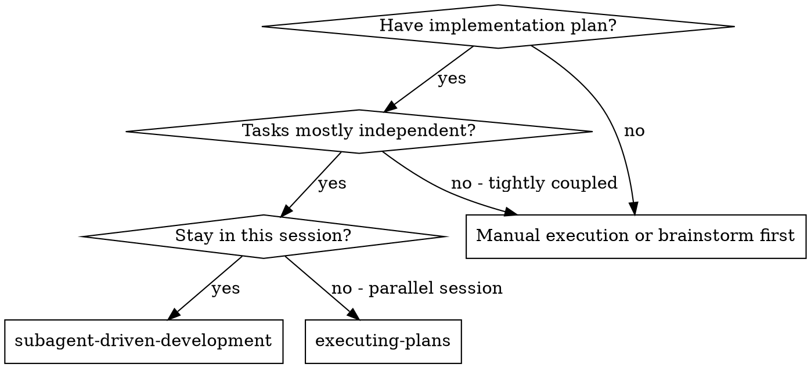
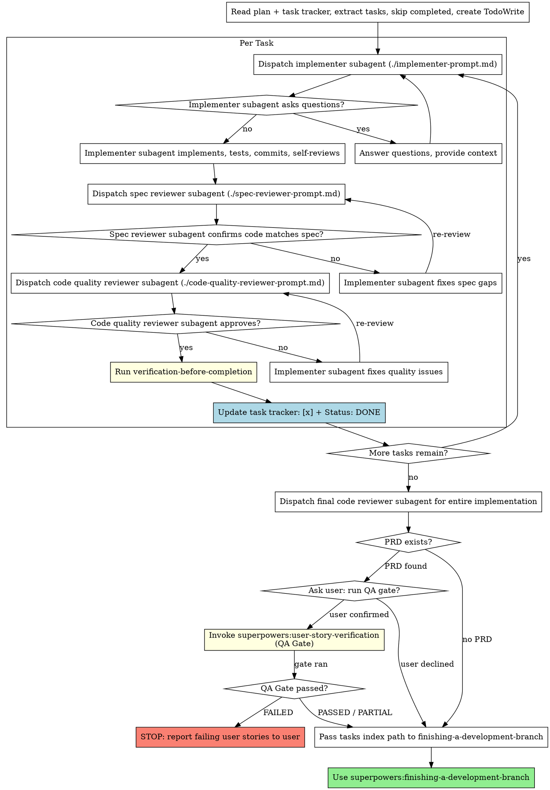

# Subagent-Driven Development

Execute plan by dispatching fresh subagent per task, with two-stage review after each: spec compliance review first, then code quality review.

**Why subagents:** You delegate tasks to specialized agents with isolated context. By precisely crafting their instructions and context, you ensure they stay focused and succeed at their task. They should never inherit your session's context or history — you construct exactly what they need. This also preserves your own context for coordination work.

**Core principle:** Fresh subagent per task + two-stage review (spec then quality) = high quality, fast iteration

**Continuous execution:** Do not pause to check in with your human partner between tasks. Execute all tasks from the plan without stopping. The only reasons to stop are: BLOCKED status you cannot resolve, ambiguity that genuinely prevents progress, or all tasks complete. "Should I continue?" prompts and progress summaries waste their time — they asked you to execute the plan, so execute it.

## When to Use



**vs. Executing Plans (parallel session):**
- Same session (no context switch)
- Fresh subagent per task (no context pollution)
- Two-stage review after each task: spec compliance first, then code quality
- Faster iteration (no human-in-loop between tasks)

## The Process

### Task Tracker Integration

Before extracting tasks, locate the tasks index:

**Discovery:** The tasks index path is passed explicitly in context (e.g., `docs/superpowers/<feature-name>/plans/tasks-<feature-name>.md`). If not passed, look for a `tasks-*.md` file in the feature's `plans/` directory.

> **Deterministic task parsing (preferred):**
> ```bash
> node scripts/parse-tasks.js --tasks-index <path>
> ```
> Outputs JSON with `found`, `allDone`, `completed[]`, `pending[]`, `inProgress[]`, `mismatches[]`.  
> Use `completed` to skip already-done tasks (session resume), `pending`+`inProgress` for what remains.  
> Check `mismatches` — any mismatch between index and task file requires manual resolution before proceeding.  
> **Fallback:** Read and parse the tasks index file manually if the script is unavailable.

### Memory Gate Check

> **Required — do not skip.** This is the entry guard of the Executando state. Memory must have been persisted at the end of `writing-plans` (exit action of Planejando state). If it wasn't, persist it now before dispatching any subagent.

Before dispatching the first task subagent, verify that planning artifacts were persisted:

```bash
pmem search "<feature-name>" --limit 3
```

- **If results include entries for this feature** (decisions, scope, artifacts paths): memory is present — proceed.
- **If no results found**: memory was not persisted during planning. Run the full persistence procedure now — read `writing-plans/SKILL.md § Memory Persistence` and `writing-plans/references/memory-persistence.md` for the exact `pmem add` calls to make (3 entries: decisions, scope, artifact paths). Do not dispatch any task subagent until all three entries are written.

### Caveman Mode Activation

Before dispatching the first task subagent, check session caveman state (defined in `using-superpowers` policy):

1. **If `session_caveman_active = false` AND `session_caveman_prompted = false`:** Ask the dynamic question (see `using-superpowers` Caveman Mode section) and record the result.
2. **If `session_caveman_active = true`:** Invoke the `caveman` skill at `session_caveman_level` (e.g., `/caveman full`). Caveman stays active through all tasks, spec reviews, code quality reviews, and QA gate.
3. **Before invoking `finishing-a-development-branch`:** Explicitly deactivate caveman — say "normal mode" or "stop caveman". Finalizando requires clear human-facing communication.

**Subagent propagation:** when caveman is active, include the following block in every subagent prompt dispatched (implementer, spec reviewer, code quality reviewer, QA subagents):

```
## Caveman Mode

Caveman is active at level: [session_caveman_level]
Invoke the caveman skill at this level before your first response: `/caveman [level]`
Maintain caveman throughout your entire execution. Do not revert to normal mode.
```

**If tracker exists:**
1. Read the tasks index (`tasks-<feature-name>.md`)
2. Tasks marked `[x]` are already completed — skip them entirely (session resume)
3. For each remaining `[ ]` task, read the individual task file for full context
4. **Read PRD and Spec from each task:** Before dispatching the implementer subagent, read the `**PRD:**` and `**Spec:**` fields from the task file header. Include the content of both files in the subagent's context alongside the task steps. This ensures the implementer has full feature requirements and design decisions available.
5. **Before dispatching each implementer:** use your file-editing tool to physically write the change to `task-NN.md` on disk — change `**Status:** PENDING` to `**Status:** IN_PROGRESS`. This is a real file edit, not a TodoWrite entry or a mental note. The file on disk must reflect the current working state.
6. When ALL gates pass (verification-before-completion ✅ + spec review ✅ + code quality ✅), make **two physical file edits on disk** — this is mandatory even if you've already marked the task complete in TodoWrite:
   - Edit `tasks-<feature-name>.md`: change `- [ ] N.` → `- [x] N.` for that task's line
   - Edit `task-NN.md`: change `**Status:** IN_PROGRESS` → `**Status:** DONE`

   These file edits are the authoritative audit record of task completion. `finishing-a-development-branch` reads the tasks index directly to verify all tasks are `[x]` — if the files are not edited on disk, the branch cannot be finished and the history cannot be audited.

**If no tracker exists:**
Proceed as before — extract tasks from a plan file if one was passed directly. Note in the log: "No task tracker found; using plan file directly."



## QA Gate — User Story Verification

After the final code reviewer approves, and **before** invoking `finishing-a-development-branch`, run the QA Gate if a PRD exists.

**PRD discovery order** (same logic as `writing-plans`):
1. Explicit path in context (passed forward from `generating-prd` in this session)
2. Deterministic derivation: `docs/superpowers/<feature-name>/prd/prd-<feature-name>.md`
3. Directory scan: files with `prd-` prefix in `docs/superpowers/<feature-name>/prd/`

**If no PRD is found:** Skip the QA Gate and proceed directly to `finishing-a-development-branch`.

**If a PRD is found:** Ask the user whether they want to run the QA gate before proceeding:

```
A PRD was found for this feature. Do you want to run user-story-verification (QA gate)
to verify all user stories against the implementation before finishing the branch?
This will dispatch parallel subagents to check acceptance criteria and collect evidence.
```

| User decision | Action |
|--------------|--------|
| **Yes / confirmed** | Invoke `superpowers:user-story-verification`, passing the PRD path, feature name, and test runner command |
| **No / declined** | Skip the gate — proceed directly to `finishing-a-development-branch` |

**When QA runs and returns a result:**

| QA Result | Action |
|-----------|--------|
| `PASSED` | Continue — invoke `finishing-a-development-branch` |
| `PARTIAL` | Continue — invoke `finishing-a-development-branch` (note partial coverage in handoff) |
| `FAILED` | **STOP.** Report the failing user stories to the user. Do not invoke `finishing-a-development-branch` until the user resolves the failures and re-runs. |

The QA report is saved to `docs/superpowers/<feature-name>/qa/qa-report-<feature-name>.md` by `user-story-verification`.

**Caveman + QA Gate:** `user-story-verification` runs in the `Verificando` state — caveman remains active during QA. Pass the caveman block to the QA skill invocation context so its subagents also use caveman. Deactivate caveman only after QA returns and **before** invoking `finishing-a-development-branch`:

```
[QA Gate result received]
→ Deactivate caveman: "normal mode"
→ Invoke finishing-a-development-branch
```

## Model Selection

Use the least powerful model that can handle each role to conserve cost and increase speed.

**Mechanical implementation tasks** (isolated functions, clear specs, 1-2 files): use a fast, cheap model. Most implementation tasks are mechanical when the plan is well-specified.

**Integration and judgment tasks** (multi-file coordination, pattern matching, debugging): use a standard model.

**Architecture, design, and review tasks**: use the most capable available model.

**Task complexity signals:**
- Touches 1-2 files with a complete spec → cheap model
- Touches multiple files with integration concerns → standard model
- Requires design judgment or broad codebase understanding → most capable model

## Handling Implementer Status

Implementer subagents report one of four statuses. Handle each appropriately:

**DONE:** Proceed to spec compliance review.

**DONE_WITH_CONCERNS:** The implementer completed the work but flagged doubts. Read the concerns before proceeding. If the concerns are about correctness or scope, address them before review. If they're observations (e.g., "this file is getting large"), note them and proceed to review.

**NEEDS_CONTEXT:** The implementer needs information that wasn't provided. Provide the missing context and re-dispatch.

**BLOCKED:** The implementer cannot complete the task. Assess the blocker:
1. If it's a context problem, provide more context and re-dispatch with the same model
2. If the task requires more reasoning, re-dispatch with a more capable model
3. If the task is too large, break it into smaller pieces
4. If the plan itself is wrong, escalate to the human

**Never** ignore an escalation or force the same model to retry without changes. If the implementer said it's stuck, something needs to change.

## Prompt Templates

- `./implementer-prompt.md` - Dispatch implementer subagent
- `./spec-reviewer-prompt.md` - Dispatch spec compliance reviewer subagent
- `./code-quality-reviewer-prompt.md` - Dispatch code quality reviewer subagent

## Example Workflow

```
You: I'm using Subagent-Driven Development to execute this plan.

[Read tasks index: docs/superpowers/toggle-light-dark-theme/plans/tasks-toggle-light-dark-theme.md]
[Tasks 1-2 already [x] — skipping (session resume)]
[Read task-03.md — PRD: ../prd/prd-toggle-light-dark-theme.md, Spec: ../specs/toggle-light-dark-theme-design.md]
[Read PRD and Spec for full feature context]
[Extract remaining tasks 3-5 with full text and context]
[Create TodoWrite with remaining tasks]

Task 3: Token refresh endpoint

[Read individual task file: feature-plan-tasks/task-03.md]
[Update task file Status: PENDING → IN_PROGRESS]
[Dispatch implementation subagent with full task text + context]

Implementer: "Before I begin - should the token use sliding expiration?"

You: "Yes, 15 minute sliding window."

Implementer: "Got it. Implementing now..."
[Later] Implementer:
  - Implemented refresh endpoint
  - Added tests, 5/5 passing
  - Self-review: Found I missed rate limiting, added it
  - Committed

[Dispatch spec compliance reviewer]
Spec reviewer: ✅ Spec compliant - all requirements met, nothing extra

[Get git SHAs, dispatch code quality reviewer]
Code reviewer: Strengths: Good test coverage, clean. Issues: None. Approved.

[Run verification-before-completion: tests pass, evidence confirmed]
[Update task tracker: feature-plan-tasks.md line "- [ ] 3." → "- [x] 3."]
[Update task file: Status: IN_PROGRESS → DONE]
[Mark Task 3 complete]

Task 4: Session management
...

[After all tasks]
[Dispatch final code-reviewer]
Final reviewer: All requirements met, ready to merge

[PRD found: docs/superpowers/toggle-light-dark-theme/prd/prd-toggle-light-dark-theme.md]
[Ask user: "PRD found. Do you want to run the QA gate (user-story-verification)?"]
User: "Yes, run QA."
[Invoke superpowers:user-story-verification]
QA Gate: 3/3 user stories verified. Status: PASSED.
QA report → docs/superpowers/toggle-light-dark-theme/qa/qa-report-toggle-light-dark-theme.md

[Pass tasks index path to finishing-a-development-branch]
Done!
```

## Suggesting Commit Messages

After each task's code quality review is approved, provide the developer with a ready-to-copy git command block containing the staged files and commit message. The developer is responsible for executing it — your role is to produce an accurate, copy-paste-ready command.

**Output format** — always render as a shell code block:
```sh
git add <arquivo1> <arquivo2> ...
git commit -m "tipo(escopo): descrição em português no imperativo"
```

Use the file list from the implementer's report for `git add`. List each file explicitly — never use `git add .` or `git add -A`.

**Commit message format:**
```
tipo(escopo): descrição em português no imperativo
```

**Common types:**
- `feat` — nova funcionalidade
- `fix` — correção de bug
- `refactor` — refatoração sem mudança de comportamento observável
- `test` — adição ou ajuste de testes
- `docs` — atualização de documentação
- `chore` — tarefas de manutenção, build, CI

**Guidelines:**
- `scope` should reflect the module, feature, or file area changed
- Keep the subject line under 72 characters
- Use imperative mood: "adicionar", "corrigir", "extrair" — not "adicionado" or "adicionando"
- If the task warrants a body (breaking change, multi-concern), add it after a blank line

**Example output:**
```sh
git add src/auth/jwt.ts src/auth/jwt.test.ts
git commit -m "feat(auth): implementar autenticação com JWT"
```

## Advantages

**vs. Manual execution:**
- Subagents follow TDD naturally
- Fresh context per task (no confusion)
- Parallel-safe (subagents don't interfere)
- Subagent can ask questions (before AND during work)

**vs. Executing Plans:**
- Same session (no handoff)
- Continuous progress (no waiting)
- Review checkpoints automatic

**Efficiency gains:**
- No file reading overhead (controller provides full text)
- Controller curates exactly what context is needed
- Subagent gets complete information upfront
- Questions surfaced before work begins (not after)

**Quality gates:**
- Self-review catches issues before handoff
- Two-stage review: spec compliance, then code quality
- Review loops ensure fixes actually work
- Spec compliance prevents over/under-building
- Code quality ensures implementation is well-built

**Cost:**
- More subagent invocations (implementer + 2 reviewers per task)
- Controller does more prep work (extracting all tasks upfront)
- Review loops add iterations
- But catches issues early (cheaper than debugging later)

## Red Flags

**Never:**
- Start implementation on main/master branch without explicit user consent
- Skip reviews (spec compliance OR code quality)
- Proceed with unfixed issues
- Dispatch multiple implementation subagents in parallel (conflicts)
- Make subagent read plan file (provide full text instead)
- Skip scene-setting context (subagent needs to understand where task fits)
- Ignore subagent questions (answer before letting them proceed)
- Accept "close enough" on spec compliance (spec reviewer found issues = not done)
- Skip review loops (reviewer found issues = implementer fixes = review again)
- Let implementer self-review replace actual review (both are needed)
- **Start code quality review before spec compliance is ✅** (wrong order)
- Move to next task while either review has open issues
- **Mark task `[x]` before verification-before-completion confirms evidence** — reviews passing is necessary but not sufficient; fresh verification is the final gate
- **Skip updating the task tracker** — if a tracker exists, you must physically edit both `tasks-<feature-name>.md` (change `[ ]` → `[x]`) and `task-NN.md` (change `Status: IN_PROGRESS` → `Status: DONE`) on disk before moving to the next task. Updating TodoWrite or knowing mentally that the task is done does not count — the actual files must be edited and saved.
- **Skip user-story-verification without asking when a PRD exists** — always present the consent question to the user first; skipping after the user explicitly declines is valid, but skipping silently is not

**If subagent asks questions:**
- Answer clearly and completely
- Provide additional context if needed
- Don't rush them into implementation

**If reviewer finds issues:**
- Implementer (same subagent) fixes them
- Reviewer reviews again
- Repeat until approved
- Don't skip the re-review

**If subagent fails task:**
- Dispatch fix subagent with specific instructions
- Don't try to fix manually (context pollution)

## Integration

**Required workflow skills:**
- **superpowers:using-git-worktrees** - Ensures isolated workspace (creates one or verifies existing)
- **superpowers:writing-plans** - Creates the plan this skill executes
- **superpowers:requesting-code-review** - Code review template for reviewer subagents
- **superpowers:user-story-verification** - QA Gate: verifies user stories from PRD before finishing branch (consent-based when PRD exists; skipped when no PRD or user declines)
- **superpowers:finishing-a-development-branch** - Complete development after all tasks

**Subagents should use:**
- **superpowers:test-driven-development** - Subagents follow TDD for each task

**Alternative workflow:**
- **superpowers:executing-plans** - Use for parallel session instead of same-session execution
