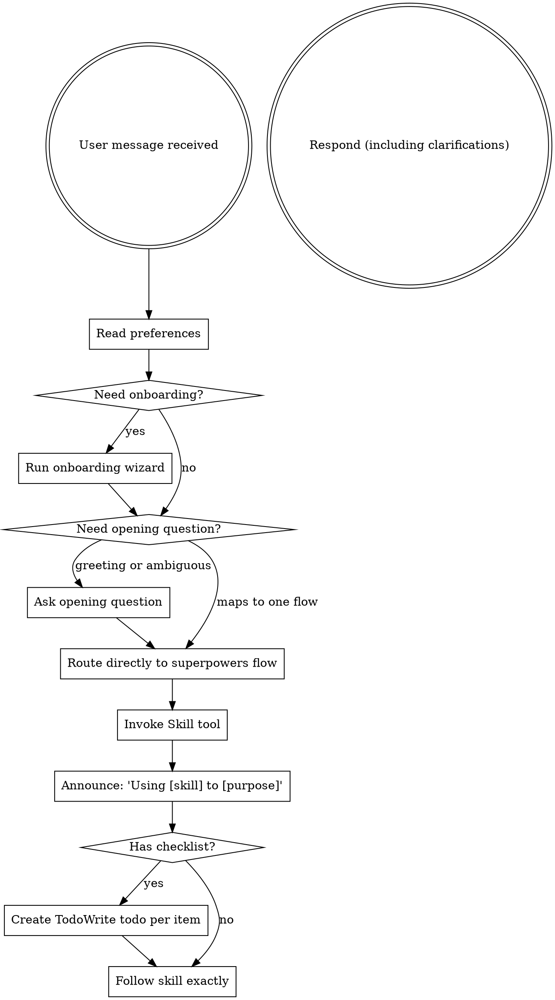

<SUBAGENT-STOP>
If you were dispatched as a subagent to execute a specific task, skip this skill.
</SUBAGENT-STOP>

<EXTREMELY-IMPORTANT>
If you think there is even a 1% chance a skill might apply to what you are doing, you ABSOLUTELY MUST invoke the skill.

IF A SKILL APPLIES TO YOUR TASK, YOU DO NOT HAVE A CHOICE. YOU MUST USE IT.

This is not negotiable. This is not optional. You cannot rationalize your way out of this.
</EXTREMELY-IMPORTANT>

## Workflow Preferences

On every session start, check for `.superpowers/preferences.yml` in the user's repository root.

> **Deterministic reading (preferred):** Run the shared script to avoid hidden-directory glob failures and parse YAML correctly:
> ```bash
> node scripts/read-preferences.js
> # or with explicit root:
> node scripts/read-preferences.js --repo-root <repo-root>
> ```
> The script outputs JSON with `found`, `preferences`, and `malformed` fields. Use `preferences.workflow.auto_commit`, `preferences.communication.language`, `preferences.copilot.rubber_duck`, `preferences.context.has_corporate_artifacts`, `preferences.optimization.caveman`, `preferences.optimization.caveman_level`, and `preferences.memory.persistent_memory` directly from the output.
> 
> **Fallback (if script unavailable):** Read the file directly using `view` — do NOT use `glob` (glob silently misses hidden directories like `.superpowers/`). See `references/copilot-tools.md`.

- **If it exists:** Read it and keep the preferences in context. Inject relevant preferences when dispatching subagents (include them in the subagent prompt context).
- **If it does NOT exist:** Follow the onboarding wizard in `references/onboarding-preferences.md` (read that file and execute the wizard before proceeding with the user's task).
- **After preferences are available:** Continue into the opening triage step below. Do not stop after the onboarding confirmation message.

### Corporate Artifacts

If `preferences.context.has_corporate_artifacts` is `true`, read `.superpowers/corporate-artifacts.yml` using `view` (not `glob`) to retrieve the list of corporate artifact paths and URLs. Keep these references in context.

When routing to `brainstorming` or `generating-prd`, include the corporate artifact references in the context you pass to those skills so they can incorporate them into research and requirements gathering. State explicitly in the handoff: _"Corporate artifacts are available: [list of paths/URLs]."_

If the file is missing despite the flag being true, warn the user once and continue without artifacts.

These preferences govern agent behavior throughout the workflow (auto-commit, language, destructive action confirmation). Skills that execute tasks (subagent-driven-development, executing-plans) also read the file directly, but the entry point ensures onboarding happens.

## Opening Triage

Once preferences are available, decide whether to ask the opening question or route immediately.

**Rule:** If the user already gave a request that clearly maps to a single superpowers flow, skip the opening question and route directly. Do not spend a turn asking "how can I help?" when the correct flow is already obvious.

If the user greeted you, asked for generic help, or the request is still ambiguous, ask the opening question in the preferred language.

- **pt-BR example:** "Como posso te ajudar? Posso te encaminhar para brainstorming, debugging, planejamento de um spec ja aprovado, execucao ou review."
- **en example:** "How can I help? I can route us into brainstorming, debugging, planning an approved spec, execution, or review."

Use this routing table:

| Request shape | Required action |
|---|---|
| Greeting, generic help request, or ambiguous task | Ask the opening question above and wait for the user's answer. |
| Bug, regression, failing test, or unexpected behavior | Invoke `systematic-debugging` immediately. |
| New feature, behavior change, architecture change, migration, or refactor | Invoke `brainstorming` immediately. This is the path for prompts like "preciso migrar um repositório monolítico para dentro de um monolito modular". |
| Approved design spec or PRD and the user wants the implementation plan | Invoke `writing-plans` immediately. |
| Existing tasks index, task file, or "execute task X" request | Invoke `executing-plans` or `subagent-driven-development`, depending on the requested execution mode. |
| Review, QA, or verification request | Invoke the matching review or verification skill. |

### Native plan mode is forbidden while superpowers is routing

Do not use the platform's native plan mode (EnterPlanMode, `/plan`, `[[PLAN]]`, or equivalent) for feature, design, migration, or refactor requests while superpowers is active. Stay in the main session and use the internal superpowers pipeline: `brainstorming` -> `generating-prd` -> `writing-plans`. If the user wants to skip the PRD, go from `brainstorming` directly to `writing-plans`.

## Instruction Priority

Superpowers skills override default system prompt behavior, but **user instructions always take precedence**:

1. **User's explicit instructions** (CLAUDE.md, GEMINI.md, AGENTS.md, direct requests) — highest priority
2. **Superpowers skills** — override default system behavior where they conflict
3. **Default system prompt** — lowest priority

If CLAUDE.md, GEMINI.md, or AGENTS.md says "don't use TDD" and a skill says "always use TDD," follow the user's instructions. The user is in control.

## How to Access Skills

**In Claude Code:** Use the `Skill` tool. When you invoke a skill, its content is loaded and presented to you—follow it directly. Never use the Read tool on skill files.

**In Copilot CLI:** Use the `skill` tool. Skills are auto-discovered from installed plugins. The `skill` tool works the same as Claude Code's `Skill` tool.

**In Gemini CLI:** Skills activate via the `activate_skill` tool. Gemini loads skill metadata at session start and activates the full content on demand.

**In other environments:** Check your platform's documentation for how skills are loaded.

## Platform Adaptation

Skills use Claude Code tool names. Non-CC platforms: see `references/copilot-tools.md` (Copilot CLI), `references/codex-tools.md` (Codex) for tool equivalents. Gemini CLI users get the tool mapping loaded automatically via GEMINI.md.

## Caveman Mode

Caveman Mode reduces agent token consumption ~75% during execution phases by switching to ultra-compressed communication. It is opt-in and never activated automatically.

### Session State

After reading preferences, track these four session-only variables in memory:

| Variable | Initial value | Description |
|----------|--------------|-------------|
| `session_caveman_active` | `preferences.optimization.caveman` | Whether caveman is currently ON |
| `session_caveman_level` | `preferences.optimization.caveman_level` (default: `full`) | The intensity level to use |
| `session_caveman_prompted` | `false` | Whether the dynamic question was already asked this session |
| `session_memory_enabled` | `preferences.memory.persistent_memory` (default: `false`) | Whether persistent memory recall/persist operations are active |

These variables are never written back to `.superpowers/preferences.yml`. They live in the current session context only.

### Activation Rules by State

Caveman activates at the `Planejando → Executando` gate and stays active through the entire `Executando` compound state and into `GateQA → Verificando`. It deactivates at the `GateQA → Finalizando` or `Executando → Finalizando` transition.

```
[Explorando]          → caveman: OFF
[Formalizando]        → caveman: OFF
[Planejando]          → caveman: OFF
─── GATE: Planejando → Executando ─── ← ACTIVATE if session_caveman_active = true
                                         CONDITIONAL: memory persisted by writing-plans (if session_memory_enabled)
[Implementando]       → caveman: ON
[EmRevisao]           → caveman: ON
[Depurando em Exec]   → caveman: ON
─── GATE: Executando → GateQA ───
[Verificando (QA)]    → caveman: ON
─── GATE: GateQA → Finalizando ─── OR ─── Executando → Finalizando ─── ← DEACTIVATE
[Finalizando]         → caveman: OFF

[Depurando (estado raiz)] → caveman: OFF — root debugging is investigative and needs clear prose
```

> **GATE: Planejando → Executando** has two mandatory exit actions:
> 1. **Memory persistence** (if `session_memory_enabled = true`) — `writing-plans` must call `pmem add` (3 entries) before handing off to execution. See `writing-plans/SKILL.md § Memory Persistence`. If `session_memory_enabled = false`, skip this action entirely.
> 2. **Caveman activation** — if `session_caveman_active = true`, invoke `/caveman <level>`.
>
> Execution skills (`subagent-driven-development`, `executing-plans`) must **verify memory was persisted** before starting tasks — but only if `session_memory_enabled = true`. If memory is disabled, skip the verification and proceed directly.

**Invocation:** to activate at the correct level, invoke the `caveman` skill passing the level (e.g., `/caveman full`). To deactivate, say "normal mode" or "stop caveman". Execution skills (`subagent-driven-development`, `executing-plans`) own the actual invocation — this section defines the policy they follow.

### Dynamic Question (R4)

If `session_caveman_active = false` AND `session_caveman_prompted = false`, the execution skill **may** ask once before starting the `Executando` phase:

> "Antes de iniciar a implementação, deseja ativar o **Caveman Mode**? Este modo reduz o consumo de tokens em ~75% durante a execução, usando comunicação ultra-compacta enquanto mantém precisão técnica. O modo é aplicado apenas durante implementação, revisão de código e verificações técnicas."
> - **Sim** — ativa para esta sessão (não altera preferências salvas)
> - **Não** — continua com comunicação normal

If yes: set `session_caveman_active = true`, `session_caveman_level = full` (or `preferences.optimization.caveman_level` if set), `session_caveman_prompted = true`.  
If no: set `session_caveman_prompted = true`. Do not ask again in this session.

**Rule:** The dynamic question is session-only. It never alters `.superpowers/preferences.yml`.

### Compaction Continuity

After a context compaction (whether auto-triggered by the platform at its own threshold or manually by the user), restore `session_caveman_active`, `session_caveman_level`, `session_caveman_prompted`, and `session_memory_enabled` from the compaction summary **only if those fields are present in it**. If `session_memory_enabled` is not found in the compaction summary, derive it from `preferences.memory.persistent_memory` (default: `false`).

# Using Skills

## The Rule

**Invoke relevant or requested skills BEFORE any response or action.** Even a 1% chance a skill might apply means that you should invoke the skill to check. If an invoked skill turns out to be wrong for the situation, you don't need to use it.



## Red Flags

These thoughts mean STOP—you're rationalizing:

| Thought | Reality |
|---------|---------|
| "This is just a simple question" | Questions are tasks. Check for skills. |
| "I need more context first" | Skill check comes BEFORE clarifying questions. |
| "Let me explore the codebase first" | Skills tell you HOW to explore. Check first. |
| "I can check git/files quickly" | Files lack conversation context. Check for skills. |
| "Let me gather information first" | Skills tell you HOW to gather information. |
| "This doesn't need a formal skill" | If a skill exists, use it. |
| "I remember this skill" | Skills evolve. Read current version. |
| "This doesn't count as a task" | Action = task. Check for skills. |
| "The skill is overkill" | Simple things become complex. Use it. |
| "I'll just do this one thing first" | Check BEFORE doing anything. |
| "This feels productive" | Undisciplined action wastes time. Skills prevent this. |
| "I know what that means" | Knowing the concept ≠ using the skill. Invoke it. |

## Skill Priority

When multiple skills could apply, use this order:

1. **Process skills first** (brainstorming, debugging) - these determine HOW to approach the task
2. **Implementation skills second** (frontend-design, mcp-builder) - these guide execution

"Let's build X" → brainstorming first, then implementation skills.
"Fix this bug" → debugging first, then domain-specific skills.

## Skill Types

**Rigid** (TDD, debugging): Follow exactly. Don't adapt away discipline.

**Flexible** (patterns): Adapt principles to context.

The skill itself tells you which.

## User Instructions

Instructions say WHAT, not HOW. "Add X" or "Fix Y" doesn't mean skip workflows.

## Superpowers Finite State Machine

To understand how the flows and states you will go through in your execution plan work, see the state diagram: `assets/state-diagram.mmd`.
