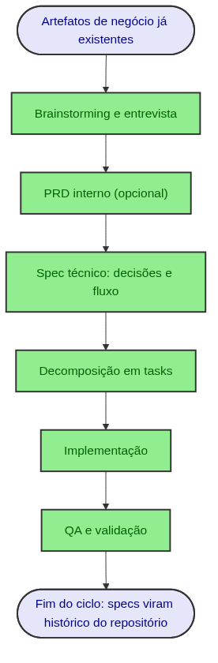
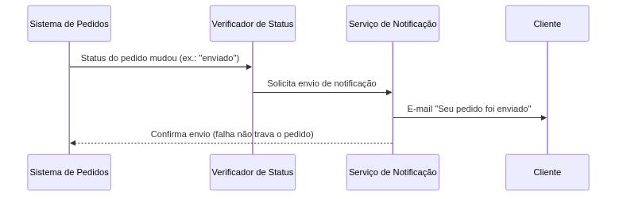
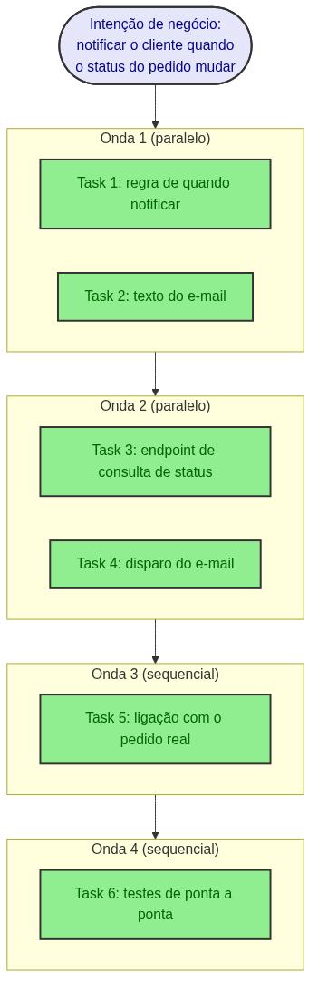
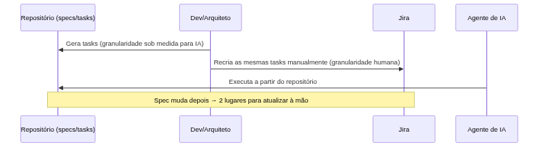

# Roteiro de apresentação — Spec-Driven Development (SDD) para Produto e Negócio

**Público:** gerentes de produto de squads, time de produto, time de negócio.
**Duração alvo:** 20-30 min (~24 slides + Q&A).
**Formato deste documento:** roteiro em Markdown para transcrição manual no PowerPoint — não é um `.pptx`. Cada seção abaixo é um slide: título, conteúdo (o texto que vai na tela) e notas de apresentação (o que você fala). Diagramas estão em `docs/apresentacoes/diagrams/` como `.png`, prontos para colar como imagem.

**Objetivo da apresentação:** apresentar um novo fluxo de trabalho — o Spec-Driven Development — e alinhar expectativas sobre como ele funciona, sem entrar em detalhes técnicos da ferramenta específica usada internamente para orquestrá-lo.

**O que este roteiro NÃO faz:** não propõe substituir o Jira, os rituais (planning, daily, weekly) ou qualquer processo de gestão existente. A tensão entre o fluxo SDD e esse processo tradicional é reconhecida explicitamente na Seção 6 — como um desafio real, não como algo já resolvido.

**Cenário usado como exemplo em todo o roteiro:** é **fictício**, criado especificamente para esta apresentação (domínio de e-commerce, feature de "notificação de status de pedido"). Não corresponde a nenhuma feature real deste ou de outro repositório — foi desenhado apenas para ilustrar as fases do fluxo com números plausíveis.

**Vocabulário técnico usado neste roteiro:** o jargão específico do fluxo SDD é definido em uma linha, em português simples, na primeira vez que aparece — 7 termos ao todo (orçamento fechado para não virar um glossário): SDD, janela de contexto, spec técnica, PRD interno, task, onda, critérios de aceite. O Slide 3 também nomeia artefatos de negócio que a empresa já produz hoje (PRD, diagramas de contexto, casos de uso, DAS, ADRs, data mappings, referências visuais) — esses não entram no orçamento de termos porque não são jargão novo: são artefatos que a própria audiência já usa no dia a dia.

---

## Seção 1 — Abertura

### Slide 1 — Título

**Conteúdo do slide:**

> Como construímos software com IA: o fluxo de Spec-Driven Development (SDD)
> Alinhamento de expectativas — Produto e Negócio

**Notas de apresentação (texto corrido):**

"Hoje eu quero explicar um fluxo de trabalho que passamos a usar para transformar uma ideia de produto em software funcionando, quando parte da construção é feita com apoio de inteligência artificial. Esse fluxo se chama **Spec-Driven Development**, ou **SDD** — desenvolvimento guiado por especificação: em vez de descrever a feature e já sair implementando, a gente escreve, decompõe e valida uma especificação detalhada antes de qualquer código ser escrito. O objetivo de hoje não é vender essa abordagem nem pedir uma decisão de vocês — é alinhar expectativa sobre como ela funciona, porque ela vai aparecer no dia a dia de vocês de um jeito diferente do que estão acostumados."

---

### Slide 2 — O que esta apresentação é (e o que não é)

**Conteúdo do slide:**

- **É:** um mapa do fluxo de trabalho ponta a ponta, de onde ele começa até onde ele termina.
- **É:** uma explicação de por que os artefatos gerados nesse fluxo têm um formato e um nível de detalhe diferente do que vocês veem hoje em uma história de Jira.
- **NÃO é:** uma proposta para substituir o Jira ou os rituais atuais.
- **NÃO é:** um mergulho técnico na ferramenta interna usada para orquestrar o fluxo.

**Notas de apresentação (texto corrido):**

"Só para gerenciar expectativa antes de começar: eu não vou pedir nenhuma decisão de processo hoje. Vou também deixar de fora o nome e os detalhes técnicos da ferramenta específica que usamos — isso não muda nada do que vocês precisam entender como time de produto. O que importa aqui são as fases do fluxo, os artefatos que cada fase produz, e onde esse fluxo hoje ainda esbarra no jeito tradicional de organizar trabalho — isso sim eu vou mostrar sem filtro, no final."

---

## Seção 2 — De onde vem o contexto

### Slide 3 — Toda feature começa fora do código

**Conteúdo do slide:**

- Antes de qualquer especificação técnica ser escrita, a empresa já produz artefatos descrevendo a necessidade de negócio:
  - **PRD** (documento de requisitos de produto — define o problema, para quem, e por quê)
  - Diagramas de contexto
  - Casos de uso
  - Restrições de negócio
  - DAS (documento de arquitetura de software) e ADRs (registros de decisão de arquitetura)
  - Data mappings
  - Referências visuais (Figma / Adobe XD)

**Notas de apresentação (texto corrido):**

"O fluxo SDD não substitui nada disso — ele começa depois disso. Vocês, o time de produto e as áreas correlatas, já produzem esse contexto hoje. Um aviso rápido: mais adiante eu vou falar de um PRD *interno*, gerado pelo próprio fluxo SDD — não é o mesmo documento que este PRD de negócio. São coisas diferentes, e eu vou deixar isso bem claro quando chegarmos lá."

---

### Slide 4 — O nível desses artefatos é "a feature pronta"

**Conteúdo do slide:**

- Esses documentos descrevem a entrega como um todo: a jornada completa do usuário, o valor de negócio, o resultado final.
- Eles não decompõem "como construir isso, pedaço por pedaço" — e está correto que não decomponham. Não é função de um PRD descrever ordem de implementação técnica.

**Notas de apresentação (texto corrido):**

"Isso não é uma crítica a esses artefatos — é assim que eles devem ser. Um PRD que já viesse quebrado em ordem de implementação técnica estaria fazendo o trabalho errado, cedo demais. O ponto é: existe uma lacuna entre 'aqui está a feature pronta que eu quero' e 'aqui está a sequência de passos técnicos para construir isso com qualidade' — e é exatamente essa lacuna que o SDD preenche."

---

### Slide 5 — É aqui que entra o SDD

**Conteúdo do slide:**

> O Spec-Driven Development pega o contexto de alto nível que a empresa já produz e faz o trabalho de tradução e decomposição que falta para a construção começar de forma confiável.

**Notas de apresentação (bullets/cues):**

- Ponte para a próxima seção: por que essa decomposição é necessária, e por que não é automática.

---

## Seção 3 — Por que não dá para jogar tudo para a IA de uma vez

### Slide 6 — A limitação real

**Conteúdo do slide:**

- Analogia: não se entrega a planta de uma casa inteira a um pedreiro e diz "construa" — quebra-se em fundação, estrutura, instalações, acabamento. Cada etapa tem escopo claro e pode ser conferida separadamente.
- Com um agente de IA essa necessidade é ainda mais rígida: existe um limite real de quanta informação ele processa com qualidade em uma única tarefa.
- **Janela de contexto:** o quanto de informação um agente de IA consegue "segurar" e processar com atenção em uma única tarefa, antes de começar a perder qualidade.

**Notas de apresentação (texto corrido):**

"Isso não é frescura de processo — é uma restrição técnica real. Se a gente entrega uma tarefa grande demais, o resultado piora de forma perceptível: decisões inconsistentes, partes esquecidas, qualidade caindo ao longo da tarefa. Por isso a decomposição em pedaços menores não é opcional dentro desse fluxo — ela é a diferença entre um resultado confiável e um que precisa ser refeito."

---

### Slide 7 — Decompor não é picotar aleatoriamente

**Conteúdo do slide:**

- A ressalva mais importante desta apresentação: o valor do SDD **não é** "a IA decide sozinha como dividir o trabalho".
- Quem interpreta o problema, decide os limites lógicos (onde uma regra de negócio termina e outra começa) e os limites físicos (que componente, que arquivo), e aprova cada decisão, é a pessoa — arquiteto(a) ou desenvolvedor(a).
- A IA participa da entrevista e da escrita. Quem decide e valida continua sendo humano.

**Notas de apresentação (texto corrido):**

"Esse é o ponto que eu mais quero que fique claro hoje: isso não é 'jogar o problema para a IA resolver'. A qualidade de tudo que vem depois — a spec técnica, as tarefas, o código — depende inteiramente de alguém ter decomposto bem o problema antes. IA mal orientada, com decomposição ruim, produz spec ruim e código ruim, só que mais rápido. O fluxo que eu vou mostrar agora existe justamente para estruturar essa curadoria humana em etapas verificáveis."

---

## Seção 4 — O ciclo do SDD

### Slide 8 — Mapa do ciclo completo

**Conteúdo do slide:**

**Notas de apresentação (bullets/cues):**

- Este é o mapa completo. Os próximos slides detalham cada fase, um de cada vez.
- Sugestão de apresentação: repita esta imagem (ou recorte) no canto de cada slide seguinte, destacando em negrito ou com uma seta a fase que está sendo detalhada — ajuda a plateia a nunca perder o "onde estamos".
- Frisar: sete fases, mas nem toda mudança passa pelas sete — isso vem na Seção 5.

---

### Slide 9 — Fase 1: Brainstorming e entrevista

**Conteúdo do slide:**

- Ponto de entrada do fluxo. Duas situações possíveis:
  - Uma ideia nova, ainda sem contexto formal — a entrevista extrai o que falta diretamente com quem está pedindo a feature.
  - Uma ideia que já tem contexto (PRD de negócio, Figma, casos de uso) — a entrevista absorve esse contexto existente e preenche só as lacunas.
- Saída desta fase: entendimento compartilhado do problema, ainda sem nenhuma decisão técnica tomada.

**Notas de apresentação (texto corrido):**

"Essa fase é uma conversa estruturada, não um formulário. O objetivo é sair dela com clareza sobre o que precisa ser resolvido e por quê — sem ainda decidir como. É comum que essa fase reaproveite tudo que a Seção 2 mostrou: quanto mais contexto de negócio já existe, mais rápida e mais precisa é essa etapa."

---

### Slide 10 — Fase 2: PRD interno (opcional)

**Conteúdo do slide:**

- **PRD interno:** um documento que o próprio fluxo SDD gera, opcionalmente, para registrar o que foi decidido e aprovado durante a entrevista — não é o PRD de negócio da Seção 2, é um artefato derivado dele.
- É opcional: features pequenas e autocontidas podem pular direto para a spec técnica.

**Notas de apresentação (texto corrido):**

"Aqui está a diferença que eu prometi esclarecer: o PRD de negócio vem de fora, antes do fluxo começar. Este PRD interno é gerado dentro do fluxo, depois da entrevista, e serve para registrar o que foi combinado — é opcional porque nem toda feature precisa desse registro formal separado; às vezes a spec técnica já é suficiente."

---

### Slide 11 — Fase 3: Spec técnica — decisões e fluxo

**Conteúdo do slide:**

- **Spec técnica:** o documento onde as decisões de arquitetura são tomadas e justificadas — o que vai ser construído, como os componentes se conectam, e por quê essa abordagem e não outra.
- Inclui: fluxo de dados, componentes e responsabilidades, decisões com justificativa técnica e de negócio, riscos aceitos, o que fica fora do escopo.

**Notas de apresentação (texto corrido):**

"Essa é a fase mais densa do fluxo, e a mais parecida com o que um arquiteto de software já fazia antes de qualquer IA existir. A diferença é que agora essa etapa é obrigatoriamente registrada por escrito, com justificativa, antes de qualquer linha de código — não fica só na cabeça de quem construiu."

---

### Slide 12 — Fase 3 na prática: o cenário fictício

**Conteúdo do slide:**

> Cenário ilustrativo (fictício, e-commerce): quando o status de um pedido muda, o sistema notifica o cliente por e-mail.

**Notas de apresentação (bullets/cues):**

- Este diagrama é o tipo de decisão que a fase técnica produz: quem chama quem, o que acontece em caso de sucesso, o que acontece se o envio do e-mail falhar (aqui, decidimos que uma falha no envio não pode travar o pedido).
- Frisar: isso é fictício, criado só para este roteiro — não existe de verdade em nenhum sistema.

---

### Slide 13 — Fase 4: Decomposição em tasks

**Conteúdo do slide:**

- **Task:** a menor unidade de trabalho executável do fluxo — pequena o bastante para caber na janela de contexto (Slide 6) e para ser verificada isoladamente antes de seguir para a próxima.
- **Onda:** um grupo de tasks que podem ser executadas ao mesmo tempo, porque não dependem umas das outras. Ondas diferentes rodam em sequência.

**Notas de apresentação (texto corrido):**

"Essa é a fase onde a spec técnica vira uma lista de tarefas concretas. E aqui já adianto o ponto que vou aprofundar na Seção 6: essa lista de tarefas é desenhada para ser executada por um agente de IA — o tamanho de cada task e a forma como elas são agrupadas em ondas não é o mesmo tamanho e forma que a gente usaria para dividir o mesmo trabalho entre pessoas."

---

### Slide 14 — Fase 4 na prática: granularidade

**Conteúdo do slide:**

> Para efeito de comparação: a mesma intenção de negócio, escrita como uma história de Jira tradicional, provavelmente viraria só 1 história com ~2 subtarefas — não 6 tasks em 4 ondas.

**Notas de apresentação (bullets/cues):**

- O ponto não é "6 é melhor que 2" ou vice-versa — é que são pensados para públicos diferentes: a decomposição em ondas existe para orquestrar execução automatizada e paralela; a subtask de Jira existe para comunicação e acompanhamento entre pessoas.
- Guardar esse slide na memória — ele volta a ser citado na Seção 6.

---

### Slide 15 — Fase 5: Implementação

**Conteúdo do slide:**

- Cada task é executada seguindo exatamente o que foi decidido na spec técnica.
- Fase mecânica, consequência das fases anteriores — não é onde as decisões importantes acontecem.

**Notas de apresentação (bullets/cues):**

- Slide propositalmente curto: o objetivo é deixar claro que, quando a decomposição está bem-feita, a implementação deixa de ser o gargalo criativo do processo — a decisão difícil já foi tomada e registrada antes.

---

### Slide 16 — Fase 6: QA e validação

**Conteúdo do slide:**

- **Critérios de aceite:** as condições específicas que definem quando uma parte da feature está pronta — cada critério é conferido, um a um, contra o que a spec técnica prometeu.
- Nada é considerado concluído só porque "parece que funciona" — cada critério de aceite é checado individualmente e o resultado fica registrado.

**Notas de apresentação (texto corrido):**

"Essa é a fase que fecha o ciclo tecnicamente. A pergunta que ela responde não é 'o código roda?' — é 'o que foi entregue corresponde exatamente ao que a spec técnica decidiu?'. Se um critério não passa, a tarefa não é considerada pronta."

---

### Slide 17 — Onde o ciclo termina

**Conteúdo do slide:**

- Depois da validação, os artefatos do fluxo (spec, PRD interno, tasks, relatório de validação) **não são apagados** — ficam no repositório como registro histórico das decisões tomadas.
- Mas eles também não viram documentação viva: ninguém volta a editar o "spec da feature X" quando a feature já foi entregue. O código passa a ser a fonte da verdade dali em diante.
- Servem para consulta futura (por que essa decisão foi tomada assim?), não para acompanhamento contínuo.

**Notas de apresentação (texto corrido):**

"Essa é uma pergunta que costuma vir aqui: 'então isso vira documentação que a gente mantém?'. Não exatamente — vira um histórico. É mais parecido com uma ata de decisão do que com uma documentação viva. Isso importa para o que vem a seguir, porque é justamente aqui que mora a fricção com o processo tradicional de gestão de trabalho."

---

## Seção 5 — Nem tudo passa pelo ciclo completo

### Slide 18 — Nem toda mudança precisa disso

**Conteúdo do slide:**

- O ciclo completo (7 fases) se justifica para: features novas, com escopo aberto, com decisões de arquitetura reais a tomar.
- Grande parte do trabalho do dia a dia é ajuste pontual sobre o que já existe: mudar um texto, ajustar uma regra, corrigir um comportamento.
- Forçar um ajuste pontual pelo ciclo completo é desperdício de tempo, não é rigor.

**Notas de apresentação (texto corrido):**

"Vale reforçar: o ciclo que acabei de mostrar não é a régua para todo pedido de mudança. Ele existe para os casos em que há decisão real a tomar. Usá-lo para uma mudança trivial seria como escrever uma spec de arquitetura para trocar a cor de um botão — desproporcional."

---

### Slide 19 — Exemplo: ajuste pós-SDD no mesmo cenário

**Conteúdo do slide:**

> A feature de notificação de status (cenário fictício) foi entregue pelo ciclo completo. Semanas depois, o time de marketing pede: "inclua o prazo estimado de entrega no texto do e-mail."

- Isso **não reabre o ciclo**: é uma tarefa pontual, direto no código já existente.
- Sem nova spec técnica, sem novo PRD interno, sem nova decomposição em ondas.

**Notas de apresentação (bullets/cues):**

- Reforçar que isso também é fictício — continuação do mesmo exemplo ilustrativo, não uma feature real.
- Esse é o contraponto direto ao Slide 18: mesmo depois de um SDD completo, os ajustes que vêm depois da entrega raramente precisam do mesmo tratamento.

---

### Slide 20 — Como decidir qual caminho usar

**Conteúdo do slide:**

| Use o ciclo completo quando... | Use um ajuste pontual quando... |
|---|---|
| A feature é nova | Já existe uma spec anterior cobrindo essa área |
| Há decisão de arquitetura real a tomar | A mudança é local, sem impacto em outros componentes |
| Múltiplos componentes são afetados | O comportamento já é conhecido, só precisa mudar um detalhe |

**Notas de apresentação (bullets/cues):**

- Este slide é o resumo prático da Seção 5 — útil como referência rápida se surgir a pergunta "e aquele pedido específico, qual caminho ele segue?".

---

## Seção 6 — Onde o fluxo ainda esbarra no processo tradicional

### Slide 21 — Um desafio real, não uma proposta de solução

**Conteúdo do slide:**

> Esta seção não traz uma solução pronta. É o reconhecimento honesto de um atrito real entre o fluxo SDD e o processo tradicional de gestão (Jira, sprints, cerimônias) — para que a decisão de como lidar com isso seja tomada com informação completa, não depois.

**Notas de apresentação (texto corrido):**

"Eu poderia terminar a apresentação no slide anterior e ficar tudo bonito. Mas não seria honesto — porque existe um ponto real onde esse fluxo ainda não conversa bem com o jeito que a empresa organiza e acompanha trabalho hoje. Vou mostrar exatamente onde."

---

### Slide 22 — Granularidade que não conversa

**Conteúdo do slide:**

- As tasks do SDD (Slide 13-14) são desenhadas sob medida para execução por um agente de IA: pequenas, passo a passo, verificáveis isoladamente.
- Uma pessoa não precisa desse nível de detalhe para executar a mesma tarefa — e o Jira, hoje, é pensado para granularidade humana.
- Resultado: o número e o formato das tasks do SDD **não é** o número e o formato que faríamos no Jira para o mesmo escopo (lembrar do Slide 14: 6 tasks/4 ondas vs. ~2 subtarefas).

**Notas de apresentação (texto corrido):**

"Isso não é um defeito do SDD nem do Jira — são dois formatos otimizados para públicos diferentes: um agente de IA executando sozinho, e uma pessoa acompanhando o trabalho de um time. O problema aparece quando tentamos fazer as duas coisas convergirem para o mesmo lugar, que é o próximo slide."

---

### Slide 23 — O round-trip manual

**Conteúdo do slide:**

- Hoje, para um item existir "oficialmente" no processo da empresa, alguém recria manualmente no Jira o que já foi decidido e decomposto no repositório.
- Se a spec muda depois — e specs mudam — existem dois lugares para manter sincronizados, e nada garante que fiquem.
- Isso é um risco real de desalinhamento entre repositório e Jira, não uma hipótese teórica.

**Notas de apresentação (bullets/cues):**

- Este é o ponto mais concreto de fricção: não é filosófico, é operacional — round-trip manual custa tempo e cria uma fonte de verdade duplicada.
- Deixar claro que não há proposta de solução hoje — é matéria para uma conversa separada, com as pessoas certas na mesa.

---

## Seção 7 — Encerramento

### Slide 24 — Recapitulação e próximos passos

**Conteúdo do slide:**

- O SDD começa onde o contexto de negócio (PRD, Figma, casos de uso) já existe — ele não substitui esse trabalho, ele o traduz.
- A decomposição em fases é curadoria humana estruturada, não "a IA decide sozinha" (Slide 7).
- Nem toda mudança passa pelo ciclo completo — a maior parte do trabalho do dia a dia continua sendo ajuste pontual.
- Existe uma fricção real e não resolvida entre a granularidade do SDD e o processo tradicional (Jira) — fica registrada como pauta em aberto.

**Notas de apresentação (texto corrido):**

"Resumindo: este é um fluxo novo de trabalho, com fases e artefatos próprios, que começa a partir do contexto que vocês já produzem hoje. Ele não pede para abandonar nada do processo atual — mas expõe um ponto de atrito real que, em algum momento, vamos precisar decidir juntos como tratar. Fico à disposição para perguntas."

---

## Apêndice — Arquivos-fonte dos diagramas

Todos os diagramas foram gerados via Mermaid e validados com `mmdc`. Os arquivos `.mmd` (fonte editável) e `.png` (para colar no PowerPoint) estão em `docs/apresentacoes/diagrams/`:

| Slide | Arquivo | Tipo |
|---|---|---|
| 8 | `sdd-fluxo-para-produto_01_flowchart_ciclo_sdd.png` | Fluxo (pipeline das 7 fases) |
| 12 | `sdd-fluxo-para-produto_02_sequence_notificacao_status_p.png` | Sequência (cenário fictício) |
| 14 | `sdd-fluxo-para-produto_03_flowchart_tasks_em_ondas.png` | Fluxo (tasks/ondas) |
| 23 | `sdd-fluxo-para-produto_04_sequence_round_trip_jira.png` | Sequência (round-trip Jira) |
