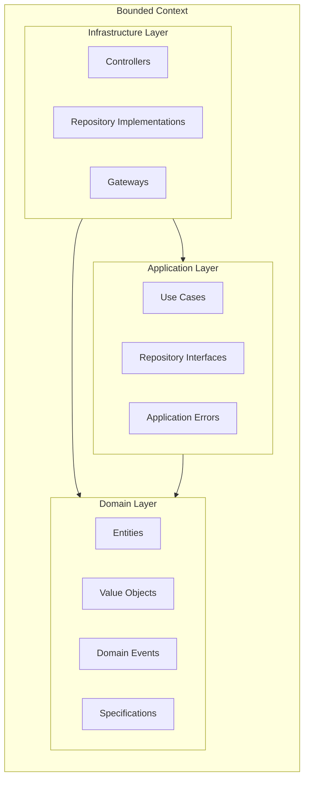
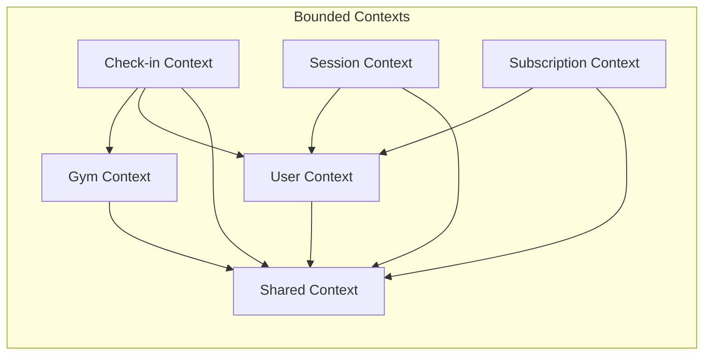
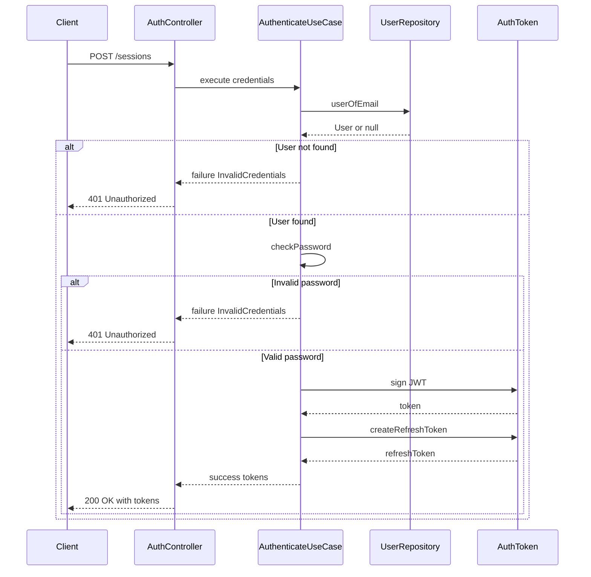
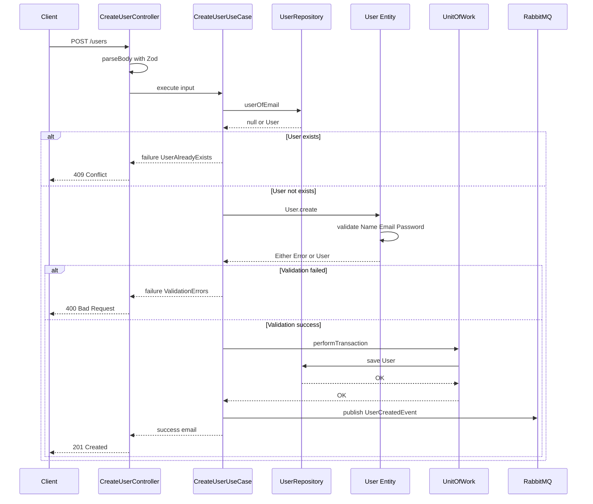
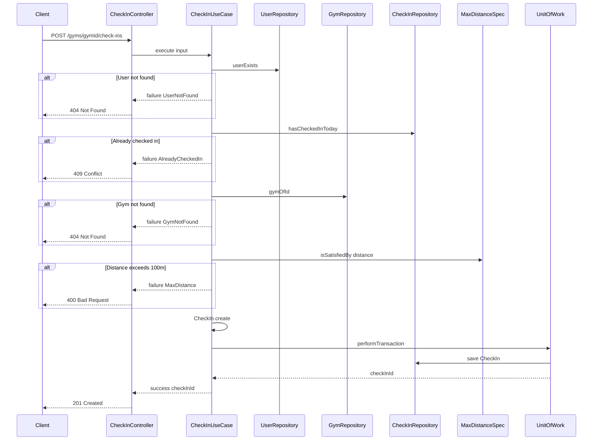
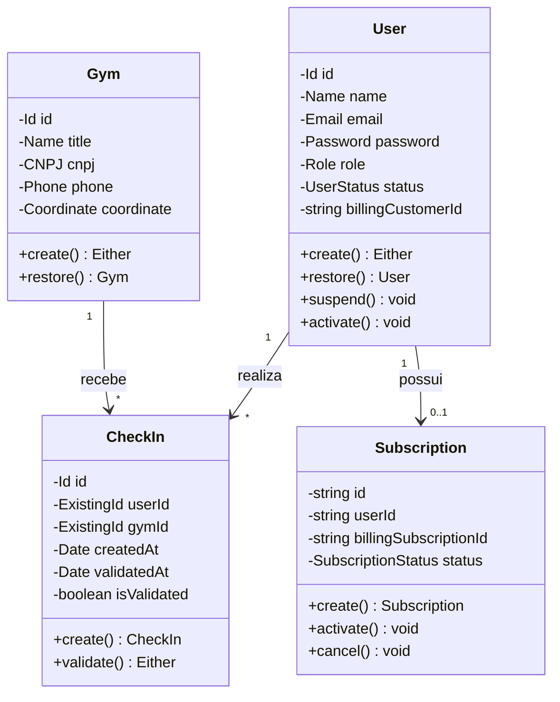
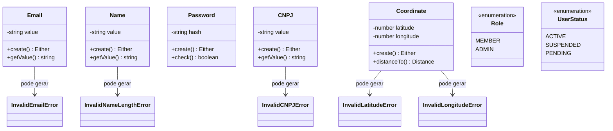
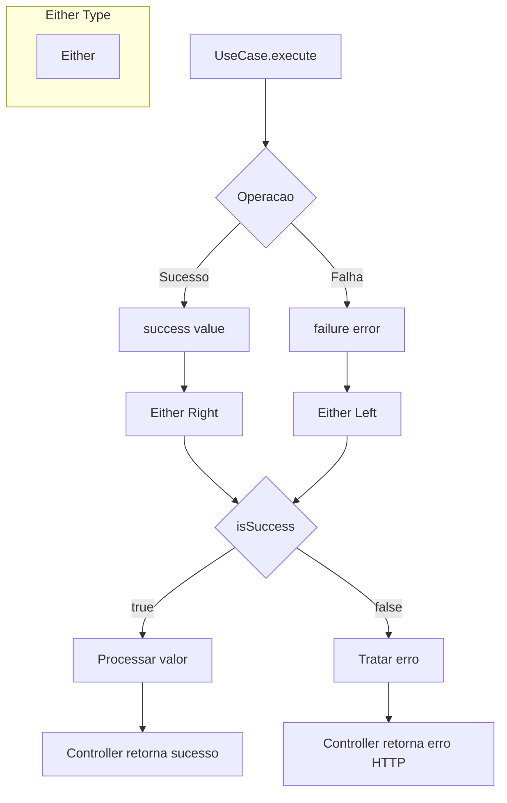
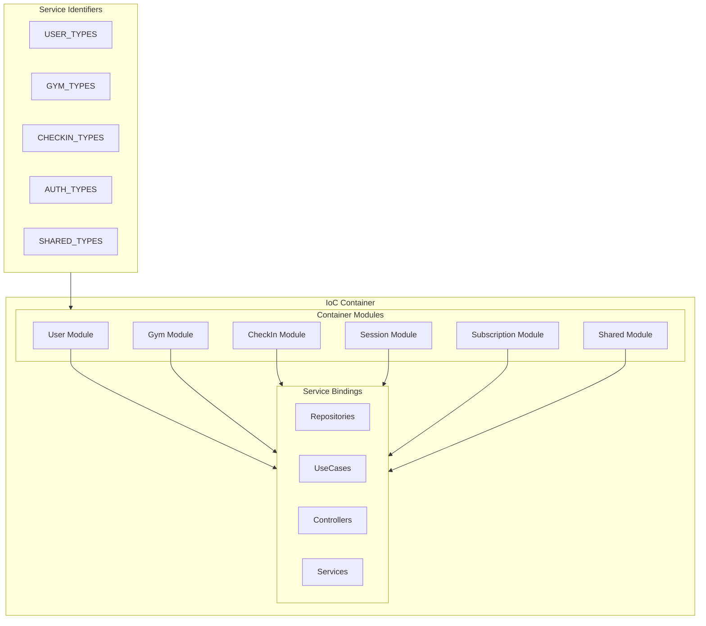
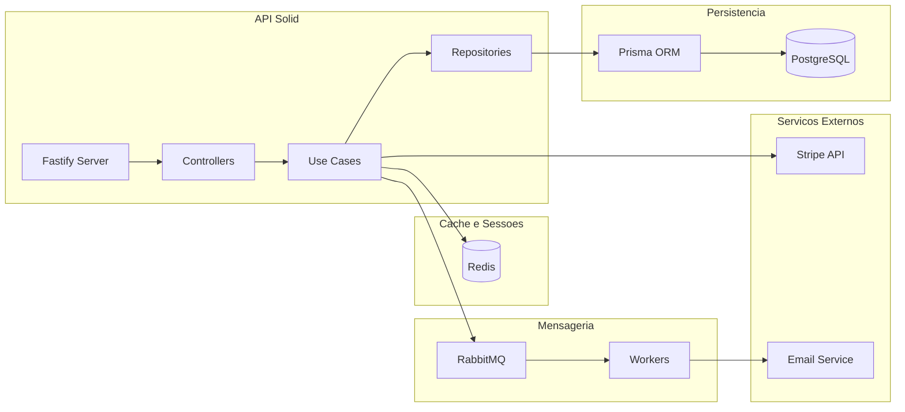

# Diagramas Mermaid - API Solid

## Visao Geral

A API Solid e um sistema de gerenciamento de academias desenvolvido com Clean Architecture e Domain-Driven Design. O sistema permite o cadastro de usuarios, gerenciamento de academias, realizacao de check-ins e gerenciamento de assinaturas. A arquitetura segue principios de separacao de responsabilidades com camadas bem definidas (Domain, Application, Infra) organizadas por bounded contexts.

## Elementos Identificados

### Fluxos Externos
- Usuarios finais (clientes e administradores)
- Stripe API (processamento de pagamentos)
- Sistema de Email (NodeMailer)
- RabbitMQ (fila de mensagens)

### Processos Internos
- Autenticacao e gerenciamento de sessoes
- Cadastro e gerenciamento de usuarios
- Cadastro e busca de academias
- Realizacao e validacao de check-ins
- Gerenciamento de assinaturas

### Variacoes de Comportamento
- Tipos de usuario: MEMBER, ADMIN
- Status do usuario: ACTIVE, SUSPENDED, PENDING
- Modos de persistencia: PostgreSQL, SQLite, In-Memory
- Status de assinatura: active, canceled, pending

### Contratos Publicos
- Either Pattern para tratamento de erros
- Interfaces de Repository
- Value Objects com validacao
- Domain Events

---

## Diagramas

### Arquitetura de Camadas por Bounded Context

Este diagrama ilustra a estrutura de camadas seguida em cada bounded context do sistema. A arquitetura Clean Architecture define regras de dependencia estritas onde a camada Domain nao possui dependencias externas, Application depende apenas de Domain, e Infra implementa as interfaces definidas em Application.

**Notas**:
- Domain Layer nao possui dependencias externas
- Application Layer define interfaces que Infra implementa
- Dependency Cruiser valida estas regras automaticamente

---

### Contextos de Dominio

Este diagrama apresenta os bounded contexts identificados no sistema e suas responsabilidades principais. Cada contexto possui sua propria estrutura de Domain, Application e Infra, seguindo o padrao DDD.

**Notas**:
- Shared Context contem componentes reutilizaveis
- Check-in depende de User e Gym para validacoes
- Session depende de User para autenticacao

---

### Fluxo de Autenticacao

Este diagrama de sequencia representa o fluxo completo de autenticacao de um usuario. O processo inclui validacao de credenciais, geracao de tokens JWT e refresh tokens para manter a sessao ativa.

**Notas**:
- Utiliza Either pattern para tratamento de erros
- JWT assinado com chave privada
- Refresh token para renovacao de sessao

---

### Fluxo de Criacao de Usuario

Este diagrama demonstra o processo de criacao de um novo usuario no sistema. O fluxo inclui validacao de unicidade, criacao da entidade com validacoes de dominio, persistencia com transacao e publicacao de eventos.

**Notas**:
- Validacoes de Value Objects ocorrem na criacao da entidade
- Transacao garante consistencia na persistencia
- Evento de dominio publicado apos sucesso

---

### Fluxo de Check-in

Este diagrama apresenta o processo complexo de realizacao de check-in em uma academia. O fluxo valida a existencia do usuario, verifica se ja realizou check-in no dia, valida a distancia ate a academia e persiste o registro.

**Notas**:
- Limite de distancia: 100 metros da academia
- Apenas um check-in por dia por usuario
- Evento CheckInCreated publicado automaticamente

---

### Estrutura de Entidades de Dominio

Este diagrama de classes apresenta as principais entidades do sistema e seus relacionamentos. Cada entidade possui Value Objects para garantir validacoes e invariantes de dominio.

**Notas**:
- Metodo create retorna Either para validacoes
- Metodo restore ignora validacoes para hidratacao
- Entities estendem Observable para Domain Events

---

### Value Objects do Sistema

Este diagrama apresenta os principais Value Objects utilizados nas entidades. Value Objects garantem validacoes e encapsulam regras de dominio especificas.

**Notas**:
- Todos retornam Either na criacao
- Imutaveis apos criacao
- Validacoes encapsuladas no proprio objeto

---

### Padrao Either para Tratamento de Erros

Este diagrama flowchart ilustra como o padrao Either e utilizado no sistema para tratamento de erros de forma funcional. O padrao elimina a necessidade de exceptions para fluxos de erro esperados.

**Notas**:
- success cria um Right com o valor
- failure cria um Left com o erro
- isSuccess e isFailure para verificacao

---

### Inversao de Controle com Inversify

Este diagrama apresenta a estrutura do container IoC utilizado para injecao de dependencias. O sistema utiliza Inversify com modulos organizados por bounded context.

**Notas**:
- Symbols usados como identificadores
- Singleton para Repositories
- RequestScope para transacoes

---

### Infraestrutura e Servicos Externos

Este diagrama mostra os componentes de infraestrutura e integracao com servicos externos. O sistema utiliza PostgreSQL para persistencia, Redis para cache de sessoes, RabbitMQ para mensageria e Stripe para pagamentos.

**Notas**:
- Prisma como ORM para PostgreSQL
- Redis para validacao de tokens revogados
- RabbitMQ para processamento assincrono
- Workers processam eventos de dominio

