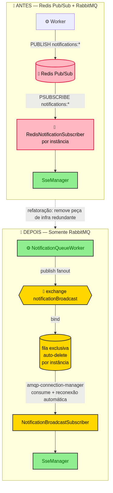
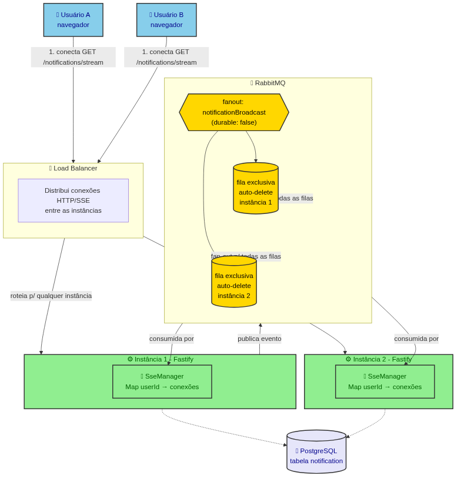
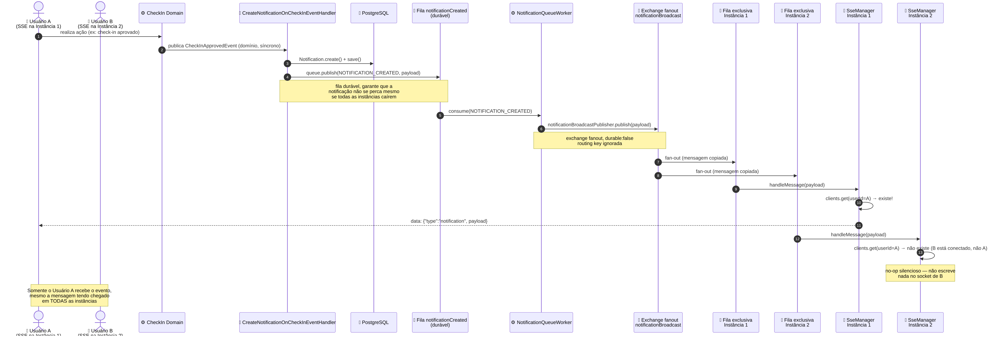
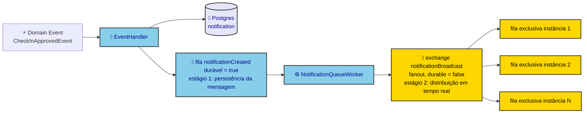
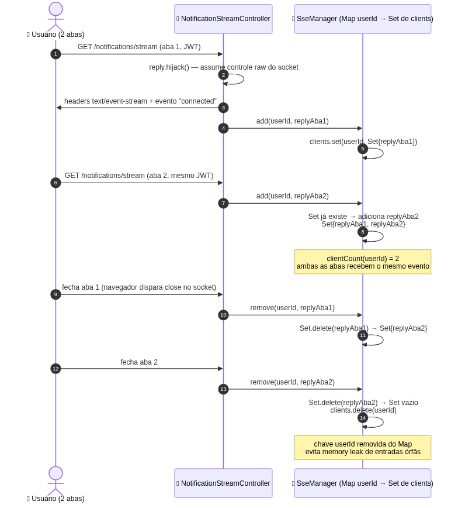

# Sistema de Notificações em Tempo Real — Guia Didático

> Público-alvo: desenvolvedor(a) jr entrando no bounded context `notification/`.
> Este documento explica **como** e **por quê** o sistema entrega notificações em tempo real
> apenas para o usuário que as gerou, mesmo com múltiplas instâncias da aplicação rodando
> atrás de um load balancer.

## Contexto: o que mudou

Até pouco tempo atrás, o broadcast de notificações entre instâncias usava **Redis Pub/Sub**
(`PSUBSCRIBE notifications:*`) além do RabbitMQ. Essa peça foi removida — hoje **só o
RabbitMQ** é responsável por levar uma notificação até a instância certa. O Redis continua
no projeto (rate-limit e BullMQ), só não participa mais deste fluxo.



`★ Insight ─────────────────────────────────────`

Por que remover o Redis Pub/Sub? Manter duas tecnologias de mensageria (RabbitMQ para
filas de trabalho + Redis para broadcast) significa duas conexões para monitorar, dois
pontos de falha e duas APIs para o time aprender. O RabbitMQ já tinha suporte nativo a
`fanout exchange` — o mesmo padrão de "distribuir para todo mundo" que o Redis Pub/Sub
oferecia — então a duplicação de infraestrutura não trazia benefício real.

`─────────────────────────────────────────────────`

## O problema que este sistema resolve

Imagine dois usuários, A e B, cada um com uma aba do navegador aberta, conectados via
Server-Sent Events (SSE) para receber notificações em tempo real. A aplicação roda em
**duas instâncias** atrás de um load balancer — não há garantia de que A e B estejam
conectados na mesma instância. Quando A faz um check-in aprovado, **só A** deve receber a
notificação, mesmo que a instância que processa o evento não seja a mesma onde A está
conectado.



`★ Insight ─────────────────────────────────────`

Este é um problema clássico de sistemas com estado em memória (as conexões SSE) rodando
em múltiplas réplicas sem sticky sessions. A solução geral é: **todo mundo recebe a
mensagem, mas só quem tem o destinatário conectado localmente age sobre ela**. É o mesmo
princípio usado em salas de chat distribuídas, contadores de presença, etc.

`─────────────────────────────────────────────────`

## Passo a passo do fluxo completo



1. **Usuário A realiza uma ação** que gera uma notificação (ex: um check-in é aprovado).
2. O domínio publica um `DomainEvent` (`CheckInApprovedEvent`) — isso é **síncrono e
   local**, sem RabbitMQ envolvido ainda.
3. `CreateNotificationOnCheckInEventHandler` (em
   `apps/backend/src/notification/application/event-handler/create-notification-on-check-in-event.handler.ts`)
   reage ao evento:
   - Cria e **persiste** a `Notification` no Postgres.
   - Publica o payload na fila `notificationCreated` (durável).
4. `NotificationQueueWorker` (`apps/backend/src/notification/infra/worker/notification-queue-worker.ts`)
   consome essa fila e repassa o payload ao `NotificationBroadcastPublisher`.
5. `NotificationBroadcastPublisher` (`apps/backend/src/notification/infra/queue/notification-broadcast-publisher.ts`)
   publica na **exchange fanout** `notificationBroadcast`.
6. O RabbitMQ **copia a mensagem para todas as filas vinculadas** à exchange — uma fila por
   instância viva da aplicação.
7. Em cada instância, `NotificationBroadcastSubscriber` recebe a mensagem e chama
   `SseManager.send(userId, evento)`.
8. `SseManager.send()` só escreve no socket **se aquele `userId` estiver conectado
   naquela instância específica**. Nas demais instâncias, a chamada é um no-op silencioso.

O ponto central: **o roteamento por usuário não acontece dentro do RabbitMQ** — o
RabbitMQ só distribui "para todo mundo" (fanout). Quem decide se a notificação chega ao
navegador certo é o `Map` em memória de cada instância.

## Por que a exchange é `fanout`

Uma exchange `fanout` ignora a routing key e **copia a mensagem para todas as filas
vinculadas**. É exatamente o comportamento necessário aqui: como não sabemos, no momento
da publicação, em qual instância o destinatário está conectado, a única forma de garantir
entrega é mandar para **todas** e deixar cada uma filtrar localmente.

```ts
// apps/backend/src/shared/infra/queue/exchanges.ts
export const EXCHANGES = {
  // ...
  NOTIFICATION_CREATED: "notificationCreated",
  NOTIFICATION_BROADCAST: "notificationBroadcast",
} as const
```

`★ Insight ─────────────────────────────────────`

Existem quatro tipos de exchange no AMQP: `direct` (routing key exata), `topic` (routing
key com wildcards), `headers` (roteia por atributos) e `fanout` (ignora routing key,
entrega a tudo). Os outros 6 exchanges deste projeto (`userCreated`, `checkInCreated`
etc.) usam o padrão `direct` — cada evento tem um único consumidor de destino. O
broadcast de notificação é o único caso do projeto que precisa de fanout, porque o
"destino" (a instância certa) não é conhecido em tempo de publicação.

`─────────────────────────────────────────────────`

## Por que duas filas em vez de publicar direto na fanout



Repare que existem **dois** RabbitMQ na jogada, não um só:

| Estágio | Nome | Tipo | `durable` | Papel |
|---|---|---|---|---|
| 1 | `notificationCreated` | fila comum (exchange `direct` padrão) | `true` | Persistência da mensagem — sobrevive a reinício do broker e a instâncias fora do ar |
| 2 | `notificationBroadcast` | exchange `fanout` | `false` | Distribuição em tempo real para as instâncias vivas no momento |

Se o handler de domínio publicasse **direto** na exchange fanout, uma notificação gerada
enquanto todas as instâncias estivessem reiniciando (deploy, crash) seria **perdida** —
uma fanout sem fila durável ligada a ela não guarda mensagem para ninguém. Com o estágio 1
(fila durável `notificationCreated`), a notificação fica retida até algum
`NotificationQueueWorker` processá-la, não importa quando as instâncias voltarem.

O estágio 2 continua sendo *best-effort*: se uma instância estiver offline no exato
momento do fan-out, ela simplesmente não recebe aquela mensagem em tempo real — mas como a
notificação já foi persistida no Postgres no passo 3, o usuário consegue recuperá-la ao
carregar a lista via `GET /api/v1/notifications` (não há reentrega ou "catch-up" via
Last-Event-ID nesse fluxo; o Postgres é a fonte da verdade).

## O mecanismo de SSE: o `Map` de conexões

A classe `SseManager` (`apps/backend/src/notification/infra/sse/sse-manager.ts`) é o
coração do roteamento local. Ela é registrada como **singleton** no container Inversify —
existe exatamente uma instância dela por processo Node.js, compartilhada por todas as
requisições daquele processo.

```ts
export interface SseClient {
  raw: { write(chunk: string): void }
}

@injectable()
export class SseManager {
  private readonly clients = new Map<string, Set<SseClient>>()

  public add(userId: string, reply: SseClient): void {
    const userClients = this.clients.get(userId)
    if (!userClients) {
      this.clients.set(userId, new Set([reply]))
      return
    }
    userClients.add(reply)
  }

  public remove(userId: string, reply: SseClient): void {
    const userClients = this.clients.get(userId)
    if (!userClients) return
    userClients.delete(reply)
    if (userClients.size === 0) {
      this.clients.delete(userId)
    }
  }

  public send(userId: string, data: unknown): void {
    const userClients = this.clients.get(userId)
    if (!userClients) return
    const message = `data: ${JSON.stringify(data)}\n\n`
    const deadClients: SseClient[] = []
    for (const reply of userClients) {
      try {
        reply.raw.write(message)
      } catch {
        deadClients.push(reply)
      }
    }
    for (const deadClient of deadClients) {
      this.remove(userId, deadClient)
    }
  }
}
```

Três decisões de design valem atenção:

- **`Map<userId, Set<SseClient>>` — não `Map<userId, SseClient>`.** Um mesmo usuário pode
  ter várias abas/dispositivos conectados ao mesmo tempo. O `Set` garante que todas
  recebam a mesma notificação, e evita duplicar a mesma conexão duas vezes.
- **Limpeza automática de chaves vazias.** Quando o último cliente de um usuário se
  desconecta, `remove()` apaga a entrada inteira do `Map` (`clients.delete(userId)`). Sem
  isso, o `Map` cresceria indefinidamente com chaves de usuários que já saíram — um
  memory leak clássico.
- **Falha de escrita não derruba o loop.** Se `reply.raw.write()` lançar (conexão já
  morta, mas o evento de `close` ainda não disparou), o cliente é anotado em
  `deadClients` e removido **depois** do loop — nunca durante a iteração do próprio `Set`
  que está sendo modificado.

### Como a conexão entra e sai do `Map`



O registro acontece em `NotificationStreamController`
(`apps/backend/src/notification/infra/controller/notification-stream.controller.ts`), na
rota `GET /notifications/stream`:

```ts
private async callback(req: FastifyRequest, reply: FastifyReply) {
  const userId = req.user.sub.id
  reply.raw.statusCode = HTTP_STATUS.OK
  this.copyReplyHeadersToRaw(reply)
  reply.raw.setHeader("Content-Type", "text/event-stream")
  reply.raw.setHeader("Cache-Control", "no-cache")
  reply.raw.setHeader("Connection", "keep-alive")
  reply.raw.setHeader("X-Accel-Buffering", "no")
  reply.hijack()
  reply.raw.write(`data: ${JSON.stringify({ type: "connected", userId })}\n\n`)
  this.sseManager.add(userId, reply)
  req.socket.on("close", () => {
    this.sseManager.remove(userId, reply)
  })
  return ResponseFactory.create({ status: HTTP_STATUS.OK, body: null })
}
```

`★ Insight ─────────────────────────────────────`

`reply.hijack()` é a peça que faz SSE funcionar dentro do Fastify. Normalmente o Fastify
controla todo o ciclo de vida da resposta (serializa, define `Content-Length`, fecha o
stream). Com SSE, a conexão precisa ficar **aberta indefinidamente** e o servidor escreve
nela sob demanda — o `hijack()` avisa o framework "não gerencie mais essa resposta, eu
mesmo vou escrever no socket raw". Sem isso, o Fastify tentaria finalizar a resposta
normalmente e a conexão SSE cairia.

O `userId` vem de `req.user.sub.id` — o *subject* do JWT decodificado, já que a rota é
`isProtected: true`. Isso garante que ninguém consiga se registrar como outro usuário no
`Map`; o servidor decide o `userId`, não o cliente.

`─────────────────────────────────────────────────`

## RabbitMQ fanout: cada instância cria fila nova?

**Sim.** Não existe uma fila fixa e compartilhada para o broadcast — cada instância, ao
subir, declara sua **própria fila exclusiva e efêmera**:

```ts
// apps/backend/src/notification/infra/queue/notification-broadcast-subscriber.ts
public async start(): Promise<void> {
  const connection = this.connect([env.AMQP_URL])
  this.channelWrapper = connection.createChannel({
    setup: async (channel: Channel) => {
      await channel.assertExchange(EXCHANGES.NOTIFICATION_BROADCAST, "fanout", { durable: false })
      const { queue } = await channel.assertQueue("", { exclusive: true, autoDelete: true })
      await channel.bindQueue(queue, EXCHANGES.NOTIFICATION_BROADCAST, "")
      await channel.consume(queue, (msg) => this.handleMessage(channel, msg))
    },
  })
  await this.channelWrapper.waitForConnect()
}
```

O que cada opção significa:

| Opção | Valor | Efeito |
|---|---|---|
| Nome da fila | `""` (vazio) | O RabbitMQ **gera um nome único** automaticamente (ex.: `amq.gen-xxxxx`) |
| `exclusive` | `true` | Só a conexão que criou a fila pode usá-la; a fila **desaparece** quando essa conexão fecha |
| `autoDelete` | `true` | A fila é apagada assim que o último consumidor se desconecta |
| routing key do bind | `""` (vazio) | Irrelevante numa exchange `fanout` — ela entrega a todas as filas vinculadas de qualquer forma |

Isso responde diretamente à pergunta: **não há configuração manual de fila por instância,
nem reuso de fila entre subidas**. Toda vez que uma instância inicia (ou reconecta após
queda de rede), ela recebe uma fila nova, vinculada automaticamente à exchange fanout.
Quando a instância cai ou reinicia, a fila antiga simplesmente some sozinha — não há
lixo acumulando no broker.

`★ Insight ─────────────────────────────────────`

Esse padrão (`""` + `exclusive: true` + `autoDelete: true`) é o idioma padrão do AMQP para
"quero uma fila privada e temporária, uma por assinante". É diferente das outras 6 filas
do projeto (`userCreated`, `checkInCreated` etc.), que são **duráveis e fixas** — porque
ali cada mensagem deve ser processada **uma única vez** por **um** worker (padrão
work queue). No broadcast, é o oposto: **cada instância deve processar todas as
mensagens**, então cada uma precisa da sua própria fila.

`─────────────────────────────────────────────────`

## Por que `durable: false` na exchange fanout

A fila durável (`notificationCreated`) já garante que a notificação não se perca antes do
fan-out (ver seção do pipeline de dois estágios). A exchange `notificationBroadcast` em si
não precisa sobreviver a um restart do broker — ela é redeclarada automaticamente (é
idempotente, `assertExchange` não falha se já existir com a mesma configuração) assim que
qualquer publisher ou subscriber sobe. Por isso `durable: false` é uma escolha deliberada,
não um esquecimento.

Ponto de atenção operacional: **o valor de `durable` precisa ser idêntico em todos os
pontos que declaram essa exchange** (publisher e subscriber). O RabbitMQ recusa uma
segunda declaração da mesma exchange com `durable` divergente do já registrado, fechando o
canal com erro `PRECONDITION_FAILED`. Os dois pontos do código
(`notification-broadcast-publisher.ts` e `notification-broadcast-subscriber.ts`) usam
`false` consistentemente — e isso é coberto por teste unitário em ambos, justamente para
travar essa consistência.

## Por que `amqp-connection-manager`

```json
// apps/backend/package.json
"amqp-connection-manager": "5.0.0",
"amqplib": "2.0.1",
```

O restante do projeto usa `amqplib` puro (via `RabbitMQAdapter`) para as filas de trabalho
comuns. O `NotificationBroadcastSubscriber`, porém, tem uma exigência que o `amqplib` puro
não resolve sozinho: como a fila é **exclusiva**, ela **deixa de existir** assim que a
conexão TCP cai (queda de rede, restart do RabbitMQ, etc.). Isso significa que, depois de
uma reconexão, a fila precisa ser **recriada e revinculada à exchange do zero** — não
basta reconectar o socket, é preciso reexecutar `assertExchange` +
`assertQueue` + `bindQueue` + `consume` de novo.

É exatamente esse recurso que o `amqp-connection-manager` oferece: o callback `setup`
passado a `createChannel()` é **reexecutado automaticamente pela biblioteca a cada
reconexão TCP** — sem código de retry/backoff próprio.

```ts
const connection = this.connect([env.AMQP_URL])       // AmqpConnectionManager
this.channelWrapper = connection.createChannel({
  setup: async (channel) => { /* redeclarar tudo aqui */ },
})
await this.channelWrapper.waitForConnect()
```

Sem essa lib, seria necessário escrever manualmente: detectar o evento `close` da conexão
`amqplib`, esperar um backoff, reconectar, e reexecutar toda a sequência de setup — código
de infraestrutura genérico que a lib já resolve de forma testada.

`★ Insight ─────────────────────────────────────`

Note que o `connect` do `amqp-connection-manager` **não é importado direto** dentro do
`NotificationBroadcastSubscriber` — ele é **injetado via Inversify**
(`NOTIFICATION_TYPES.Infra.AmqpConnect`, registrado como `toConstantValue(connect)` no
módulo IoC). Essa indireção existe para permitir que os testes substituam a conexão real
por um fake passado ao construtor, sem depender de mock de módulo ES — que quebraria neste
projeto porque o container inteiro é importado antecipadamente pelo setup global de testes.
É um exemplo prático de **Dependency Inversion** aplicado a uma função de biblioteca
externa, não só a classes do próprio domínio.

`─────────────────────────────────────────────────`

## Resumo de responsabilidades por arquivo

| Arquivo | Responsabilidade |
|---|---|
| `notification/application/event-handler/create-notification-on-check-in-event.handler.ts` | Reage a eventos de domínio, persiste `Notification`, publica na fila durável `notificationCreated` |
| `notification/infra/worker/notification-queue-worker.ts` | Consome `notificationCreated`, repassa para o publisher de broadcast |
| `notification/infra/queue/notification-broadcast-publisher.ts` | Publica na exchange fanout `notificationBroadcast` |
| `notification/infra/queue/notification-broadcast-subscriber.ts` | Declara fila exclusiva por instância, consome a exchange fanout, entrega ao `SseManager` local |
| `notification/infra/sse/sse-manager.ts` | Mantém o `Map<userId, Set<SseClient>>` em memória e escreve nos sockets SSE |
| `notification/infra/controller/notification-stream.controller.ts` | Endpoint `GET /notifications/stream`; registra/remove conexões no `SseManager` |
| `shared/infra/queue/exchanges.ts` | Nomes centralizados de exchanges, incluindo `NOTIFICATION_BROADCAST` |

## O que este design não cobre (limitações conhecidas)

- **Sem catch-up via Last-Event-ID**: se o navegador ficar offline e reconectar, ele não
  recebe automaticamente as notificações perdidas nesse intervalo via SSE — precisa
  buscar via `GET /api/v1/notifications`, que lê do Postgres (fonte da verdade).
- **Sem teardown explícito do `NotificationBroadcastSubscriber` no shutdown**: o método
  `stop()` existe na classe, mas nenhum ponto do bootstrap o chama hoje em `SIGTERM`/
  `SIGINT`. É um gap pré-existente no projeto (nenhum componente tem graceful shutdown
  hoje), não uma regressão introduzida por este refactor.
- **Custo de N filas exclusivas simultâneas**: cada instância viva mantém uma fila própria
  no RabbitMQ. Na escala atual do projeto isso é irrelevante, mas é o trade-off do padrão
  fanout + fila exclusiva (cresce linearmente com o número de instâncias, não com o
  número de usuários).

## Referências no repositório

- Design doc completo da migração: `docs/superpowers/notification-broadcast-fanout/specs/notification-broadcast-fanout-design.md`
- PRD da feature: `docs/superpowers/notification-broadcast-fanout/prd/prd-notification-broadcast-fanout.md`
- QA gate: `docs/superpowers/notification-broadcast-fanout/qa/qa-report-notification-broadcast-fanout.md`
