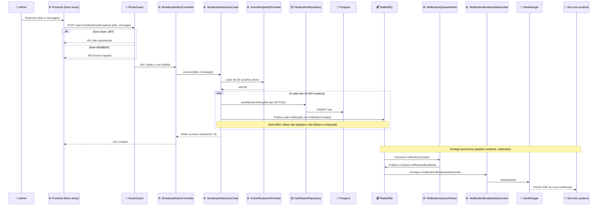

# Aviso administrativo em broadcast - Design

## Visão Geral

O administrador cadastra um aviso (título + mensagem) em uma tela nova do frontend. Ao enviar, o aviso é entregue como notificação in-app (sino, tempo real via SSE) a todos os usuários ativos.

- **Para quem:** administradores criam; todos os usuários ativos recebem.
- **Sucesso:** cada usuário ativo recebe exatamente uma notificação `NOTICE`, visível no sino sem recarregar a página.
- **Restrições:** somente `ADMIN` acessa a tela e o endpoint; reaproveita o pipeline de entrega já decidido (`notification-broadcast-fanout`).

**Fora de escopo (decidido nesta entrevista):** e-mail e push, agendamento, rascunho, histórico de avisos, exclusão de aviso enviado. `realtime-notification-system` e `notification-broadcast-fanout` já haviam adiado o produtor de avisos e a tela de admin; esta feature é esse follow-up. Também fica fora a proposta de fan-out na leitura (`broadcast_notifications` + `broadcast_dismissals`) do research anterior.

## Características Arquiteturais

**Priorizadas (top 3):**

| Característica | Por quê | Critério mensurável |
|---|---|---|
| Segurança (autorização) | Ação atinge todos os usuários e é irreversível | `POST /notifications/broadcast` responde 401 sem token e 403 para `MEMBER` (business-flow) |
| Corretude | Cada usuário ativo deve receber um único aviso | Nº de notificações `NOTICE` criadas = nº de usuários ativos no momento do envio; `recipients` da resposta bate com esse número |
| Disponibilidade | Falha de entrega não pode perder o aviso persistido | Falha ao publicar na fila não falha a requisição nem apaga o que já foi persistido |

**Consideradas, não priorizadas:** scalability (base atual pequena; gatilho de revisão na D2), latência do envio (aceitável enquanto síncrono, ver D2), i18n.

## Arquitetura e Fluxo

Abordagem escolhida: fan-out na escrita, síncrono, reaproveitando o pipeline existente (fila `notificationCreated` -> exchange fanout `notificationBroadcast` -> `SseManager` -> SSE por `userId`). Nada muda na leitura (`GET /notifications`, contador, marcar como lida) nem no SSE.

1. O admin abre `/admin/avisos/novo`, preenche Título e Mensagem e vê a pré-visualização do sino.
2. O frontend chama `POST /api/v1/notifications/broadcast` com `{ title, message }`.
3. `RouteGuard` valida JWT e papel `ADMIN` (401/403 caso contrário).
4. `BroadcastNoticeController` delega a `BroadcastNoticeUseCase`.
5. O use case obtém os ids dos usuários ativos por `ActiveRecipientsProvider`.
6. Para cada bloco de 500 ids: cria `Notification` do tipo `NOTICE` (uma por usuário, `gymName` e `reason` nulos), persiste com `NotificationRepository.saveMany` e publica cada uma em `notificationCreated`.
7. Falha ao publicar é logada (`logger.error`) e não interrompe nem falha a requisição; o Postgres é a fonte de verdade.
8. Resposta `201` com `{ recipients: N }`; o frontend exibe toast e limpa o formulário.
9. Entrega assíncrona pelo pipeline existente, sem alterações.

Diagrama fonte: `specs/diagrams/broadcast-flow.mmd`

## Componentes

Nomeados por responsabilidade.

**Backend (`apps/backend/src/notification`)**

- `BroadcastNoticeUseCase` (application): valida o comando, obtém destinatários, persiste em blocos e dispara a publicação; retorna `Either` com a contagem de destinatários.
- `ActiveRecipientsProvider` (porta, application): entrega os ids dos usuários ativos. Existe para que o contexto `notification` não importe o contexto `user` (dependency-cruiser).
- `PrismaActiveRecipientsProvider` (infra): implementa a porta consultando usuários com status ativo.
- `NotificationRepository.saveMany` (porta + Prisma + em memória): inserção em lote.
- `BroadcastNoticeController` (infra): rota `POST /api/v1/notifications/broadcast`, `isProtected: true`, `onlyAdmin: true`, schema OpenAPI via `OpenApiSchemaBuilder`.
- Tipo `NOTICE`: novo valor em `NotificationType` (tipo de domínio, enum Prisma, migration, zod de `get-notifications.controller`).
- Composição: identificador de serviço, binding no container e bootstrap em `setup-notification-module.ts`.
- Após implementar, `pnpm generate:types` atualiza `@repo/api-types`.

**Frontend (`apps/frontend/src`)**

- `features/notices/schemas/noticeSchema`: título 1-100 e mensagem 1-500 caracteres (zod).
- `features/notices/api/useBroadcastNotice`: mutation TanStack Query sobre o cliente OpenAPI tipado.
- `features/notices/components/NoticeForm` e `NoticePreview` (o preview reutiliza `NotificationItem`).
- Página `app/(authenticated)/admin/avisos/novo/page.tsx` sob `AdminGuard` (já aplicado por `admin/layout.tsx`).
- `authenticated-shell.tsx`: item `Novo aviso` (`Megaphone`) em `ADMIN_NAV_ITEMS`.
- `notification-item.tsx`: entrada `NOTICE` em `NOTIFICATION_TYPE_STYLE`; tipo `NOTICE` em `use-notifications.ts`.
- `test/msw/handlers.ts`: handler do novo endpoint.

## Especificação Visual

**Artefato curado:** `mockups/admin-notice-broadcast-visual.md` (prosa + markup + tokens, relativo a este spec)

**Fonte de design original:** Nenhuma; layout definido apenas via mockup do companion.

**Decisões visuais (norte, não pixel-final):**
- Layout B escolhido: formulário em card à esquerda e pré-visualização do sino à direita; empilha abaixo de ~860px.
- Hierarquia: `h1` "Novo aviso" com eyebrow mono "Admin"; CTA primário `Enviar aviso` alinhado à direita no card.
- Tokens do tema VOLT (dark padrão): primário `#39e58c`, card `#161616`, raio `rounded-md` 14px e `rounded-xl` 22px.
- O preview usa o `NotificationItem` real para não divergir do que o usuário vê.

**Fidelidade:** o mockup é um norte; a fidelidade final é construída na task de implementação.

## Decisões Arquiteturais

### D1. Fan-out na escrita, síncrono

- **Contexto:** hoje cada `Notification` tem um único `userId` e o pipeline entrega por `userId`. Não há mecanismo de "todos os usuários". Alternativas: fan-out na escrita síncrono, expansão assíncrona por worker, fan-out na leitura.
- **Decisão:** o use case cria uma notificação por usuário ativo, em blocos, e publica cada uma na fila existente.
- **Justificativa técnica:** leitura, contador, "marcar como lida" e SSE permanecem intactos; reaproveita decisões fechadas em `notification-broadcast-fanout`.
- **Justificativa de negócio:** menor custo e menor risco de regressão para um volume de usuários pequeno.
- **Trade-offs aceitos:** escrita O(N) e N mensagens na fila; a requisição espera o lote; sem estado de progresso.

### D2. Gatilho para migrar ao fan-out assíncrono

- **Contexto:** o síncrono não escala indefinidamente.
- **Decisão:** revisar para expansão assíncrona por worker se a base passar de ~10 mil usuários ativos ou o envio levar mais de 5 s.
- **Justificativa de negócio:** evita construir fila e worker extras sem necessidade medida.
- **Trade-offs aceitos:** até lá, o timeout de uma requisição longa é um limite conhecido.

### D3. Novo tipo `NOTICE` em vez de reaproveitar `PROMOTION`

- **Contexto:** `PROMOTION` existe sem produtor e significa promoção, não aviso.
- **Decisão:** adicionar `NOTICE`.
- **Justificativa técnica:** semântica correta e estilo próprio no sino; evita ambiguidade futura quando promoções existirem.
- **Justificativa de negócio:** evita retrabalho de migração de dados depois.
- **Trade-offs aceitos:** migration e edição nos 4 lugares onde o enum é duplicado (domínio, Prisma, migration, zod) mais o mapa de estilo do frontend.

### D4. Porta `ActiveRecipientsProvider` no contexto `notification`

- **Contexto:** o contexto `notification` não pode depender do contexto `user`.
- **Decisão:** porta própria implementada em infra com consulta Prisma dos usuários ativos.
- **Trade-offs aceitos:** uma consulta a mais mantida em infra; a regra de "ativo" fica no provider e deve acompanhar o status do usuário (verificar `UserStatus` ao planejar).

### D5. Sem deduplicação no servidor; admin incluído; sem confirmação modal

- **Decisão:** botão desabilitado durante o envio e formulário limpo em sucesso; o próprio admin recebe o aviso; a pré-visualização substitui um modal de confirmação.
- **Trade-offs aceitos:** dois envios deliberados iguais geram dois avisos. Revisar com uma chave de idempotência se aparecer envio duplicado em produção.

## Riscos

| Risco | Impacto (1-3) | Probabilidade (1-3) | Score | Mitigação |
|---|---|---|---|---|
| Envio duplicado por clique duplo ou reenvio | 2 | 2 | 4 🟡 | Botão desabilitado em `isPending`; teste de frontend cobre; D5 registra o gatilho de revisão |
| Falha parcial no meio dos blocos (parte dos usuários sem aviso) | 2 | 1 | 2 🟢 | Blocos já persistidos permanecem; a resposta reporta erro; sem retentativa automática nesta versão |
| Drift do enum `NotificationType` (duplicado em 4 lugares) | 2 | 2 | 4 🟡 | Teste de contrato que percorre todos os valores; `pnpm tsc:check` e `pnpm generate:types` no gate final |
| Requisição longa com base grande | 2 | 1 | 2 🟢 | D2 define o gatilho de migração |
| Aviso enviado a usuário inativo/incorreto por regra de "ativo" errada | 2 | 2 | 4 🟡 | Verificar `UserStatus` real no plano; teste do provider com usuários de status variados |

## Testes

**Runners:** backend `pnpm --filter backend test:run` (unitários `*.test.ts`), `test:business-flow` (`*.business-flow-test.ts`), `test:e2e:prisma`; frontend Vitest + Testing Library + MSW (`pnpm --filter frontend test -- --run`). Portões finais do repositório: `pnpm biome:fix`, `pnpm tsc:check`, `pnpm test:run`, `pnpm build`, `pnpm --filter backend fit:validate-dependencies`.

- **Unitário do use case** (repositório, provider e fila em memória): cria uma notificação por destinatário; blocos de 500; contagem retornada; falha de publicação não falha o caso de uso; sem destinatários retorna sucesso com 0.
- **Business-flow:** 401 sem token, 403 para `MEMBER`, 201 para `ADMIN`, corpo inválido retorna 400, e um segundo usuário vê o aviso em `GET /api/v1/notifications`.
- **Prisma e2e:** `saveMany` persiste as linhas com o vínculo `UserNotification`; provider lista só usuários ativos.
- **Contrato do enum:** todos os valores de `NotificationType` aceitos pelo zod do GET e pelo mapa de estilo.
- **Frontend:** validação do schema, preview reflete o digitado, submit chama a mutation e mostra toast, botão desabilitado durante o envio, item de menu visível só para ADMIN.
- Testes do frontend escritos em PT-BR com `test` (nunca `it`), conforme `apps/frontend/AGENTS.md`.
