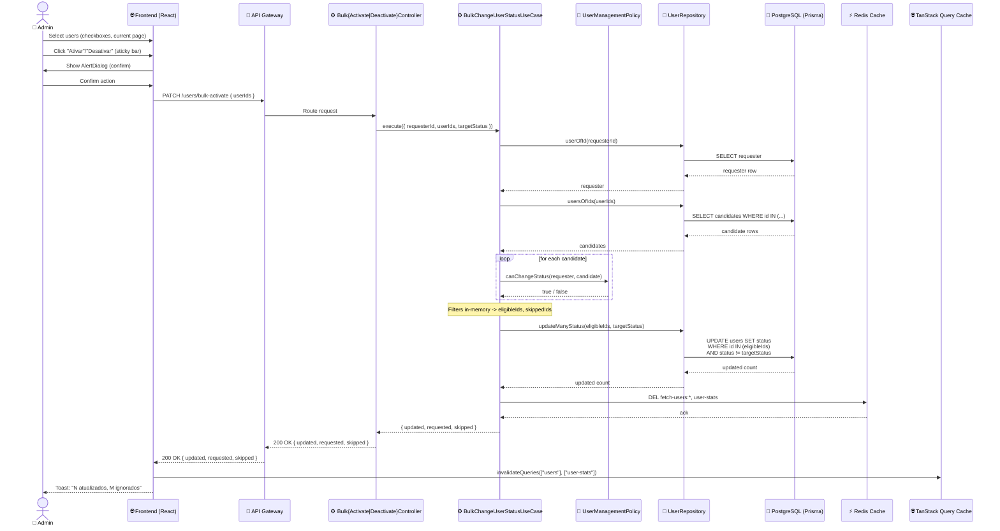

# Design — Ações em Massa (Ativar/Desativar) na Listagem de Usuários

## Visão Geral

Hoje, um admin em `/admin/usuarios` só pode ativar ou desativar usuários um por um: abre o
painel de detalhe do usuário, clica em "Mais ações" e aplica a ação individualmente. Esta
feature adiciona uma **operação em massa**: o admin marca múltiplos usuários na página
atual da listagem e aplica Ativar ou Desativar de uma vez, com uma única escrita bulk no
banco (não um loop de updates individuais), de forma idempotente.

**Dentro do escopo:**
- Checkbox por linha + checkbox "selecionar página" (com estado indeterminado)
- Barra de ações fixa no rodapé quando há seleção (Ativar / Desativar / Limpar)
- Checkbox desabilitado para usuários que o admin logado não pode gerenciar (self, root,
  admin gerenciando outro admin) — reaproveitando a lógica de permissão já existente
- "Ativar" em massa também desbloqueia usuários `locked`, igual ao botão individual
- Confirmação (AlertDialog) tanto para Ativar quanto para Desativar em massa
- Backend: 1 leitura de candidatos + 1 `updateMany`, reaproveitando `UserManagementPolicy`
  para revalidação defensiva
- Invalidação de cache (Redis `fetch-users:*` e `user-stats`) e do cache do TanStack Query

**Fora de escopo:**
- Seleção entre páginas ("selecionar todos os N resultados do filtro")
- Exclusão em massa (soft-delete), promoção/rebaixamento de role em massa
- Trilha de auditoria detalhada (quem/quando) além do que já existe hoje
- Relatório granular de "falhou por usuário" na UI — o backend filtra silenciosamente os
  inelegíveis (defesa em profundidade); a UI já impede a seleção deles no caminho normal

## Características Arquiteturais

**Priorizadas (top 3):**

| Característica | Por quê (preocupação de domínio) | Critério mensurável |
|---|---|---|
| Performance | Requisito explícito do pedido: evitar N updates individuais | 1 operação bulk no banco por chamada, independente do tamanho da seleção (até 100 IDs) |
| Idempotência | Requisito explícito: repetir a mesma chamada não deve reaplicar efeitos indesejados | Repetir a mesma requisição duas vezes produz o mesmo estado final; segunda chamada retorna `updated: 0` |
| Segurança/Autorização | A operação altera status de acesso de várias contas de uma vez — erro aqui é caro | `UserManagementPolicy.canChangeStatus` é reavaliada no backend para cada candidato, mesmo que a UI já bloqueie a seleção |

**Consideradas, não priorizadas:** escalabilidade horizontal (volume de usuários por página
já é limitado pela paginação existente, sem necessidade de otimização adicional), i18n (sem
expansão prevista).

## Especificação Visual

**Artefato curado:** `mockups/bulk-user-status-actions-visual.md`

**Fonte de design original:** Nenhuma; layout definido apenas via mockup do companion.

**Decisões visuais (norte, não pixel-final):**
- Checkbox dentro de cada card da lista (não vira data-table) + barra de ações fixa no
  rodapé, visível apenas quando há seleção (Opção A, aprovada por comparação lado a lado).
- Checkbox de página no topo com estado indeterminado para seleção parcial.
- Checkbox desabilitado para usuários fora da política de permissão do admin logado.

**Fidelidade:** o mockup é um norte de layout/hierarquia; a fidelidade final é construída
nas tasks de implementação do `BulkActionBar` e da atualização de `UserRow`.

## Arquitetura e Fluxo de Dados



Diagrama fonte: `specs/diagrams/bulk-user-status-actions-design_01_sequence_bulk_status_change_f.mmd`

O fluxo faz **duas** consultas ao banco (buscar requester + buscar candidatos) e **uma
única escrita** (`updateMany`), independente de quantos usuários estejam selecionados —
substituindo o padrão anterior de N updates individuais. A filtragem por política de
autorização acontece inteiramente em memória, reaproveitando `UserManagementPolicy`, sem
duplicar a regra em SQL.

## Estrutura de Componentes

### Backend (`apps/backend/src/user/`)

| Componente | Camada | Responsabilidade |
|---|---|---|
| `BulkChangeUserStatusUseCase` | `application/use-case` | Recebe `{ requesterId, userIds, targetStatus }`; busca requester e candidatos; filtra por `UserManagementPolicy.canChangeStatus`; delega a escrita bulk ao repositório; invalida cache |
| `UserRepository.usersOfIds(ids)` | `application/persistence/repository` (interface) + implementações | Busca candidatos por lista de IDs em uma única query |
| `UserRepository.updateManyStatus(ids, status)` | idem | Executa um único `updateMany` — `where: { id: { in: eligibleIds }, status: { not: status } }`, `data: { status }`. Retorna `{ count }` |
| `BulkActivateUsersController` | `infra/controller` | Parsing HTTP → `BulkChangeUserStatusUseCase` com `targetStatus: "activated"` |
| `BulkDeactivateUsersController` | `infra/controller` | Parsing HTTP → `BulkChangeUserStatusUseCase` com `targetStatus: "suspended"` |

Nenhum novo bounded context, entidade ou value object — reaproveita `User`,
`UserManagementPolicy` e o padrão de repositório/provider já existentes.

### Frontend (`apps/frontend/src/features/admin/`)

| Componente | Responsabilidade |
|---|---|
| `AdminUsersContent` | Guarda `selectedIds: Set<string>`, limpo ao trocar página/filtro/busca |
| `UserRow` (atualizado) | Ganha `selectable`/`checked`/`onToggleSelect`; checkbox desabilitado via `resolvePermissions(user, currentUser).canChangeStatus` (função pura já existente, sem duplicar regra) |
| `BulkActionBar` (novo) | Barra fixa no rodapé: contador, botões Ativar/Desativar, Limpar seleção |
| `BulkStatusConfirmationDialog` (novo) | `AlertDialog` parametrizado por ação, usado tanto para Ativar quanto Desativar em massa |
| `useBulkChangeUserStatus` (novo hook) | Mutation TanStack chamando `/users/bulk-activate` ou `/users/bulk-deactivate`; mesmo padrão otimista/invalidação dos hooks existentes |

## Endpoints

```
PATCH /users/bulk-activate    { userIds: string[] }   -- isProtected, onlyAdmin
PATCH /users/bulk-deactivate  { userIds: string[] }   -- isProtected, onlyAdmin
```

- Body validado via Zod: `userIds: z.array(z.string().uuid()).min(1).max(100)`.
- Resposta de sucesso (`200 OK`): `{ updated: number, requested: number, skipped: number }`
  — inclusive quando `updated: 0` (caso idempotente ou seleção 100% inelegível).
- **`skipped` é um número único, sem distinguir motivo:** ele soma tanto os usuários
  reprovados por `UserManagementPolicy` (ex.: seleção obsoleta, outro admin, root) quanto os
  que já estavam no status alvo (excluídos pelo `status: { not: targetStatus }` da
  idempotência). Decisão deliberada: para o admin, o resultado prático de "não foi
  atualizado" é o mesmo nos dois casos, e a UI já impede a seleção de inelegíveis no
  caminho normal — abrir uma quebra por motivo (`skippedIneligible`/`skippedNoop`) só se
  justificaria se a UI precisasse exibir mensagens diferentes por causa, o que não é
  requisito desta feature. Se essa granularidade for necessária no futuro, é uma extensão
  aditiva da resposta, não uma mudança breaking.
- `400 Bad Request`: array vazio, mais de 100 IDs, UUID inválido.
- `422`: requester não encontrado (`NotAllowedToManageUserError`, mesmo padrão do
  `SuspendUserUseCase`).
- Rate limit: reaproveita `RATE_LIMIT_CONFIG.AUTH`, já usado em `ActivateUserController`.

## Decisões Arquiteturais

### D1. Select + filtro em memória (reaproveitando a Policy) + um único `updateMany`, em vez de embutir a regra de elegibilidade na cláusula SQL

- **Contexto:** a operação precisa aplicar `UserManagementPolicy.canChangeStatus` (root
  imune, admin não gerencia outro admin, sem auto-alteração) sobre uma seleção de até 100
  usuários, sem cair num loop de updates individuais. Duas abordagens foram avaliadas:
  (1) embutir as condições de elegibilidade diretamente no `where` do `updateMany` (1
  round-trip); (2) buscar os candidatos, filtrar em memória com a `Policy` já testada, e
  então rodar um único `updateMany` só com os IDs elegíveis (2 round-trips).
- **Decisão:** abordagem (2) — select + filtro em memória + um único `updateMany`.
- **Justificativa técnica:** reaproveita a única fonte de verdade da regra de autorização
  (já testada em `user-management-policy.test.ts`), respeitando a regra de dependência do
  projeto (regra de negócio pertence a Application/Domain, não deve vazar para uma query
  de infraestrutura). Mantém a operação testável unitariamente com `InMemoryUserRepository`.
- **Justificativa de negócio:** reduz o risco de duas fontes de verdade divergirem ao longo
  do tempo (SQL vs. `UserManagementPolicy`), o que é mais caro de corrigir depois do que o
  custo de uma consulta extra.
- **Trade-offs aceitos:** 2 round-trips ao banco em vez de 1; carrega os usuários candidatos
  em memória (custo pequeno, já que a seleção é limitada à página atual). O gargalo real
  que motivou o pedido (N updates individuais) é eliminado de qualquer forma — a escrita
  continua sendo O(1) em relação ao tamanho da seleção.

### D2. Sem eventos de domínio granulares por usuário no caminho bulk

- **Contexto:** o fluxo individual (`user.activate()`/`user.suspend()`) hidrata a entidade
  `User` e publica eventos de domínio via `Observable`. O `updateMany` do Prisma não hidrata
  entidades, então não dispara esse mecanismo.
- **Decisão:** o caminho bulk não publica `UserActivatedEvent`/`UserSuspendedEvent` por
  usuário afetado.
- **Justificativa técnica:** hidratar e mutar N entidades apenas para publicar eventos
  reintroduziria o padrão de N operações que a feature busca eliminar.
- **Justificativa de negócio:** nenhum consumidor atual desses eventos depende de granularidade
  por usuário para o caso de uso administrativo em massa; auditoria detalhada por usuário
  está explicitamente fora de escopo (ver Riscos).
- **Trade-offs aceitos:** se um handler de evento existente depender de reagir a
  ativação/suspensão individual (ex.: notificação por e-mail), ele não dispara para usuários
  afetados pelo caminho bulk. Nenhum handler desse tipo foi identificado na exploração do
  código atual; se surgir a necessidade, é um fork de escopo futuro.

### Decisões táticas

| Decisão | Justificativa |
|---|---|
| Duas rotas dedicadas (`/users/bulk-activate`, `/users/bulk-deactivate`) em vez de uma rota genérica com `action` no body | Consistente com o padrão existente de rotas por ação (`/users/activate`), evita um parâmetro de ação genérico que a base de código atual não usa em nenhum outro lugar |
| Seleção limitada à página atual (sem "selecionar todos os N filtrados") | Decisão do usuário durante a entrevista — reduz escopo e evita semântica de bulk-por-filtro no backend |
| Limite de 100 IDs por chamada | Defesa contra abuso de payload; a seleção normal nunca deveria superar o `limit` da paginação |

## Riscos

| Risco | Impacto (1-3) | Probabilidade (1-3) | Score | Mitigação |
|---|---|---|---|---|
| Seleção fica obsoleta entre o carregamento da lista e o clique em Ativar/Desativar (outro admin alterou o alvo nesse meio-tempo) | 2 | 2 | 4 🟡 | Backend reaplica `UserManagementPolicy` no momento do submit (não confia apenas na UI); resposta `skipped` informa o frontend, que exibe toast resumindo |
| Ausência de auditoria granular por usuário no caminho bulk (ver D2) | 2 | 1 | 2 🟢 | Fora de escopo explícito nesta feature; se necessário no futuro, é um fork de escopo separado, não uma lacuna silenciosa |
| Payload de seleção manipulado pelo cliente para incluir IDs inelegíveis | 2 | 1 | 2 🟢 | Backend sempre revalida via `UserManagementPolicy`, independente do que a UI permite selecionar — nenhum ID inelegível é afetado mesmo com payload adulterado |

## Testes

- **Unidade:** `bulk-change-user-status.usecase.test.ts` com `InMemoryUserRepository` —
  filtragem por política, idempotência (executar duas vezes), seleção 100% inelegível
  (`updated: 0`), desbloqueio de usuário `locked` via Ativar em massa.
- **Business-flow:** `bulk-activate-user.business-flow-test.ts` /
  `bulk-deactivate-user.business-flow-test.ts` — fluxo HTTP completo, `400` para payload
  inválido (vazio, >100 IDs, UUID inválido), `200` com `skipped > 0` para mistura de
  elegíveis/inelegíveis, `422` para requester não encontrado.
- **Frontend:** teste do `BulkActionBar` (aparece/some conforme `selectedIds`), teste do
  `useBulkChangeUserStatus` via MSW (sucesso, erro, invalidação de cache), teste de que o
  checkbox de `UserRow` fica desabilitado quando `resolvePermissions(...).canChangeStatus`
  é `false`, teste de que `selectedIds` é limpo ao trocar de página/filtro/busca.
- **Fitness/dependências:** `pnpm fit:validate-dependencies` para garantir que os novos
  arquivos respeitam a regra Domain → Application → Infra.
