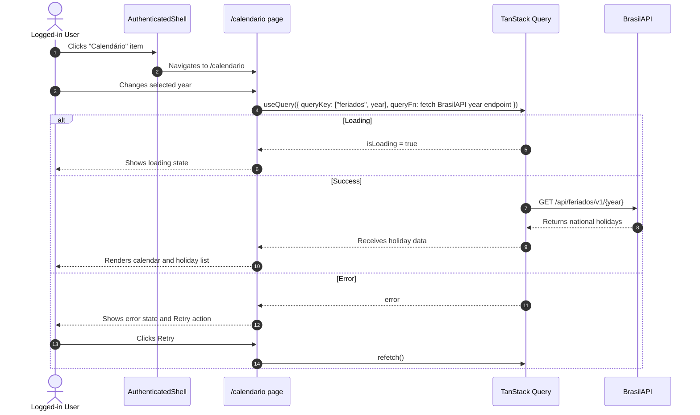

# Design — Calendario de Feriados

## Visao Geral

Adicionar uma rota autenticada `/calendario` acessivel por um novo item **Calendario** no menu principal da area logada. A tela mostra feriados nacionais brasileiros por ano, sem criar backend, endpoint proprio, migracao ou persistencia. O usuario abre a tela pelo `AuthenticatedShell`, visualiza o ano atual por padrao e navega entre anos anteriores/proximos.

## Caracteristicas Arquiteturais

**Priorizadas (top 3):**

| Caracteristica | Por que | Criterio mensuravel |
|---|---|---|
| Usabilidade | A tela e uma consulta visual rapida dentro da area logada | Usuario encontra o item no menu principal e troca de ano em uma acao |
| Disponibilidade percebida | A fonte e uma API publica sem SLA do app | Falha da BrasilAPI mostra erro recuperavel com retry, sem quebrar shell/navegacao |
| Manutenibilidade | A feature nao deve contaminar contratos backend/OpenAPI | Nenhum endpoint proprio, schema backend ou tipo gerado e alterado |

**Consideradas, nao priorizadas:** escalabilidade (consulta anual pequena e cacheada no cliente), compliance (informativo, nao regra regulatoria), internacionalizacao (escopo PT-BR/Brasil).

## Escopo

Inclui: novo item no menu logado, rota `/calendario`, busca por ano na BrasilAPI, estados de loading/erro/retry, visualizacao dos feriados nacionais e testes frontend. Exclui: feriados estaduais/municipais, backend proprio, persistencia local duravel, admin-only behavior, mudancas no login, drawer mobile/off-canvas e qualquer novo contrato OpenAPI.

## Especificacao Visual

**Artefato curado:** `mockups/calendario-feriados-visual.md`.

**Fonte de design original:** nenhuma; layout definido apenas via mockup do companion.

**Decisoes visuais:** o item **Calendario** fica na secao **Principal** do `AuthenticatedShell`; ativo usa o padrao verde da sidebar. A pagina usa `PageHeader`, navegacao de ano no topo, card principal para calendario e painel lateral para proximos feriados/fonte dos dados. Loading e erro ocupam a area de conteudo, mantendo o cabecalho e os controles visiveis.

**Fidelidade:** o mockup e direcional. A fidelidade final deve usar os componentes e tokens reais do frontend.

## Componentes Logicos

| Componente | Responsabilidade | Depende de | Usado por |
|---|---|---|---|
| Navegar para calendario | Expor a entrada autenticada e preservar o comportamento existente da sidebar | `AuthenticatedShell`, `next/navigation` | Usuario logado |
| Consultar feriados nacionais | Buscar e normalizar feriados por ano diretamente da BrasilAPI | `fetch`, TanStack Query | Tela de calendario |
| Apresentar calendario anual | Renderizar ano selecionado, feriados, loading, erro e retry | Hook de consulta, componentes UI | Rota `/calendario` |

Os nomes acima descrevem responsabilidades; a implementacao deve mapear para arquivos existentes do frontend, evitando classes genericas do tipo Manager/Service.

## Fluxo de Dados

O clique em **Calendario** navega para `/calendario`. A pagina calcula o ano inicial pelo calendario local do navegador e chama um hook de consulta com `queryKey` por ano. O hook requisita `https://brasilapi.com.br/api/feriados/v1/{year}`, normaliza a resposta em `date`, `name` e marcador nacional/tipo, e entrega esse modelo para a UI. Ao trocar o ano, a query muda e o cache client-side evita refetch desnecessario para anos ja carregados.

Diagrama fonte: `diagrams/calendario-feriados-design_01_sequence_frontend_brasilapi_f.mmd`.

## Decisoes Arquiteturais

### D1. BrasilAPI consumida direto no frontend

- **Contexto:** o requisito pede feriados nacionais sem backend proprio.
- **Decisao:** usar `https://brasilapi.com.br/api/feriados/v1/{year}` diretamente na camada frontend.
- **Justificativa tecnica:** evita endpoint proprio, migrations e tipos OpenAPI; o payload anual e pequeno e combina com cache por `queryKey`.
- **Justificativa de negocio:** entrega a consulta rapidamente com fonte brasileira conhecida para feriados nacionais.
- **Trade-offs aceitos:** dependencia de terceiro sem SLA, possivel instabilidade/CORS/rate-limit e necessidade de mensagem de erro clara.

### D2. TanStack Query como fronteira de estado remoto

- **Contexto:** a tela precisa cachear por ano, diferenciar loading/success/error e permitir retry.
- **Decisao:** encapsular a chamada em hook de query de feature, com normalizacao local da resposta.
- **Justificativa tecnica:** segue padrao existente do frontend para dados remotos e mantem a UI declarativa.
- **Justificativa de negocio:** melhora responsividade ao alternar anos ja consultados.
- **Trade-offs aceitos:** adiciona um pequeno modulo de feature mesmo sem backend proprio.

### D3. Sem fallback estatico na primeira versao

- **Contexto:** fallback local aumentaria manutencao e escopo.
- **Decisao:** a primeira versao usa BrasilAPI + erro recuperavel/retry, sem dataset local.
- **Justificativa tecnica:** reduz fontes divergentes de verdade e evita calendario desatualizado embutido.
- **Justificativa de negocio:** prioriza velocidade e simplicidade para uma tela informativa.
- **Trade-offs aceitos:** em indisponibilidade da API, a tela informa falha em vez de mostrar dados antigos.

## Riscos

| Risco | Impacto | Probabilidade | Score | Mitigacao |
|---|---:|---:|---:|---|
| BrasilAPI indisponivel, com CORS bloqueado ou limitando requisicoes | 2 | 3 | 6 | Implementar erro claro, retry e teste do estado de falha |
| Formato da resposta mudar | 2 | 2 | 4 | Normalizar em uma fronteira unica e testar contrato esperado |
| Sidebar/regressao de navegacao em modo colapsado | 2 | 2 | 4 | Testar item visivel/ativo e preservar regras desktop-only existentes |

## Testes

Runner: Vitest com Testing Library no frontend.

- Menu autenticado mostra **Calendario** na navegacao principal e aplica estado ativo em `/calendario`.
- Rota `/calendario` inicia no ano atual e permite navegar para ano anterior/proximo.
- Hook de feriados consulta BrasilAPI com o ano selecionado e normaliza os campos usados pela UI.
- Tela renderiza feriados nacionais no calendario/lista quando a consulta tem sucesso.
- Tela exibe loading, erro e retry quando a consulta falha.
- Nenhum teste ou tipo depende de endpoint backend proprio/OpenAPI gerado.
