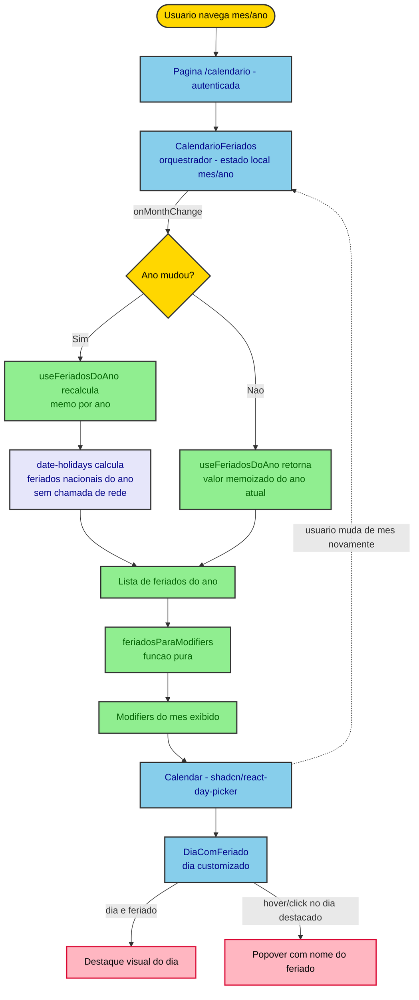

# Calendário de Feriados Nacionais

## Visão Geral

Nova rota autenticada `/calendario` no frontend, mostrando uma grade mensal com os feriados nacionais do Brasil destacados visualmente, navegação entre meses e anos, e um popover com o nome do feriado ao interagir com o dia marcado.

**Fora de escopo:** feriados estaduais/municipais, backend/endpoint próprio, notificações, integração com agenda externa (Google Calendar etc).

## Características Arquiteturais

**Priorizadas (top 3):**

| Característica | Por quê (preocupação de domínio) | Critério mensurável |
|---|---|---|
| Acessibilidade (AA/WCAG) | Regra "sempre" do projeto (conformidade AA/LBI/eMAG); calendário é navegação por teclado e leitor de tela | Grade navegável por teclado, dias com `aria-label` incluindo o nome do feriado quando houver |
| Manutenibilidade | Feature isolada, sem tocar backend; deve ser fácil de estender/revisar | 100% dos arquivos novos dentro de `features/calendario/`, zero acoplamento com outras features |
| Testabilidade | Cálculo de feriados é lógica pura, sem rede — deve ser barato de testar | Cobertura de teste unitário nos componentes de lógica pura (`useFeriadosDoAno`, `feriadosParaModifiers`) |

**Consideradas, não priorizadas:** performance (volume de dados é trivial — feriados de um ano), internacionalização (sem expansão prevista para outros países).

## Arquitetura e Fluxo de Dados

Feature 100% frontend (Next.js), sem novo bounded context de backend nem chamada de rede. Os feriados nacionais são calculados localmente via a biblioteca `date-holidays`.

**Fluxo:**
1. Página `/calendario` (rota autenticada) monta `<CalendarioFeriados />`.
2. `CalendarioFeriados` guarda o mês/ano exibido em estado local (`useState`, inicializado no mês/ano atual).
3. `useFeriadosDoAno(ano)` calcula (síncrono, via `date-holidays`, memoizado por ano com `useMemo`) a lista de feriados nacionais do ano exibido.
4. `feriadosParaModifiers` converte essa lista em `modifiers` do `react-day-picker` para o mês exibido.
5. Ao navegar de mês (`onMonthChange` do `Calendar`), o estado `{mes, ano}` é atualizado; se a navegação cruzar virada de ano (dez → jan), `useFeriadosDoAno` recalcula automaticamente porque a chave do memo (o ano) muda.
6. Dias marcados como feriado usam o componente customizado `DiaComFeriado` (via prop `components.Day` do `react-day-picker`), que exibe um popover/tooltip com o nome do feriado ao hover/click.



Diagrama fonte: `specs/diagrams/calendario-feriados-design_01_flowchart_fluxo_de_dados_do_ca.mmd`

## Estrutura de Componentes

Derivados por fluxo de trabalho (navegar mês → destacar feriados → ver nome do feriado). Cada um passa no teste de responsabilidade única e não usa sufixo genérico (Manager/Handler/Service).

| Componente | Responsabilidade | Depende de | Usado por |
|---|---|---|---|
| **ObterFeriadosDoAno** (hook `useFeriadosDoAno(ano)`) | Dado um ano, retorna a lista de feriados nacionais calculados via `date-holidays`, memoizada por ano | biblioteca `date-holidays` | CalendarioFeriados |
| **DestacarFeriadosNaGrade** (função pura `feriadosParaModifiers`) | Converte a lista de feriados em `modifiers`/`modifiersClassNames` do `react-day-picker` para marcar visualmente os dias | ObterFeriadosDoAno | CalendarioFeriados |
| **ExibirPopoverDeFeriado** (componente `DiaComFeriado`) | Renderiza o popover/tooltip com o nome do feriado ao interagir com um dia marcado | shadcn `Popover`/`Tooltip` | CalendarioFeriados |
| **CalendarioFeriados** (componente de orquestração) | Monta o `Calendar` do shadcn, controla o mês/ano exibido (estado local), aplica os modifiers e injeta o componente de dia customizado | DestacarFeriadosNaGrade, ExibirPopoverDeFeriado, shadcn `Calendar` | página `/calendario` |

**Estrutura de arquivos** (convenção feature-based do frontend; `hooks/`+`lib/` no lugar de `api/` porque não há chamada de rede):

```
apps/frontend/src/
  components/ui/calendar.tsx          # adicionado via shadcn CLI
  features/calendario/
    hooks/use-feriados-do-ano.ts
    lib/feriados-para-modifiers.ts
    components/calendario-feriados.tsx
    components/dia-com-feriado.tsx
    schemas/feriado.schema.ts         # tipo/shape do feriado (Zod)
  app/(authenticated)/calendario/page.tsx
```

## Decisões Arquiteturais

### D1. Feriados calculados no frontend via `date-holidays`, sem backend

- **Contexto:** os feriados nacionais podem vir de uma API pública (ex.: BrasilAPI) via um endpoint próprio no backend, ou ser calculados localmente no frontend sem chamada de rede.
- **Decisão:** biblioteca `date-holidays` (npm), instanciada com país `BR`, sem estado — calcula feriados nacionais localmente, sem rede e sem novo bounded context de backend.
- **Justificativa técnica:** elimina dependência de disponibilidade de rede/API externa; nenhuma mudança no backend (sem endpoint, sem migração).
- **Justificativa de negócio:** decisão explícita do usuário — menor custo de implementação, sem tocar o backend.
- **Trade-offs aceitos:** um feriado extraordinário decretado por lei avulsa (ponto facultativo pontual) não é coberto pela biblioteca até uma atualização manual de versão/código (ver Riscos).

### D2. Grade do calendário via shadcn `Calendar` (react-day-picker), não grade própria

- **Contexto:** construir a grade mensal do zero com `date-fns`, ou reaproveitar o componente `Calendar` do shadcn/ui (que embrulha `react-day-picker`).
- **Decisão:** shadcn `Calendar`, customizando `modifiers` para os feriados e o componente de dia (`components.Day`) para o popover.
- **Justificativa técnica:** navegação de mês/ano, foco por teclado e semântica ARIA de grid já resolvidos pela biblioteca; segue a convenção do projeto de UI baseada em shadcn/ui.
- **Justificativa de negócio:** menor risco de não atingir a conformidade AA/WCAG exigida pelo projeto; menos código para manter.
- **Trade-offs aceitos:** introduz `react-day-picker` como dependência direta (hoje só transitiva via Prisma Studio); customizar o dia exige aprender a API de `components` da biblioteca.

## Riscos

| Risco | Impacto (1-3) | Probabilidade (1-3) | Score | Mitigação |
|---|---|---|---|---|
| Feriado extraordinário decretado por lei avulsa não é coberto por `date-holidays` | 1 | 2 | 2 🟢 | Aceito como limitação conhecida (fora do escopo de "feriados nacionais oficiais recorrentes"); documentado nesta spec |
| Comparação de datas sujeita a deslocamento por fuso horário (±1 dia) | 2 | 2 | 4 🟡 | Normalizar toda comparação de data para ano-mês-dia puro, sem componente de hora |
| Versão de `react-day-picker` incompatível com a versão de React do frontend | 2 | 1 | 2 🟢 | Verificar peer deps antes de instalar (regra do projeto: "sempre verifique APIs dos pacotes dependentes") |

## Testes

Runner: Vitest + Testing Library + MSW (conforme `apps/frontend/AGENTS.md`); descrições em PT-BR usando `test` (nunca `it`).

- **`useFeriadosDoAno`**: unitário — para um ano dado, retorna os feriados nacionais esperados (datas fixas e móveis, ex.: Tiradentes, Carnaval/Páscoa daquele ano); memoização não recalcula para o mesmo ano.
- **`feriadosParaModifiers`**: unitário puro — dado um conjunto de feriados e um mês, retorna os modifiers corretos; casos de borda: mês sem feriado, feriado no primeiro/último dia do mês, virada de ano.
- **`CalendarioFeriados`** (component test): renderiza o mês atual com os feriados destacados; navegar para o mês seguinte/anterior atualiza a grade; navegar através da virada de ano recalcula os feriados do novo ano.
- **`DiaComFeriado`**: interação (hover/click) em um dia de feriado exibe o popover com o nome correto; dia sem feriado não exibe popover.
- Sem testes de backend/integração (não há bounded context novo) nem `test:business-flow`.
