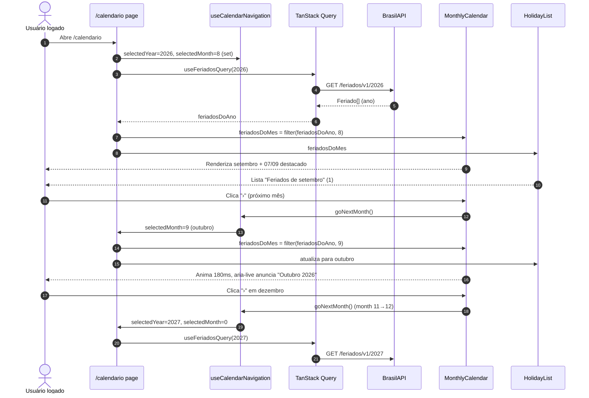

# Design — Calendário Layout Mês Único

## Visão Geral

Evoluir a rota autenticada `/calendario` (feature `calendario-feriados`) de um grid anual com 12 calendários lado a lado para **mês único com navegação por setas**. A disposição atual aperta datas e prejudica leitura; o novo layout exibe o mês atual por padrão, com setas para trocar de mês e controle híbrido de ano, mantendo integração direta com BrasilAPI e `TanStack Query` intactas. A mudança é frontend-only, sem backend, migration ou contrato OpenAPI.

## Características Arquiteturais

**Priorizadas (top 3):**

| Característica | Por quê (preocupação de domínio) | Critério mensurável |
|---|---|---|
| Usabilidade | Consulta visual rápida; grid 12 meses aperta datas e exige scroll | Trocar de mês em 1 clique/seta/swipe, sem recarregar ano; mês atual visível por padrão |
| Manutenibilidade | Não contaminar contratos backend; reuso futuro do calendário | `page.tsx` delega para `MonthlyCalendar` reutilizável em `features/calendario-feriados/ui/`; zero nova dependência |
| Acessibilidade | Setas e troca de mês precisam ser percebidas por leitor de tela e teclado | `aria-label` com mês/ano alvo, `aria-live="polite"` no título, foco permanece na seta, `prefers-reduced-motion` respeitado |

**Consideradas, não priorizadas:** escalabilidade (payload anual ~9 feriados, filtrado em memória), disponibilidade percebida (herdada: erro BrasilAPI com retry), internacionalização (PT-BR fixo).

## Escopo

Inclui: estado `selectedMonth` (0-11) + `selectedYear`, hook `useCalendarNavigation` com virada de ano automática (dez→jan, jan→dez), componente `MonthlyCalendar` (header com setas + grid 7cols + destaque feriado), `HolidayList` filtrada por mês, animação `180ms slide+fade` com fallback `prefers-reduced-motion`, swipe horizontal em `<768px`, atualização de `page.test.tsx` para novo layout. Exclui: alteração em `useFeriadosQuery`/`feriadosQueryKey`/BrasilAPI, feriados estaduais/municipais, persistência, backend/proxy, mudanças em `AuthenticatedShell`.

## Especificação Visual

**Artefato curado:** `mockups/calendario-layout-mes-unico-visual.md` (prosa + core HTML, relativo a este spec)

**Fonte de design original:** nenhuma; layout definido apenas via mockup do companion.

**Decisões visuais (norte, não pixel-final):**
- Layout: `PageContainer as="section" width="wide"` → `PageHeader` (título `Calendário` + `pill` ano com `ChevronLeft/Right`) → `grid gap-6 xl:grid-cols-[minmax(0,1fr)_320px]` com calendário mês único + sidebar; em `<768px` 1 coluna com swipe.
- Hierarquia: título do mês (`strong 15px`, `aria-live="polite"`) entre setas `32px` circulares no `CardHeader`; `Card rounded-[22px]`; `weekdays` 11px uppercase; `days grid-cols-7 gap-1` com `day min-h-10` e feriado `bg-[#ecfdf5] border-[#39e58c]` + `data-name` 7px.
- Spacing/escala: `gap-6` grid principal, `gap-1` dias, `p-3` `FeriadoItem`; `radius 22px` Card, `14px` item.
- Tokens: `--volt-green #39e58c`, `--muted #f4f4f5`, `--border #e4e4e7`; tipografia sans + mono para data/ano.
- Interação: `aria-label="Mês anterior, agosto 2026"` nas setas, foco mantido via `ref`, `role="grid"` nos dias, animação `180ms` desabilitada com `prefers-reduced-motion`.

**Fidelidade:** o mockup é direcional. Fidelidade final construída na implementação com `Card`, `Button`, `Skeleton`, `PageContainer`, `PageHeader` reais.

## Componentes Lógicos

| Componente | Responsabilidade | Depende de | Usado por |
|---|---|---|---|
| Navegar entre meses e anos | Controlar `selectedMonth/Year`, virada de ano, manter foco, expor `goPrev/goNext/goToday` | `useState`, `Date` local | `MonthlyCalendar`, `page.tsx` |
| Apresentar mês único | Renderizar header com setas + weekdays + grid de dias + destaque de feriado | navegação, `Feriado[]` filtrado | rota `/calendario` |
| Listar feriados do mês | Filtrar `feriadosDoAno` por `selectedMonth` e exibir lista vazia quando ausente | `Feriado[]`, `selectedMonth` | sidebar |

Os nomes descrevem responsabilidades; a implementação mapeia para `features/calendario-feriados/ui/MonthlyCalendar.tsx`, `useCalendarNavigation.ts` e `HolidayList.tsx`, evitando sufixos genéricos Manager/Service.

## Fluxo de Dados

`page.tsx` inicializa `selectedYear` (ano atual via `new Date().getFullYear()`) e `selectedMonth` (mês atual `0-11`). `useFeriadosQuery(year)` busca `https://brasilapi.com.br/api/feriados/v1/{year}` com `queryKey ["feriados", year]` e cache client-side. `feriadosDoAno` é filtrado em memória por `getFeriadosDoMes(feriadosDoAno, selectedMonth)` para `MonthlyCalendar` e `HolidayList`. Clique em seta de mês chama `goNextMonth`/`goPrevMonth`: se `month` sai de `0-11`, ajusta `selectedYear` e corrige `month` (ex.: `11 → 0` incrementa ano). Título do mês atualiza e `aria-live="polite"` anuncia. Swipe e `ArrowLeft/Right` também disparam navegação. `prefers-reduced-motion` desabilita transição.

Diagrama fonte: `specs/diagrams/calendario-layout-mes-unico-design_01_sequence_mo.mmd`

## Decisões Arquiteturais

### D1. Extrair `MonthlyCalendar` reutilizável (B) em vez de refactor inline

- **Contexto:** Grid 12 meses em `page.tsx` (411 linhas) aperta datas; precisa virar mês único com navegação híbrida. Alternativas: A) refactor inline (menor diff), B) extrair componente reutilizável, C) biblioteca externa.
- **Decisão:** B — criar `features/calendario-feriados/ui/MonthlyCalendar.tsx` + `useCalendarNavigation` hook + `HolidayList.tsx`.
- **Justificativa técnica:** Isola navegação e grid 7cols, facilita testes unitários (aserta 1 card + navegação) e reuso em dashboard/admin; hook mantém foco via `ref`.
- **Justificativa de negócio:** Custo de +2 arquivos é baixo para `Medium` e evita `page.tsx` crescer além de 500 linhas; reuso futuro compensa abstração prematura.
- **Trade-offs aceitos:** Mais arquivos para feature Small/Medium; `page.tsx` continua orquestrador mas delega — sem overhead de lib externa.

### D2. Manter cache anual `["feriados", year]` e filtrar por mês em memória

- **Contexto:** `useFeriadosQuery` hoje cacheia por ano; trocar para `["feriados", year, month]` granularizaria.
- **Decisão:** Manter chave anual, filtrar `feriadosDoMes` em memória.
- **Justificativa técnica:** Payload anual pequeno (~9 itens), filtro O(n) trivial; evita 12 queries e mantém decisão fechada D2 de `calendario-feriados`.
- **Justificativa de negócio:** Zero mudança em contrato/cache; menor risco regressivo.
- **Trade-offs aceitos:** Sidebar não pode mostrar feriados de ano diferente sem trocar `selectedYear`; mitigado por navegação rápida.

### D3. Animação CSS `180ms slide+fade` com `prefers-reduced-motion`

- **Contexto:** Resposta 3C pede animação suave ao trocar mês.
- **Decisão:** CSS `transform+opacity 180ms ease` + swipe `touch`; desabilitar via `@media (prefers-reduced-motion: reduce)`.
- **Justificativa técnica:** Sem dependência (`framer-motion` desnecessário), custo bundle zero; respeita `acessibilidade-frontend` D2 (anel de foco não conflita).
- **Justificativa de negócio:** Melhora percepção de navegação sem custo operacional.
- **Trade-offs aceitos:** Gerenciar `transitionend` e foco manualmente; sem física avançada — aceitável para slide simples.

### D4. Sidebar filtrada por mês (resposta 2A)

- **Contexto:** Lista lateral hoje mostra todos feriados do ano; com mês único, manter ou filtrar?
- **Decisão:** Filtrar por `selectedMonth`; título `Feriados de {mês}` + `1 de 9 em 2026`.
- **Justificativa técnica:** Reduz ruído, alinha lista ao calendário visível; `HolidayList` recebe `feriadosDoMes` já filtrado.
- **Justificativa de negócio:** Usuário vê só o relevante; visão anual perdida é compensada por navegação rápida mês a mês.
- **Trade-offs aceitos:** Perde visão anual completa; mitigado por manter `pill` de ano e navegação híbrida (1C).

## Riscos

| Risco | Impacto (1-3) | Probabilidade (1-3) | Score | Mitigação |
|---|---|---|---|---|
| `page.test.tsx` quebra — esperava 12 cards, agora 1 | 2 | 3 | 6 🟡 | Atualizar testes para asserir 1 `Card` + navegação mês/ano e filtro por mês |
| `prefers-reduced-motion` ignorado → animação causa desconforto | 2 | 2 | 4 🟡 | `@media (prefers-reduced-motion: reduce) { transition: none }` e teste com `matchMedia` |
| Foco perdido ao trocar mês/ano (seta perde `focus`) | 2 | 2 | 4 🟡 | Guardar `ref` nas setas, `focus()` após `setState`, teste `aria-label` dinâmico |
| Virada de ano não dispara `useFeriadosQuery` novo → lista vazia | 3 | 1 | 3 🟡 | `goNextMonth`/`goPrevMonth` atualizam `selectedYear` e `queryKey` reage; teste dez→jan e jan→dez |
| Extração prematura sem reuso futuro | 1 | 2 | 2 🟢 | Manter `MonthlyCalendar` com props mínimas (`feriados`, `month`, `year`, `onNavigate`); YAGNI — não generalizar além de feriados |

## Testes

Runner: `vitest` (frontend, `apps/frontend` `package.json` → `pnpm --filter frontend test -- --run`). Cobrir: render mês atual por padrão; setas mês incrementam/decrementam `selectedMonth` com virada de ano; `pill` ano ainda funciona híbrido; filtro `feriadosDoMes` exibe só do mês e mensagem vazia; `aria-live` e `aria-label` dinâmicos; `prefers-reduced-motion` desabilita transição; `Skeleton`/`Alert` mantêm `role="status"`/`role="alert"` em loading/erro. `page.test.tsx` e novos `MonthlyCalendar.test.tsx`/`useCalendarNavigation.test.tsx`.
