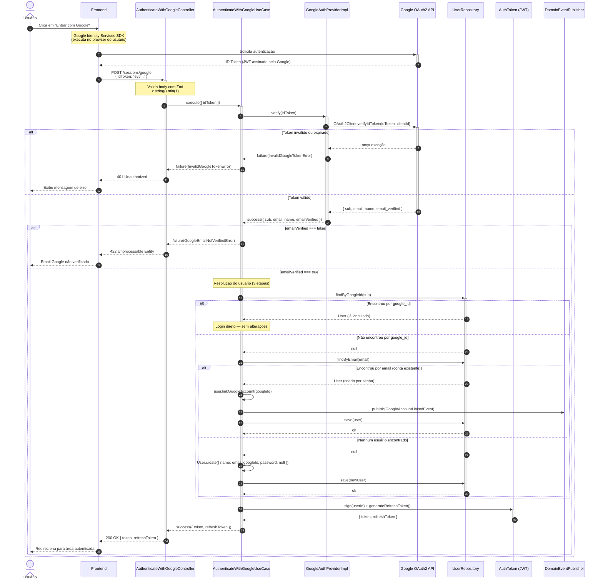

# Google OAuth — Diagrama de Sequência

Diagrama de sequência do fluxo de autenticação via Google OAuth implementado no backend.

O arquivo `.mmd` pode ser renderizado via [Mermaid Live Editor](https://mermaid.live) ou qualquer editor com suporte a Mermaid (VS Code, GitHub, Obsidian, etc).

---

## Etapas explicadas

### Fase 1 — Obtenção do ID Token (Frontend ↔ Google)

> Etapas 1–3

O usuário clica no botão. O **Google Identity Services SDK** (rodando no browser) abre o fluxo de seleção de conta Google. O Google valida as credenciais e devolve um **ID Token** — um JWT assinado com as chaves privadas do Google contendo `sub`, `email`, `name` e `email_verified`.

---

### Fase 2 — Validação do Token (Backend ↔ Google)

> Etapas 4–9

O frontend envia `POST /sessions/google` com o ID Token. O **Controller** valida o body com Zod e chama o **UseCase**. O **GoogleAuthProviderImpl** usa a biblioteca `google-auth-library` (`OAuth2Client.verifyIdToken`) para confirmar a assinatura criptográfica do token diretamente com os servidores do Google.

| Situação | Resposta |
|----------|----------|
| Token inválido ou expirado | `401 Unauthorized` |
| Email não verificado no Google | `422 Unprocessable Entity` |

---

### Fase 3 — Resolução do Usuário (3 caminhos)

> Etapas 10–17

O UseCase tenta resolver o usuário em sequência, garantindo **zero contas duplicadas** para o mesmo email:

| Ordem | Busca | Ação |
|-------|-------|------|
| 1º | `findByGoogleId(sub)` | Login direto, sem alterações |
| 2º | `findByEmail(email)` | Vincula `google_id` + publica `GoogleAccountLinkedEvent` |
| 3º | Nenhum | Cria novo `User` com `password_hash: null` |

**Regra de integridade:** todo usuário tem ao menos um método de autenticação — `password_hash` não-nulo **ou** `google_id` não-nulo.

---

### Fase 4 — Emissão dos JWTs e Resposta

> Etapas 18–21

Independente do caminho de resolução, o **AuthToken** gera o `token` (JWT de acesso) e o `refreshToken` — **idênticos ao login tradicional por email/senha**. O frontend armazena os tokens e redireciona o usuário para a área autenticada.

---

## Arquivos relacionados

| Arquivo | Descrição |
|---------|-----------|
| [`../specs/google-social-login-design.md`](../specs/google-social-login-design.md) | Design spec completo |
| [`../prd/prd-google-social-login.md`](../prd/prd-google-social-login.md) | PRD com histórias de usuário |
| [`google-oauth-sequence.mmd`](./google-oauth-sequence.mmd) | Diagrama Mermaid (fonte) |
