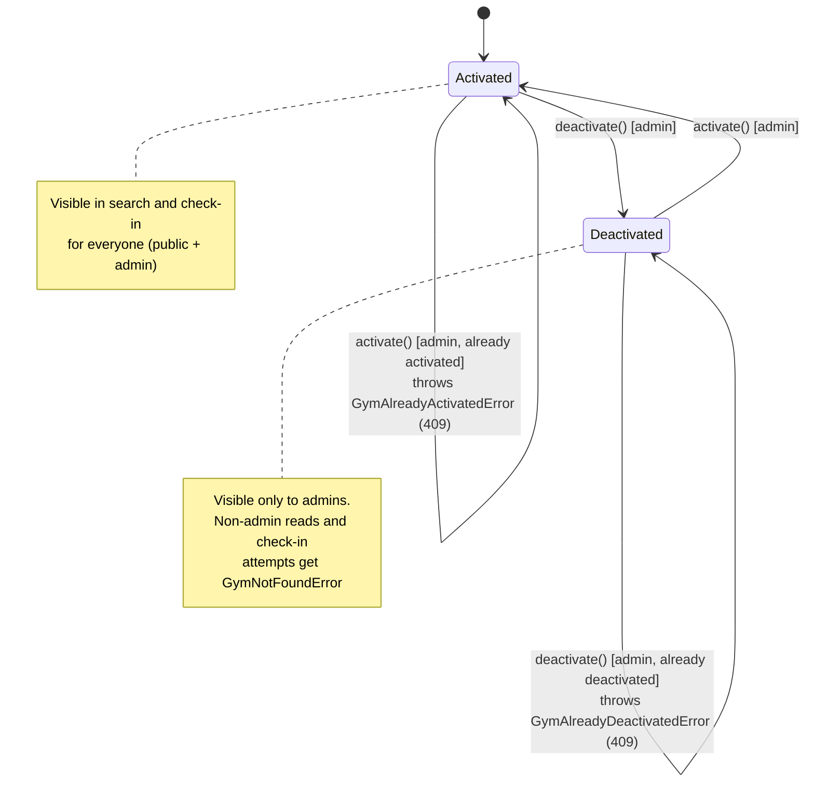

# Desativação/Reativação de Academia

## Visão Geral

Administradores passam a poder desativar uma academia (soft-state, nunca hard delete) diretamente pela tela de detalhe (`/academias/[id]`). Uma academia desativada deixa de aparecer nas buscas e não permite mais check-ins, mas todo o histórico (check-ins, dados cadastrais) é preservado. A mesma ação é reversível: o admin pode reativar a academia a qualquer momento, pelo mesmo botão (ícone e cor mudam conforme o estado atual), com um modal de confirmação em ambos os sentidos.

## Características Arquiteturais

**Priorizadas (top 3):**

| Característica | Por quê (preocupação de domínio) | Critério mensurável |
|---|---|---|
| Segurança/Autorização | Só administradores podem desativar/reativar uma academia | `PATCH /gyms/:id/deactivate` e `/activate` retornam 403 para qualquer requisição sem role `ADMIN` |
| Integridade dos dados | Não pode haver exclusão física — check-ins e dados cadastrais são registros históricos/auditoria | Nenhum endpoint ou migração remove linhas da tabela `Gym`; toda mudança de estado é uma atualização de campo |
| Confiabilidade | A regra "sem check-in em academia desativada" precisa valer em 100% dos caminhos de leitura (busca, geolocalização, link direto), sem brechas de paginação | Testes de integração cobrindo `fetchAll`, `search`, `fetchNearby`, `findById` e `check-in.usecase` confirmam que nenhum deles retorna/aceita uma academia desativada para um requester não-admin |

**Consideradas, não priorizadas:** auditabilidade (rastrear quem/quando desativou — fora de escopo nesta versão), manutenibilidade (obtida "de graça" ao espelhar o padrão já validado de `User`).

## Especificação Visual

**Artefato curado:** [`mockups/gym-deactivation-visual.md`](./mockups/gym-deactivation-visual.md)

**Fonte de design original:** nenhuma; layout definido apenas via mockup do companion visual, aprovado pelo usuário sem alterações.

**Decisões visuais (norte, não pixel-final):**
- Botão de status flutuante ao lado do "Editar" existente, mesmo tamanho (36×36), `gap: 8px`, sobre a imagem de capa.
- Ícone e cor mudam conforme `gym.status`: vermelho (`--color-destructive`) com ícone de "desligar" quando ativa; verde (`--color-primary`) com ícone de "religar" quando desativada.
- Modal de confirmação reaproveita o padrão visual do `AlertDialog`/`SuspendConfirmationDialog` já existente (título `font-display`, descrição cinza, footer Cancelar + ação).

**Fidelidade:** o mockup é um *norte* de layout e interação; a fidelidade final é construída na implementação, reaproveitando os componentes reais (`Button`, `AlertDialog`) do design system do projeto.

## Estrutura de Componentes

### Backend (bounded context `gym` existente + 1 ponto de extensão em `check-in`)

| Componente | Responsabilidade | Depende de |
|---|---|---|
| `GymStatus` (VOs `ActivatedStatus`/`DeactivatedStatus`) | Encapsula as transições válidas (`activate()`/`deactivate()`) e seus guard clauses, espelhando `apps/backend/src/user/domain/value-object/status.ts` | — |
| `DeactivateGymUseCase` | Carrega a `Gym`, chama `gym.deactivate()`, persiste | `GymRepository` |
| `ActivateGymUseCase` | Simétrico a `DeactivateGymUseCase`, chama `gym.activate()` | `GymRepository` |
| `DeactivateGymController` / `ActivateGymController` | Expõem `PATCH /gyms/:gymId/deactivate` e `PATCH /gyms/:gymId/activate`, `isProtected: true, onlyAdmin: true` (mesmo padrão de `update-gym.controller.ts`) | use-cases acima |
| `GymRepository` (interface existente, estendida) | `fetchAll`, `search`, `fetchNearby`, `findById` ganham o parâmetro `includeInactive: boolean` (default `false`) | Prisma |

**Check-in (extensão pontual em `apps/backend/src/check-in/`, não um componente novo):** `check-in.usecase.ts` passa a buscar a academia com `includeInactive: false` (perspectiva de membro comum). Se a academia estiver desativada, o repositório não a retorna, e o use-case lança o `GymNotFoundError` já existente — nenhum guard novo é necessário no fluxo de check-in.

### Frontend

| Componente | Responsabilidade |
|---|---|
| `GymStatusToggleButton` | Botão flutuante icon-only ao lado do "Editar"; ícone e cor derivam de `gym.status` |
| `GymStatusConfirmationDialog` | Componente único, parametrizado por ação (título/descrição/label conforme desativar ou reativar), construído sobre `AlertDialog` — mesmo padrão de `SuspendConfirmationDialog` |
| `useDeactivateGym` / `useActivateGym` | Hooks de mutation (espelham `use-suspend-user.ts`); invalidam a query da tela de detalhe **e** da busca `/academias` |
| Badge "Desativada" na lista `/academias` | Renderizado somente quando `user.role === "ADMIN"` e `gym.status === "deactivated"` |

Como é uma extensão de um fluxo CRUD já estabelecido no projeto, a forma correta é reaproveitar o padrão existente (1 use-case por ação, 1 controller por rota) em vez de introduzir uma abstração nova.

## Fluxo de Dados

**Desativar/Reativar** (mesmo fluxo nos dois sentidos, texto do modal e cor do botão variam conforme a direção):

```
Admin clica no botão flutuante (ícone conforme status atual)
  → Modal de confirmação abre (título/texto conforme a ação)
  → Admin confirma
  → PATCH /gyms/:gymId/deactivate (ou /activate)
  → RouteGuard valida onlyAdmin (403 se não-admin)
  → Use-case carrega a Gym via repositório
  → gym.deactivate() / gym.activate() — o VO valida a transição
       - se já estiver no estado alvo → GymAlreadyDeactivatedError / GymAlreadyActivatedError (409)
  → Repositório persiste o novo status
  → Frontend invalida a query da tela de detalhe + da busca `/academias`
  → Ícone do botão e badge são atualizados
```

**Check-in numa academia desativada:**

```
Membro tenta check-in
  → check-in.usecase busca a Gym com includeInactive: false
  → Gym desativada → repositório retorna null
  → GymNotFoundError (mesmo erro já usado hoje para "academia não existe")
```

**Acesso direto a `/academias/:id` desativada:**

```
GET /gyms/:gymId
  → includeInactive = (requester.role === ADMIN)
  → não-admin + desativada → repositório retorna null → GymNotFoundError (404)
  → admin → repositório retorna a academia normalmente (pode visualizar e reativar)
```

O diagrama abaixo resume os estados e as transições guardadas pelo domínio:



Diagrama fonte: `specs/diagrams/gym-deactivation-design_01_state_gym_status_state_mac.mmd`

## Decisões Arquiteturais

### D1. Filtro de visibilidade no repositório via um parâmetro booleano (`includeInactive`), decidido por quem chama

- **Contexto:** a regra "academia desativada não aparece para não-admin" atravessa 4 pontos de leitura (`fetchAll`, `search`, `fetchNearby`, `findById`) e o check-in. Alternativas consideradas: (A) repositório decide sozinho a partir da role do requester; (B) buscar tudo no repositório e filtrar depois na camada de aplicação; (C) repositório recebe só um booleano simples, decidido pelo use-case/controller chamador.
- **Decisão:** opção C — `includeInactive: boolean` na assinatura dos 4 métodos de leitura do `GymRepository`, com o filtro (`WHERE status = 'active'` quando `false`) aplicado no banco.
- **Justificativa técnica:** a opção B quebra em `search`/`fetchNearby`, que já usam `LIMIT`/paginação geoespacial no banco — filtrar depois de buscar pode devolver menos resultados que o esperado. A opção A acopla autorização dentro do repositório. A opção C resolve os dois problemas: filtro correto no banco (paginação/geolocalização continuam certas) e repositório permanece sem conhecimento de "por que", só recebe um booleano.
- **Justificativa de negócio:** evita bugs de listagem incompleta para o usuário final (Confiabilidade, um dos 3 critérios priorizados) sem aumentar a superfície de autorização espalhada pelo código.
- **Trade-offs aceitos:** toca a assinatura de 4 métodos existentes do repositório (interface, implementação Prisma, repositório in-memory de teste, call-sites atuais) — mitigado com um default `includeInactive = false`.

### D2. Reaproveitar `GymNotFoundError` em vez de criar um erro novo para acesso bloqueado

- **Contexto:** tanto o check-in quanto o `GET /gyms/:gymId` para não-admin precisam se comportar de forma consistente quando a academia está desativada.
- **Decisão:** tratar "desativada" exatamente como "não existe" para requesters não-admin, reaproveitando o `GymNotFoundError` (`kind: "not-found"`) já existente em `apps/backend/src/gym/application/error/gym-not-found-error.ts`.
- **Justificativa técnica:** menos um tipo de erro para manter; o `DomainError` já expõe um campo `kind`, então o mapeamento HTTP (404) já está resolvido pela infraestrutura existente.
- **Justificativa de negócio:** reflete a decisão explícita do usuário (opção "bloqueio total exceto admin") de esconder de fato a academia desativada, não apenas sinalizá-la como bloqueada.
- **Trade-offs aceitos:** um usuário comum não recebe uma mensagem diferenciada tipo "essa academia foi desativada" — ele só vê "não encontrada". Se um dia for necessário diferenciar essas mensagens, isso vaza a existência da academia; decisão consciente, priorizando esconder de verdade sobre uma UX mais informativa.

### D3. Transições inválidas lançam erro de conflito, não são idempotentes silenciosamente

- **Contexto:** o que acontece se um admin desativar uma academia já desativada (ex.: duplo clique, requisição concorrente)?
- **Decisão:** `gym.deactivate()`/`gym.activate()` validam o estado atual antes de transicionar e lançam `GymAlreadyDeactivatedError`/`GymAlreadyActivatedError` (`kind: "conflict"`, HTTP 409) quando a transição não é válida.
- **Justificativa técnica:** segue o padrão de guard clauses já usado no precedente `user-soft-delete` (ordem de validação importa).
- **Justificativa de negócio:** dá um retorno explícito ao admin em vez de mascarar uma ação que não teve efeito, reduzindo confusão em caso de clique duplo ou concorrência entre admins.
- **Trade-offs aceitos:** o frontend precisa tratar esse 409 (idealmente re-sincronizando o estado exibido via um refetch), em vez de simplesmente ignorar a resposta.

### D4. Migração adiciona `status` (enum, default `"active"`) à tabela `Gym`; sem `deleted_at`

- **Contexto:** como modelar a persistência do estado, dado que a exclusão nunca é física.
- **Decisão:** novo campo `status GymStatus @default(activated)` no Prisma schema (`apps/backend/prisma/schema.prisma`), sem campo `deleted_at`.
- **Justificativa técnica:** o padrão `deleted_at` (usado em `User`) marca *quando* algo foi removido; aqui a transição é sempre reversível, então um enum de status simples já expressa o estado corretamente, sem a semântica extra de "quando foi apagado".
- **Justificativa de negócio:** menos um campo para o time entender/manter; a migração com `DEFAULT 'activated'` garante que academias existentes continuem visíveis sem exigir backfill manual.
- **Trade-offs aceitos:** nenhum histórico de "quando foi desativada pela última vez" é mantido — se isso vier a ser necessário (ex.: para auditoria, item hoje "considerado, não priorizado"), será uma migração futura adicionando campos como `deactivated_at`/`deactivated_by`.

## Riscos

| Risco | Impacto (1-3) | Probabilidade (1-3) | Score | Mitigação |
|---|---|---|---|---|
| `fetch-by-id` virar admin-only geral por engano, quebrando o acesso normal de usuários comuns a academias ativas | 3 | 2 | 6 🔴 | A checagem de `includeInactive`/role deve ficar dentro do use-case, condicionada ao status da academia — nunca como `onlyAdmin` genérico no controller; task dedicada no plano para deixar isso explícito, com teste cobrindo "usuário comum acessa academia ativa normalmente" |
| Mudança de assinatura no `GymRepository` (4 métodos) quebra call-sites/testes existentes | 2 | 3 | 6 🔴 | Default `includeInactive = false` no parâmetro; rodar a suíte completa de testes do módulo `gym` após a mudança de assinatura |
| Esquecer de invalidar uma das duas queries (detalhe / busca) no frontend após o toggle | 2 | 2 | 4 🟡 | Hooks de mutation invalidam explicitamente as duas query keys; teste de componente cobrindo a atualização do badge após a ação |
| Nome de rota (`/deactivate`, `/activate`) inconsistente com alguma convenção já usada em `suspend-user` | 1 | 2 | 2 🟢 | Confirmar a convenção de rota do `suspend-user` durante o planejamento antes de nomear as novas rotas |
| Seed do banco gerar dado inválido após a migração | 1 | 1 | 1 🟢 | Campo `status` tem `DEFAULT 'activated'`, então seeds existentes continuam válidos sem alteração; conferir seed script após a migração |

## Testes

- **Domínio**: `GymStatus` VOs — transições válidas e guard clauses de transição inválida.
- **Use-case**: `DeactivateGymUseCase`/`ActivateGymUseCase` com `InMemoryGymRepository` (convenção já usada no módulo `gym`).
- **Repositório**: filtro `includeInactive` cobrindo os 4 métodos de leitura (`fetchAll`, `search`, `fetchNearby`, `findById`), incluindo o caso de paginação/geolocalização com resultados mistos ativos/inativos.
- **Check-in**: tentativa de check-in numa academia desativada lança `GymNotFoundError`.
- **Controller/fluxo**: 403 para não-admin nas rotas de desativar/reativar; 409 para transição inválida; 404 para não-admin acessando uma academia desativada por link direto; 200 para admin acessando a mesma academia.
- **Frontend**: `GymStatusToggleButton` (ícone/cor por status), `GymStatusConfirmationDialog` (confirmar/cancelar/estado pending), badge "Desativada" (visível somente para admin + academia desativada) — descrições em PT-BR, `test()` (não `it()`), conforme `AGENTS.md` do frontend.
- **Fluxo completo**: desativar → check-in bloqueado → reativar → check-in funciona de novo, espelhando os `business-flow-test.ts` já existentes no módulo `gym`.
