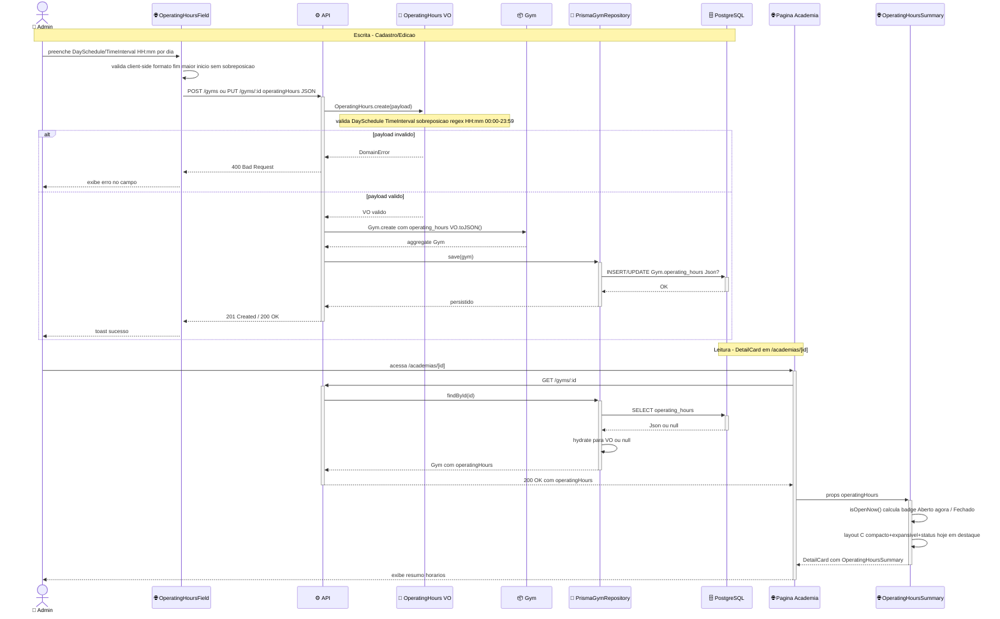

# Design — Horário de Funcionamento da Academia

## Visão Geral

Permitir informar dias e horários de funcionamento da academia no cadastro (opcional) e na edição posterior, e exibir resumo na tela de detalhe `/academias/[id]` no layout C (resumo compacto + badge “Aberto agora / Fecha às HH:mm” + tabela semanal expansível). Suporta múltiplos intervalos por dia (ex: 08:00–12:00 e 14:00–18:00) e dias fechados. Não há filtro por horário nesta entrega — apenas display e edição.

## Características Arquiteturais

**Priorizadas (top 3):**

| Característica | Por quê (preocupação de domínio) | Critério mensurável |
|---|---|---|
| Corretude de validação | intervalo inválido quebra cálculo “Aberto agora” e resumo | 100% dos casos `open>=close`, `HH:mm` inválido, sobreposição intra-dia rejeitados com `InvalidOperatingHoursError`; suíte unitária cobre cada invariante |
| Manutenibilidade DDD | novo conceito deve seguir pattern `Name/CNPJ/Phone/Coordinate` | VO com `create/restore/equals/toJSON/isOpenAt`, sem throw, retorno `Either`, reutilizado em create e update |
| Clareza de UX | resumo não pode poluir `DetailCard` existente | bloco colapsado ≤ 80px, expande sob demanda; exibe estado vazio “Horário não informado” quando `null` |

**Consideradas, não priorizadas:** performance (leitura é `SELECT` único com Json, sem join), escalabilidade (volume de academias não justifica tabela normalizada agora), i18n (labels fixas `Seg–Dom` pt-BR).

## Especificação Visual

**Artefato curado:** `mockups/gym-operating-hours-visual.md` (prosa + core JSX, relativo a este spec)

**Fonte de design original:** Nenhuma; layout definido apenas via mockup do companion `operating-hours-v1.html`.

**Decisões visuais (norte, não pixel-final):**
- Bloco dentro do `DetailCard` após `<dl>` de phone/address, `rounded-[10px] border-border bg-[#fcfcf9]`.
- Header `Clock` + label 11px uppercase; badge pill “Aberto agora/Fechado” (primary `#39e58c` vs destructive) com `Fecha às HH:mm`.
- Resumo agrupado `Seg–Sex 06:00–22:00 · Sáb 08:00–14:00 · Dom fechado`; tabela 7 linhas expansível via `
`, linha `today` com `rgba(57,229,140,.10)`.
- Estado vazio tracejado “Horário não informado”.

**Fidelidade:** mockup é norte; implementação usa tokens reais de `src/app/globals.css` (Tailwind 4.3, `shadcn/ui`, Space Grotesk/Inter) e valida contra artefato curado.

## Arquitetura e Fluxo

Escrita: `OperatingHoursField` (validação client Zod) → `POST /gyms` ou `PUT /gyms/:id` `{ operatingHours?: DaySchedule[] }` → `Controller` (isProtected, onlyAdmin) → `CreateGymUseCase/UpdateGymUseCase` → `OperatingHours.create(dto): Either<InvalidOperatingHoursError, OperatingHours>` → `Gym.create({..., operatingHours})` → `PrismaGymRepository.save/update` (`operating_hours Json?`) → PostgreSQL. Erro de domínio retorna 400 com campo.

Leitura: `GET /gyms/:id` → `PrismaGymRepository.findById` (`SELECT operating_hours`) → `Gym.restore` hydrata VO ou `null` → DTO `{ operatingHours: json|null }` → `useGymById` → `OperatingHoursSummary` computa `isOpenAt(now, 'America/Sao_Paulo')` no client e renderiza layout C (agrupamento + badge + tabela). Sem request extra para status.

Diagrama fonte: `specs/diagrams/gym-operating-hours-design_01_sequence_fluxo_operating_hour.mmd`

## Estrutura de Componentes

| Componente | Responsabilidade | Observação |
|---|---|---|
| `TimeInterval` (VO interno) | par `open/close` HH:mm, invariante `open<close` | value object imutável, `HH:mm` regex `^([01]\d|2[0-3]):[0-5]\d$` |
| `DaySchedule` | `weekday 0-6 (Dom=0 via lib ou Seg=0 — definir) + intervals: TimeInterval[]` ordenados sem sobreposição | ordena por `open`, verifica `prev.close <= next.open` |
| `OperatingHours` (VO) | coleção 0-7 `DaySchedule`, `isEmpty`, `toJSON`, `toCompactString`, `isOpenAt(date, tz)` | `create(dto): Either<InvalidOperatingHoursError, OperatingHours>`, `restore(json)`, `equals` |
| `InvalidOperatingHoursError` | erro de domínio tipado | usado em `Either` chain de `Gym.create` |
| `Gym` | entidade estendida com `operatingHours?: OperatingHours` | `GymCreateProps` adiciona campo opcional, `restore` aceita `null` |
| `PrismaGymRepository` | mapear `operating_hours` ↔ VO | `GymCreateProps`/`Update` inclui `operating_hours`; `createGym` hydrata via `restore` |
| `create-gym` / `update-gym` use cases | orquestrar `OperatingHours.create` antes de `Gym.create` | falha de VO propaga como `failure` sem tocar DB |
| `create-gym.controller` / `update-gym.controller` + Zod schemas | validar `operatingHours?` no transport | `operatingHoursSchema: z.array(dayScheduleSchema).max(7).optional()` com refine sobreposição |
| `OperatingHoursField` | UI de formulário: 7 linhas, toggle Fechado, `+ intervalo` (max 3/dia), `input type=time`, erro por dia | usado em cadastro (seção colapsada opcional) e edição `/admin/academias/[id]/editar` |
| `OperatingHoursSummary` + `useIsGymOpen` | apresentação layout C + cálculo status | agrupa dias com `intervals` iguais, badge com `timeZone: 'America/Sao_Paulo'` |

## Decisões Arquiteturais

### D1. Persistência JSON em `Gym.operating_hours` vs tabela normalizada

- **Contexto:** necessidade é display/edição; filtro SQL “abertas agora” não solicitado.
- **Decisão:** coluna `operating_hours Json?` em `Gym`.
- **Justificativa técnica:** 1 migration, sem join, reuso de pattern `metadata Json?`, escrita/leitura atômica com `Gym`.
- **Justificativa de negócio:** menor custo e YAGNI; evita overengineering.
- **Trade-offs aceitos:** não queryável por SQL; caso filtro seja pedido, migra para `gym_operating_hours` (planejado como evolução compatível — `toJSON` já é array normalizado).

### D2. VO `OperatingHours` com invariantes vs string livre

- **Contexto:** múltiplos intervalos/dia e cálculo “Aberto agora” exigem estrutura.
- **Decisão:** VO com `create` validado e `isOpenAt`.
- **Justificativa técnica:** garante ordenação/sem sobreposição e habilita `toCompactString`/`isOpenAt` no domínio; alinha com `Phone/CNPJ/Coordinate`.
- **Justificativa de negócio:** evita dados inconsistentes que quebrariam resumo.
- **Trade-offs aceitos:** mais código de validação; string livre seria mais flexível porém inutilizável para status.

### D3. Opcional no `POST /gyms` vs obrigatório

- **Contexto:** bloqueio no cadastro aumentaria fricção.
- **Decisão:** opcional (`null` = sem horário), editável via `PUT /gyms/:id`.
- **Justificativa técnica:** segue `phone/description` opcionais; `DetailCard` trata vazio.
- **Justificativa de negócio:** não interrompe fluxo atual de criação.
- **Trade-offs aceitos:** DetailCard precisa estado “Horário não informado”; first-check `isEmpty()`.

### D4. Cálculo “Aberto agora” no client vs server

- **Contexto:** badge precisa refletir horário local da academia.
- **Decisão:** client, fixando `timeZone: 'America/Sao_Paulo'` em `isOpenAt` (via `Intl` ou `date-fns-tz` leve se necessário).
- **Justificativa técnica:** sem nova rota/clock skew; dado já está no `GET /gyms/:id`.
- **Justificativa de negócio:** zero custo infra.
- **Trade-offs aceitos:** depende de relógio do navegador; mitigado por timezone fixa e testes com datas mockadas.

## Riscos

| Risco | Impacto | Probabilidade | Score | Mitigação |
|---|---|---|---|---|
| Prisma `Json?` sem validação em DB permite payload inválido se VO for burlado | 2 | 2 | 4 🟡 | validação exclusiva em VO + Zod; teste de integração Prisma com payload inválido deve falhar antes do `save` |
| Timezone divergente entre client e server quebra “Aberto agora” | 2 | 2 | 4 🟡 | fixar `America/Sao_Paulo` em `isOpenAt`; testes unitários com `Date` mockado em bordas (22:00, 00:00) |
| Form com múltiplos intervalos confuso, usuário cria sobreposição | 2 | 3 | 6 🟡 | `OperatingHoursField` limita a 3 intervalos/dia, ordena automaticamente, erro inline por dia, botão remover |
| `weekday` mapping divergente (Dom=0 vs Seg=0) entre front e VO | 2 | 2 | 4 🟡 | contrato documenta `0=Dom … 6=Sáb` (JS `getDay`); teste de serialização round-trip `create→toJSON→restore` |

## Testes

- **Unit (Vitest):** `OperatingHours.create` — HH:mm inválido, `open>=close`, sobreposição intra-dia, ordenação automática, `isOpenAt` com múltiplos intervalos e `America/Sao_Paulo` (mock Date), `toCompactString` agrupamento, `equals`/`isEmpty`/`restore`.
- **Use case (InMemory repo):** `create-gym` e `update-gym` com `operatingHours` válido/inválido, opcional omitido, CNPJ duplicado ainda priorizado, `fetch-gym-by-id` retorna json ou null.
- **Repo (Prisma):** `save/update` persiste `Json?` e `createGym` re-hidrata VO corretamente.
- **Componente (Cypress/RTL):** `OperatingHoursField` — toggle Fechado limpa intervalos, add/remove intervalo, validação inline; `OperatingHoursSummary` — layout C compacto + expansão + badge “Aberto/Fechado”, estado vazio.
- **Contrato:** OpenAPI atualizado via `makeCreateGymSwaggerSchema` e `@repo/api-types` regenerado; `biome:fix` zero issues.
