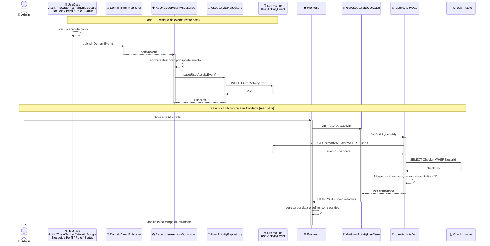

# Design — Histórico de Atividade do Usuário

## Visão Geral

Popular a aba "Atividade" do modal de detalhes do usuário (visão admin) com um feed real de eventos, combinando ações de conta (login, senha alterada, vínculo Google, bloqueio de segurança, atualização de perfil, mudança de role, mudança de status) e check-ins, ordenados por data decrescente, limitados aos últimos 20 itens. O componente frontend (`ActivityTab`) já aceita uma prop `events` — hoje simplesmente não recebe dados, então cai sempre no placeholder "Sem dados de atividade disponíveis".

## Características Arquiteturais

**Priorizadas (top 3):**

| Característica | Por quê | Critério mensurável |
|---|---|---|
| Consistência (padrão já estabelecido) | O projeto já tem um event bus (`DomainEventPublisher`) e um padrão de subscriber testado (`send-password-alert-email.notification.ts`) — reinventar aqui seria dívida técnica imediata | Nenhum novo mecanismo de dispatch é criado; 100% reuso do `DomainEventPublisher` existente |
| Confiabilidade do registro | Um evento de atividade perdido é silencioso e sem retry — mas não pode travar o fluxo principal (ex: login não pode falhar porque o registro de atividade falhou) | Falha no subscriber de atividade nunca lança para a use case chamadora (mesmo padrão try/catch já usado pelo publisher) |
| Simplicidade de leitura | A aba é consultada sob demanda, sem alta frequência | Busca dos 20 itens recentes com uma query de merge simples, sem cache dedicado na v1 |

**Consideradas, não priorizadas:** performance sob alto volume (sem indício de necessidade agora — índice `[userId, occurredAt]` já cobre o caso), retenção/expurgo de eventos antigos (fica para uma iteração futura, não bloqueia esta feature).

## Decisões Arquiteturais

### D1. Nova tabela `UserActivityEvent` + merge na leitura com `CheckIn`

- **Contexto:** o sistema não tem hoje audit log genérico nem histórico de login persistido. `CheckIn` já existe e tem timestamps por usuário; eventos de conta não são persistidos em lugar algum.
- **Decisão:** persistir eventos de conta em tabela própria (`UserActivityEvent`); check-ins continuam na tabela existente; um DAO de leitura faz o merge por timestamp entre as duas fontes.
- **Justificativa técnica:** evita distorcer o modelo de `CheckIn` (que já serve outro propósito no dashboard) e mantém `UserActivityEvent` focado em um único tipo de dado.
- **Justificativa de negócio:** menor esforço — reaproveita dado já existente (check-ins) em vez de migrá-lo para um formato genérico.
- **Trade-offs aceitos:** duas fontes de dados no read-path (uma query extra por chamada), aceitável dado o volume (20 itens, sem alta frequência).

### D2. Captura via subscriber de domain events, reusando o `DomainEventPublisher` existente

- **Contexto:** o barramento já existe (`shared/domain/event/domain-event-publisher.ts`, singleton, in-process, síncrono, `publish()` com try/catch por subscriber). A investigação encontrou que dois dos eventos necessários para o feed — `GoogleAccountLinkedEvent` e `UserProfileUpdatedEvent` — são hoje **órfãos**: a entidade `User` os dispara via `Observable.notify()`, mas nenhuma use case os republica no `DomainEventPublisher`, então não têm consumidor algum (efetivamente dead code).
- **Decisão:**
  - (a) Religar esses dois eventos nas use cases correspondentes (`authenticate-with-google.usecase.ts`, `update-my-profile.usecase.ts`, `update-user-profile.usecase.ts` — todas em `session/application/use-case/` ou `user/application/use-case/` conforme o bounded context real, ver Estrutura de Componentes), replicando o padrão já usado em `change-password.usecase.ts` (`user.subscribe(handler)` antes da chamada de domínio, `DomainEventPublisher.instance.publish(...)` dentro do handler).
  - (b) Criar 3 domain events novos — `LoginSucceededEvent`, `UserRoleChangedEvent`, `UserStatusChangedEvent` — publicados diretamente nas use cases relevantes (padrão já usado por `AccountLockedBySecurityEvent` em `authenticate.usecase.ts`, publicado direto na use case sem passar pela entidade).
  - (c) **`userId` nos payloads religados (fork fechado):** os payloads reais de `PasswordChangedEvent` (`userName`, `userEmail`), `GoogleAccountLinkedEvent` (`userEmail`, `googleId`) e `UserProfileUpdatedEvent` (`name`, `email`) não carregam `userId` hoje, mas `UserActivityEvent.userId` é obrigatório e indexado (`[userId, occurredAt]`) — o merge/leitura depende dele. Os 3 payloads devem ser estendidos com `userId: string`, adicionado no único call site de cada um (a entidade `User` já tem `this.id` disponível nos métodos `linkGoogleAccount()`, `updateProfile()` e `changePassword()`). Qualquer construção pré-existente desses eventos em testes (ex: os testes de `send-password-alert-email.notification.ts` e de `domain-event-publisher.ts` que constroem `PasswordChangedEvent`) também precisa ser atualizada para incluir `userId` — sem isso a mudança quebra a compilação desses arquivos.
- **Justificativa técnica:** zero infraestrutura nova de dispatch — 100% reuso do mecanismo existente.
- **Justificativa de negócio:** religar os eventos órfãos é trabalho pequeno (replicar um padrão testado) e destrava dados de domínio que já deveriam existir.
- **Trade-offs aceitos:** esta feature carrega uma correção de dívida técnica pré-existente (eventos órfãos) além do escopo "puro" de atividade — declarado aqui para não ser confundido com regressão introduzida por esta feature. Estender o payload de `PasswordChangedEvent` também é uma mudança que atravessa esta feature e a funcionalidade de troca de senha já existente — os call sites de teste que já constroem esse evento precisam ser atualizados junto.

### D3. Um único subscriber de atividade (`RecordUserActivitySubscriber`) em vez de uma classe por evento

- **Contexto:** o padrão atual do projeto é uma classe por evento (`SendPasswordAlertEmail`, `SendAccountLockedEmail`). Replicar isso para atividade geraria 7 classes quase idênticas.
- **Decisão:** uma única classe `RecordUserActivitySubscriber`, que assina os 7 nomes de evento (`PASSWORD_CHANGED`, `ACCOUNT_LOCKED_BY_SECURITY`, `GOOGLE_ACCOUNT_LINKED`, `USER_PROFILE_UPDATED`, `LOGIN_SUCCEEDED`, `USER_ROLE_CHANGED`, `USER_STATUS_CHANGED`) e delega a um formatter interno (`type` → descrição em pt-BR) antes de gravar via `UserActivityRepository.record(...)`.
- **Justificativa técnica:** a responsabilidade real ("registrar atividade") é uma só — não há motivo de negócio para 7 classes; mantém `bootstrap/setup-user-module.ts` com uma linha a mais em vez de 7.
- **Justificativa de negócio:** menor superfície de manutenção para adicionar novos tipos de evento no futuro (um único lugar).
- **Trade-offs aceitos:** diverge levemente da convenção "uma classe por evento" já usada para e-mails — declarado explicitamente para não ser lido como inconsistência acidental.
- **Localização (`user/infra/event-handler/`):** o projeto hoje tem duas convenções coexistentes para subscribers com dependência de repositório/gateway — `application/event-handler/` (ex: `notification/application/event-handler/create-notification-on-check-in-event.handler.ts`) e `infra/email/` (ex: `user/infra/email/send-password-alert-email.notification.ts`). `RecordUserActivitySubscriber` fica em `infra/event-handler/` por ser tratado como um adaptor primário (equivalente a um controller para eventos, e não parte da lógica de aplicação em si) — mesma categoria arquitetural de um controller HTTP, que também vive em `infra/`.
- **Taxonomia canônica de `type` (fork fechado):** a coluna `type` de `UserActivityEvent` e o campo `type` retornado pelo endpoint usam **o mesmo vocabulário único**: `LOGIN`, `PASSWORD_CHANGED`, `ACCOUNT_LOCKED`, `GOOGLE_LINKED`, `PROFILE_UPDATED`, `ROLE_CHANGED`, `STATUS_CHANGED` (gravados pelo formatter do subscriber, mapeando cada `EVENTS.*` para exatamente um desses 7 valores) mais `CHECK_IN` (sintético, atribuído pelo DAO de leitura aos itens vindos de `CheckIn`, nunca persistido). Este é o único vocabulário válido — os nomes internos de evento (`EVENTS.PASSWORD_CHANGED = "passwordChanged"` etc.) são um detalhe de implementação do `DomainEventPublisher` e nunca aparecem na coluna `type` nem na resposta HTTP.

### D4. `bulk-change-user-status.usecase.ts` publica um `UserStatusChangedEvent` por usuário afetado

- **Contexto:** a mudança de status em massa precisa refletir individualmente no feed de cada usuário afetado. **Confirmado no código real** (não é mais hipótese): `bulk-change-user-status.usecase.ts` já chama `userRepository.updateManyStatus(eligibleIds, targetStatus)`, cuja implementação Prisma executa um único `prisma.user.updateMany({ where: { id: { in: ids }, status: { not: status } }, data: { status } })` — um UPDATE em lote via SQL, sem carregar/iterar entidades `User`, e que retorna apenas um `count` numérico, não os IDs efetivamente alterados.
- **Decisão:** a use case de mudança em massa deve publicar um evento por usuário **efetivamente alterado**, não um evento agregado, e não um evento por usuário meramente **elegível** — `eligibleIds` é filtrado só pela política de permissão (`UserManagementPolicy.canChangeStatus`), então pode incluir um usuário que já está no status alvo (sem mudança real). O subconjunto "efetivamente alterado" deve ser calculado em código de aplicação **antes** do update, usando as entidades já carregadas via `usersOfIds` (`candidates`): `changedCandidates = candidates.filter(c => eligibleIds.includes(c.id) && c.status !== targetStatus)`. Após `updateManyStatus` ter sucesso, publicar um `UserStatusChangedEvent` para cada item de `changedCandidates` — nunca para todo `eligibleIds`. Isso resolve o fork sem reverter a otimização de escrita em lote e sem exigir que `updateManyStatus` mude de assinatura.
- **Justificativa técnica:** mantém o modelo de leitura (`UserActivityDao`) simples — sempre um evento = um item no feed de um usuário; calcular o subconjunto alterado a partir de dados já carregados evita uma query extra pós-update.
- **Trade-offs aceitos:** nenhum — a resolução acima não exige alteração de assinatura do repositório nem query adicional.

## Fluxo (Sequência)

1. Uma ação de conta acontece (login, troca de senha, vínculo Google, bloqueio, atualização de perfil, promoção/rebaixamento de role, mudança de status) → a use case correspondente publica o domain event no `DomainEventPublisher` (já existente, ou religado conforme D2).
2. `RecordUserActivitySubscriber` (assinado nos 7 nomes de evento) recebe o evento, formata uma descrição em pt-BR e grava um registro em `UserActivityEvent` via `UserActivityRepository`. Falha aqui nunca propaga para a use case de origem (mesma garantia do publisher).
3. Ao abrir a aba "Atividade" no admin, o frontend chama `GET /users/:id/activity`, que executa `GetUserActivityUseCase` → `UserActivityDao` faz merge de `UserActivityEvent` + `CheckIn` por `userId`, ordena por data desc, limita a 20.
4. `ActivityTab` recebe a lista, agrupa por data ("Hoje"/"Ontem"/data completa) e escolhe ícone por `type` — layout definido na Especificação Visual. **Estados de loading e erro (fork fechado):** enquanto a busca via hook React Query está pendente (`isPending`), a aba mostra um placeholder de carregamento simples (sem novo componente — reaproveita o padrão de loading já usado em outras abas do modal); em caso de erro (`isError`), mostra uma mensagem distinta do estado vazio ("Não foi possível carregar o histórico de atividade", reaproveitando o padrão de erro inline já usado em `user-detail-panel.tsx`) — sem isso, uma falha de rede fica visualmente idêntica a "usuário sem atividade", o que é enganoso numa tela usada em decisões administrativas.



Diagrama fonte: `specs/diagrams/historico-atividade-usuario-design_01_sequence_fluxo_atividade_usua.mmd`

## Estrutura de Componentes

**Backend — novo:**

| Arquivo | Papel |
|---|---|
| `user/domain/event/login-succeeded.event.ts` | Novo domain event |
| `user/domain/event/user-role-changed.event.ts` | Novo domain event |
| `user/domain/event/user-status-changed.event.ts` | Novo domain event |
| `user/application/persistence/repository/user-activity-repository.ts` | Interface de escrita |
| `user/application/persistence/dao/user-activity-dao.ts` | Interface de leitura (merge) |
| `user/application/use-case/get-user-activity.usecase.ts` | Use case de leitura (limit 20) |
| `shared/infra/database/repository/prisma/prisma-user-activity-repository.ts` | Implementação Prisma da escrita (caminho real da convenção Prisma do projeto — não `user/infra/gateway/`, que hoje só contém stores Redis) |
| `shared/infra/database/dao/prisma/prisma-user-activity-dao.ts` | Implementação Prisma do merge (query `UserActivityEvent` + `CheckIn`) |
| `user/infra/event-handler/record-user-activity.subscriber.ts` | O subscriber único (D3) |
| `user/infra/controller/get-user-activity.controller.ts` | `GET /users/:id/activity`, registrado com `isProtected: true, onlyAdmin: true` (ver Endpoint) |

**Backend — modificado:**

| Arquivo | Mudança |
|---|---|
| `shared/domain/event/events.ts` | + `LOGIN_SUCCEEDED`, `USER_ROLE_CHANGED`, `USER_STATUS_CHANGED` |
| `session/application/use-case/authenticate.usecase.ts` | Publica `LoginSucceededEvent` no sucesso |
| `session/application/use-case/authenticate-with-google.usecase.ts` | Publica `LoginSucceededEvent`; religa `GoogleAccountLinkedEvent` (D2) |
| `user/application/use-case/update-my-profile.usecase.ts` | Religa `UserProfileUpdatedEvent` (D2) |
| `user/application/use-case/update-user-profile.usecase.ts` | Religa `UserProfileUpdatedEvent` (D2) |
| `user/application/use-case/promote-to-admin.usecase.ts` | Publica `UserRoleChangedEvent` |
| `user/application/use-case/demote-from-admin.usecase.ts` | Publica `UserRoleChangedEvent` |
| `user/application/use-case/suspend-user.usecase.ts` | Publica `UserStatusChangedEvent` |
| `user/application/use-case/active-user.usecase.ts` | Publica `UserStatusChangedEvent` |
| `user/application/use-case/bulk-change-user-status.usecase.ts` | Publica `UserStatusChangedEvent` por usuário afetado (D4) |
| `prisma/schema.prisma` | + model `UserActivityEvent` (migration nova) |
| `shared/infra/ioc/module/service-identifier/user-types.ts` | + símbolos novos |
| `shared/infra/ioc/module/user/user-module.ts` | Bind das classes novas |
| `bootstrap/setup-user-module.ts` | `.subscribe()` do novo subscriber |

**Frontend:**

| Arquivo | Mudança |
|---|---|
| `features/admin/api/use-user-activity.ts` | Novo hook React Query |
| `features/admin/components/user-detail/activity-tab.tsx` | Reestrutura: agrupamento por data + ícone por tipo |
| `features/admin/components/user-detail/user-detail-panel.tsx` | Busca e passa `events` para `ActivityTab` |

## Modelo de Dados

```prisma
model UserActivityEvent {
  id          String   @id @default(uuid())
  userId      String   @map("user_id")
  type        String   // LOGIN | PASSWORD_CHANGED | ACCOUNT_LOCKED | GOOGLE_LINKED | PROFILE_UPDATED | ROLE_CHANGED | STATUS_CHANGED
  description String   // pré-computada em pt-BR no momento da escrita
  metadata    Json?    // ex: {previousRole, newRole} / {previousStatus, newStatus}
  occurredAt  DateTime @map("occurred_at")
  createdAt   DateTime @default(now()) @map("created_at")

  user User @relation(fields: [userId], references: [id])

  @@index([userId, occurredAt])
  @@map("user_activity_events")
}
```

A descrição é pré-computada no subscriber (não derivada na leitura), mantendo o merge com `CheckIn` simples e uniforme no DAO.

### Shape do item de lista combinado (fork fechado)

O DAO de leitura (`UserActivityDao`) e o endpoint retornam uma lista de itens no shape unificado abaixo — o mesmo para itens vindos de `UserActivityEvent` e de `CheckIn`:

```typescript
interface UserActivityListItem {
  id: string
  type: "LOGIN" | "PASSWORD_CHANGED" | "ACCOUNT_LOCKED" | "GOOGLE_LINKED" | "PROFILE_UPDATED" | "ROLE_CHANGED" | "STATUS_CHANGED" | "CHECK_IN"
  description: string
  occurredAt: string // ISO 8601
}
```

Para um item de `UserActivityEvent`: `type`/`description`/`occurredAt` vêm direto das colunas gravadas pelo subscriber. Para um item de `CheckIn`: `type` é sempre o valor sintético `"CHECK_IN"` (nunca persistido); `occurredAt` usa `CheckIn.created_at` (o timestamp em que o check-in foi realizado — `validated_at`/`rejected_at` refletem a aprovação, não a ocorrência, e ficam fora deste shape); `description` é formatada como `"Check-in — {gym.title}"`.

## Endpoint

`GET /users/:id/activity` — retorna os últimos 20 itens combinados (`UserActivityEvent` + `CheckIn`), no shape `UserActivityListItem` acima, ordenados por data decrescente. Sem paginação na v1.

**Autorização (fork fechado):** restrito a administradores — `isProtected: true, onlyAdmin: true` na definição da rota, replicando o padrão declarativo já usado por outros ~15 controllers do módulo `user` (`get-user-stats.controller.ts`, `fetch-users.controller.ts`, etc.), e não uma checagem manual de `req.user.sub.role` dentro do handler. Coerente com o PRD, que enquadra esta feature como "apenas visão admin" (Fora de Escopo: "Visão de atividade para o próprio usuário... esta feature cobre apenas a visão admin").

## Especificação Visual

**Artefato curado:** `specs/mockups/historico-atividade-usuario-visual.md`

**Fonte de design original:** nenhuma — layout definido apenas via mockup do companion.

**Decisões visuais (norte, não pixel-final):**
- Agrupamento por data com cabeçalhos ("Hoje", "Ontem", data completa) em vez de lista cronológica plana.
- Ícone circular colorido por categoria de evento: accent (`#39e58c`) para check-in, warning (`#ffb443`) para eventos de segurança (bloqueio, senha), surface-3 (`#242424`) para eventos de conta/perfil/role/status.
- Cada item: ícone + descrição + horário (texto subtle, menor).
- Tokens do tema real do projeto (VOLT design system, tema escuro).

**Fidelidade:** o mockup é um norte. A fidelidade final (ícones reais via `lucide-react`, ajuste fino de espaçamento) é construída na task de implementação do frontend.

## Riscos

| Risco | Impacto | Probabilidade | Score | Mitigação |
|---|---|---|---|---|
| `bulk-change-user-status.usecase.ts` já faz update em lote via SQL (`prisma.user.updateMany`) sem iterar entidade por entidade — confirmado no código real, não é mais hipótese; `eligibleIds` (filtrado só por permissão) diverge de "efetivamente alterado" | 2 | 2 | 4 🟡 | Resolvido em D4: calcular `changedCandidates` a partir dos `candidates` já carregados (`status !== targetStatus`) antes do update, e publicar evento só para esse subconjunto após o update ter sucesso — sem reverter a otimização de escrita |
| Subscriber de atividade falha silenciosamente (por design, para não quebrar o fluxo principal) e a falha passa despercebida sem contexto suficiente para diagnóstico (o log padrão do `DomainEventPublisher` só registra o nome do evento e o erro, não `userId`/`type`) | 2 | 2 | 4 🟡 | `RecordUserActivitySubscriber` envolve a gravação em seu próprio `try/catch` local e loga `userId` + `type` do evento antes de deixar a falha ser engolida (mantendo a garantia de não propagar para a use case chamadora); teste unitário garante que a falha não propaga |
| Nova migration (`UserActivityEvent`) em produção | 2 | 1 | 2 🟢 | Migration aditiva (nova tabela), sem alteração de tabelas existentes — baixo risco |
| Religar `GoogleAccountLinkedEvent`/`UserProfileUpdatedEvent` (D2) desperta efeito colateral inesperado em algum consumidor pré-existente | 1 | 1 | 1 🟢 | Investigação já confirmou que não há nenhum subscriber hoje para esses dois eventos — religar só adiciona o novo subscriber de atividade |

## Testes

- **Domain events novos:** teste unitário de construção/payload para `LoginSucceededEvent`, `UserRoleChangedEvent`, `UserStatusChangedEvent`.
- **`RecordUserActivitySubscriber`:** teste unitário — cada um dos 7 tipos de evento gera a descrição pt-BR esperada e chama `UserActivityRepository.record` com os campos corretos; erro no repositório não propaga.
- **Use cases modificados** (`authenticate`, `authenticate-with-google`, `update-my-profile`, `update-user-profile`, `promote-to-admin`, `demote-from-admin`, `suspend-user`, `active-user`): teste garantindo que o evento correto é publicado no `DomainEventPublisher` no caminho de sucesso.
- **`bulk-change-user-status.usecase.ts`:** teste garantindo o invariante de D4 — publica exatamente um `UserStatusChangedEvent` por usuário em `updated` (efetivamente alterado), não por usuário em `eligibleIds`; zero eventos para usuários em `skipped` ou já no status alvo.
- **`prisma-user-activity-dao`:** teste de integração — merge correto de `UserActivityEvent` + `CheckIn`, ordenação desc, limite de 20.
- **`get-user-activity.usecase.ts`:** teste unitário do use case de leitura.
- **`get-user-activity.controller.ts`:** teste de integração/e2e — 200 com a lista de eventos para admin; 403 para não-admin (autorização declarada no Endpoint).
- **Frontend:** teste de `ActivityTab` — agrupamento por data, mapeamento de ícone por `type`, estado de loading distinto do vazio, estado de erro distinto do vazio; teste do hook `use-user-activity`.
- **Aceitação:** admin abre a aba "Atividade" de um usuário com eventos variados e vê os itens agrupados e com ícone correto (evidência via QA gate, `super.user-story-verification`).
