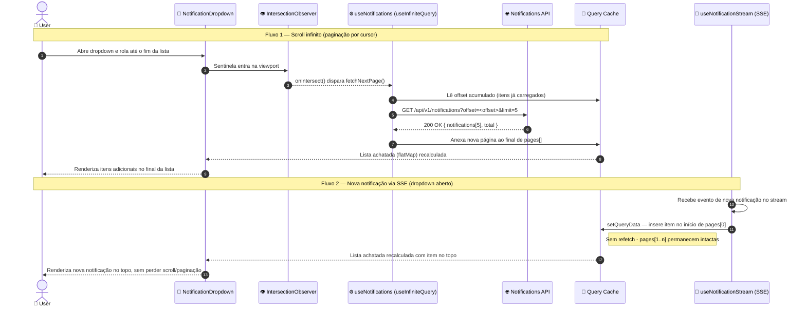

# Scroll Infinito no Dropdown de Notificações

## Visão Geral

O dropdown de notificações no header (`NotificationBell` / `NotificationDropdown`) hoje busca uma página fixa de até 10 notificações e não pagina. Esta feature adiciona scroll infinito: a carga inicial continua trazendo 10 itens; ao rolar até o fim da lista, lotes adicionais de 5 são buscados por offset/limit até não haver mais notificações. O objetivo é evitar carregar de uma vez todo o histórico de notificações de um usuário, reduzindo consumo de rede e tempo de carregamento quando há muitos itens.

**Correção pós-pesquisa de planejamento:** a suposição original deste spec de que a API já era cursor-based estava incorreta. `GET /api/v1/notifications` hoje aceita apenas `page`/`unreadOnly`, com tamanho de página fixo no backend (`ITEMS_PER_PAGE`, env var, default 20) — não há como o cliente pedir lotes de tamanhos diferentes (10 na carga inicial, 5 depois). A feature passa a incluir uma mudança de backend mínima e retrocompatível: ver D0 abaixo.

## Características Arquiteturais

**Priorizadas (top 3):**

| Característica | Por quê (preocupação de domínio) | Critério mensurável |
|---|---|---|
| Performance | Motivador original da feature: evitar buscar todo o histórico de notificações de uma vez | Cada busca de lote transfere no máximo 5 itens (exceto a carga inicial, 10) |
| Confiabilidade | Falha de rede ao buscar um lote não pode quebrar a lista já carregada nem duplicar/perder itens ao reconciliar com SSE | Falha em `fetchNextPage` não invalida páginas já carregadas; SSE nunca duplica item já presente no cache |
| Testabilidade | Primeiro uso de `useInfiniteQuery` no frontend — precisa ficar claro e coberto por teste para servir de referência a usos futuros | Hook e componente cobertos por testes unitários com mocks de múltiplas páginas |

**Consideradas, não priorizadas:** escalabilidade (volume de notificações por usuário não justifica um esquema de cursor real — offset/limit sobre a tabela existente é suficiente), acessibilidade além do já existente no componente (fora do escopo pedido).

## Decisões Arquiteturais

### D0. Backend: adicionar `offset`/`limit` opcionais a `GET /api/v1/notifications`, mantendo `page` para os demais consumidores

- **Contexto:** a paginação atual é por número de página (`page`) com tamanho de página fixo via env var (`ITEMS_PER_PAGE`). Isso não permite lotes de tamanhos diferentes entre a carga inicial (10) e as buscas seguintes (5), porque um esquema `page` + tamanho fixo não compõe corretamente quando o tamanho varia entre páginas.
- **Decisão:** estender `get-notifications.controller.ts`, `GetNotificationsUseCase` e `PrismaNotificationRepository` para aceitar `offset`/`limit` opcionais que, quando presentes, sobrepõem o cálculo padrão de `skip`/`take` (hoje `skip: (page-1)*ITEMS_PER_PAGE, take: ITEMS_PER_PAGE`). Quando `offset`/`limit` não são enviados, o comportamento por `page` continua idêntico ao atual — mudança retrocompatível. O dropdown de notificações passa a chamar sempre com `offset`/`limit` explícitos; a resposta continua trazendo `total`, que já é suficiente para o frontend calcular `hasNextPage` (itens acumulados < `total`), sem precisar de um campo `nextCursor` novo.
- **Justificativa técnica:** o repositório Prisma já calcula `skip`/`take` internamente — parametrizar essas duas variáveis é a menor mudança possível que resolve o problema, sem introduzir um segundo modelo de paginação (cursor real) nem reescrever o endpoint.
- **Justificativa de negócio:** entrega os lotes de 10/5 exigidos pelo PRD sem quebrar nenhum consumidor existente do endpoint (`page` continua funcionando para quem já o usa).
- **Trade-offs aceitos:** o endpoint passa a ter dois modelos de paginação coexistindo (`page` e `offset`/`limit`) até que, eventualmente, os demais consumidores migrem — dívida técnica pequena e explícita, não um cursor real (não há proteção contra itens inseridos/removidos entre buscas alterarem o offset; aceitável para uma lista de notificações, não para dados financeiros).

### D1. `useInfiniteQuery` (TanStack Query) com sentinela `IntersectionObserver` em vez de handler de `onScroll`

- **Contexto:** é preciso disparar a busca do próximo lote quando o usuário se aproxima do fim da lista do dropdown.
- **Decisão:** migrar `useNotifications` de `useQuery` para `useInfiniteQuery`; disparo via elemento sentinela observado por `IntersectionObserver`.
- **Justificativa técnica:** `useInfiniteQuery` já expõe `fetchNextPage`/`hasNextPage`/`isFetchingNextPage` prontos para o cursor da API; `IntersectionObserver` evita listener de scroll rodando a cada pixel e é o padrão recomendado pelo TanStack para esse caso.
- **Justificativa de negócio:** menor risco de bug de threshold (off-by-one em cálculo de `scrollTop`), reduzindo retrabalho.
- **Trade-offs aceitos:** primeiro uso desse hook e desse padrão de sentinela no frontend — não há precedente local para copiar; próximas features de lista que quiserem infinite scroll usam esta como referência.

### D2. Notificações via SSE são inseridas manualmente no cache (`setQueryData`), não disparam `invalidateQueries`

- **Contexto:** hoje, uma notificação recebida via SSE invalida a query e refaz tudo, o que com paginação re-buscaria todos os lotes já carregados — anulando a economia de rede que é o motivo da feature.
- **Decisão:** o handler de mensagens SSE (`handleNotificationStreamMessage`, definido em `use-notifications.ts` e passado como `onMessage` para `useNotificationStream`) passa a usar `queryClient.setQueryData` para inserir a notificação recebida no início de `data.pages[0].notifications`, sem tocar nas demais páginas. `use-notification-stream.ts` continua responsável apenas por conectar ao SSE e repassar mensagens já parseadas — não é modificado.
- **Justificativa técnica:** preserva os lotes já carregados; é o padrão documentado pelo TanStack Query para eventos em tempo real combinados com `useInfiniteQuery`.
- **Justificativa de negócio:** consistente com o objetivo de performance da feature; sem essa decisão, cada notificação em tempo real anularia o ganho do scroll infinito.
- **Trade-offs aceitos:** mais código que um simples `invalidateQueries` (precisa de um updater específico); se o formato de `data.pages[0]` mudar no futuro, este updater precisa ser atualizado junto.

### D3. Retry de lote com erro é automático e silencioso (padrão nativo do TanStack Query)

- **Contexto:** falha de rede ao buscar o próximo lote não deve exigir ação do usuário nem quebrar a lista já visível.
- **Decisão:** usar o `retry` nativo do TanStack Query, escopado à tentativa de `fetchNextPage`; nenhuma UI de erro é exibida.
- **Justificativa técnica:** comportamento padrão da biblioteca, sem componente novo.
- **Justificativa de negócio:** decisão explícita do usuário do produto — falha ao carregar mais notificações não deve gerar fricção, é um problema recuperável e não-crítico.
- **Trade-offs aceitos:** se todas as tentativas de retry falharem, o usuário não recebe nenhum aviso — o spinner de rodapé simplesmente some silenciosamente e a lista para de crescer até o dropdown ser reaberto.

## Arquitetura / Fluxo

Diagrama fonte: `specs/diagrams/notificacoes-scroll-infinito-design_01_sequence_scroll_infinito_e_re.mmd`

**Regras da carga:**
- Página inicial: `offset=0&limit=10`.
- Páginas seguintes: `offset=<itens já acumulados>&limit=5`.
- `hasNextPage` é calculado no frontend comparando o total de itens já acumulados em `data.pages` com o `total` retornado pela API; quando `acumulado >= total`, a sentinela não dispara mais buscas e o spinner de rodapé some.

## Estrutura de Componentes

Nenhum componente novo é criado; os arquivos abaixo (frontend e backend) são modificados:

| Componente | Responsabilidade | Depende de | Do qual dependem |
|---|---|---|---|
| `GetNotificationsController` (`notification/infra/controller/get-notifications.controller.ts`) | Aceitar `offset`/`limit` opcionais na query, junto de `page`/`unreadOnly` já existentes | `GetNotificationsUseCase` | Rota `GET /api/v1/notifications` |
| `GetNotificationsUseCase` (`notification/application/use-case/get-notifications.usecase.ts`) | Repassar `offset`/`limit` ao repositório quando presentes | `NotificationRepository` | `GetNotificationsController` |
| `PrismaNotificationRepository` (`notification/infra/repository/prisma/prisma-notification.repository.ts`) | Calcular `skip`/`take` a partir de `offset`/`limit` quando fornecidos, senão manter o cálculo atual por `page`/`ITEMS_PER_PAGE` | Prisma Client | `GetNotificationsUseCase` |
| `useNotifications` (`lib/notifications/use-notifications.ts`) | Buscar e paginar notificações via `offset`/`limit`, expor lista achatada + `fetchNextPage`/`hasNextPage`/`isFetchingNextPage` | Cliente API tipado (`@repo/api-types`, regenerado após a mudança de backend) | `NotificationDropdown` |
| `useNotificationStream` (`lib/notifications/use-notification-stream.ts`) | Conectar ao stream SSE e repassar mensagens já parseadas via `onMessage` — não modificado nesta feature | — | `useNotifications`, via o callback `handleNotificationStreamMessage` |
| `NotificationDropdown` (`components/notification/notification-dropdown.tsx`) | Renderizar a lista com contêiner rolável, sentinela de scroll e spinner de rodapé | `useNotifications` | `NotificationBell` |

Sem mudança de contrato para `NotificationItem` nem para as mutações existentes (marcar como lida / marcar todas como lidas) — ambas continuam operando sobre o array achatado.

## Riscos

| Risco | Impacto (1-3) | Probabilidade (1-3) | Score | Mitigação |
|---|---|---|---|---|
| Primeiro uso de `useInfiniteQuery` no repo — padrão não testado localmente | 2 | 2 | 4 🟡 | Cobrir com teste unitário do hook simulando 3+ páginas antes de integrar ao componente; usar exatamente a API documentada do TanStack v5 (`initialPageParam` obrigatório) |
| Corrida entre `setQueryData` do SSE e `fetchNextPage` em andamento causando duplicidade/ordem inconsistente | 2 | 2 | 4 🟡 | Updater do SSE insere por id com checagem de duplicidade antes de prepend; teste cobrindo notificação chegando durante fetch de próxima página |
| Mocks MSW de notificações não existem hoje (nenhum handler específico encontrado; testes atuais usam `vi.mock("@/lib/api")`) | 1 | 2 | 2 🟢 | Manter o padrão existente de `vi.mock` nos testes do hook, sem introduzir MSW nesta feature |
| Endpoint passa a ter dois modelos de paginação coexistindo (`page` e `offset`/`limit`) | 1 | 3 | 3 🟡 | Documentado explicitamente em D0 como dívida técnica aceita; cobrir com teste que `page` continua funcionando sem `offset`/`limit` (retrocompatibilidade) |

## Testes

- **Backend, unitário (Vitest, `pnpm --filter backend test`):** teste de `GetNotificationsUseCase` cobrindo repasse de `offset`/`limit` ao repositório, e teste de repositório (in-memory) cobrindo `skip`/`take` calculados a partir de `offset`/`limit` quando presentes e o comportamento por `page` preservado quando ausentes (retrocompatibilidade).
- **Frontend, unitário (Vitest, `pnpm --filter frontend test -- --run`):** `use-notifications.test.tsx` cobrindo carga inicial (`offset=0&limit=10`), busca de próxima página (`offset=10&limit=5`), fim da paginação (`hasNextPage=false` quando acumulado ≥ `total`), e inserção via SSE sem afetar páginas já carregadas. `use-notification-stream.test.ts` atualizado para o novo updater de cache. Mocks via `vi.mock("@/lib/api")`, seguindo o padrão já usado nesses testes (sem introduzir MSW).
- **Componente:** teste de `notification-dropdown.tsx` cobrindo o disparo do sentinela (mock de `IntersectionObserver`, ausente hoje no setup de testes — precisa ser adicionado) chamando `fetchNextPage`, e exibição/ocultação do spinner de rodapé conforme `isFetchingNextPage`/`hasNextPage`.
- Após a mudança de backend, rodar `pnpm generate:types` para regenerar `@repo/api-types` antes de implementar o frontend.
