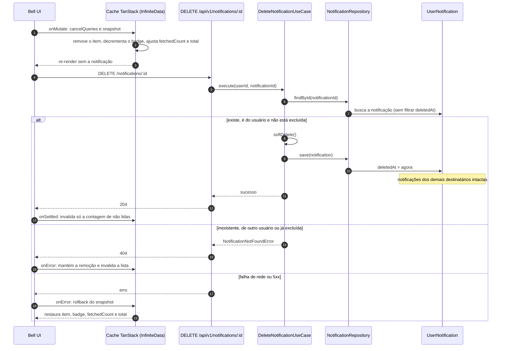

# Exclusão de notificação no bell: design

## Visão Geral

**Problema:** o menu de notificações (bell) só permite visualizar e marcar como lida. O usuário não consegue remover uma notificação da própria caixa.

**Objetivo:** permitir que o usuário autenticado exclua uma notificação por vez, direto no item do bell. A exclusão vale só para o próprio usuário: em um broadcast cada destinatário tem a sua própria notificação, e as dos demais não são afetadas.

**Sucesso:** o item some da lista imediatamente, o badge de não lidas acompanha, o scroll infinito não pula nem repete itens e a exclusão sobrevive a um reload.

**Suposições assumidas (não ditas):**
- Qualquer tipo de notificação pode ser excluído, inclusive `SECURITY_ALERT`. A exclusão é lógica, então a retenção mínima de 90 dias (RF-023 do PRD `realtime-notification-system`) continua valendo.
- Sem desfazer, sem lixeira e sem confirmação.

**Fora de escopo:** excluir várias ou todas de uma vez, sincronização da exclusão entre abas ou dispositivos (não há evento SSE de exclusão), purga física após 90 dias, restauração, página `/notificacoes` de histórico, exclusão ou recolhimento de avisos pelo admin (excluídos por `admin-notice-broadcast` e `notice-audience`).

## Características Arquiteturais

**Priorizadas (top 3):**

| Característica | Por quê | Critério mensurável |
|---|---|---|
| Isolamento entre usuários | Avisos em broadcast geram uma notificação por destinatário | Excluir notificação de outro usuário devolve 404 e não altera nenhuma linha |
| Consistência percebida | A lista tem scroll infinito por `offset` | Após excluir, `fetchNextPage` não pula nem repete itens (teste do ajuste de `fetchedCount`) |
| Manutenibilidade | Já existe o padrão de `markAsRead` | Zero migration; nenhum componente novo além do caso de uso, do controller e do hook |

**Consideradas, não priorizadas:** performance (operação por linha única), disponibilidade (sem dependência de fila ou SSE).

## Estrutura de Componentes

**Backend, bounded context `notification`:**
- **Exclusão no domínio:** novo método `softDelete()` na entidade `Notification`, no estilo de `markAsRead()`, que preenche `deletedAt`. Os getters `deletedAt` e `isDeleted` já existem.
- **`DeleteNotificationUseCase`:** carrega pelo `findById(notificationId)`, confere que `notification.userId` é o do requisitante e que `notification.isDeleted` é falso, aplica `softDelete()` e persiste com `save()`. Se não existe, é de outro usuário ou já está excluída, devolve `NotificationNotFoundError`. O `findById` não filtra `deletedAt`, então a checagem de `isDeleted` é do caso de uso. O `save()` já persiste `deletedAt` (upsert com `updateMany` por `userId`), sem mudança no repositório nem migration.
- **Controller:** `DELETE /api/v1/notifications/:id`, protegido, resposta 204. O OpenAPI descreve 204, 401 e 404; o IoC ganha os símbolos do caso de uso e do controller.
- **Contrato compartilhado:** `pnpm generate:types` para o `@repo/api-types` expor o `DELETE`.

**Frontend:**
- **`NotificationItem`:** o `<li>` vira contêiner flex com o botão principal (marca como lida) e um botão irmão de excluir; nunca `<button>` aninhado.
- **`deleteNotification` (mutation dentro de `useNotifications`, em `lib/notifications/use-notifications.ts`, retornada como `deleteNotification(id)`):** atualização otimista sobre o cache `InfiniteData` da lista e sobre a query separada da contagem de não lidas. O `NotificationDropdown` e o `NotificationBell` repassam `onDelete` até o item.

## Especificação Visual

**Artefato curado:** `mockups/notification-delete-visual.md` (relativo a este spec).

**Fonte de design original:** nenhuma; layout definido via mockup do companion com tokens reais do app.

**Decisões visuais (norte, não pixel-final):**
- Opção B escolhida: o botão de excluir aparece no hover ou foco da linha e ocupa o lugar da hora; em `@media (hover: none)` fica sempre visível.
- Botão de 32px, ícone `Trash2` de 16px, `rounded-md`, hover em `bg-destructive-soft text-destructive`.
- `opacity-60` das linhas lidas atinge só o botão principal, não o de excluir.
- Layout do item, ponto de não lida e tokens do tema permanecem como hoje.

**Fidelidade:** o mockup é um norte; a fidelidade final é construída contra `notification-item.tsx` e `ui/button.tsx`.

## Fluxo de Dados

O usuário clica em excluir e o hook remove o item do cache antes da resposta, ajustando `fetchedCount`, `total` e a contagem de não lidas. O backend valida a posse e marca `deletedAt`. Em sucesso (204) a lista permanece como está e só a query de contagem de não lidas é invalidada. Em 404 (o item já não existe para o usuário) a remoção é mantida e a lista é invalidada para se ressincronizar. Em falha de rede ou 5xx o snapshot é restaurado.

Diagrama fonte: `specs/diagrams/notification-delete-design_01_sequence_delete_notification.mmd`

## Decisões Arquiteturais

### D1. Exclusão lógica em `UserNotification.deletedAt` via `DELETE /notifications/:id`

- **Contexto:** cada destinatário tem a sua `Notification` com uma linha `UserNotification` que guarda `readAt` e `deletedAt`; as listagens e a contagem já filtram `deletedAt: null`, e o `save()` já persiste `deletedAt`.
- **Decisão:** `DELETE` que preenche `deletedAt`; 204 no sucesso, 404 quando não encontrada, de outro usuário ou já excluída.
- **Justificativa técnica:** reaproveita schema, filtros e o padrão do `MarkAsReadUseCase`; zero migration.
- **Justificativa de negócio:** respeita a retenção de 90 dias das notificações de segurança e permite auditoria.
- **Trade-offs aceitos:** as linhas nunca somem do banco; a purga fica para trabalho futuro. Descartadas: remoção física (viola RF-023) e `PATCH dismiss` (foge do padrão REST sem ganho).

### D2. Remoção otimista com `fetchedCount` ajustado

- **Contexto:** o scroll infinito pagina por `offset`; remover um item entre buscas deslocaria o offset.
- **Decisão:** remover do cache, decrementar o badge se era não lida, decrementar o `fetchedCount` da página que continha o item e o `total` de todas as páginas (o `getNextPageParam` usa `total` e a soma dos `fetchedCount`); remover também o item pendente de reaplicação do SSE; rollback só em falha de rede ou 5xx.
- **Justificativa técnica:** o próximo `fetchNextPage` continua a partir do ponto correto, sem refetch das páginas carregadas. Segue a regra D2 de `notificacoes-scroll-infinito`.
- **Justificativa de negócio:** o item some na hora, sem "pulo" de scroll.
- **Trade-offs aceitos:** mais lógica de cache e um teste dedicado ao offset. Descartada: invalidar a lista inteira a cada exclusão (refetch de todas as páginas, scroll instável).

### D3. 404 mantém a remoção

- **Contexto:** um clique duplo gera um segundo `DELETE` que devolve 404.
- **Decisão:** em 404 não há rollback; a lista é invalidada para ressincronizar.
- **Justificativa técnica:** 404 significa que a notificação não existe para o usuário; restaurá-la mostraria algo inexistente.
- **Justificativa de negócio:** evita piscar o item de volta.
- **Trade-offs aceitos:** um refetch extra no caso raro de 404.

## Riscos

| Risco | Impacto (1-3) | Probabilidade (1-3) | Score | Mitigação |
|---|---|---|---|---|
| Deslocamento de offset no scroll infinito após excluir | 2 | 2 | 4 🟡 | D2 e teste do hook que verifica `fetchedCount` e o próximo `fetchNextPage` |
| Excluir a última notificação carregada com `hasNextPage` ativo deixa o sentinel sem gatilho | 2 | 2 | 4 🟡 | Teste do componente: lista vazia com `hasNextPage` volta a buscar |
| `findById` não filtra `deletedAt`: uma exclusão repetida devolveria 204 se o caso de uso não checar `isDeleted` | 2 | 2 | 4 🟡 | O caso de uso checa `isDeleted` e devolve 404; teste unitário de exclusão repetida |
| Um item excluído ainda pendente de reaplicação do SSE reaparece na lista | 2 | 2 | 4 🟡 | A mutation remove a entrada pendente; teste no hook |
| O 404 não é distinguível de erro de rede na camada de API do frontend | 2 | 2 | 4 🟡 | Ler o status da resposta na função de requisição; teste do hook para 404 e para 5xx |
| Sem sincronização entre abas | 1 | 3 | 3 🟡 | Aceito e registrado como fora de escopo; a lista se acerta no próximo fetch |

## Testes

Backend: Vitest via `pnpm --filter backend test` (`*.test.ts`) e `pnpm --filter backend test:business-flow` (`*.business-flow-test.ts`). Frontend: Vitest via `pnpm --filter frontend test -- --run`. Sem framework novo; backend em Fastify e frontend em Next.js, já declarados nos manifests.

- **Unitário do caso de uso (repositório em memória):** sucesso, inexistente, de outro usuário, exclusão repetida (404).
- **Business-flow HTTP:** 204, 401 sem token, 404 para notificação de outro usuário, e a notificação some do `GET /notifications`.
- **Hook `useNotifications` (`deleteNotification`):** remoção do item, decremento do badge só se não lida, ajuste de `fetchedCount` e `total`, rollback em 5xx, sem rollback em 404, item pendente do SSE não reaparece.
- **Componente `NotificationItem`:** botão de excluir com `aria-label`, revelado por foco, não aninhado ao botão principal, e o clique nele não dispara marcar como lida. Os testes existentes que usam `getByRole("button")` passam a filtrar por nome.
- **Mocks:** os testes do hook mockam `@/lib/api` com `vi.mock` (adicionando `DELETE`), como os existentes; não há handler MSW de notificações.
- **Gates:** `pnpm biome:fix`, `pnpm tsc:check`, `pnpm test:run` e `pnpm build` verdes; fitness e dependency-cruiser sem regressão.
