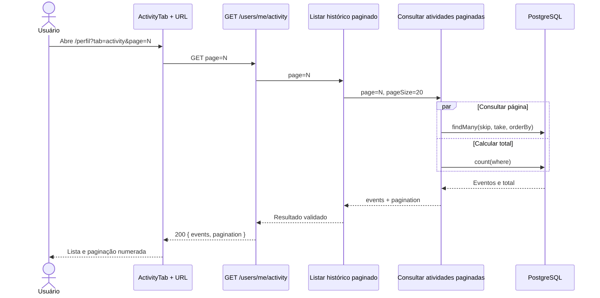

# Design: Paginação do histórico de atividades do perfil

## Visão Geral

A aba **Atividade** do perfil hoje combina eventos de conta e check-ins, ordena-os por data e retorna os 20 mais recentes sem permitir navegar pelo restante do histórico. Esta mudança adiciona paginação de 20 itens por página no read path completo: DAO, caso de uso, controller, contrato OpenAPI, tipos compartilhados, hook e tela. A captura dos eventos, o schema do banco e o endpoint administrativo permanecem inalterados.

## Características Arquiteturais

**Priorizadas (top 3):**

| Característica | Por quê | Critério mensurável |
|---|---|---|
| Escalabilidade | O histórico cresce continuamente e não deve gerar payload completo. | Cada resposta contém no máximo 20 eventos e o DAO usa `take=20`. |
| Performance | A tela precisa carregar somente a página solicitada. | A página e o `count` são iniciados em paralelo e não há consulta para materializar o histórico completo. |
| Usabilidade/consistência | A navegação deve seguir as demais listagens do produto. | `page` é preservado na URL; a paginação aparece somente quando `totalPages > 1`. |

**Consideradas, não priorizadas:** disponibilidade, pois a operação mantém as garantias atuais; cursor pagination, pois não atende à navegação numerada aprovada; filtros, exportação e retenção, pois continuam fora do escopo.

## Especificação Visual

**Artefato curado:** `specs/mockups/paginacao-historico-atividade-perfil-visual.md`.

**Fonte de design original:** nenhuma; layout definido pelo mockup do companion visual.

**Decisões visuais:** tema dark VOLT; aba Atividade ativa; card de largura total com título, legenda e indicação `20 / página`; eventos agrupados por data com ícones circulares; rodapé com resumo à esquerda e paginação numerada à direita; em telas estreitas, controles abaixo do resumo. Utilizar Inter, Space Grotesk, JetBrains Mono, accent `#39e58c`, cards `#161616`, bordas `#2a2a2a`, raio de card 22px e controles de 14px.

## Componentes e Responsabilidades

### Listar histórico paginado

Valida a página, fixa o tamanho em 20, calcula o offset e compõe eventos e metadados. Depende do port do DAO e é chamado pelo controller.

### Consultar atividades paginadas

Busca os eventos de atividade e check-ins da página solicitada, aplica ordenação determinística e calcula o total. Depende das fontes Prisma ou in-memory e é usado pelo caso de uso.

### Expor histórico paginado

Valida query/autenticação, executa o caso de uso e publica o contrato `{ events, pagination }` em `/users/me/activity`. Depende do caso de uso e do schema OpenAPI.

### Navegar histórico do perfil

Inclui `page` na query key, sincroniza a URL, renderiza estados e usa `NumberedPagination` para a interação. Depende dos tipos OpenAPI gerados e do `ActivityTab`.

## Fluxo de Dados

`/perfil?tab=activity&page=N` é lido pelo frontend, que chama `GET /users/me/activity?page=N`. O controller encaminha `page` ao caso de uso. O DAO recebe `page` e `pageSize=20`, calcula `skip=(page-1)*20`, executa em paralelo a consulta da fatia e `count`, mescla as fontes já existentes e ordena por data mais um desempate estável. O retorno contém os eventos e `page`, `pageSize`, `total` e `totalPages`. O frontend atualiza a lista sem remover a página anterior durante a troca.



Diagrama fonte: `specs/diagrams/paginacao-historico-atividade-perfil-design_01_sequence_fluxo_da_pagina_o_do.mmd`.

## Contrato HTTP

`GET /users/me/activity?page=<inteiro positivo>` usa `page=1` por padrão. O tamanho não é configurável pelo cliente e permanece 20. A resposta mantém `events` e adiciona:

```json
{
  "events": [],
  "pagination": {
    "page": 1,
    "pageSize": 20,
    "total": 47,
    "totalPages": 3
  }
}
```

`page` não inteiro ou menor que 1 é erro de validação. Uma página acima de `totalPages` retorna `200` com `events: []` e metadados consistentes.

## Decisões Arquiteturais

### D1. Offset em vez de cursor

- **Contexto:** a tela precisa de páginas numeradas, `totalPages` e URL reproduzível.
- **Decisão:** usar `skip/take` com `count`.
- **Justificativa técnica:** segue os padrões existentes e permite a navegação aprovada sem novo contrato.
- **Justificativa de negócio:** menor risco e menor custo para resolver a lista extensa agora.
- **Trade-offs aceitos:** offsets altos e `count` podem custar mais; cursor será reavaliado se volume ou latência tornar isso relevante.

### D2. Tamanho fixo de 20

- **Contexto:** o requisito define 20 itens por página.
- **Decisão:** o backend fixa `pageSize=20`; o cliente envia apenas `page`.
- **Justificativa técnica:** evita respostas arbitrariamente grandes e reduz estados de contrato.
- **Justificativa de negócio:** comportamento previsível para o usuário.
- **Trade-offs aceitos:** não há customização por usuário; isso só será reaberto se surgir requisito explícito.

## Erros e Estados

Valores inválidos são rejeitados pelo schema HTTP. Falhas de persistência são propagadas pelo padrão de erro existente, sem transformar falha em lista vazia. O frontend usa `keepPreviousData` durante a troca, mantém os estados atuais de loading/error/empty e oculta o pager com uma única página. Novos eventos entre duas requisições podem deslocar a fronteira das páginas; isso é aceito para um feed sem requisito de snapshot.

## Riscos

| Risco | Impacto | Probabilidade | Score | Mitigação |
|---|---:|---:|---:|---|
| Contrato OpenAPI e tipos gerados divergirem | 3 | 2 | 6 🔴 | Atualizar schema, regenerar `@repo/api-types` e cobrir o contrato HTTP. |
| Ordenação inconsistente duplicar/omitir eventos entre páginas | 2 | 2 | 4 🟡 | Usar segundo campo de desempate estável e testar páginas consecutivas. |
| `count` degradar em histórico muito grande | 2 | 2 | 4 🟡 | Medir consulta no teste de integração e reavaliar cursor se o volume exigir. |

## Testes

- Caso de uso: páginas inicial, intermediária e final; página vazia; validação; cálculo de metadados.
- DAOs Prisma e in-memory: offset, limite 20, total, merge e ordenação determinística.
- HTTP/OpenAPI: `page`, autenticação, erro de validação e resposta paginada.
- Frontend: query key, URL, metadados, troca de página, estados loading/error/empty e visibilidade do `NumberedPagination`.

## Escopo

Inclui somente a leitura paginada do histórico do próprio usuário e sua apresentação no perfil. Não inclui captura de eventos, migração de banco, filtros, exportação, retenção/expurgo, “carregar mais” ou alteração funcional do endpoint administrativo.
