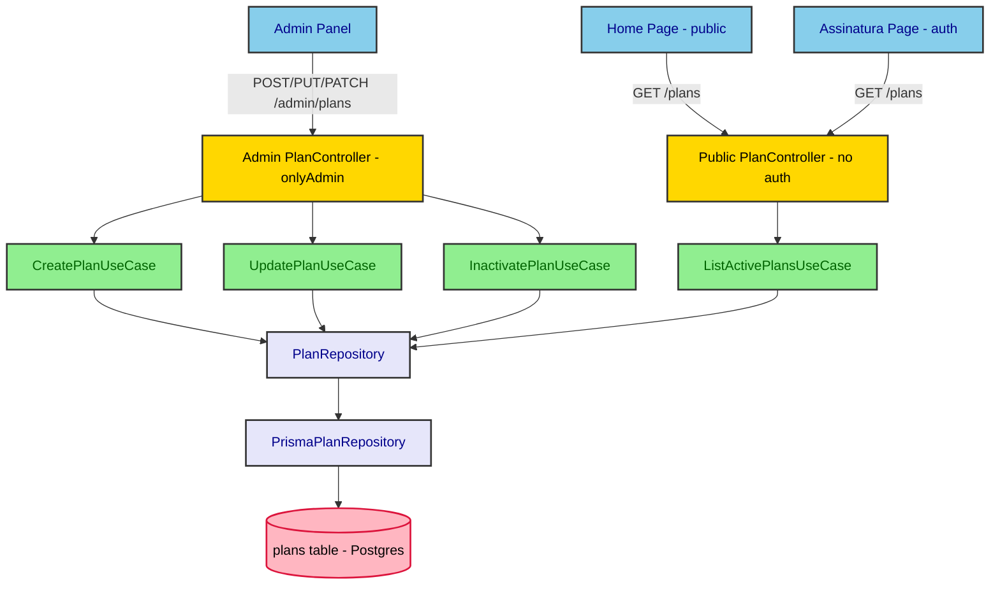

# Design Spec — Cadastro de Planos de Assinatura (Admin)

## Visão Geral

Hoje os planos exibidos na tela de assinaturas (`/assinatura`) e na home pública vêm de um array hardcoded (`DEMO_PLANS`), duplicado no backend (`apps/backend/src/subscription/domain/plans.ts`) e no frontend (`apps/frontend/src/features/subscriptions/schemas/index.ts`). Esta feature adiciona uma tabela `Plan` real no banco e uma rota HTTP administrativa protegida para que um admin cadastre, edite e inative planos — sem qualquer dependência do Stripe. A listagem pública (`GET /plans`, já existente desde a feature `home-planos-contato`) passa a ler dessa tabela em vez do array estático, mantendo o mesmo contrato de resposta.

O fluxo de checkout/criação real de assinatura (`create-subscription.usecase.ts`, que hoje chama o Stripe com um `priceId`) **não é alterado** por esta feature — ver "Fora do Escopo".

## Características Arquiteturais

**Priorizadas (top 3):**

| Característica | Por quê (preocupação de domínio) | Critério mensurável |
|---|---|---|
| Compatibilidade de contrato | `GET /plans` já é consumido pela home e por `/assinatura`; quebrar o shape de resposta quebra duas telas em produção | Resposta de `GET /plans` mantém exatamente `{ id, name, priceLabel, tagline, features[] }` |
| Integridade referencial | Planos podem estar referenciados por assinaturas já criadas; excluir um plano em uso pode derrubar consultas/telas que dependem dele | Nenhum endpoint permite hard delete de `Plan` — apenas inativação (`is_active`) |
| Manutenibilidade | Feature deve seguir exatamente os padrões já estabelecidos no repo (camadas, IoC, rotas admin) para não introduzir uma segunda convenção | 100% dos arquivos novos seguem o layout `domain/ → application/ → infra/` e o IoC de 3 passos já documentado em `apps/backend/AGENTS.md` |

**Consideradas, não priorizadas:** performance (volume de planos é da ordem de dezenas, não exige otimização), internacionalização (fora de escopo do produto atual).

## Arquitetura e Fluxo

Novo modelo `Plan` dentro do bounded context `subscription` já existente (não um bounded context novo), seguindo as mesmas camadas que o resto do backend. Duas superfícies HTTP distintas leem/escrevem o mesmo repositório: a rota pública (somente leitura, planos ativos) e a rota administrativa (CRUD completo, protegida).

Diagrama fonte: `specs/diagrams/plans-catalog-admin-design_01_flowchart_plans_crud_and_read.mmd`

**Migration:** a migration Prisma que cria a tabela `plans` já traz um seed populando os planos hoje hardcoded em `DEMO_PLANS` (nome, preço, tagline, features), preservando a continuidade da tela pública no primeiro deploy.

## Estrutura de Componentes

**Backend** (`apps/backend/src/subscription/`):
- `domain/plan.ts` — entidade `Plan` (substitui/convive com `plans.ts` atual, que é removido).
- `application/use-case/create-plan.usecase.ts`, `update-plan.usecase.ts`, `inactivate-plan.usecase.ts`, `list-plans.usecase.ts` (admin, todos os planos), `list-active-plans.usecase.ts` (público, só ativos).
- `application/repository/plan-repository.ts` — interface do repositório.
- `infra/repository/prisma-plan-repository.ts` + `infra/repository/in-memory-plan-repository.ts`.
- `infra/controller/admin/` — controllers de criação/edição/inativação/listagem, registrados com `{ isProtected: true, onlyAdmin: true }`.
- `infra/controller/list-plans.controller.ts` — mantém a rota pública `GET /plans`, agora lendo de `ListActivePlansUseCase`.
- IoC: novo identificador em `service-identifier/subscription-types.ts`, registro em `subscription-container.ts`, wiring em `bootstrap/setup-subscription-module.ts` (reaproveita o módulo existente).

**Frontend** (`apps/frontend/src/`):
- `app/(authenticated)/admin/planos/page.tsx` — lista em grid de cards (ver Especificação Visual).
- `features/plans-admin/components/plan-form-dialog.tsx` — formulário criar/editar (react-hook-form + zod), reaproveitando o padrão de outras telas admin.
- `features/plans-admin/schemas/plan-admin-schema.ts` — schema zod (nome, preço, periodicidade, tagline, features, status).
- `features/plans-admin/api/` — hooks TanStack Query (`usePlans`, `useCreatePlan`, `useUpdatePlan`, `useInactivatePlan`).
- Remoção de `DEMO_PLANS` de `features/subscriptions/schemas/index.ts`; `/assinatura` e a home passam a depender só de `GET /plans`.

## Especificação Visual

**Artefato curado:** `mockups/plans-catalog-admin-visual.md`

**Fonte de design original:** nenhuma — tokens do tema do projeto + padrões já existentes.

**Decisões visuais:** grid de cards por plano (nome, preço, tagline, features, badge de status, ações editar/inativar), com um card tracejado "Adicionar novo plano" ao final da grid. Validado pelo usuário via preview visual em 2026-09-22 (alternativa de tabela/lista foi oferecida e recusada).

**Fidelidade:** o mockup é um norte de layout/hierarquia; a implementação reaproveita os componentes shadcn/ui já usados nas demais telas admin (`PageContainer`, `PageHeader`, `StatusBadge`, `Dialog`) em vez de recriar CSS ad hoc.

## Endpoints

| Método | Rota | Auth | Descrição |
|---|---|---|---|
| GET | `/plans` | pública | Lista planos ativos. Contrato de resposta preservado: `{ id, name, priceLabel, tagline, features[] }[]` |
| GET | `/admin/plans` | `onlyAdmin` | Lista todos os planos (ativos e inativos) |
| POST | `/admin/plans` | `onlyAdmin` | Cria plano |
| PUT | `/admin/plans/:id` | `onlyAdmin` | Edita plano |
| PATCH | `/admin/plans/:id/inactivate` | `onlyAdmin` | Inativa plano (soft delete) |
| PATCH | `/admin/plans/:id/reactivate` | `onlyAdmin` | Reativa plano |

## Decisões Arquiteturais

### D1. Plan dentro do bounded context `subscription` existente, não um novo bounded context

- **Contexto:** Plan é conceitualmente parte do domínio de assinaturas (é o catálogo do qual uma `Subscription` deriva).
- **Decisão:** nova entidade dentro de `subscription/`, reaproveitando IoC/testes/convenções já montados.
- **Justificativa técnica:** menos boilerplate de wiring; camadas já existem e são testadas.
- **Justificativa de negócio:** menor esforço de implementação sem perda de clareza de domínio.
- **Trade-offs aceitos:** o módulo `subscription` cresce em responsabilidade (ciclo de vida de assinatura + catálogo de planos); se um dia o catálogo precisar de regras de negócio muito distintas (ex. precificação dinâmica, multi-moeda), vale reavaliar a extração para um bounded context próprio.

### D2. Preço estruturado (`price_cents` + `billing_period`) em vez de string livre

- **Contexto:** o `DemoPlan` atual guarda `priceLabel` como texto pronto ("R$ 49,90/mês"), sem estrutura.
- **Decisão:** `Plan.price_cents: int` + `Plan.billing_period: enum(MONTHLY, YEARLY)`; `priceLabel` é computado na serialização para preservar o contrato de `GET /plans`.
- **Justificativa técnica:** permite validação (preço não-negativo), ordenação e formatação consistente; abre caminho para integração futura com Stripe Products API sem mudar o contrato de resposta (decisão já registrada na feature `home-planos-contato`).
- **Justificativa de negócio:** evita erros de digitação/formatação inconsistente no texto livre atual.
- **Trade-offs aceitos:** um pouco mais de código de formatação (`price_cents` → `priceLabel`) na camada de apresentação da resposta pública.

### D3. Rotas separadas `/plans` (público) e `/admin/plans` (admin), em vez de uma rota única com verbos diferenciados

- **Contexto:** o GET público precisa continuar simples e não deve expor planos inativos.
- **Decisão:** dois grupos de rotas/controllers, cada um com seu próprio use case (`ListActivePlansUseCase` vs `ListPlansUseCase`).
- **Justificativa técnica:** segue o mesmo padrão de separação admin já usado por outras entidades do repo (academias, usuários); evita misturar autorização condicional dentro do mesmo handler.
- **Justificativa de negócio:** reduz risco de vazar planos inativos/descontinuados na vitrine pública por um bug de filtro.
- **Trade-offs aceitos:** um controller e um use case a mais para manter (listagem duplicada em espírito, não em código — cada um filtra diferente).

### D4. Soft delete via `is_active`, nunca hard delete

- **Contexto:** planos podem já estar referenciados por assinaturas existentes (mesmo sem integração Stripe nesta feature, o modelo de dados de `Subscription` pode apontar para um plano).
- **Decisão:** `PATCH /admin/plans/:id/inactivate` marca `is_active = false`; não existe rota de exclusão física.
- **Justificativa técnica:** evita erros de integridade referencial e quebra de históricos.
- **Justificativa de negócio:** preserva auditabilidade — um plano descontinuado continua rastreável.
- **Trade-offs aceitos:** a tabela cresce indefinidamente com planos inativos; aceitável dado o volume baixo esperado (dezenas de linhas).

## Riscos

| Risco | Impacto (1-3) | Probabilidade (1-3) | Score | Mitigação |
|---|---|---|---|---|
| Quebra do contrato de `GET /plans` ao migrar de array estático para leitura via DB | 3 | 1 | 3 🟡 | Teste de integração (`business-flow-test`) comparando o shape de resposta antes/depois; seed garante os mesmos planos no primeiro deploy |
| Seed da migration não rodar em algum ambiente (dev/CI) e `/assinatura`/home ficarem vazios | 2 | 2 | 4 🟡 | Seed idempotente na própria migration Prisma (não em script separado que possa ser esquecido) |
| Confusão futura sobre por que `Plan.stripe_price_id` existe mas não é usado | 1 | 2 | 2 🟢 | Comentário no schema Prisma e nota explícita em "Fora do Escopo" abaixo |

## Fora do Escopo

- **Fluxo de checkout/criação real de assinatura** (`create-subscription.usecase.ts`, `SubscriptionGateway`, `StripeSubscriptionGateway`, webhooks) — continua chamando o Stripe como hoje, sem qualquer alteração. `Plan.stripe_price_id` é um campo opcional preservado para uma integração futura, não conectado nesta feature.
- **Integração com Stripe Products API** para sincronizar planos — explicitamente adiada (mesma decisão já registrada na feature `home-planos-contato`).
- **Ações em massa** (inativar/editar vários planos de uma vez) — fora do escopo, cada ação é individual.
- **Filtros combinados** na listagem administrativa além de busca por nome/status — fora do escopo desta primeira versão.
- **Recuperação do trabalho órfão** encontrado no reflog (commits `0a92f8f7`...`9c85df21`, branch `feat/dashboard-assinaturas-admin` resetada) — descartado por decisão explícita do usuário; esta feature é implementada do zero.

## Testes

- **Unitários** (`pnpm --filter backend test:run`): entidade `Plan` (validação de `price_cents` não-negativo), use cases (create/update/inactivate/list/list-active) com `InMemoryPlanRepository`.
- **Integração HTTP** (`pnpm --filter backend test:business-flow`): `GET /plans` (contrato preservado, só ativos), `/admin/plans` CRUD completo incluindo autorização (`onlyAdmin` rejeita não-admin), inativação não remove o registro.
- **Fitness functions** (`pnpm --filter backend test:fitness` + `fit:validate-dependencies`): nova entidade respeita as regras de dependência entre camadas já validadas no repo.
- **Frontend** (`pnpm --filter frontend test -- --run`): página `/admin/planos` (list, empty state, criação, edição, inativação via MSW), reaproveitando o padrão de teste já usado em `academias`/`usuarios`.
