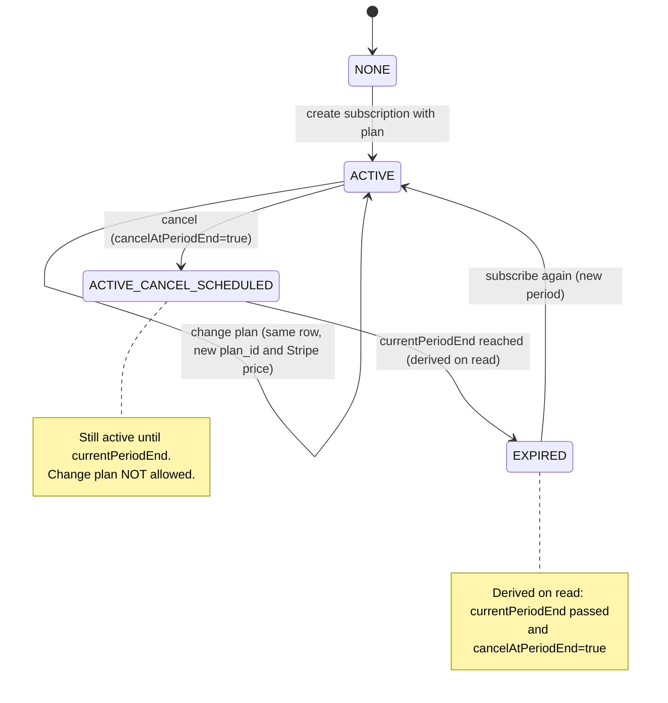

# Vínculo Plano-Assinatura-Usuário: Design

## Visão Geral

Hoje o plano escolhido em `/assinatura` vive só em `useState` (`apps/frontend/src/app/(authenticated)/assinatura/page.tsx`) e cai em `plans[0]` ao voltar à tela. No backend, `Subscription` (`user_id`, `billing_subscription_id`, `customer_id`, `status`, `canceled_at`) não referencia `Plan`; o único elo é o `priceId` enviado ao Stripe em `POST /subscriptions`.

Esta feature persiste o vínculo usuário -> assinatura -> plano e entrega o ciclo de vida: consultar a assinatura atual, trocar de plano e cancelar ao fim do período. A tela `/assinatura` passa a exibir o plano vigente.

**Escopo:** backend (bounded context `subscription`), migration Prisma, OpenAPI/`@repo/api-types`, frontend `/assinatura`.

**Fora de escopo:** gateway de pagamento real além do fluxo atual (Stripe/`DEMO_PAYMENT_METHOD_ID` permanece), webhooks de sincronização, múltiplas assinaturas simultâneas, cobrança proporcional (proration), métricas financeiras (MRR/LTV, já fora de escopo em `admin-analytics`), alterações no CRUD admin de planos.

**Contexto herdado (`plans-catalog-admin`):** `Plan` pertence ao contexto `subscription` (D1); `Plan` nunca é deletado, só inativado (`is_active`); `GET /plans` mantém o shape `{ id, name, priceId, priceLabel, tagline, features[] }`. Aquela feature deixou `create-subscription.usecase.ts`, `SubscriptionGateway` e `StripeSubscriptionGateway` intocados de propósito; esta feature os altera.

## Características Arquiteturais

**Priorizadas (top 3):**

| Característica | Por quê | Critério mensurável |
|---|---|---|
| Consistência | Duas assinaturas ativas ou plano divergente geram cobrança errada | Índice único parcial impede 2 assinaturas ativas por usuário; teste de concorrência de criação |
| Modificabilidade | O contexto `subscription` já tem AGENTS.md com regras de camadas | `test:fitness` e `fit:validate-dependencies` passam sem exceção |
| Testabilidade | Regras de ciclo de vida são lógica de domínio pura | Transições cobertas por testes unitários do agregado, sem infra |

**Consideradas, não priorizadas:** performance (leitura por `user_id`, volume baixo), disponibilidade do webhook (fora de escopo).

## Modelo de Domínio

`Subscription` (agregado existente) ganha:

| Campo | Tipo | Significado |
|---|---|---|
| `planId` | string (FK `Plan.id`) | Plano vigente. Nullable no banco (linhas legadas); obrigatório para novas assinaturas |
| `currentPeriodStart` | instante UTC | Início do período pago vigente |
| `currentPeriodEnd` | instante UTC | Fim do período pago vigente |
| `cancelAtPeriodEnd` | boolean | `true` = cancelamento agendado para `currentPeriodEnd` |

Regras:
- No máximo uma assinatura ativa por usuário (guarda no use case + índice único parcial em `user_id` onde a assinatura está ativa).
- `currentPeriodEnd` = `currentPeriodStart` + 1 mês (`Plan.billing_period = MONTHLY`) ou + 1 ano (`YEARLY`), calculado localmente (decisão "só escrita local").
- Estado "expirada" é derivado na leitura (ver diagrama). Como o status no banco continua ativo, o `CreateSubscriptionUseCase` fecha a linha expirada (status cancelada, `canceled_at` = `currentPeriodEnd`) na mesma transação antes de criar a nova; sem isso o índice único parcial bloquearia reassinar. A guarda "já possui assinatura ativa" (409) considera apenas linhas não expiradas.
- Uma `Subscription` pode apontar para plano inativo (herdado de D4); a leitura retorna o plano mesmo inativo.

### Ciclo de vida

Fonte: `diagrams/subscription-lifecycle.mmd`.

## Componentes (por responsabilidade)

**Backend, contexto `subscription`** (um controller por rota, `DomainError` para falhas de domínio, gateway lança direto sem Either, conforme `apps/backend/src/subscription/AGENTS.md`):

| Componente | Responsabilidade |
|---|---|
| `Subscription` (domínio) | Guarda os novos campos e as transições `changePlan`, `scheduleCancellation`, `isExpired(now)` |
| `CreateSubscriptionUseCase` (alterado) | Resolve `Plan` por `priceId`, cria no gateway, grava `planId` e período. Rejeita se já existe assinatura ativa |
| `GetMySubscriptionUseCase` + `GET /subscriptions/me` | Devolve assinatura vigente do usuário autenticado com plano embutido, ou `null` |
| `ChangeSubscriptionPlanUseCase` + `PATCH /subscriptions/me/plan` | Atualiza `planId` e o price no gateway na mesma assinatura. Rejeita se não há assinatura ativa ou se `cancelAtPeriodEnd = true` |
| `CancelSubscriptionUseCase` + `POST /subscriptions/me/cancel` | Marca `cancelAtPeriodEnd = true`. Idempotente se já agendado |
| Erros novos (`DomainError`) | `ActiveSubscriptionAlreadyExistsError`, `NoActiveSubscriptionError`, `SubscriptionCancellationScheduledError` |
| Migration Prisma | Colunas novas em `Subscription`, índice único parcial, sem backfill obrigatório |

**Frontend `apps/frontend/src/features/subscriptions/`:**

| Componente | Responsabilidade |
|---|---|
| `api/use-my-subscription.ts` | `useMySubscription()` sobre `GET /subscriptions/me` |
| `api/use-change-plan.ts`, `api/use-cancel-subscription.ts` | Mutations; invalidam a query da assinatura |
| Página `/assinatura` (alterada) | Pré-seleciona e marca "Plano atual"; botão vira "Trocar plano" quando há assinatura; ação "Cancelar"; sem assinatura mantém o comportamento atual |

Contrato: endpoints registrados via `zod-openapi`; `pnpm generate:types` atualiza `@repo/api-types`. `GET /plans` não muda.

## Decisões Arquiteturais

### D1. `plan_id` em `Subscription`

- **Contexto:** o plano escolhido precisa persistir por usuário. Alternativas: `User.plan_id`, derivar do `stripe_price_id`.
- **Decisão:** coluna `plan_id` na `Subscription`.
- **Justificativa técnica:** a assinatura já é o agregado do ciclo de vida; o vínculo fica onde o estado muda e não cria acoplamento `user` -> `subscription`.
- **Justificativa de negócio:** uma fonte de verdade evita cobrança divergente do plano exibido.
- **Trade-offs aceitos:** migration nullable (linhas legadas sem plano) e alteração do `CreateSubscriptionUseCase`, que a feature anterior deixou intocado.

### D2. Ciclo de vida com escrita local, sem webhooks

- **Contexto:** status e datas poderiam vir de webhooks Stripe ou de escrita local.
- **Decisão:** o backend grava status e período nas próprias ações; período calculado de `Plan.billing_period`.
- **Justificativa técnica:** o fluxo atual é demo e não depende de eventos do gateway.
- **Justificativa de negócio:** entrega rápida do comportamento visível ao usuário.
- **Trade-offs aceitos:** o estado local pode divergir do Stripe (falha de pagamento, cancelamento fora do app). Ver Riscos.

### D3. Troca atualiza a mesma assinatura

- **Decisão:** `changePlan` altera `planId` e o price no Stripe na mesma linha.
- **Justificativa técnica:** mantém uma assinatura ativa por usuário e evita o passo duplo cancelar+criar, que pode falhar pela metade.
- **Trade-offs aceitos:** sem histórico de planos por linha; histórico fica para outra feature.

### D4. Cancelamento ao fim do período

- **Decisão:** `cancelAtPeriodEnd = true`; o status permanece ativo até `currentPeriodEnd`.
- **Justificativa de negócio:** o usuário mantém o que já pagou.
- **Trade-offs aceitos:** exige o estado derivado "expirada" na leitura, pois ninguém a expira sem webhook.

## Fronteiras e Significados

- `currentPeriodStart`, `currentPeriodEnd`: instantes UTC (ISO 8601 na API); o frontend formata no fuso do navegador como data (dia).
- Preço: `price_cents` inteiro + `billing_period`, herdado de `plans-catalog-admin` D2; nenhum valor monetário novo é criado aqui.
- Troca de plano: estado alvo é sempre "ativa com novo `planId`" (não é toggle). Tela desatualizada que tente trocar após cancelamento agendado recebe erro `SubscriptionCancellationScheduledError` (HTTP 409) e o frontend recarrega a assinatura.
- Cancelar duas vezes: idempotente, retorna a assinatura com `cancelAtPeriodEnd = true`.
- Falhas visíveis ao usuário: sem assinatura ativa (404, mensagem "Você não possui assinatura ativa"); plano inexistente para o `priceId` (404 `PlanNotFoundError`, existente); já possui assinatura ativa (409).
- `GET /subscriptions/me` sem assinatura: 200 com `null` (estado normal da tela, não erro).

## Testes

- Unitários do agregado: cada transição do diagrama, incluindo as proibidas (trocar com cancelamento agendado) e `isExpired` na borda exata de `currentPeriodEnd`.
- Unitários dos use cases com repositório e gateway em memória/fake.
- Integração Prisma (`test:e2e:prisma`): índice único parcial rejeita segunda ativa; migration em linha legada com `plan_id` nulo.
- HTTP (`test:business-flow`): criar, consultar `me`, trocar, cancelar, cancelar de novo, trocar após cancelar (409).
- Fitness: `test:fitness` e `fit:validate-dependencies` sem regressão.
- Frontend (Vitest + MSW): `/assinatura` pré-seleciona plano vigente; sem assinatura mantém o padrão; ações invalidam a query.

## Riscos

| Risco | Mitigação |
|---|---|
| Estado local diverge do Stripe (D2) | Aceito e documentado; webhooks ficam como feature futura |
| Linhas legadas com `plan_id` nulo | `GET me` devolve `plan: null` para elas; o frontend mostra "plano não identificado" e oferece cancelar. `ChangeSubscriptionPlan` aceita `plan_id` nulo (grava o novo plano), então o usuário legado consegue regularizar sem intervenção manual |
| Índice único parcial mal definido bloqueia assinaturas válidas | Teste de integração Prisma cobre ativa+expirada do mesmo usuário |
| Alterar `CreateSubscriptionUseCase` quebra testes existentes | Rodar suíte completa do contexto; ajustar fakes do gateway |
