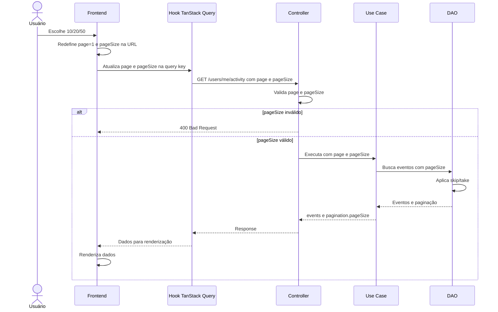

# Design: tamanho variável na paginação de atividades do perfil

## Visão Geral

Adicionar à tela de atividades do perfil um seletor de itens por página com as
opções `10`, `20` e `50`. A escolha será representada na URL, fará a consulta
voltar para `page=1` e será enviada ao endpoint `GET /users/me/activity`.

O endpoint administrativo `GET /users/:userId/activity` permanece com 20 itens
por página e fora do escopo funcional. A persistência não precisa de alteração:
os DAOs Prisma e in-memory já recebem `pageSize`.

## Características Arquiteturais

**Priorizadas (top 3):**

| Característica | Por quê | Critério mensurável |
|---|---|---|
| Simplicidade | A mudança deve atender ao perfil sem ampliar o comportamento administrativo | Apenas `/users/me/activity` aceita `pageSize`; o endpoint admin continua retornando 20 |
| Correção/consistência | URL, cache, request e metadados precisam representar a mesma página | Trocar o seletor gera `page=1`, uma query com a combinação correta e `pagination.pageSize` igual à opção escolhida |
| Performance | Tamanhos grandes aumentam o custo de leitura e renderização | O backend aceita somente 10, 20 ou 50; a consulta continua usando paginação `skip/take` |

**Consideradas, não priorizadas:** cursor pagination, filtros, exportação,
retenção/expurgo e persistência da preferência do usuário.

## Estrutura de Componentes

### Frontend

- **Estado de busca da atividade:** interpreta `page` e `pageSize` dos
  `searchParams`, aplica os defaults e preserva os demais parâmetros da rota.
- **Hook de atividade:** envia `page` e `pageSize` somente para a consulta do
  próprio usuário e inclui ambos na `queryKey`.
- **Seletor de itens por página:** controle visual ao lado do resumo/pager, com
  opções 10/20/50; ao mudar, atualiza `pageSize` e define `page=1`.
- **Paginação de atividade:** mantém a navegação existente e usa os metadados
  recebidos pela API.

### Backend

- **Schema do endpoint próprio:** valida `page` e `pageSize` na query. `pageSize`
  aceita apenas 10, 20 ou 50; ausente significa 20.
- **Caso de uso de atividade:** recebe o tamanho já validado e o encaminha ao
  DAO. O caminho administrativo continua chamando o caso de uso com 20.
- **DAO de atividade:** permanece sem mudança funcional; aplica o `pageSize`
  recebido usando a implementação Prisma ou in-memory existente.
- **Contrato OpenAPI/api-types:** documenta `pageSize` somente em
  `/users/me/activity`; os tipos são regenerados pelo fluxo oficial.

## Fluxo de Dados

Diagrama fonte: `diagrams/user-activity-pagination-capability-design_01_sequence_request_flow.mmd`.

## Especificação Visual

**Artefato curado:** `mockups/pagination-size-options.md`

**Fonte de design original:** nenhuma; layout definido a partir do preview
visual do companion e dos tokens existentes do projeto.

**Decisões visuais:**

- O seletor “Itens por página” fica na barra de paginação, sem criar uma nova
  área ou modal.
- As opções são apresentadas como controle compacto com `10`, `20` e `50`.
- O resumo permanece próximo da navegação e reflete a resposta atual.
- A hierarquia e os tokens existentes da tela de atividade são preservados.

**Fidelidade:** o mockup é um norte para a implementação, não uma exigência
pixel-perfect.

## Contrato e Comportamento

### Endpoint do perfil

`GET /users/me/activity?page=<page>&pageSize=<pageSize>`

- `page`: inteiro maior ou igual a 1, comportamento atual.
- `pageSize`: opcional; valores aceitos `10`, `20` e `50`.
- ausência de `pageSize`: usa `20` para manter compatibilidade com links e
  clientes existentes.
- valor inválido: resposta `400 Bad Request`.
- resposta: mantém `events` e `pagination`; `pagination.pageSize` informa o
  tamanho efetivamente usado.

### Endpoint administrativo

`GET /users/:userId/activity` permanece aceitando apenas `page` e usando 20.
O hook compartilhado deve manter esse comportamento quando usado pela área
administrativa.

### URL da tela

- A tela passa a aceitar `pageSize` nos `searchParams`.
- Ausente ou inválido no navegador: o estado efetivo é 20 e a URL pode ser
  canonicalizada para o valor válido.
- Trocar o seletor sempre define `page=1`.
- Navegar entre páginas preserva o `pageSize` atual.
- Outros parâmetros existentes da rota são preservados.

## Decisões Arquiteturais

### D1. Parametrizar somente o endpoint do próprio usuário

- **Contexto:** o hook de atividade é compartilhado, mas o pedido é para
  `/perfil`; o histórico explicitamente manteve o endpoint administrativo fora
  do escopo.
- **Decisão:** adicionar `pageSize` somente a `GET /users/me/activity`.
- **Justificativa técnica:** limita a mudança ao contrato necessário e permite
  reutilizar o DAO já genérico sem alterar o fluxo administrativo.
- **Justificativa de negócio:** menor risco e menor custo para entregar a opção
  solicitada na tela do usuário.
- **Trade-offs aceitos:** os dois endpoints ficam assimétricos; uma futura
  necessidade do admin exigirá uma decisão e mudança separadas.

### D2. Usar lista fechada de tamanhos

- **Contexto:** o cliente precisa de escolha, mas valores arbitrários podem
  gerar consultas e renderizações excessivas.
- **Decisão:** aceitar somente `10`, `20` e `50`.
- **Justificativa técnica:** validação simples, contrato previsível e limite
  operacional explícito.
- **Justificativa de negócio:** oferece redução e aumento úteis sem transformar
  a tela em uma configuração avançada.
- **Trade-offs aceitos:** usuários não podem informar outros tamanhos sem uma
  alteração futura de contrato.

### D3. Resetar a página ao trocar o tamanho

- **Contexto:** manter o número da página pode apontar para uma posição
  inesperada ou para uma página inexistente após a mudança.
- **Decisão:** toda troca de `pageSize` define `page=1`.
- **Justificativa técnica:** comportamento determinístico e simples de testar.
- **Justificativa de negócio:** o usuário vê imediatamente o início da nova
  paginação, sem saltos ou lista vazia inesperada.
- **Trade-offs aceitos:** a posição aproximada no histórico não é preservada.

## Tratamento de Erros

- O backend rejeita `pageSize` fora da lista permitida com `400`, seguindo o
  padrão de validação dos controllers.
- O frontend restringe o seletor às opções válidas e canonicaliza valores
  ausentes ou inválidos para 20 ao interpretar a URL.
- Erros de rede continuam seguindo o tratamento existente do cliente e do
  hook; não haverá fallback silencioso para uma resposta de sucesso.

## Riscos

| Risco | Impacto (1-3) | Probabilidade (1-3) | Score | Mitigação |
|---|---:|---:|---:|---|
| Cache misturar respostas de tamanhos diferentes | 3 | 2 | 6 | Incluir `pageSize` na `queryKey` e cobrir com teste |
| Contrato OpenAPI e tipos gerados ficarem desatualizados | 3 | 2 | 6 | Atualizar schema do endpoint e executar `pnpm generate:types` |
| Comportamento admin mudar acidentalmente por hook compartilhado | 3 | 2 | 6 | Manter `pageSize` ausente no admin e cobrir seus testes existentes |
| URL inválida produzir estado divergente da API | 2 | 2 | 4 | Centralizar parser/canonicalização e testar valores ausentes, válidos e inválidos |

## Testes

### Backend

Runner: Vitest, conforme os scripts do workspace backend.

- Caso de uso: default 20, e uso correto de 10/20/50.
- Controller `/users/me/activity`: aceita cada opção, rejeita valores inválidos
  e mantém `page` existente.
- Business flow: resposta informa `pagination.pageSize` igual ao parâmetro.
- Endpoint administrativo: continua usando 20 e não aceita o novo parâmetro como
  parte deste escopo.
- DAO: reutilizar a cobertura existente de `pageSize`; não criar nova lógica de
  persistência.

### Frontend

Runner: Vitest, conforme os scripts do workspace frontend.

- Parser de URL: default 20, opções válidas e fallback/canonicalização.
- Hook: request inclui `pageSize` no perfil e a `queryKey` separa combinações de
  `page`/`pageSize`.
- Componente de seletor: altera o tamanho e redefine `page=1`.
- Paginação: preserva `pageSize` ao navegar entre páginas.
- Admin: consumo existente permanece sem `pageSize`.

## Fora de Escopo

- Alterar o endpoint administrativo para aceitar tamanhos variáveis.
- Cursor pagination, filtros, exportação, retenção/expurgo ou migração dos
  eventos.
- Persistir a preferência de tamanho no perfil do usuário.
- Alterar o modelo de dados ou a estratégia de consulta dos DAOs.
