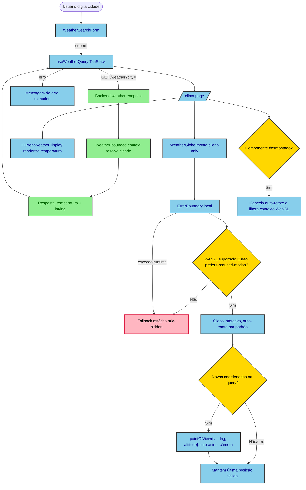

# Design — Globo 3D na rota `/clima`

## Visão Geral

Adicionar à rota pública `/clima` (Next.js App Router) um globo 3D decorativo que gira
automaticamente e anima até a localização da cidade consultada pelo usuário. O objetivo é
tornar a consulta de clima mais visual, sem alterar o comportamento funcional já existente
(busca por cidade, exibição de temperatura atual/mínima/máxima).

A página `/clima` já existe (bounded context `weather`, feature de planejamento
`weather-service`), assim como o endpoint
`GET /weather?city=`. Este design estende ambos de forma aditiva: o backend passa a expor
`latitude`/`longitude` na resposta, e o frontend ganha um novo componente `WeatherGlobe`.

## Características Arquiteturais

**Priorizadas (top 3):**

| Característica | Por quê (preocupação de domínio) | Critério mensurável |
|---|---|---|
| Performance (bundle) | `react-globe.gl` pesa ~340KB gzip; não pode inflar o bundle inicial de uma rota pública simples | Chunk do `WeatherGlobe` carregado via `next/dynamic({ ssr:false })` fica fora do bundle inicial da rota (verificável no output do `next build`). Como a decisão de D1 ("Fechamento adicional — textura do globo") elimina qualquer asset de textura, o peso total da rota é integralmente o peso do chunk JS — não há imagem/textura adicional a medir nem requisição de rede extra em runtime |
| Compatibilidade / acessibilidade | WebGL e `prefers-reduced-motion` não são garantidos em todo navegador/usuário | Fallback estático é renderizado sempre que `WebGL` está indisponível OU `prefers-reduced-motion: reduce` está ativo, coberto por teste unitário mockando as duas condições |
| Testabilidade | WebGL não roda em jsdom/CI headless | Testes unitários verificam a chamada de `pointOfView({ lat, lng, altitude }, ms)` via mock de `ref`, sem depender de render WebGL real |

**Consideradas, não priorizadas:** scalability (rota pública de baixo tráfego, sem mudança de perfil de acesso), availability (globo é decorativo — sua falha não pode derrubar a página, ver D5/Riscos).

## Especificação Visual

**Artefato curado:** `mockups/weather-globe-clima-visual.md`

**Fonte de design original:** nenhuma; layout definido apenas via mockup do companion.

**Decisões visuais (norte, não pixel-final):**
- Globo como hero, sempre visível, acima da busca (coluna centralizada ~448px mantida).
- Auto-rotação por padrão; anima até a cidade buscada quando o resultado chega.
- Marcador simples na cor primária do tema (`#39e58c`) indicando a localização.
- Superfície do globo sem textura fotográfica (sem mapa-múndi): material sólido escuro
  combinando com o gradiente radial do mockup (ver D1, "Fechamento adicional — textura do
  globo").

**Fidelidade:** o mockup é um *norte* — a renderização real usa `react-globe.gl` (WebGL),
não o círculo estático do mockup.

## Decisões Arquiteturais

### D1. `react-globe.gl` como biblioteca do globo (em vez de `cobe`)

- **Contexto:** duas bibliotecas leves cobrem o caso de uso — `cobe` (~5KB, sem binding
  React, animação de câmera manual) e `react-globe.gl` (~340KB gzip, wrapper React sobre
  Three.js, `pointOfView({ lat, lng, altitude }, ms)` pronto).
- **Decisão:** `react-globe.gl`.
- **Justificativa técnica:** API de animação de câmera já pronta (`pointOfView({ lat, lng,
  altitude }, ms)`), reduz código customizado de easing; superfície de extensão maior
  (marcadores, arcos, atmosfera) caso a feature evolua.
- **Justificativa de negócio:** decisão explícita do usuário, priorizando espaço para
  evoluir o recurso no futuro sobre o menor bundle possível agora.
- **Trade-offs aceitos:** ~335KB a mais de bundle (mitigado por code-splitting client-only,
  ver D4); tensiona o precedente do `volt-redesign` de evitar novas dependências de
  visualização — aceito conscientemente e escopado só a esta página.
- **Fechamento adicional — textura do globo:** o globo **não** usa `globeImageUrl` nem
  qualquer textura fotográfica (mapa-múndi). A superfície é definida via `globeMaterial`
  com um material Three.js sólido (`MeshPhongMaterial` na cor escura do mockup, `#061410`),
  e o entorno recebe o gradiente radial do mockup (`#123a2c` → `#061410` → `#020403`) via
  `backgroundColor`/estilo do container. Justificativa: (a) evita depender de um CDN externo
  em runtime numa rota pública; (b) elimina o modo de falha silencioso de `waitForGlobeReady`
  (default `true` no `globe.gl`), em que uma URL de textura que não carrega trava o render do
  globo indefinidamente; (c) mantém o peso da rota fechado no chunk JS, sem asset de imagem
  fora do critério de performance medido. Trade-off aceito: o globo não mostra continentes —
  aceitável porque o elemento é decorativo e o marcador da cidade é a única informação
  espacial relevante.

### D2. Layout — globo hero sempre visível no topo

- **Contexto:** duas opções de layout comparadas via mockup visual: globo grande e sempre
  visível no topo da página vs. globo pequeno, só aparecendo dentro do card de resultado
  após uma busca.
- **Decisão:** globo hero, sempre visível no topo (Opção A do mockup).
- **Justificativa técnica:** simplifica o componente — não há estado "antes/depois da
  busca" na montagem do globo, só na câmera.
- **Justificativa de negócio:** maior impacto visual imediato, aprovado pelo usuário.
- **Trade-offs aceitos:** o globo ocupa espaço vertical mesmo antes de qualquer busca.
- **Fechamento adicional:** uma nova busca disparada antes da animação da busca anterior
  terminar substitui o alvo da câmera pela coordenada mais recente (a chamada mais nova de
  `pointOfView` sempre prevalece); não há fila de animações pendentes.
  Estado pré-busca (FR-012): enquanto não houver `latitude`/`longitude` (nenhuma busca feita
  ainda), o array de marcadores do globo é vazio (`pointsData: []`) e **nenhuma** chamada
  inicial de `pointOfView` é feita — a câmera permanece na posição/altitude default do
  `react-globe.gl`, girando. O marcador só aparece junto da primeira animação de câmera bem
  sucedida.

### D3. Contrato HTTP estendido de forma aditiva

- **Contexto:** `GET /weather?city=` hoje retorna `{ city, temperature }`; o geocoding
  interno já resolve coordenadas, apenas não as expõe.
- **Decisão:** adicionar `latitude` e `longitude` à resposta existente, sem novo endpoint,
  como campos soltos no nível raiz (não aninhados no VO `Coordinate`):
  `{ city, temperature: {...}, latitude: number, longitude: number }`.
- **Justificativa técnica:** menor superfície de mudança; nenhum consumidor existente
  quebra (campos novos, não removidos/renomeados); forma plana evita acoplar o contrato
  HTTP à representação interna do VO `Coordinate`.
- **Atenção de implementação:** o Fastify serializa a resposta estritamente conforme o
  `weatherResponseSchema` do `WeatherController` (`fast-json-stringify`, sem
  `setSerializerCompiler` customizado) — um campo ausente desse schema é descartado
  silenciosamente na serialização, mesmo presente no objeto de domínio. A mudança precisa
  tocar **tanto** o VO de domínio (`CurrentWeather`) **quanto** o `weatherResponseSchema`,
  sob pena de `latitude`/`longitude` desaparecerem na resposta HTTP real sem erro visível.
- **Justificativa de negócio:** reaproveita geocoding já pago (custo zero adicional de
  chamada externa).
- **Trade-offs aceitos:** nenhum — extensão puramente aditiva.

### D4. Renderização client-only via `next/dynamic({ ssr: false })`

- **Contexto:** `react-globe.gl`/Three.js dependem de WebGL/`canvas`, indisponíveis em
  SSR.
- **Decisão:** `WeatherGlobe` é importado com `next/dynamic` e `ssr: false`.
- **Justificativa técnica:** requisito técnico da biblioteca; também isola o chunk pesado
  do bundle inicial da rota (suporta a característica de performance priorizada).
- **Justificativa de negócio:** evita erro de renderização no servidor / hidratação.
- **Trade-offs aceitos:** pequeno "pop-in" do globo após o carregamento do chunk
  (aceitável para um elemento decorativo).

### D5. Fallback estático para no-WebGL / `prefers-reduced-motion`

- **Contexto:** nem `cobe` nem `react-globe.gl` documentam fallback oficial para
  navegadores sem WebGL; usuários com preferência de movimento reduzido não devem receber
  uma animação contínua de rotação.
- **Decisão:** `WeatherGlobe` detecta as duas condições na montagem e renderiza uma
  alternativa estática (elemento decorativo simples, sem WebGL) quando qualquer uma se
  aplica.
- **Justificativa técnica:** evita crash/tela em branco em ambientes sem WebGL; respeita
  `prefers-reduced-motion` nativamente.
- **Justificativa de negócio:** acessibilidade e robustez — a página nunca fica quebrada
  por causa de um elemento decorativo.
- **Trade-offs aceitos:** parte dos usuários nunca vê o globo animado; aceito porque a
  informação de clima (o dado essencial) nunca depende do globo.
- **Fechamentos adicionais (escopo de robustez e acessibilidade):**
  - Uma exceção de runtime do Three.js/`react-globe.gl` (após a montagem bem-sucedida)
    também não pode derrubar a página: `WeatherGlobe` é envolvido por um `ErrorBoundary`
    local que renderiza o fallback estático em caso de erro, estendendo a garantia de D5
    de "montagem" para "runtime". O `dynamic(() => import(...))` do globo vive **dentro**
    do próprio `ErrorBoundary` (que por sua vez é importado estaticamente pela página):
    assim, uma falha no fetch do chunk também vira um erro de render capturado pelo
    boundary, em vez de subir para a página e derrubar a exibição do clima.
  - O `ErrorBoundary` cobre apenas erros lançados durante o ciclo de render do React, e não
    alcança o modo de falha dominante do WebGL: a perda de contexto GPU (aba em background
    por muito tempo, driver reiniciado, limite de contextos WebGL do navegador atingido), que
    acontece fora do render e apenas congela o canvas, sem exceção. Por isso o componente do
    globo interativo também escuta o evento nativo `webglcontextlost` no canvas
    (`renderer().domElement`) e, ao recebê-lo, troca para o mesmo fallback estático de D5 —
    sem depender de um erro de render.
  - No desmonte (unmount), `WeatherGlobe` cancela o loop de auto-rotação e libera o
    contexto WebGL (`globeEl.current.renderer()`), evitando vazamento de contexto WebGL
    ao navegar repetidamente para dentro e fora de `/clima`.
  - Por ser puramente decorativo (ver Fora de Escopo), `WeatherGlobe` e seu fallback
    recebem `aria-hidden="true"` e a interação por ponteiro é desabilitada. Duas coisas
    distintas são necessárias: `enablePointerInteraction={false}` desabilita **apenas** o
    rastreamento de ponteiro para hover/click/tooltip — ele não desliga arrastar/zoom. Para
    desabilitar arrastar/zoom/pan é preciso agir sobre a instância de controles, mas
    **não** via `controls().enabled = false`: o `three-render-objects` só chama
    `controls.update()` enquanto `controls.enabled` é `true`, e a auto-rotação do
    `OrbitControls` só é aplicada dentro de `update()` — desligar `enabled` mataria também
    o giro automático. A forma correta é manter `enabled = true` e desligar apenas os flags
    que gateiam os event handlers de mouse/touch:
    `enableZoom = false`, `enablePan = false`, `enableRotate = false`.
  - Como o loop de `update()` continua rodando, a auto-rotação também gira durante a
    transição de câmera do `pointOfView` e faria a cidade buscada passar direto pelo
    enquadramento. Por isso o efeito que reage a `latitude`/`longitude` pausa
    `controls.autoRotate` antes de chamar `pointOfView` e o reativa após
    `CAMERA_TRANSITION_MS`, via `setTimeout` limpo no cleanup do efeito (desmonte ou nova
    busca antes do fim da transição).
  - Quando a query de clima falha (busca subsequente sem sucesso), o globo mantém a
    última posição/rotação válida sem indicar erro — o estado de erro é comunicado só
    pela mensagem já existente da página, não pelo globo.

## Componentes e Fluxo de Dados

- **`WeatherGlobe`** (novo, `apps/frontend/src/features/weather/components/`) —
  responsabilidade única: renderizar um globo 3D decorativo que gira automaticamente e
  anima até a localização da última busca de clima, com fallback estático quando
  WebGL/`prefers-reduced-motion` não são suportados. Depende de `react-globe.gl` e de
  `latitude`/`longitude` vindos do resultado da query de clima; é consumido apenas pela
  página `/clima` (fan-in = 1). Enquanto o chunk client-only (`next/dynamic`) carrega, a
  página reserva um placeholder de altura fixa equivalente ao globo, evitando layout
  shift no card acima.
- **Extensão do fluxo de clima existente** (backend, `apps/backend/src/weather/`) — o caso
  de uso que já resolve geocoding + clima atual passa a incluir `latitude`/`longitude` na
  resposta; após a mudança, regenerar `@repo/api-types` (`pnpm generate:types`).

Diagrama fonte: `specs/diagrams/weather-globe-clima-design_01_flowchart_weatherglobe_data_fl.mmd`

## Riscos

| Risco | Impacto (1-3) | Probabilidade (1-3) | Score | Mitigação |
|---|---|---|---|---|
| Peso de bundle (~340KB) degrada performance da rota | 2 | 2 | 4 🟡 | `next/dynamic({ ssr:false })` isola o chunk do bundle inicial (D4), reforçado por um teste estrutural que falha se `react-globe.gl` for importado fora do `next/dynamic` |
| WebGL indisponível ou fraco em dispositivo do usuário | 2 | 2 | 4 🟡 | Fallback estático (D5); dado essencial (temperatura) nunca depende do globo |
| Inconsistência com precedente do `volt-redesign` (evitar novas deps de visualização) | 1 | 3 | 3 🟡 | Decisão explícita e documentada (D1), escopada só a esta página |
| Esquecer de regenerar `@repo/api-types` após estender o contrato | 2 | 2 | 4 🟡 | Task de plano inclui `pnpm generate:types` como passo explícito após a mudança de backend |

## Fora de Escopo

- Marcadores múltiplos, arcos, atmosfera ou qualquer recurso extra do `react-globe.gl`
  além do globo + animação de câmera.
- Globo interativo (arrastar/zoom manual) — só decorativo/auto-animado.
- Exibir histórico de cidades buscadas no globo.
- Mudar a lógica de desambiguação de cidade homônima (continua usando o primeiro
  resultado do geocoding — decisão já fechada em `weather-service`).

## Testes

- **Backend:** teste de integração HTTP (não só do caso de uso) garantindo que a resposta
  serializada de `GET /weather?city=` passa a incluir `latitude`/`longitude` corretos para
  uma cidade conhecida, sem quebrar o formato existente (`city`, `temperature`) — cobrindo
  também o `weatherResponseSchema` do controller, não só o VO de domínio (ver D3, "Atenção
  de implementação").
- **Frontend:**
  - A detecção de capacidade vive num hook nomeado (`useGlobeCapability`), testado
    diretamente: retorna `"fallback"` quando WebGL é reportado como indisponível (mock) OU
    `prefers-reduced-motion: reduce` está ativo (mock de `matchMedia`, incluindo mudança
    posterior via evento `change`). `WeatherGlobe` renderiza o fallback estático sempre que
    o hook retorna `"fallback"` — o hook é também o seam que permite exercitar o caminho
    interativo nos testes, já que o ambiente headless sempre reporta WebGL indisponível.
  - `WeatherGlobe` chama `pointOfView({ lat, lng, altitude }, ms)` com `latitude`/
    `longitude` corretos quando a query de clima retorna um resultado novo (mock do
    ref/instância do globo — sem WebGL real). Critério de "concluído" para este teste: a
    chamada mockada ocorreu com os valores de `lat`/`lng` esperados — duração e easing da
    transição são detalhe de implementação, não fazem parte do critério de aceite.
  - `/clima` continua renderizando `CurrentWeatherDisplay` normalmente com o globo
    presente (nenhuma regressão no fluxo de busca existente).
  - `WeatherGlobe` cancela o loop de auto-rotação e libera o contexto WebGL (`renderer`
    interno) no cleanup do `useEffect` ao desmontar.
  - `WeatherGlobe` envolvido por um `ErrorBoundary` local: uma exceção de runtime do
    Three.js/`react-globe.gl` renderiza o fallback estático de D5 em vez de derrubar a
    página; `CurrentWeatherDisplay` continua renderizando (mock de throw simulado).
  - `WeatherGlobe` troca para o fallback estático quando o canvas emite `webglcontextlost`
    (evento simulado no teste), sem depender do `ErrorBoundary`.
  - Nenhuma importação estática de `react-globe.gl` **nem** dos módulos do próprio
    `WeatherGlobe`/`WeatherGlobeErrorBoundary` fora do `next/dynamic({ ssr: false })`
    (fitness function/regra estrutural que impede regressão do isolamento de bundle de D4 —
    um import estático do componente arrasta o mesmo chunk para o bundle inicial, mesmo sem
    citar `react-globe.gl`).
