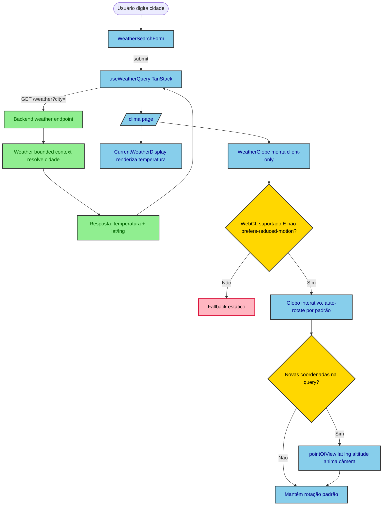

# Design — Globo 3D na rota `/clima`

## Visão Geral

Adicionar à rota pública `/clima` (Next.js App Router) um globo 3D decorativo que gira
automaticamente e anima até a localização da cidade consultada pelo usuário. O objetivo é
tornar a consulta de clima mais visual, sem alterar o comportamento funcional já existente
(busca por cidade, exibição de temperatura atual/mínima/máxima).

A página `/clima` já existe (feature `weather-service`), assim como o endpoint
`GET /weather?city=`. Este design estende ambos de forma aditiva: o backend passa a expor
`latitude`/`longitude` na resposta, e o frontend ganha um novo componente `WeatherGlobe`.

## Características Arquiteturais

**Priorizadas (top 3):**

| Característica | Por quê (preocupação de domínio) | Critério mensurável |
|---|---|---|
| Performance (bundle) | `react-globe.gl` pesa ~340KB gzip; não pode inflar o bundle inicial de uma rota pública simples | Chunk do `WeatherGlobe` carregado via `next/dynamic({ ssr:false })` fica fora do bundle inicial da rota (verificável no output do `next build`) |
| Compatibilidade / acessibilidade | WebGL e `prefers-reduced-motion` não são garantidos em todo navegador/usuário | Fallback estático é renderizado sempre que `WebGL` está indisponível OU `prefers-reduced-motion: reduce` está ativo, coberto por teste unitário mockando as duas condições |
| Testabilidade | WebGL não roda em jsdom/CI headless | Testes unitários verificam a chamada de `pointOfView(lat, lng, altitude)` via mock de `ref`, sem depender de render WebGL real |

**Consideradas, não priorizadas:** scalability (rota pública de baixo tráfego, sem mudança de perfil de acesso), availability (globo é decorativo — sua falha não pode derrubar a página, ver D5/Riscos).

## Especificação Visual

**Artefato curado:** `mockups/weather-globe-clima-visual.md`

**Fonte de design original:** nenhuma; layout definido apenas via mockup do companion.

**Decisões visuais (norte, não pixel-final):**
- Globo como hero, sempre visível, acima da busca (coluna centralizada ~448px mantida).
- Auto-rotação por padrão; anima até a cidade buscada quando o resultado chega.
- Marcador simples na cor primária do tema (`#39e58c`) indicando a localização.

**Fidelidade:** o mockup é um *norte* — a renderização real usa `react-globe.gl` (WebGL),
não o círculo estático do mockup.

## Decisões Arquiteturais

### D1. `react-globe.gl` como biblioteca do globo (em vez de `cobe`)

- **Contexto:** duas bibliotecas leves cobrem o caso de uso — `cobe` (~5KB, sem binding
  React, animação de câmera manual) e `react-globe.gl` (~340KB gzip, wrapper React sobre
  Three.js, `pointOfView(lat, lng, altitude, ms)` pronto).
- **Decisão:** `react-globe.gl`.
- **Justificativa técnica:** API de animação de câmera já pronta, reduz código customizado
  de easing; superfície de extensão maior (marcadores, arcos, atmosfera) caso a feature
  evolua.
- **Justificativa de negócio:** decisão explícita do usuário, priorizando espaço para
  evoluir o recurso no futuro sobre o menor bundle possível agora.
- **Trade-offs aceitos:** ~335KB a mais de bundle (mitigado por code-splitting client-only,
  ver D4); tensiona o precedente do `volt-redesign` de evitar novas dependências de
  visualização — aceito conscientemente e escopado só a esta página.

### D2. Layout — globo hero sempre visível no topo

- **Contexto:** duas opções de layout comparadas via mockup visual: globo grande e sempre
  visível no topo da página vs. globo pequeno, só aparecendo dentro do card de resultado
  após uma busca.
- **Decisão:** globo hero, sempre visível no topo (Opção A do mockup).
- **Justificativa técnica:** simplifica o componente — não há estado "antes/depois da
  busca" na montagem do globo, só na câmera.
- **Justificativa de negócio:** maior impacto visual imediato, aprovado pelo usuário.
- **Trade-offs aceitos:** o globo ocupa espaço vertical mesmo antes de qualquer busca.

### D3. Contrato HTTP estendido de forma aditiva

- **Contexto:** `GET /weather?city=` hoje retorna `{ city, temperature }`; o geocoding
  interno já resolve coordenadas, apenas não as expõe.
- **Decisão:** adicionar `latitude` e `longitude` à resposta existente, sem novo endpoint.
- **Justificativa técnica:** menor superfície de mudança; nenhum consumidor existente
  quebra (campos novos, não removidos/renomeados).
- **Justificativa de negócio:** reaproveita geocoding já pago (custo zero adicional de
  chamada externa).
- **Trade-offs aceitos:** nenhum — extensão puramente aditiva.

### D4. Renderização client-only via `next/dynamic({ ssr: false })`

- **Contexto:** `react-globe.gl`/Three.js dependem de WebGL/`canvas`, indisponíveis em
  SSR.
- **Decisão:** `WeatherGlobe` é importado com `next/dynamic` e `ssr: false`.
- **Justificativa técnica:** requisito técnico da biblioteca; também isola o chunk pesado
  do bundle inicial da rota (suporta a característica de performance priorizada).
- **Justificativa de negócio:** evita erro de renderização no servidor / hidratação.
- **Trade-offs aceitos:** pequeno "pop-in" do globo após o carregamento do chunk
  (aceitável para um elemento decorativo).

### D5. Fallback estático para no-WebGL / `prefers-reduced-motion`

- **Contexto:** nem `cobe` nem `react-globe.gl` documentam fallback oficial para
  navegadores sem WebGL; usuários com preferência de movimento reduzido não devem receber
  uma animação contínua de rotação.
- **Decisão:** `WeatherGlobe` detecta as duas condições na montagem e renderiza uma
  alternativa estática (elemento decorativo simples, sem WebGL) quando qualquer uma se
  aplica.
- **Justificativa técnica:** evita crash/tela em branco em ambientes sem WebGL; respeita
  `prefers-reduced-motion` nativamente.
- **Justificativa de negócio:** acessibilidade e robustez — a página nunca fica quebrada
  por causa de um elemento decorativo.
- **Trade-offs aceitos:** parte dos usuários nunca vê o globo animado; aceito porque a
  informação de clima (o dado essencial) nunca depende do globo.

## Componentes e Fluxo de Dados

- **`WeatherGlobe`** (novo, `apps/frontend/src/features/weather/components/`) —
  responsabilidade única: renderizar um globo 3D decorativo que gira automaticamente e
  anima até a localização da última busca de clima, com fallback estático quando
  WebGL/`prefers-reduced-motion` não são suportados. Depende de `react-globe.gl` e de
  `latitude`/`longitude` vindos do resultado da query de clima; é consumido apenas pela
  página `/clima` (fan-in = 1).
- **Extensão do fluxo de clima existente** (backend, `apps/backend/src/weather/`) — o caso
  de uso que já resolve geocoding + clima atual passa a incluir `latitude`/`longitude` na
  resposta; após a mudança, regenerar `@repo/api-types` (`pnpm generate:types`).

Diagrama fonte: `specs/diagrams/weather-globe-clima-design_01_flowchart_weatherglobe_data_fl.mmd`

## Riscos

| Risco | Impacto (1-3) | Probabilidade (1-3) | Score | Mitigação |
|---|---|---|---|---|
| Peso de bundle (~340KB) degrada performance da rota | 2 | 2 | 4 🟡 | `next/dynamic({ ssr:false })` isola o chunk do bundle inicial (D4) |
| WebGL indisponível ou fraco em dispositivo do usuário | 2 | 2 | 4 🟡 | Fallback estático (D5); dado essencial (temperatura) nunca depende do globo |
| Inconsistência com precedente do `volt-redesign` (evitar novas deps de visualização) | 1 | 3 | 3 🟡 | Decisão explícita e documentada (D1), escopada só a esta página |
| Esquecer de regenerar `@repo/api-types` após estender o contrato | 2 | 2 | 4 🟡 | Task de plano inclui `pnpm generate:types` como passo explícito após a mudança de backend |

## Fora de Escopo

- Marcadores múltiplos, arcos, atmosfera ou qualquer recurso extra do `react-globe.gl`
  além do globo + animação de câmera.
- Globo interativo (arrastar/zoom manual) — só decorativo/auto-animado.
- Exibir histórico de cidades buscadas no globo.
- Mudar a lógica de desambiguação de cidade homônima (continua usando o primeiro
  resultado do geocoding — decisão já fechada em `weather-service`).

## Testes

- **Backend:** teste unitário/integração garantindo que a resposta de `GET /weather?city=`
  passa a incluir `latitude`/`longitude` corretos para uma cidade conhecida, sem quebrar o
  formato existente (`city`, `temperature`).
- **Frontend:**
  - `WeatherGlobe` renderiza o fallback estático quando WebGL é reportado como
    indisponível (mock) OU `prefers-reduced-motion: reduce` está ativo (mock de
    `matchMedia`).
  - `WeatherGlobe` chama `pointOfView` com `latitude`/`longitude` corretos quando a query
    de clima retorna um resultado novo (mock do ref/instância do globo — sem WebGL real).
  - `/clima` continua renderizando `CurrentWeatherDisplay` normalmente com o globo
    presente (nenhuma regressão no fluxo de busca existente).
