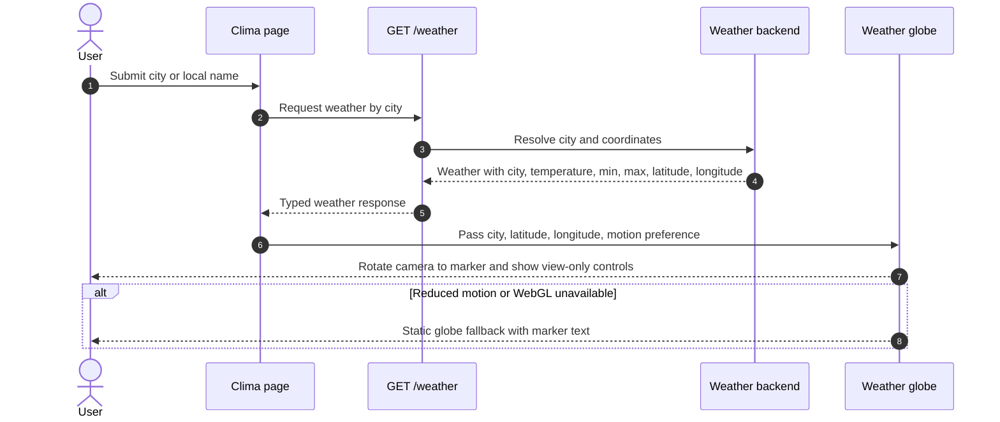

# Design — Globo 3D panorâmico na rota `/clima`

## Visão Geral

Adicionar à rota pública `/clima` um mapa 3D mundi simples que rotaciona para a cidade/local consultado pelo usuário. A busca por cidade continua sendo a origem da consulta; o globo reforça o contexto geográfico e não substitui o fluxo atual de clima.

O design aprovado usa layout **B: globo panorâmico**. O globo aparece como hero visual, a cidade pesquisada centraliza o marcador e os dados de clima ficam abaixo. A interação manual é híbrida, mas **view-only**: girar, zoom e resetar a visualização não alteram a cidade nem disparam nova busca.

## Características Arquiteturais

**Priorizadas (top 3):**

| Característica | Por quê | Critério mensurável |
|---|---|---|
| Performance mobile | A rota é pública e deve continuar leve em GPU fraca | Globo carregado client-only; DPR máximo `1.5`; geometria/texturas leves; busca e resultado renderizam mesmo se o chunk 3D ainda estiver carregando |
| Acessibilidade/reduced-motion | O recurso é visual e animado, mas o clima precisa seguir acessível | `prefers-reduced-motion: reduce` desativa rotação contínua e renderiza estado estático; informação essencial aparece em texto |
| Simplicidade de manutenção | O globo é contextual, não um mapa meteorológico completo | Um componente isolado, sem múltiplos marcadores, seleção pelo globo ou camadas extras |

**Consideradas, não priorizadas:** extensibilidade futura (preparar componente sem construir camadas agora), disponibilidade (falha do globo não pode quebrar a consulta).

## Especificação Visual

**Artefato curado:** `mockups/weather-globe-clima-visual.md`

**Fonte de design original:** nenhuma; layout definido via Visual Companion.

**Decisões visuais:**
- Layout panorâmico: copy, busca e globo no topo; resultado climático abaixo.
- Globo escuro, minimalista, com grid/continentes sutis e um único marcador destacado.
- Tokens seguem o app: fundo `#080808`, cards `#161616`, borda `#2a2a2a`, acento `#39e58c`, warning `#ffb443`.
- Tipografia preserva o design system atual: `Space Grotesk` em títulos, `Inter` em texto e `JetBrains Mono` para números.

**Fidelidade:** o mockup é um norte visual, não pixel-final. A implementação final deve adaptar proporções e estados responsivos no código real.

## Componentes Lógicos

| Componente | Responsabilidade | Depende de | Usado por |
|---|---|---|---|
| Resolver clima por cidade | Retornar clima e coordenadas normalizadas do local resolvido | Backend `/weather`, geocoding existente | Hook de clima |
| Apresentar localização no globo | Renderizar globo, marcador e rotação para `lat/lon` | `@react-three/fiber`, Three.js, resultado de clima | Página `/clima` |
| Controlar visualização do globo | Permitir girar/zoom/reset sem alterar a cidade | Estado local do globo | Componente do globo |
| Compor experiência de clima | Organizar busca, hero panorâmico, globo e resultado | Componentes weather existentes | Rota `/clima` |

## Fluxo de Dados

Diagrama fonte: `diagrams/weather-globe-clima-design_01_sequence_weather_globe_flow.mmd`

## Decisões Arquiteturais

### D1. `@react-three/fiber` em vez de `react-globe.gl`

- **Contexto:** a feature precisa de esfera, marcador, rotação para coordenadas e controles simples.
- **Decisão:** criar um wrapper próprio com `@react-three/fiber` sobre Three.js.
- **Justificativa técnica:** dá controle fino sobre DPR, geometria, animação, fallback e bundle client-only.
- **Justificativa de negócio:** favorece performance mobile, acessibilidade e manutenção simples.
- **Trade-offs aceitos:** mais código próprio para conversão `lat/lon`, rotação e controles; menos recursos prontos de globo completo.

### D2. Contrato `GET /weather` estendido com coordenadas

- **Contexto:** o backend já resolve a cidade antes de buscar clima, mas o frontend não recebe `latitude`/`longitude`.
- **Decisão:** adicionar `latitude` e `longitude` à resposta existente.
- **Justificativa técnica:** evita segunda geocodificação no browser e mantém clima e marcador no mesmo local resolvido.
- **Justificativa de negócio:** menor custo de execução e menos pontos de falha.
- **Trade-offs aceitos:** exige atualização backend, OpenAPI/types gerados e consumidores tipados.

### D3. Interação manual view-only

- **Contexto:** o usuário quer modo híbrido, mas não quer que o globo selecione outro local.
- **Decisão:** permitir girar, zoom e reset, sem alterar cidade ou query.
- **Justificativa técnica:** mantém fonte única de verdade na busca e reduz acoplamento entre canvas e dados.
- **Justificativa de negócio:** entrega sensação interativa sem tornar o globo a interface principal.
- **Trade-offs aceitos:** explorar o mapa não consulta clima de novos pontos na primeira versão.

## Riscos

| Risco | Impacto | Probabilidade | Score | Mitigação |
|---|---:|---:|---:|---|
| WebGL falhar ou performar mal em mobile | 3 | 2 | 6 alto | Fallback estático, DPR máximo `1.5`, geometria/texturas leves e carregamento client-only |
| Nova dependência 3D aumentar bundle | 2 | 2 | 4 médio | Lazy/dynamic import e componente isolado da rota |
| Contrato backend/frontend ficar divergente | 2 | 2 | 4 médio | Atualizar OpenAPI, `@repo/api-types` e testes de contrato |
| Movimento causar desconforto | 2 | 2 | 4 médio | Respeitar `prefers-reduced-motion` e oferecer estado estático |

## Fora de Escopo

- Selecionar local clicando/tocando no globo.
- Múltiplos marcadores, arcos, atmosfera, camadas meteorológicas ou histórico de cidades.
- Trocar o mecanismo de busca de cidade ou resolver homônimos nesta feature.
- Tornar o globo obrigatório para consultar clima.

## Testes e Verificação

- Backend: resposta de `GET /weather?city=` inclui `latitude` e `longitude` junto de cidade, temperatura, mínima e máxima.
- Types: OpenAPI e `@repo/api-types` regenerados após a mudança de contrato.
- Frontend: `/clima` preserva busca e resultado atual com o globo presente.
- Globo: rotação recebe coordenadas corretas; controles manuais não alteram cidade/query.
- Acessibilidade: fallback aparece com `prefers-reduced-motion` ou WebGL indisponível.
