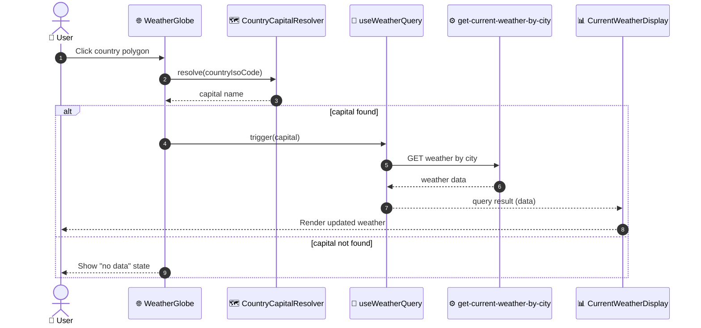

# Mapa Mundi (Globo 3D) na tela /clima

## Visão Geral

Adiciona um globo 3D interativo à tela `/clima`, complementando a busca por cidade já
existente. Ao clicar em um país no globo, a tela consulta automaticamente o clima da
capital daquele país, reaproveitando o fluxo de busca por cidade já existente no
frontend — sem nenhuma mudança no backend.

## Características Arquiteturais

**Priorizadas (top 3):**

| Característica | Por quê (preocupação de domínio) | Critério mensurável |
|---|---|---|
| Manutenibilidade | Decisão explícita de isolar a feature no frontend, sem tocar o backend | Zero alteração em `apps/backend/src/weather/` |
| Imersão/qualidade visual | Motivo declarado da escolha do globo 3D sobre o mapa plano (Leaflet) | Globo com países clicáveis e destaque ao hover, validado no mockup |
| Performance de carregamento | Nova dependência WebGL não pode travar o carregamento inicial da tela pública | Globo carregado via `dynamic import` client-only; formulário de busca renderiza sem esperar o bundle do globo |

**Consideradas, não priorizadas:** escalabilidade (tela pública sem tráfego elevado
esperado), internacionalização (fora de escopo).

## Estrutura de Componentes

| Componente | Responsabilidade | Depende de | Do que depende |
|---|---|---|---|
| `WeatherGlobe` | Renderizar o globo 3D (client-only) com polígonos de país clicáveis e emitir o país selecionado | `react-globe.gl`, dataset de polígonos (`world-atlas`/topojson via `topojson-client`) | Página `/clima` |
| `CountryCapitalResolver` | Resolver o código ISO do país selecionado para o nome da capital, usando uma tabela estática país→capital | Dataset país→capital (estático, em repo) | Página `/clima` |

Reaproveitados sem alteração: `useWeatherQuery` (hook existente), `WeatherSearchForm` e
`CurrentWeatherDisplay`. O clique no globo apenas alimenta e dispara a mesma busca por
nome de cidade que o formulário já usa — não é criado nenhum caminho de dados novo no
backend.

Acoplamento temporal: clique → `CountryCapitalResolver` resolve a capital → dispara
`useWeatherQuery` com esse nome, na mesma ordem que a submissão manual do formulário.

## Especificação Visual

**Artefato curado:** `mockups/weather-globe-clima-visual.md`

**Fonte de design original:** nenhuma — layout definido apenas via mockup do companion.

**Decisões visuais (norte, não pixel-final):**
- Globo abaixo do formulário de busca, mesma largura de card das demais seções da tela.
- Estilo escuro (tema padrão do projeto), esfera com brilho verde (`--primary`) sutil,
  sem texturas fotorrealistas — combina com o visual flat/dark existente.
- Painel de clima (temperatura atual + min/máx) permanece o componente
  `CurrentWeatherDisplay` já existente, apenas re-disparado pelo clique no globo.

**Fidelidade:** o mockup é um norte; cores exatas do globo/luz são ajustadas na
implementação.

## Fluxo de Dados

Diagrama fonte: `specs/diagrams/weather-globe-clima-design_01_sequence_weather_globe_flow.mmd`

Usuário clica em um país no globo (`WeatherGlobe`) → `CountryCapitalResolver` resolve o
código ISO do país para o nome da capital → `useWeatherQuery` é disparado com esse nome
(mesmo caminho do submit manual do formulário) → o backend (`get-current-weather-by-city`,
inalterado) faz seu próprio geocoding e retorna o clima → `CurrentWeatherDisplay`
re-renderiza com o resultado. Se a capital não é encontrada no dataset (país sem entrada),
o globo mostra um estado "sem dados" sem disparar a consulta.

## Decisões Arquiteturais

### D1. Globo 3D (`react-globe.gl`) em vez de mapa plano (Leaflet)

- **Contexto:** o projeto já tem Leaflet 1.9.4 + react-leaflet 5.0.0 instalados; um globo
  3D exige uma nova dependência WebGL (`react-globe.gl`).
- **Decisão:** globo 3D via `react-globe.gl`, renderizado apenas no client
  (`next/dynamic`, `ssr:false`).
- **Justificativa técnica:** melhor destaque nativo por país (`polygonsData`) que a
  interação pretendida exige.
- **Justificativa de negócio:** experiência visual mais marcante para a tela de clima
  pública — validado diretamente pelo usuário comparando as duas opções no mockup.
- **Trade-offs aceitos:** ~150-250KB adicionais no bundle do cliente; exige guarda
  client-only por causa de SSR do Next.js.

### D2. Resolução país→clima 100% no frontend, sem novo endpoint

- **Contexto:** o clique no globo precisa virar uma consulta de clima.
- **Decisão:** tabela estática país→capital no frontend; o nome da capital alimenta o
  fluxo de busca por cidade já existente (`useWeatherQuery`).
- **Justificativa técnica:** reaproveita 100% do use-case de backend existente
  (`get-current-weather-by-city`), sem duplicar lógica de geocoding.
- **Justificativa de negócio:** menor esforço de implementação, sem mudança de contrato
  de API.
- **Trade-offs aceitos:** o clima mostrado é sempre o da capital do país (não do ponto
  exato clicado), aceitável dado que o backend já geocodifica por nome de cidade.

### D3. Clique dispara a consulta automaticamente

- **Contexto:** clicar no país poderia só preencher o campo de busca ou já disparar a
  consulta.
- **Decisão:** dispara automaticamente, sem exigir um clique adicional em "Consultar".
- **Justificativa de negócio:** decisão explícita do usuário — interação mais direta no
  globo.
- **Trade-offs aceitos:** nenhum debounce/guarda extra é necessário, pois cada clique já
  é uma intenção explícita (diferente de digitação incremental no campo de texto).

### D4. Fonte dos dados geográficos: polígonos via `world-atlas`/`topojson-client`

- **Contexto:** o clique precisa de uma forma clicável por país (não apenas um ponto), e
  de uma coordenada de referência (capital) por país.
- **Decisão:** usar `world-atlas` (TopoJSON) + `topojson-client` para os polígonos, e uma
  tabela própria, curada no repo, país→capital para a resolução de clima.
- **Justificativa técnica:** segue o padrão dos próprios exemplos oficiais do
  `react-globe.gl`/`globe.gl` (uso de `polygonsData`), evitando reinventar a integração.
- **Justificativa de negócio:** menor esforço de manutenção — não assumimos curadoria de
  geometria de países, só da tabela pequena de capitais.
- **Trade-offs aceitos:** duas dependências de dados (polígonos + tabela de capitais)
  precisam ser casadas por código ISO; ver risco correspondente abaixo.

## Riscos

| Risco | Impacto (1-3) | Probabilidade (1-3) | Score | Mitigação |
|---|---|---|---|---|
| Equipe sem experiência prévia com `react-globe.gl`/WebGL neste projeto | 3 | 3 | 9 🔴 | Spike de meio dia validando o wrapper client-only (guard de SSR) antes das tasks de integração |
| Peso do bundle WebGL degrada carregamento da tela pública `/clima` | 2 | 2 | 4 🟡 | `dynamic import` client-only; globo carrega após o formulário de busca renderizar |
| Descompasso entre códigos ISO do dataset de polígonos (`world-atlas`) e da tabela país→capital | 2 | 2 | 4 🟡 | Teste garantindo que todo país do dataset de polígonos tem entrada correspondente na tabela de capitais |
| Países pequenos/arquipélagos difíceis de clicar no globo | 1 | 2 | 2 🟢 | Aceito como trade-off de UX; sem mitigação adicional |

## Testes

- **Unit** — `CountryCapitalResolver`: mapeamento país→capital; caso de país ausente no
  dataset (retorna estado "sem dados", não dispara consulta).
- **Component** — `WeatherGlobe`: o handler de clique emite o país correto, testado de
  forma isolada (sem depender do render 3D real do globo).
- **Integração** — clique no globo dispara `useWeatherQuery` com o nome da capital
  correta e `CurrentWeatherDisplay` renderiza o resultado.
- **Dataset coverage** — teste garantindo que todo país presente no dataset de polígonos
  tem entrada na tabela de capitais (mitigação do risco de descompasso ISO).
- **Runner:** Vitest — `pnpm --filter frontend test -- --run`.
