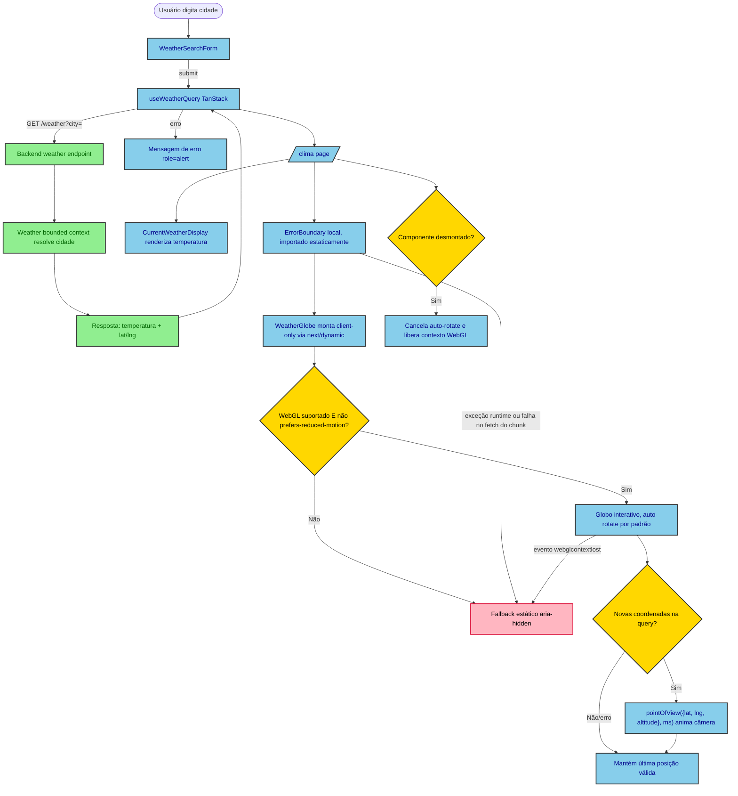

# Design — Globo 3D na rota `/clima`

> **Revisão (2026-09-05):** esta revisão adiciona textura de mapa-múndi e rotação manual
> (arrastar/tocar) ao globo, revertendo parcialmente D1 e D5 e a exclusão de "Globo
> interativo" da seção Fora de Escopo original. Zoom, pan e clique-para-buscar continuam
> fora de escopo. Ver D1/D5/D6/D7 abaixo para o detalhe de cada mudança.

## Visão Geral

Adicionar à rota pública `/clima` (Next.js App Router) um globo 3D decorativo que gira
automaticamente e anima até a localização da cidade consultada pelo usuário. O objetivo é
tornar a consulta de clima mais visual, sem alterar o comportamento funcional já existente
(busca por cidade, exibição de temperatura atual/mínima/máxima).

A página `/clima` já existe (bounded context `weather`, feature de planejamento
`weather-service`), assim como o endpoint
`GET /weather?city=`. Este design estende ambos de forma aditiva: o backend passa a expor
`latitude`/`longitude` na resposta, e o frontend ganha um novo componente `WeatherGlobe`.

## Características Arquiteturais

**Priorizadas (top 3):**

| Característica | Por quê (preocupação de domínio) | Critério mensurável |
|---|---|---|
| Performance (bundle) | `react-globe.gl` pesa ~340KB gzip; não pode inflar o bundle inicial de uma rota pública simples | Chunk do `WeatherGlobe` carregado via `next/dynamic({ ssr:false })` fica fora do bundle inicial da rota (verificável no output do `next build`). Desde a revisão de 2026-09-05, D1 passa a incluir uma textura via CDN (94KB, `earth-dark.jpg`) — é uma requisição de rede em runtime, não um asset de bundle, e não bloqueia o render (`waitForGlobeReady={false}`); o peso do bundle inicial da rota continua integralmente o peso do chunk JS |
| Compatibilidade / acessibilidade | WebGL e `prefers-reduced-motion` não são garantidos em todo navegador/usuário | Fallback estático é renderizado sempre que `WebGL` está indisponível OU `prefers-reduced-motion: reduce` está ativo, coberto por teste unitário mockando as duas condições |
| Testabilidade | WebGL não roda em jsdom/CI headless | Testes unitários verificam a chamada de `pointOfView({ lat, lng, altitude }, ms)` via mock de `ref`, sem depender de render WebGL real |

**Consideradas, não priorizadas:** scalability (rota pública de baixo tráfego, sem mudança de perfil de acesso), availability (globo é decorativo — sua falha não pode derrubar a página, ver D5/Riscos).

## Especificação Visual

**Artefato curado:** `mockups/weather-globe-clima-visual.md`

**Fonte de design original:** nenhuma; layout definido apenas via mockup do companion.

**Decisões visuais (norte, não pixel-final):**
- Globo como hero, sempre visível, acima da busca (coluna centralizada ~448px mantida).
- Auto-rotação por padrão; anima até a cidade buscada quando o resultado chega.
- Marcador simples na cor primária do tema (`#39e58c`) indicando a localização.
- Superfície do globo com textura de mapa-múndi (`earth-dark.jpg`) sobre o `globeMaterial`
  sólido escuro (`#061410`) como base imediata — a base garante que o globo nunca apareça
  vazio enquanto a textura carrega ou caso ela falhe (ver D1, "Fechamento adicional —
  textura do globo").

**Fidelidade:** o mockup é um *norte* — a renderização real usa `react-globe.gl` (WebGL),
não o círculo estático do mockup.

**Revisão (2026-09-05) — textura e tamanho:** decisões visuais adicionais validadas via
companion, distiladas em `mockups/weather-globe-clima-visual-textura.md`: textura
realista (`earth-dark.jpg`) em vez de superfície sólida, e tamanho aumentado para 240px
(era 128px) para acomodar a rotação manual (D5.1/D6).

## Decisões Arquiteturais

### D1. `react-globe.gl` como biblioteca do globo (em vez de `cobe`)

- **Contexto:** duas bibliotecas leves cobrem o caso de uso — `cobe` (~5KB, sem binding
  React, animação de câmera manual) e `react-globe.gl` (~340KB gzip, wrapper React sobre
  Three.js, `pointOfView({ lat, lng, altitude }, ms)` pronto).
- **Decisão:** `react-globe.gl`.
- **Justificativa técnica:** API de animação de câmera já pronta (`pointOfView({ lat, lng,
  altitude }, ms)`), reduz código customizado de easing; superfície de extensão maior
  (marcadores, arcos, atmosfera) caso a feature evolua.
- **Justificativa de negócio:** decisão explícita do usuário, priorizando espaço para
  evoluir o recurso no futuro sobre o menor bundle possível agora.
- **Trade-offs aceitos:** ~335KB a mais de bundle (mitigado por code-splitting client-only,
  ver D4); tensiona o precedente do `volt-redesign` de evitar novas dependências de
  visualização — aceito conscientemente e escopado só a esta página.
- **Fechamento adicional — textura do globo (revisado 2026-09-05):** decisão original
  invertida por pedido explícito do usuário. O globo agora usa
  `globeImageUrl="https://cdn.jsdelivr.net/npm/three-globe/example/img/earth-dark.jpg"`
  (esquema explícito, não protocol-relative — remove a dependência do esquema da página
  servidora) — URL oficial de exemplo do pacote `three-globe` (confirmada no repositório
  `vasturiano/three-globe`, 94KB, tons escuros/acinzentados compatíveis com o tema dark
  do app) — combinada com `waitForGlobeReady={false}`. `globeMaterial` (`MeshPhongMaterial`,
  `#061410`) continua definido como base visual: com `waitForGlobeReady={false}` o globo
  renderiza imediatamente sobre esse material sólido e a textura aparece assim que o
  download terminar, sem bloquear o render. Justificativa da mudança: (a) o modo de falha
  original de `waitForGlobeReady` (default `true`) — uma textura que não carrega travando o
  globo indefinidamente — deixa de existir independente da textura ser externa, então o
  motivo original para evitar CDN não se aplica mais; (b) o peso da textura (94KB) é uma
  requisição de rede em runtime, não bundle, e não afeta o critério de performance medido em
  D1 original (chunk JS via `next/dynamic`). Trade-off aceito: dependência de disponibilidade
  do CDN `jsdelivr` (fora do controle do time) — mitigada, não eliminada, por
  `waitForGlobeReady={false}`.
- **Risco residual aceito — ordem de aplicação `globeMaterial` × `globeImageUrl`:** o
  `three-globe` aplica o material customizado (`globeMaterial`, um *method* do Kapsule) e a
  textura (`globeImageUrl`, uma *prop*) por dois caminhos internos distintos; a leitura do
  código-fonte não garante qual dos dois roda primeiro no digest interno. Se o digest da
  textura rodar antes da troca do material customizado, a textura pode nunca aparecer —
  sem erro observável, o globo permaneceria sólido `#061410` indefinidamente. Nenhum teste
  com mock consegue falsificar esse cenário (ver Testes). Aceito sem mecanismo adicional
  (gold-plating para um elemento decorativo): a verificação é uma checagem visual manual —
  screenshot no QA da feature, mesma prática já usada em `qa/evidence/` — não um teste
  automatizado.
- **Observabilidade — falha de carregamento da textura não é instrumentada:** o
  `TextureLoader` interno do `three-globe` não expõe callback `onError`, e `onGlobeReady`
  não dispara nesse caminho — uma falha de rede na textura é 100% silenciosa, sem log nem
  telemetria. Aceito para um elemento decorativo (o sintoma visível é o globo permanecer
  sólido `#061410`, sem quebrar a página); nenhuma instrumentação nova é adicionada.
- **Sem feature flag / rollout gradual:** a revisão introduz uma dependência de terceiro em
  runtime (`cdn.jsdelivr.net`) numa rota pública, sem feature flag nem rollout progressivo —
  decisão consciente, não omissão: o elemento é puramente decorativo, o rollback é reverter
  três valores (`GLOBE_SIZE_PX`, `controls.enableRotate`, `globeImageUrl`), e a aplicação não
  define `Content-Security-Policy` (só `Cross-Origin-Opener-Policy`), então nenhum ajuste de
  CSP é necessário para liberar a CDN.

### D2. Layout — globo hero sempre visível no topo

- **Contexto:** duas opções de layout comparadas via mockup visual: globo grande e sempre
  visível no topo da página vs. globo pequeno, só aparecendo dentro do card de resultado
  após uma busca.
- **Decisão:** globo hero, sempre visível no topo (Opção A do mockup).
- **Justificativa técnica:** simplifica o componente — não há estado "antes/depois da
  busca" na montagem do globo, só na câmera.
- **Justificativa de negócio:** maior impacto visual imediato, aprovado pelo usuário.
- **Trade-offs aceitos:** o globo ocupa espaço vertical mesmo antes de qualquer busca.
- **Fechamento adicional:** uma nova busca disparada antes da animação da busca anterior
  terminar substitui o alvo da câmera pela coordenada mais recente (a chamada mais nova de
  `pointOfView` sempre prevalece); não há fila de animações pendentes.
  Estado pré-busca (FR-012): enquanto não houver `latitude`/`longitude` (nenhuma busca feita
  ainda), o array de marcadores do globo é vazio (`pointsData: []`) e **nenhuma** chamada
  inicial de `pointOfView` é feita — a câmera permanece na posição/altitude default do
  `react-globe.gl`, girando. O marcador só aparece junto da primeira animação de câmera bem
  sucedida.

### D3. Contrato HTTP estendido de forma aditiva

- **Contexto:** antes desta feature, `GET /weather?city=` retornava só `{ city,
  temperature }`; o geocoding interno já resolvia coordenadas, apenas não as expunha.
  (Decisão já implementada e commitada nas tasks 1-2 — a API já retorna `latitude`/
  `longitude`; esta seção descreve o estado anterior à mudança, não o estado atual.)
- **Decisão:** adicionar `latitude` e `longitude` à resposta existente, sem novo endpoint,
  como campos soltos no nível raiz (não aninhados no VO `Coordinate`):
  `{ city, temperature: {...}, latitude: number, longitude: number }`.
- **Justificativa técnica:** menor superfície de mudança; nenhum consumidor existente
  quebra (campos novos, não removidos/renomeados); forma plana evita acoplar o contrato
  HTTP à representação interna do VO `Coordinate`.
- **Atenção de implementação:** o Fastify serializa a resposta estritamente conforme o
  `weatherResponseSchema` do `WeatherController` (`fast-json-stringify`, sem
  `setSerializerCompiler` customizado) — um campo ausente desse schema é descartado
  silenciosamente na serialização, mesmo presente no objeto de domínio. A mudança precisa
  tocar **tanto** o VO de domínio (`CurrentWeather`) **quanto** o `weatherResponseSchema`,
  sob pena de `latitude`/`longitude` desaparecerem na resposta HTTP real sem erro visível.
- **Justificativa de negócio:** reaproveita geocoding já pago (custo zero adicional de
  chamada externa).
- **Trade-offs aceitos:** nenhum — extensão puramente aditiva.

### D4. Renderização client-only via `next/dynamic({ ssr: false })`

- **Contexto:** `react-globe.gl`/Three.js dependem de WebGL/`canvas`, indisponíveis em
  SSR.
- **Decisão:** `WeatherGlobe` é importado com `next/dynamic` e `ssr: false`.
- **Justificativa técnica:** requisito técnico da biblioteca; também isola o chunk pesado
  do bundle inicial da rota (suporta a característica de performance priorizada).
- **Justificativa de negócio:** evita erro de renderização no servidor / hidratação.
- **Trade-offs aceitos:** pequeno "pop-in" do globo após o carregamento do chunk
  (aceitável para um elemento decorativo).

### D5. Fallback estático para no-WebGL / `prefers-reduced-motion`

- **Contexto:** nem `cobe` nem `react-globe.gl` documentam fallback oficial para
  navegadores sem WebGL; usuários com preferência de movimento reduzido não devem receber
  uma animação contínua de rotação.
- **Decisão:** `WeatherGlobe` detecta as duas condições na montagem e renderiza uma
  alternativa estática (elemento decorativo simples, sem WebGL) quando qualquer uma se
  aplica.
- **Justificativa técnica:** evita crash/tela em branco em ambientes sem WebGL; respeita
  `prefers-reduced-motion` nativamente.
- **Justificativa de negócio:** acessibilidade e robustez — a página nunca fica quebrada
  por causa de um elemento decorativo.
- **Trade-offs aceitos:** parte dos usuários nunca vê o globo animado; aceito porque a
  informação de clima (o dado essencial) nunca depende do globo.
- **Fechamentos adicionais (escopo de robustez e acessibilidade):**
  - Uma exceção de runtime do Three.js/`react-globe.gl` (após a montagem bem-sucedida)
    também não pode derrubar a página: `WeatherGlobe` é envolvido por um `ErrorBoundary`
    local que renderiza o fallback estático em caso de erro, estendendo a garantia de D5
    de "montagem" para "runtime". O `dynamic(() => import(...))` do globo vive **dentro**
    do próprio `ErrorBoundary` (que por sua vez é importado estaticamente pela página):
    assim, uma falha no fetch do chunk também vira um erro de render capturado pelo
    boundary, em vez de subir para a página e derrubar a exibição do clima.
  - O `ErrorBoundary` cobre apenas erros lançados durante o ciclo de render do React, e não
    alcança o modo de falha dominante do WebGL: a perda de contexto GPU (aba em background
    por muito tempo, driver reiniciado, limite de contextos WebGL do navegador atingido), que
    acontece fora do render e apenas congela o canvas, sem exceção. Por isso o componente do
    globo interativo também escuta o evento nativo `webglcontextlost` no canvas
    (`renderer().domElement`) e, ao recebê-lo, troca para o mesmo fallback estático de D5 —
    sem depender de um erro de render.
  - No desmonte (unmount), `WeatherGlobe` cancela o loop de auto-rotação e libera o
    contexto WebGL (`globeRef.current.renderer()`), evitando vazamento de contexto WebGL
    ao navegar repetidamente para dentro e fora de `/clima`.
  - Por ser majoritariamente decorativo (ver Fora de Escopo), `WeatherGlobe` e seu fallback
    recebem `aria-hidden="true"` (D7) — a rotação manual (D5 revisado) não expõe nenhuma
    informação exclusiva a ela, então não justifica remover o `aria-hidden`. Duas coisas
    distintas continuam necessárias: `enablePointerInteraction={false}` desabilita **apenas**
    o rastreamento de ponteiro para hover/click/tooltip — ele não desliga arrastar/zoom. Para
    controlar arrastar/zoom/pan é preciso agir sobre a instância de controles, mas
    **não** via `controls().enabled = false`: o `three-render-objects` só chama
    `controls.update()` enquanto `controls.enabled` é `true`, e a auto-rotação do
    `OrbitControls` só é aplicada dentro de `update()` — desligar `enabled` mataria também
    o giro automático. A forma correta é manter `enabled = true` e ajustar apenas os flags
    que gateiam os event handlers de mouse/touch:
    `enableZoom = false`, `enablePan = false`, `enableRotate = true` (revisado 2026-09-05 —
    era `false`).
  - **D5.1 (nova, 2026-09-05) — Rotação manual habilitada, clique continua inerte:**
    verificado no código-fonte de `three-render-objects` (dependência do `react-globe.gl`)
    que `enablePointerInteraction` só controla o raycaster de hover/click sobre objetos
    (tooltip, `onHover`) — os listeners de arrastar do `OrbitControls` são anexados
    diretamente pelo Three.js no `domElement` do canvas e não dependem dessa flag. Por isso
    `enableRotate = true` funciona normalmente mesmo com `enablePointerInteraction={false}`,
    e como nenhum handler de clique (`onGlobeClick`/`onPointClick`) é registrado em nenhum
    modo, um clique sobre o globo não dispara busca nem seleciona localidade — por omissão
    de handler, não por bloqueio ativo. `enableZoom` e `enablePan` continuam `false`: só
    rotação é permitida.
  - Como o loop de `update()` continua rodando, a auto-rotação também gira durante a
    transição de câmera do `pointOfView` e faria a cidade buscada passar direto pelo
    enquadramento. Por isso o efeito que reage a `latitude`/`longitude` pausa
    `controls.autoRotate` antes de chamar `pointOfView` e o reativa após
    `CAMERA_TRANSITION_MS`, via `setTimeout` limpo no cleanup do efeito (desmonte ou nova
    busca antes do fim da transição). Como o cleanup cancela esse `setTimeout`, o mesmo efeito
    retoma `autoRotate = true` sempre que executa **sem** alvo (busca pendente ou com erro leva
    `latitude`/`longitude` a `undefined`): sem isso, uma busca que falhasse dentro da janela de
    transição deixaria a auto-rotação desligada para sempre.
  - Quando a query de clima falha (busca subsequente sem sucesso), o globo mantém a
    última posição/rotação válida sem indicar erro — o estado de erro é comunicado só
    pela mensagem já existente da página, não pelo globo.
  - Sob `prefers-reduced-motion: reduce`, o fallback estático (D5) substitui o globo por
    inteiro — FR-014 (rotação manual) não se aplica nesse caminho, só no ramo interativo.
    Aceito: a rotação manual é um extra visual sobre um elemento decorativo, e a alternativa
    (globo estático porém arrastável) dobraria os modos de renderização sem necessidade
    funcional identificada.
  - Se o usuário arrastar o globo manualmente durante a janela de transição de
    `pointOfView` (`CAMERA_TRANSITION_MS`), o delta do arrasto compõe com a interpolação de
    câmera em andamento (ambos escrevem `camera.position` no mesmo ciclo de
    `controls.update()`), sem nenhum lock entre os dois. A câmera pode terminar levemente
    deslocada do centro exato da cidade buscada. Aceito sem mecanismo de bloqueio — travar
    o arrasto durante a transição adicionaria estado extra e um novo modo de falha (ficar
    travado se a busca seguinte falhar); o elemento é decorativo e o desvio é pequeno.

### D6. Tamanho do globo: 240px (era 128px)

- **Contexto:** com o globo agora aceitando rotação manual, 128px oferece pouca área de
  arrasto para uma interação real.
- **Decisão:** `GLOBE_SIZE_PX = 240`, definida em `weather-globe-constants.ts` (única fonte
  — propaga automaticamente para `weather-globe.tsx`, `weather-globe-fallback.tsx` e o slot
  reservado em `app/(public)/clima/page.tsx`), validado via mockup dentro da coluna
  `max-w-md` (448px) da página `/clima` — cabe sem alterar a largura do layout.
- **Justificativa técnica:** maior área de toque/arrasto sem exigir reestruturação da
  página; só a altura reservada ao globo cresce; a constante centralizada evita
  reestruturação de código também.
- **Justificativa de negócio:** decisão do usuário, validada visualmente (companion).
- **Trade-offs aceitos:** a página ocupa mais espaço vertical antes de qualquer busca
  (extensão do trade-off já aceito em D2). Adicionalmente: `OrbitControls` aplica
  `touch-action: none` incondicionalmente no canvas do globo (necessário para o gesto de
  arrasto funcionar em touch); com a área passando de 128px para 240px (~3,5x), um swipe
  vertical iniciado sobre o globo — posicionado logo abaixo do título, no topo da página —
  não rola a página em mobile. Esse custo já existia em 128px (é inerente ao
  `OrbitControls`, não à revisão), mas a revisão o amplia e a spec original nunca o
  registrava. Aceito nesta rodada sem mitigação (ex.: `touch-action: pan-y` restrito ao eixo
  vertical entraria em conflito com o próprio gesto de rotação horizontal) — a validação em
  viewports pequenos (documentada em Testes) fica como verificação manual/QA, não teste
  automatizado.

### D7. Acessibilidade: mantém `aria-hidden="true"`, sem suporte a teclado

- **Contexto:** a rotação manual poderia sugerir a necessidade de foco/navegação por
  teclado (setas para girar).
- **Decisão:** `WeatherGlobe` continua `aria-hidden="true"`, sem `tabIndex` nem handlers
  de teclado.
- **Justificativa técnica/de negócio:** nenhuma informação funcional depende da rotação
  manual — é um extra visual sobre um elemento decorativo; adicionar suporte a teclado
  ampliaria o escopo sem necessidade funcional identificada. Critério aplicável: WCAG 2.2
  SC 2.5.7 (Dragging Movements, nível AA) exige uma alternativa de ponteiro único para
  funcionalidade acionada por arrasto, salvo quando o arrasto é essencial ao resultado — a
  auto-rotação já exibe todas as faces do globo sem exigir nenhum arrasto, então o arrasto
  nunca é a única via para ver qualquer parte da superfície, e a exceção se aplica.
  `aria-hidden="true"` continua válido porque o `<canvas>` do Three.js não é focável por
  padrão e o elemento não tem `tabIndex` nem descendente focável — a regra ARIA que
  `aria-hidden` viola é sobre conteúdo focável dentro da subárvore, que não existe aqui.
- **Trade-offs aceitos:** usuários de teclado/leitor de tela não têm acesso à interação
  de rotação manual — aceitável pois nenhuma informação exclusiva está ali.

## Componentes e Fluxo de Dados

- **`WeatherGlobe`** (novo, `apps/frontend/src/features/weather/components/`) —
  responsabilidade única: renderizar um globo 3D decorativo que gira automaticamente e
  anima até a localização da última busca de clima, com fallback estático quando
  WebGL/`prefers-reduced-motion` não são suportados. Depende de `react-globe.gl` e de
  `latitude`/`longitude` vindos do resultado da query de clima; é consumido apenas pela
  página `/clima` (fan-in = 1). Enquanto o chunk client-only (`next/dynamic`) carrega, a
  página reserva um placeholder de altura fixa equivalente ao globo, evitando layout
  shift no card acima.
- **Extensão do fluxo de clima existente** (backend, `apps/backend/src/weather/`) — o caso
  de uso que já resolve geocoding + clima atual passa a incluir `latitude`/`longitude` na
  resposta; após a mudança, regenerar `@repo/api-types` (`pnpm generate:types`).

Diagrama fonte: `specs/diagrams/weather-globe-clima-design_01_flowchart_weatherglobe_data_fl.mmd`

## Riscos

| Risco | Impacto (1-3) | Probabilidade (1-3) | Score | Mitigação |
|---|---|---|---|---|
| Peso de bundle (~340KB) degrada performance da rota | 2 | 2 | 4 🟡 | `next/dynamic({ ssr:false })` isola o chunk do bundle inicial (D4), reforçado por um teste estrutural que falha se `react-globe.gl` for importado fora do `next/dynamic` |
| WebGL indisponível ou fraco em dispositivo do usuário | 2 | 2 | 4 🟡 | Fallback estático (D5); dado essencial (temperatura) nunca depende do globo |
| Inconsistência com precedente do `volt-redesign` (evitar novas deps de visualização) | 1 | 3 | 3 🟡 | Decisão explícita e documentada (D1), escopada só a esta página |
| Esquecer de regenerar `@repo/api-types` após estender o contrato | 2 | 2 | 4 🟡 | Task de plano inclui `pnpm generate:types` como passo explícito após a mudança de backend |
| CDN da textura (`jsdelivr`) fica indisponível, lento, ou a textura nunca aparece por ordem de aplicação ambígua com `globeMaterial` | 1 | 2 | 2 🟢 | `waitForGlobeReady={false}` (D1 revisado) garante que o globo nunca fica travado; a ordem `globeMaterial`×`globeImageUrl` não é verificável por teste com mock (ver D1, "Risco residual aceito") — mitigado por verificação visual manual no QA da feature, não eliminado |
| Teste de mutação de D5.1 (`enableRotate`) fica vazio se só a asserção da linha 123 inverter, sem inverter também o baseline do mock | 2 | 2 | 4 🟡 | Inverter o valor inicial de `controlsState.enableRotate` no `vi.hoisted` e no `afterEach` de `true` para `false`, espelhando o padrão já usado por `enableZoom`/`enablePan` (mock nasce no oposto do valor esperado) — só assim a asserção `toBe(true)` prova uma escrita real do componente |
| Usuário confunde "arrastar gira" com "clicar busca" (sem affordance visual) | 1 | 2 | 2 🟢 | Aceito nesta rodada: nenhuma affordance visual de arrasto será adicionada; o clique é inerte por omissão de handler (D5.1), então a confusão custa no máximo um clique sem efeito — `aria-hidden` (D7) é irrelevante aqui (só afeta tecnologia assistiva, não o usuário vidente do cenário) |
| `OrbitControls` aplica `touch-action: none` no canvas; swipe vertical sobre o globo não rola a página em mobile, amplificado pelos 240px de D6 | 2 | 2 | 4 🟡 | Aceito sem mitigação nesta rodada (ver D6, trade-offs) — validação em viewport pequeno é manual/QA |

## Fora de Escopo

- Marcadores múltiplos, arcos, atmosfera ou qualquer recurso extra do `react-globe.gl`
  além do globo + animação de câmera + rotação manual.
- Zoom e pan manuais (só rotação via arrastar/tocar é permitida — D5.1).
- Clique sobre o globo disparar busca ou selecionar localidade (nenhum handler de
  clique é registrado — D5.1).
- Label/tooltip no marcador da cidade buscada (continua um ponto sem texto).
- Suporte a teclado para rotacionar o globo (D7).
- Exibir histórico de cidades buscadas no globo.
- Mudar a lógica de desambiguação de cidade homônima (continua usando o primeiro
  resultado do geocoding — decisão já fechada em `weather-service`).

## Testes

- **Backend:** teste de integração HTTP (não só do caso de uso) garantindo que a resposta
  serializada de `GET /weather?city=` passa a incluir `latitude`/`longitude` corretos para
  uma cidade conhecida, sem quebrar o formato existente (`city`, `temperature`) — cobrindo
  também o `weatherResponseSchema` do controller, não só o VO de domínio (ver D3, "Atenção
  de implementação").
- **Frontend:**
  - A detecção de capacidade vive num hook nomeado (`useGlobeCapability`), testado
    diretamente: retorna `"fallback"` quando WebGL é reportado como indisponível (mock) OU
    `prefers-reduced-motion: reduce` está ativo (mock de `matchMedia`, incluindo mudança
    posterior via evento `change`). `WeatherGlobe` renderiza o fallback estático sempre que
    o hook retorna `"fallback"` — o hook é também o seam que permite exercitar o caminho
    interativo nos testes, já que o ambiente headless sempre reporta WebGL indisponível.
  - `WeatherGlobe` chama `pointOfView({ lat, lng, altitude }, ms)` com `latitude`/
    `longitude` corretos quando a query de clima retorna um resultado novo (mock do
    ref/instância do globo — sem WebGL real). Critério de "concluído" para este teste: a
    chamada mockada ocorreu com os valores de `lat`/`lng` esperados — duração e easing da
    transição são detalhe de implementação, não fazem parte do critério de aceite.
  - `/clima` continua renderizando `CurrentWeatherDisplay` normalmente com o globo
    presente (nenhuma regressão no fluxo de busca existente).
  - `WeatherGlobe` cancela o loop de auto-rotação e libera o contexto WebGL (`renderer`
    interno) no cleanup do `useEffect` ao desmontar.
  - `WeatherGlobe` envolvido por um `ErrorBoundary` local: uma exceção de runtime do
    Three.js/`react-globe.gl` renderiza o fallback estático de D5 em vez de derrubar a
    página; `CurrentWeatherDisplay` continua renderizando (mock de throw simulado).
  - `WeatherGlobe` troca para o fallback estático quando o canvas emite `webglcontextlost`
    (evento simulado no teste), sem depender do `ErrorBoundary`.
  - Nenhuma importação estática de `react-globe.gl`/`three`/`three-globe`/`globe.gl` **nem** do
    módulo `weather-globe` fora do `next/dynamic({ ssr: false })` (fitness function/regra
    estrutural que impede regressão do isolamento de bundle de D4 — um import estático do
    componente arrasta o mesmo chunk para o bundle inicial, mesmo sem citar `react-globe.gl`).
    O único arquivo allowlistado é `weather-globe.tsx`, que importa `react-globe.gl` de fato.
    O `weather-globe-error-boundary.tsx` **não** é vigiado nem allowlistado: por D5, é ele que
    hospeda o `dynamic(() => import("./weather-globe"))`, então não puxa o chunk pesado e pode —
    e deve — ser importado estaticamente pela página `/clima`. Um import estático do boundary
    por `page.tsx` é, portanto, o comportamento esperado, não uma violação.

**Testes atualizados (revisão 2026-09-05 — textura + rotação manual):**

- `weather-globe.test.tsx` — o teste "ativa auto-rotação e desabilita arrastar/zoom/pan ao
  montar o ramo interativo" é **editado, não substituído**: a asserção de `enableRotate`
  passa de `false` para `true` (D5.1), mantendo as demais quatro asserções (`autoRotate`,
  `autoRotateSpeed`, `enableZoom`, `enablePan`) como estão. Para a mudança continuar
  provando uma escrita real do componente — não o valor inicial do mock —, o baseline de
  `controlsState.enableRotate` no `vi.hoisted` e no `afterEach` também inverte, de `true`
  para `false`, espelhando o padrão já usado por `enableZoom`/`enablePan` (mock nasce no
  oposto do valor esperado). Ver Riscos para o porquê disso ser obrigatório, não estético.
- O teste "renderiza o globo sem textura externa, usando globeMaterial sólido" é
  **substituído** (sua asserção atual, `globeImageUrl` `toBeUndefined()`, contradiz D1
  revisado) por um teste que verifica que `<Globe>` recebe `globeImageUrl` com a URL de
  textura configurada e `waitForGlobeReady={false}`, mantendo `globeMaterial` definido.
  Escopo explícito do teste: verificação de contrato de props via mock, sem WebGL real —
  não prova que a textura efetivamente aparece na tela nem resolve a ordem de aplicação
  entre `globeMaterial` e `globeImageUrl` (ver D1, "Risco residual aceito"); essa
  confirmação é verificação visual manual/QA, fora do automatizado.
- Novo teste estrutural: nenhum handler `onGlobeClick`/`onPointClick` é passado ao
  `<Globe>` — garante por asserção, não só por ausência de código, que um clique não pode
  disparar busca/seleção (D5.1).
- Testes existentes de fallback, `ErrorBoundary`, cleanup de contexto WebGL e animação de
  câmera (`pointOfView`) permanecem válidos sem alteração.
- Backend: nenhum teste novo — o contrato `latitude`/`longitude` já existe desde a feature
  original (D3), sem mudança nesta revisão.
