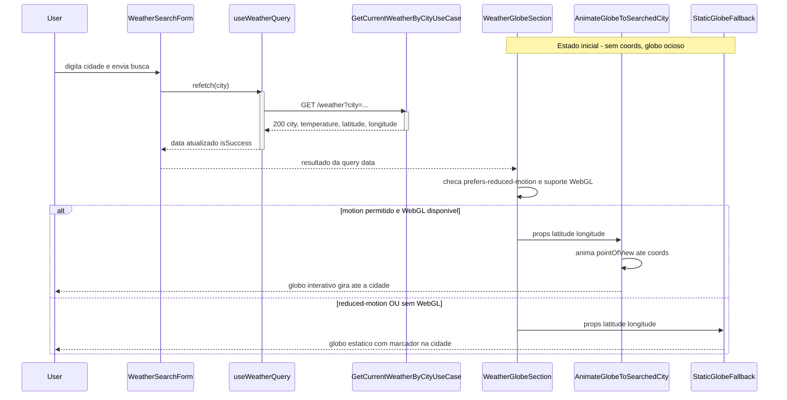

# Weather Globe Clima — Design

> Nota de proveniência: uma tentativa anterior de design para este mesmo recurso existe
> commitada em `HEAD` sob este mesmo diretório (decisões distintas: layout diferente,
> `@react-three/fiber`/Three.js em vez de `react-globe.gl`). Por instrução explícita do
> usuário, este documento **substitui** integralmente aquele conteúdo — nenhuma decisão do
> design anterior foi assumida como vinculante nesta sessão.

## Visão Geral

Na rota `/clima`, um globo 3D interativo (`react-globe.gl`) aparece como seção hero entre o
header e o formulário de busca. Sem cidade pesquisada, gira sozinho lentamente (idle). Ao
buscar uma cidade, o globo anima a câmera até a coordenada retornada pelo backend e passa a
aceitar drag/zoom livres do usuário. A consulta de clima permanece funcional mesmo quando o
globo não pode ser exibido (WebGL indisponível, `prefers-reduced-motion`).

## Características Arquiteturais

**Priorizadas (top 3):**

| Característica | Por quê (preocupação de domínio) | Critério mensurável |
|---|---|---|
| Performance | Lib 3D (three.js) é pesada e não pode degradar o carregamento da página pública `/clima` | Chunk do globo carrega via `next/dynamic({ssr:false})`, isolado do bundle inicial da rota |
| Acessibilidade | Rotação contínua é gatilho de enjoo/vestibular; a informação de clima não pode depender do canvas 3D | Com `prefers-reduced-motion: reduce`, nenhuma animação contínua roda e cidade/temperatura seguem sempre em texto plano |
| Robustez/portabilidade | Nem todo navegador/dispositivo tem WebGL disponível | Ausência de WebGL não quebra a página; `StaticGlobeFallback` assume o lugar do globo |

**Consideradas, não priorizadas:** escalabilidade (tráfego atual não justifica), segurança/LGPD
(dado público, sem PII), i18n (não muda com a feature).

## Especificação Visual

**Artefato curado:** `mockups/weather-globe-clima-visual.md`

**Fonte de design original:** nenhuma; layout definido apenas via mockup do companion
(comparação lado a lado de duas opções, aprovada nesta sessão de brainstorming).

**Decisões visuais (norte, não pixel-final):**
- Layout: globo em seção hero panorâmica, entre o `<header>` e o `WeatherSearchForm`, na
  mesma coluna `max-w-md` da página `/clima`.
- Fundo do painel: gradiente radial escuro, consistente com o tema escuro do projeto.
- Cor de destaque/marcador: `--color-primary` (`#39e58c`).
- Raio: `rounded-xl`, igual ao card de `CurrentWeatherDisplay`.
- Sem texto próprio relevante no painel — cidade/temperatura continuam só no card de
  resultado existente.

**Fidelidade:** o mockup é um *norte*. A fidelidade final (iluminação, textura do
mapa-múndi, curva de animação) é construída na task de implementação contra a API real de
`react-globe.gl`.

## Componentes Lógicos

| Componente | Responsabilidade | Depende de | Depende dele |
|---|---|---|---|
| **Incluir Coordenadas na Resposta do Clima** (backend, estende `GetCurrentWeatherByCityUseCase` + VO `CurrentWeather`) | Reter a `Coordinate` que `GeocodingGateway.geocode()` já retorna (hoje descartada pelo use case após a chamada ao `WeatherGateway`) e incluí-la na `CurrentWeather` retornada, e daí na resposta de `GET /weather` | `Coordinate` (VO compartilhado em `shared/domain/value-object/coordinate.ts`, já usado por `geocodingGateway.geocode()`) | `@repo/api-types` regenerado, `useWeatherQuery` |
| **AnimateGlobeToSearchedCity** (frontend, client-only, novo) | Renderizar o globo interativo: auto-rotate quando não há coordenada, anima `pointOfView` até a coordenada recebida, repassa drag/zoom ao usuário | Coordenada atual (prop) | `WeatherGlobeSection` |
| **StaticGlobeFallback** (frontend, novo) | Mostrar representação estática (sem animação contínua) quando `prefers-reduced-motion: reduce` ou WebGL indisponível | Coordenada atual (prop, opcional) | `WeatherGlobeSection` |
| **WeatherGlobeSection** (frontend, container novo, integrado na página `/clima`) | Ler o resultado de `useWeatherQuery`, detectar `prefers-reduced-motion`/suporte a WebGL, escolher entre `AnimateGlobeToSearchedCity` e `StaticGlobeFallback`, repassar a coordenada | `useWeatherQuery` (existente), os dois componentes acima | Página `/clima` |

**Acoplamento:** `AnimateGlobeToSearchedCity` e `StaticGlobeFallback` são folhas — só
recebem props, não conhecem a query nem o backend. `WeatherGlobeSection` concentra o
acoplamento aferente de propósito, como único ponto de integração.

## Fluxo de Dados

Usuário digita cidade → `WeatherSearchForm` (existente, inalterado) → `useWeatherQuery`
chama `GET /weather?city=` (mesma query já usada hoje, sem chamada extra) →
`GetCurrentWeatherByCityUseCase` retorna `{city, temperature, latitude, longitude}` →
`CurrentWeatherDisplay` renderiza como já faz hoje → `WeatherGlobeSection` consome o mesmo
resultado da mesma query e repassa `latitude`/`longitude` para `AnimateGlobeToSearchedCity`
(ou `StaticGlobeFallback`, conforme a detecção de motion/WebGL).

Diagrama fonte: `specs/diagrams/weather-globe-clima-design_01_sequence_weather_globe_flow.mmd`

## Contrato de API

- `GetCurrentWeatherByCityUseCase.execute()` (`apps/backend/src/weather/application/use-case/get-current-weather-by-city.usecase.ts`)
  já recebe uma `Coordinate` de `geocodingGateway.geocode()`, mas hoje só a usa para chamar
  `weatherGateway.getCurrentWeather(coordinate)` e a descarta — o `success({...})` final só
  combina `city` + `temperature`. A mudança passa a incluir essa mesma `coordinate` no
  retorno.
- VO `CurrentWeather` (`apps/backend/src/weather/domain/value-object/current-weather.ts`)
  ganha o campo `coordinate: Coordinate` (reaproveitando o VO compartilhado
  `shared/domain/value-object/coordinate.ts`, que já expõe `latitude`/`longitude`).
- `WeatherController` (`apps/backend/src/weather/infra/controller/weather-controller.ts`)
  ajusta `weatherResponseSchema` (Zod) para incluir `latitude`/`longitude` na resposta,
  lidos de `coordinate.latitude`/`coordinate.longitude`.
- Regenerar OpenAPI + `@repo/api-types` (`pnpm generate:types`).
- Ajustar `WeatherResponse`/`citySchema` em `apps/frontend/src/features/weather/`.

## Decisões Arquiteturais

### D1. `react-globe.gl` em vez de `cobe` ou `@react-three/fiber` puro

- **Contexto:** precisa de rotação animada até coordenada + drag/zoom livres do usuário.
- **Decisão:** `react-globe.gl` (built sobre `three-globe`/three.js).
- **Justificativa técnica:** `pointOfView({lat, lng, altitude}, ms)` e `OrbitControls`
  (drag + zoom + `autoRotate`) já prontos, sem gestos customizados.
- **Justificativa de negócio:** menos código para manter um requisito de interação (drag +
  zoom) que o usuário pediu explicitamente.
- **Trade-offs aceitos:** bundle maior que `cobe` (~5kB); mitigado por ser um chunk
  client-only isolado via `next/dynamic({ssr:false})`.

### D2. Backend estende `GET /weather` com lat/lng em vez de geocoding no client

- **Contexto:** a coordenada não é exposta hoje, mas já é resolvida internamente pelo
  backend ao processar a busca por cidade.
- **Decisão:** adicionar `latitude`/`longitude` na resposta existente de `GET /weather`.
- **Justificativa técnica:** reaproveita a resolução já feita; fonte única de verdade.
- **Justificativa de negócio:** evita depender de um serviço externo de geocoding no
  cliente (custo, rate-limit, confiabilidade adicionais).
- **Trade-offs aceitos:** muda o contrato público da API — exige regenerar
  `@repo/api-types` e coordenar backend + frontend na mesma entrega.

### D3. Fallback estático dirigido por `prefers-reduced-motion`/suporte a WebGL

- **Contexto:** acessibilidade e robustez exigem que a feature nunca seja bloqueante.
- **Decisão:** `WeatherGlobeSection` detecta a condição e escolhe `StaticGlobeFallback` no
  lugar do globo animado.
- **Justificativa técnica:** uma única chave de decisão (motion + WebGL) evita estados
  intermediários.
- **Justificativa de negócio:** clima é a informação essencial; o globo é decorativo/
  contextual, nunca pode ser um bloqueio para ver o resultado.
- **Trade-offs aceitos:** usuários em fallback não veem a animação — aceito, é o objetivo
  do fallback.

## Riscos

| Risco | Impacto (1-3) | Probabilidade (1-3) | Score | Mitigação |
|---|---|---|---|---|
| `react-globe.gl` nunca usada no repo | 2 | 3 | 6 🟡 | Spike curto (0,5 dia) validando `pointOfView` + `OrbitControls` antes da task principal de integração |
| WebGL indisponível quebra a página | 3 | 1 | 3 🟡 | `StaticGlobeFallback` com detecção via `canvas.getContext('webgl')` |
| Bundle 3D aumenta o TTI de `/clima` | 2 | 2 | 4 🟡 | `next/dynamic({ssr:false})` isolando o chunk; medir Lighthouse antes/depois |
| Coordenada nula (cidade não geocodificada) | 2 | 1 | 2 🟢 | Globo permanece em auto-rotate idle; sem erro visual |

## Estrutura de Componentes (arquivos)

- `apps/backend/src/weather/domain/value-object/current-weather.ts` — `CurrentWeather` ganha
  `coordinate: Coordinate`.
- `apps/backend/src/weather/application/use-case/get-current-weather-by-city.usecase.ts` —
  passa a incluir a `coordinate` (já obtida de `geocodingGateway.geocode()`) no `success({...})`
  final, em vez de descartá-la.
- `apps/backend/src/weather/infra/controller/weather-controller.ts` —
  `weatherResponseSchema` (Zod) ganha `latitude`/`longitude`.
- `packages/api-types/` — regenerado via `pnpm generate:types` (não editado manualmente).
- `apps/frontend/src/features/weather/schemas/index.ts` — `citySchema`/tipos ajustados.
- `apps/frontend/src/features/weather/components/weather-globe-section.tsx` (novo).
- `apps/frontend/src/features/weather/components/animate-globe-to-searched-city.tsx` (novo,
  client-only, montado via `next/dynamic({ssr:false})` seguindo o padrão de
  `gym-location-picker.tsx`).
- `apps/frontend/src/features/weather/components/static-globe-fallback.tsx` (novo).
- `apps/frontend/src/app/(public)/clima/page.tsx` — integra `WeatherGlobeSection` entre o
  header e `WeatherSearchForm`.

## Testes

- Backend: teste do use case `GetWeather` cobrindo `latitude`/`longitude` na resposta;
  teste de contrato/schema OpenAPI atualizado.
- Frontend: `WeatherGlobeSection` testado com Vitest/Testing Library + MSW (mock de
  `GET /weather` com/sem coordenada), cobrindo a escolha entre `AnimateGlobeToSearchedCity`
  e `StaticGlobeFallback` conforme `prefers-reduced-motion`/mock de WebGL (jsdom não tem
  WebGL real — mockar `canvas.getContext`).
- `AnimateGlobeToSearchedCity`/`StaticGlobeFallback`: testes de unidade focados em props e
  no critério de decisão (idle vs. animando vs. fallback), sem depender do render real do
  WebGL.
- Playwright (`e2e/`): cenário real de busca de cidade confirmando que a seção do globo
  aparece na página sem quebrar o fluxo de busca existente.
