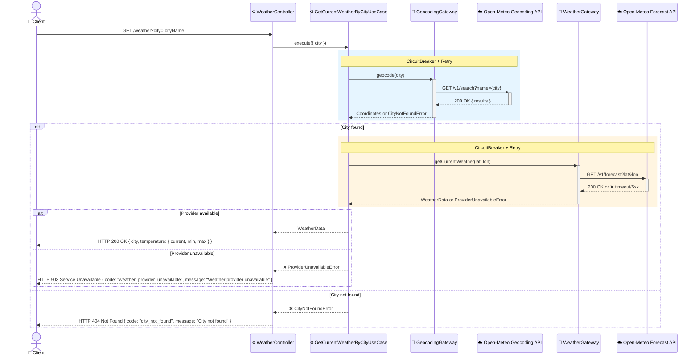

# Design — Serviço de Meteorologia

## Visão Geral

Novo bounded context (`src/weather/`) que expõe um endpoint HTTP público para consultar o clima atual de uma cidade, informada pelo nome. O serviço resolve o nome da cidade em coordenadas geográficas (geocoding) e busca o clima atual na API pública do Open-Meteo — sem autenticação, sem cache e sem persistência: cada requisição busca os dados ao vivo.

## Características Arquiteturais

**Priorizadas (top 3):**

| Característica | Por quê (preocupação de domínio) | Critério mensurável |
|---|---|---|
| Simplicidade / manutenibilidade | Escopo mínimo definido pelo usuário: sem auth, sem persistência, sem cache | Nenhuma tabela de banco nova; nenhuma variável de ambiente de secret nova |
| Confiabilidade | Depende de duas chamadas HTTP externas em série; falha de qualquer uma não pode derrubar o processo | 100% das chamadas externas envolvidas por `CircuitBreaker` + `Retry`; nenhuma exceção não tratada escapa do use case |
| Testabilidade | Segue o padrão de gateway do repo (interface + adapter + fake) | Use case coberto por testes unitários com gateways fake, sem chamada de rede real |

**Consideradas, não priorizadas:** escalabilidade/elasticidade (sem fila, sem cache — fora de escopo por decisão do usuário), segurança de autenticação (endpoint público, dado não sensível).

## Arquitetura e Fluxo de Dados

1. `GET /weather?city=<nome>` → `WeatherController` valida o parâmetro (string não vazia, via Zod).
2. `WeatherController` chama `GetCurrentWeatherByCityUseCase.execute({ city })`.
3. O use case chama `GeocodingGateway.geocode(city)` (implementado por `OpenMeteoGeocodingGateway`, envolto em `CircuitBreaker` + `Retry`).
   - Cidade não encontrada → `CityNotFoundError`.
4. Com a coordenada resolvida, o use case chama `WeatherGateway.getCurrentWeather(coordinate)` (implementado por `OpenMeteoWeatherGateway`, também envolto em `CircuitBreaker` + `Retry`).
   - Provedor externo indisponível (timeout, 5xx, circuito aberto) → `WeatherProviderUnavailableError`.
5. Sucesso → o use case retorna `Either.success(CurrentWeather)`; `WeatherController` mapeia para `ResponseFactory.OK`.
6. Falhas são mapeadas por tipo: `CityNotFoundError` → HTTP 404; `WeatherProviderUnavailableError` → HTTP 503.



Diagrama fonte: `specs/diagrams/weather-service-design_01_sequence_weather_service_flow.mmd`

## Contrato HTTP

Corpo literal das respostas, alinhado à convenção do repositório (`ResponseFactory` + `{ code, message }` para erros, já usada por todos os controllers existentes):

**200 OK**
```json
{
  "city": "São Paulo",
  "temperature": { "current": 24, "min": 18, "max": 27 }
}
```

**404 Not Found**
```json
{ "code": "city_not_found", "message": "City not found" }
```

**503 Service Unavailable**
```json
{ "code": "weather_provider_unavailable", "message": "Weather provider unavailable" }
```

Sem campo `conditions` ou qualquer condição climática textual — fora de escopo (ver "Fora de Escopo"). `CurrentWeather` (VO) mapeia 1:1 para o corpo de sucesso: `city`, `temperature.current`, `temperature.min`, `temperature.max`.

## Estrutura de Componentes

| Componente | Responsabilidade | Depende de | Do que depende dele |
|---|---|---|---|
| `GeocodingGateway` (interface, application) | Resolver um nome de cidade para uma coordenada geográfica | `Coordinate` (VO compartilhado) | `GetCurrentWeatherByCityUseCase` |
| `WeatherGateway` (interface, application) | Buscar o clima atual de uma coordenada geográfica | `Coordinate` | `GetCurrentWeatherByCityUseCase` |
| `OpenMeteoGeocodingGateway` (adapter, infra) | Implementa `GeocodingGateway` chamando a API de geocoding do Open-Meteo, envolta em `CircuitBreaker` + `Retry` | HTTP client, utilitários de resiliência existentes (`shared/infra/gateway`) | IoC container |
| `OpenMeteoWeatherGateway` (adapter, infra) | Implementa `WeatherGateway` chamando a API de forecast do Open-Meteo, envolta em `CircuitBreaker` + `Retry` | idem | IoC container |
| `GetCurrentWeatherByCityUseCase` (application) | Orquestra: nome da cidade → coordenada → clima atual; retorna `Either<Error, CurrentWeather>` | `GeocodingGateway`, `WeatherGateway` | `WeatherController` |
| `CurrentWeather` (Value Object, domain) | Modela o resultado (`city`, `temperature.current`, `temperature.min`, `temperature.max`) — sem identidade/persistência | — | Use case, controller |
| `WeatherController` (infra) | Valida query params (Zod), chama o use case, mapeia `Either` para resposta HTTP via `ResponseFactory`, e registra o schema OpenAPI (querystring + responses 200/404/503) via `OpenApiSchemaBuilder`, seguindo o padrão de `FetchUsersController` | Use case, `OpenApiSchemaBuilder` | Rotas Fastify, geração de `@repo/api-types` (`pnpm openapi:generate-client`) |

`GeocodingGateway` e `WeatherGateway` foram mantidos como interfaces separadas mesmo usando o mesmo provedor: representam falhas de naturezas diferentes (cidade não encontrada vs. provedor indisponível) e podem ser trocadas de provedor de forma independente no futuro.

## Decisões Arquiteturais

### D1. Open-Meteo como provedor de clima e geocoding

- **Contexto:** o serviço precisa resolver nome de cidade → coordenadas e depois buscar o clima atual. Alternativas avaliadas: Open-Meteo (sem API key, 2 chamadas), WeatherAPI.com (com API key, 1 chamada), OpenWeatherMap (com API key, 1 chamada).
- **Decisão:** Open-Meteo, usando sua API de geocoding gratuita seguida da API de forecast.
- **Justificativa técnica:** elimina gestão de secrets (sem API key), tier gratuito generoso (10k chamadas/dia) e demonstra melhor o padrão de gateway orquestrando múltiplas chamadas externas com os utilitários `CircuitBreaker`/`Retry` já existentes no repo.
- **Justificativa de negócio:** repositório de estudo de Clean Architecture — o valor pedagógico de exemplificar orquestração e resiliência supera o ganho de simplicidade de uma chamada única.
- **Trade-offs aceitos:** 2 chamadas HTTP em série (mais latência, mais um ponto de falha distinto — geocoding pode falhar independentemente do clima); uso comercial exigiria plano pago do Open-Meteo (irrelevante neste contexto).

### D2. Sem cache e sem persistência

- **Contexto:** o clima consultado poderia ser cacheado (Redis, TTL curto) ou ter histórico persistido em banco.
- **Decisão:** nenhum dos dois — cada requisição busca os dados ao vivo na API externa.
- **Justificativa técnica:** menor superfície de código (sem chave de cache, sem TTL, sem tabela/migration).
- **Justificativa de negócio:** decisão explícita do usuário; não há requisito de histórico ou de reduzir custo de chamadas externas nesta versão.
- **Trade-offs aceitos:** cada requisição paga o custo de 2 chamadas externas; sob carga, isso consome a cota gratuita do Open-Meteo mais rápido do que uma versão com cache. Ver risco R1.

### D3. Endpoint público, sem autenticação

- **Contexto:** os demais endpoints do backend usam middleware de autenticação de usuário.
- **Decisão:** o endpoint de clima não exige autenticação.
- **Justificativa técnica:** nenhuma — é puramente uma decisão de produto.
- **Justificativa de negócio:** decisão explícita do usuário; dado consultado (clima público) não é sensível e não há necessidade de rastrear quem consulta.
- **Trade-offs aceitos:** sem rate limiting por usuário autenticado; o endpoint fica exposto a uso não identificado (mitigado apenas indiretamente pelos limites do próprio provedor externo).

## Riscos

| Risco | Impacto (1-3) | Probabilidade (1-3) | Score | Mitigação |
|---|---|---|---|---|
| R1. Sem cache, alto volume de requisições esgota a cota gratuita do Open-Meteo (10k/dia) | 2 | 2 | 4 🟡 | Aceito conscientemente para esta versão (decisão do usuário); se o uso crescer, cache é o primeiro item a reconsiderar — não há task de mitigação nesta iteração |
| R2. Geocoding pode retornar múltiplos resultados para o mesmo nome de cidade (ex.: "Springfield") | 2 | 2 | 4 🟡 | `OpenMeteoGeocodingGateway` usa sempre o primeiro resultado retornado pela API (maior relevância); sem desambiguação por país/estado nesta versão — documentado como limitação conhecida |
| R3. Duas chamadas HTTP em série aumentam a chance de falha percebida pelo cliente | 2 | 2 | 4 🟡 | Mitigado por `CircuitBreaker` + `Retry` em ambos os gateways (mecanismos já existentes e reaproveitados, não novos) |

## Tratamento de Erros

Segue a convenção do repositório: lógica de negócio nunca lança exceção — use cases retornam `Either<Error, Success>` (`@/shared/domain/value-object/either`).

- `CityNotFoundError extends DomainError` — cidade não encontrada pelo geocoding → HTTP 404, corpo `{ code: "city_not_found", message: "City not found" }`.
- `WeatherProviderUnavailableError extends DomainError` — falha técnica do provedor externo (timeout, 5xx, circuito aberto) → HTTP 503, corpo `{ code: "weather_provider_unavailable", message: "Weather provider unavailable" }`.
- Corpo de erro segue a convenção já usada por todos os controllers do repo (`{ code, message }`, ex.: `create-password-reauth-grant.controller.ts`) — não o formato genérico `{ error }`.
- Nenhum `ErrorKind` existente mapeia para HTTP 503, então o mapeamento genérico via `kind` (`STATUS_BY_ERROR_KIND`) não alcança `WeatherProviderUnavailableError`. `WeatherController` sobrescreve `mapResponseError()` (mesmo padrão de `create-password-reauth-grant.controller.ts`) para tratar `CityNotFoundError` e `WeatherProviderUnavailableError` explicitamente, retornando o corpo `{ code, message }` correto para cada um.
- Erros 4xx do provedor externo (ex.: requisição malformada) não são retentados pelo `Retry`; falhas de rede/5xx são.

## Testes

- **Unitários:** `GetCurrentWeatherByCityUseCase` testado com `InMemoryGeocodingGateway` e `InMemoryWeatherGateway` (fakes), cobrindo: sucesso, cidade não encontrada, provedor indisponível.
- **Business-flow:** servidor Fastify em memória + supertest, gateways rebindados via `container.snapshot()` → `container.rebind(...)` para as fakes → `container.restore()`, seguindo o padrão de `*.business-flow-test.ts` já usado no repo (ex.: `fetch-users.business-flow-test.ts`). `container.rebindSync` não existe neste repositório.
- **Fitness functions** (`pnpm test:fitness`): nenhuma alteração necessária nas regras de `dependency-cruiser` — o novo módulo `src/weather/` segue a mesma direção de dependência (`domain/ → application/ → infra/`) já validada para os demais contextos.

## Injeção de Dependência

Segue o padrão de 3 passos já usado no repo:

1. `shared/infra/ioc/module/service-identifier/weather-types.ts` — símbolos `WEATHER_TYPES.GeocodingGateway`, `.WeatherGateway`, `.GetCurrentWeatherByCityUseCase`, `.WeatherController`.
2. `shared/infra/ioc/module/weather/weather-container.ts` — `ContainerModule` ligando as interfaces às implementações concretas (`OpenMeteoGeocodingGateway`, `OpenMeteoWeatherGateway`).
3. `bootstrap/setup-weather-module.ts` — registra o controller e as rotas. `WeatherController.init()` chama `httpServer.register("get", WeatherRoutes.GET, { callback }, makeWeatherSwaggerSchema())` — `isProtected` omitido (endpoint público), mesmo padrão de `send-contact-email.controller.ts`. `makeWeatherSwaggerSchema()` usa `OpenApiSchemaBuilder.build({ querystring, responses: { 200, 404, 503 } })` — mesmo padrão de `fetch-users.controller.ts` — para que `/weather` seja incluído no documento OpenAPI e, consequentemente, em `@repo/api-types` (`pnpm openapi:export` + `pnpm openapi:generate-client`), do qual o frontend depende.

Sem Provider pattern (env-based real/fake): diferente de `SubscriptionGateway`/`MailerGateway` — que usam `toDynamicValue(XProvider.provide)` para alternar entre implementação real e fake fora de testes, evitando efeitos colaterais reais (e-mail, cobrança) em desenvolvimento — as chamadas ao Open-Meteo são leituras públicas e gratuitas, sem efeito colateral, então não há motivo para gating por ambiente. Os gateways são ligados diretamente (`.to(OpenMeteoGeocodingGateway).inSingletonScope()`), com fakes usados apenas em testes via `container.rebind(...)`.

## Estrutura de Diretórios

```
apps/backend/src/weather/
  AGENTS.md
  domain/
    value-object/current-weather.ts
    error/city-not-found-error.ts
    error/weather-provider-unavailable-error.ts
  application/
    gateway/geocoding-gateway.ts
    gateway/weather-gateway.ts
    use-case/get-current-weather-by-city.usecase.ts
  infra/
    gateway/open-meteo-geocoding-gateway.ts
    gateway/open-meteo-weather-gateway.ts
    gateway/testing/in-memory-geocoding-gateway.ts
    gateway/testing/in-memory-weather-gateway.ts
    controller/weather-controller.ts
    controller/routes/weather-routes.ts
```

Sem nova variável de ambiente — a API do Open-Meteo não exige chave de acesso.

## Fora de Escopo (nesta versão)

- Previsão de múltiplos dias (apenas clima atual + mín/máx do dia).
- Cache ou persistência de histórico de consultas.
- Autenticação/autorização do endpoint.
- Desambiguação de cidades homônimas (usa sempre o primeiro resultado do geocoding).
- Entrada por coordenadas lat/long diretas (apenas nome de cidade).
