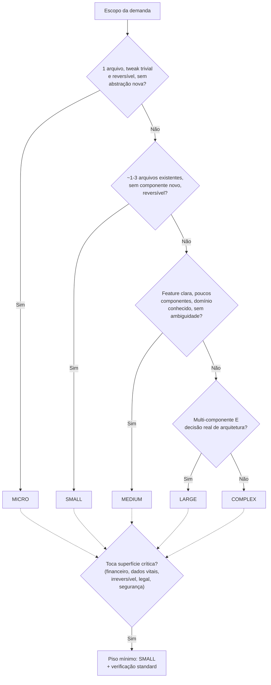

# Guia de SDD (Spec-Driven Development)

Guia de de decisão de uso para: **se** e **quanto** de SDD aplicar numa demanda.

## 1. O que é SDD

SDD é o processo de **escrever a especificação antes de escrever código**, e usar essa especificação como fonte de verdade durante implementação e verificação. Na prática, isso vira uma cadeia de artefatos:

```
PRD (o quê e por quê) → Spec/Design (como, em termos técnicos) → Plano de tasks (passos executáveis) → Implementação (TDD) → Verificação (evidência de que a spec foi atendida)
```

Nem toda demanda precisa da cadeia inteira. A regra central do processo é:

> **O que não for especificado não será feito.**

Isso corta nos dois sentidos: se a spec não menciona testes de componente, eles não vão ser escritos; se a spec não menciona fidelidade a um mockup de design, ninguém vai comparar pixel a pixel. Escrever a spec é o momento de decidir isso — não a implementação.

### 1.1. Extras

O superpowers trás recursos extras além do SDD

- Pesquisa profunda e investigação de soluções
- Brainstorming visual
- Debugging 
- Revisão de especificação

## 2. Quando usar SDD

Use quando a demanda produz um **entregável**: um incremento de valor de negócio identificável, algo que dá para demonstrar a um stakeholder — mesmo que não seja um software completo.

Exemplos:
- Suportar um novo gateway de pagamentos
- Integrar com um sistema externo de emissão de notas fiscais
- Desenvolver componente de checkout com suas regras de negócio
- Migrar um projeto de uma tecnologia X para Y (ex.: biblioteca de logging, ORM, framework de fila, Design System)
- Implementar internacionalização
- Implementar analytics com variabilidades e lugares complexos
- Adicionar filtros e contadores a uma listagem de pedidos no painel administrativo
- Implementar um fluxo de cancelamento de assinatura com regras de autorização e estorno

## 3. Quando NÃO usar SDD

- **Otimizar uma query lenta** — é investigação + correção técnica pontual, não um novo requisito. Faça profiling e corrija direto.
- **Alterar uma regra de negócio isolada** — se cabe numa mudança pequena e testável, não precisa de PRD/spec; escreva o teste, implemente, revise.
- **Investigar e resolver bugs** — use um processo de debugging sistemático. SDD assume que você já sabe o comportamento desejado; debugging assume que você não sabe por que o comportamento atual está errado. São processos diferentes.
- **Elevar cobertura de testes** — é dívida técnica, não um incremento de valor observável. TDD direto no código existente.
- **Refactor/cleanup sem mudança de comportamento observável** — não há requisito novo para especificar.

Nesses casos, rodar o ritual de PRD + spec + plano é desperdício: você paga o custo de coordenação, tokens e tempo. É mais favorável utilizar recursos como `plan mode` ou implementar manualmente.


## 5. Granularidade: quanto ceremonial a feature precisa

O erro mais comum de quem começa com SDD é tratar toda demanda como se fosse do mesmo tamanho — ou gastar uma PRD completa numa correção de padding, ou pular a spec numa feature que cruza três camadas. A granularidade certa depende de alguns sinais: quantos arquivos o escopo toca, complexidade técnica e de negócio, se cria uma abstração nova, se justifica novas histórias de usuário, se existe uma decisão de arquitetura em aberto, e quantos passos atômicos de implementação resultam disso.

| Tier | Critério | PRD | Design | Tasks | Exemplo didático |
|---|---|---|---|---|---|
| **Micro** | 1 arquivo existente, tweak trivial e reversível, sem abstração nova, sem história de usuário | pula | mental, inline | nenhum — lista de passos inline | Trocar a cor do botão "Excluir item" de vermelho para laranja numa tela de carrinho |
| **Small** | ~1–3 arquivos existentes, sem componente novo, reversível, não justifica PRD | pula | inline | 1–2 tasks | Corrigir o padding lateral ausente no componente de Drawer/Modal compartilhado, usado pelas telas de Carrinho e Perfil |
| **Medium** | feature clara, poucos componentes, domínio conhecido, sem ambiguidade real | opcional (pula se não houver ambiguidade) | poucas seções, inline | ≤ 8 passos | Migrar a biblioteca de logging estruturado da aplicação para uma alternativa mais performática, mantendo o mesmo formato de saída |
| **Large** | feature multi-componente, decisão real de arquitetura | PRD completo | design enriquecido | tasks em waves | Adicionar uma barra de filtros por status (pendente, pago, cancelado) com contadores à listagem de pedidos, incluindo um novo endpoint de estatísticas — cruza backend, contrato de API e frontend |
| **Complex** | domínio novo, ambiguidade real, ou risco cross-cutting (autorização, dados sensíveis, irreversibilidade) | PRD + pesquisa aprofundada opcional | design enriquecido | tasks em waves | Implementar cancelamento de assinatura com estorno parcial proporcional, respeitando janela de reembolso, trilha de auditoria e autorização por perfil (suporte vs. financeiro) |

**A classificação escala só pra cima.** Se no meio do planejamento a lista de passos passar de ~8, ou aparecer uma decisão de arquitetura que não estava prevista, ou o escopo esbarrar em autenticação/dados financeiros/irreversibilidade, reclassifique para o tier acima — nunca simplifique para baixo só porque "já começamos assim". O motivo é assimétrico: subestimar o tier custa retrabalho (spec incompleta, task sem dependência mapeada); superestimar custa só um PRD que ninguém precisava ler.

**Piso automático para superfície crítica:** qualquer mudança em fluxo financeiro, dados vitais/médicos, ação irreversível/destrutiva, compliance/legal ou segurança/autorização nunca fica abaixo de **Small**, mesmo que o escopo pareça trivial em número de arquivos — e força o tier de verificação (Seção 7) para pelo menos `standard`. O exemplo Complex acima (estorno de assinatura) ilustra isso: apesar de ser um fluxo de negócio "comum" em qualquer SaaS, autorização e dinheiro envolvidos empurram a feature para o tier mais alto.



## 6. Uma spec só ou desmembrar em várias features?

A pergunta não é "quantas tasks isso vai virar" — uma feature Complex pode facilmente virar 15-20 tasks numa spec só. A pergunta é: **as partes podem ser entregues, priorizadas ou canceladas de forma independente?**

- **Mantenha numa spec só** quando as partes compartilham uma única decisão/tema e só fazem sentido juntas. Exemplo: um conjunto de refatorações técnicas decididas juntas — padronizar o formato de erro de domínio, extrair um guard de autorização reutilizável e centralizar um tipo de `Endereço` compartilhado entre módulos. Nenhuma delas é um entregável de negócio isolado; são decisões técnicas correlacionadas do mesmo tema, então ficam numa spec só (mesmo que a implementação seja dividida em várias tasks executadas em momentos diferentes).
- **Desmembre em specs separadas** quando cada parte entrega valor sozinha e pode ser adiada/cancelada sem invalidar a outra. Exemplo: o Drawer de filtros da Seção 5 recebe primeiro uma correção de padding (Small) e, meses depois, ganha uma feature de filtros por status com contadores (Large). Mesmo tocando o mesmo componente, são features **separadas** — nasceram em momentos diferentes, resolvem problemas diferentes, e cada uma faz sentido sozinha.

Regra de bolso: se você consegue descrever a segunda parte como "e também seria bom fazer X" em vez de "isso não funciona sem X", são candidatas a specs separadas.

## 7. Tiers de modelo por fase

Além do tier de *tamanho da feature* (Seção 5), existe um tier de *modelo* usado em cada fase — cheap / standard / capable. São eixos diferentes: o tier de tamanho decide quanto ceremonial a feature ganha; o tier de modelo decide o custo/capacidade usado para executar e, principalmente, para **verificar** cada parte.

O piso de verificação por tamanho de feature:

| Tier da feature | Tier do verificador | Exceção |
|---|---|---|
| Micro | `cheap` | — |
| Small | `cheap` | superfície crítica → `standard` |
| Medium | `standard` | — |
| Large / Complex | `capable` | — |

Na prática, a maior parte das tasks de um backlog real deve cair em `cheap`/`standard` — mudança mecânica testável ou lógica de negócio comum. `capable` é reservado a uma fração pequena: tasks de alto risco (autorização, migração de dados, decisão de arquitetura em aberto). **`capable` não é o tier padrão "para garantir qualidade"** — é o piso para Large/Complex ou superfície crítica; usá-lo por padrão em toda task desperdiça budget sem ganho de rigor, porque o rigor da verificação (Seção 8) não muda com o tier — só o mecanismo que a entrega muda.

Nota importante: esses são **tiers**, não nomes de modelo específico. `capable` pode resolver para modelos diferentes dependendo da configuração do time/ferramenta — nunca assuma "capable = o modelo mais caro disponível hoje", e nunca deixe o verificador herdar o mesmo modelo/contexto de quem implementou (isso quebraria o invariante de author ≠ verifier da Seção 9).

## 8. Boas práticas obrigatórias em cada task/spec

Toda task, independente do tier, deve ter esta estrutura mínima. Exemplo aplicado ao caso Small da Seção 5 (padding do Drawer compartilhado):

```
# Task 1: Padding lateral consistente no Drawer compartilhado

Status: DONE
PRD: N/A
Spec: ../specs/drawer-padding-design.md
Tier: cheap
Depends on: N/A

## Conformidade com as Skills/Convenções Padrão
- design-system: Drawer é um componente base do design system — a mudança edita
  esse componente diretamente, não uma cópia local.
- test-antipatterns: novo teste cobre o comportamento renderizado (classe CSS
  aplicada), não detalhe de implementação interno.

## Nota de compatibilidade (Reach)
Drawer é importado pelas telas de Carrinho e Perfil (nenhuma das duas no
write-set desta task). A mudança é aditiva — não altera props nem estrutura —
então não exige alteração nesses consumidores; confirmar rodando as suítes
dos dois.

## Passos
1. Escrever o teste que falha (assert padding ausente)
2. Rodar e confirmar falha
3. Implementar o padding mínimo necessário
4. Rodar e confirmar sucesso
5. Commit

## Critérios de Sucesso
- Drawer renderiza com padding lateral consistente em qualquer variante
- Teste novo passa
- Suítes de Carrinho e Perfil continuam passando
```

Os elementos que toda task deve ter:

- **Cabeçalho:** `Status`, `PRD` (ou `N/A` se o tier não exige), `Spec`, `Tier`, `Depends on`.
- **Seção "Conformidade com as Skills/Convenções Padrão"** — lista explícita das convenções do projeto que essa task precisa respeitar (padrões de design system, de teste, de arquitetura), com uma linha justificando *por que* cada uma se aplica àquela mudança específica. **Isto não é opcional**: uma regra que só existe em prosa num guia geral, sem ser citada task a task, é uma regra que ninguém vai lembrar de aplicar na hora de implementar. Desenvolvedores e arquitetos são responsáveis por selecionar e fornecer as devidas skills para suas respectivas atividades.
- **Nota de compatibilidade (Reach)** — quando o arquivo alterado tem consumidores fora do write-set da task, listar quem são e confirmar (por leitura ou por rodar a suíte deles) que continuam funcionando.
- **Passos em ciclo TDD explícito:** write failing test → rodar e confirmar que falha → implementação mínima → rodar e confirmar que passa → commit (commit é pulado e reportado como arquivos alterados quando a execução é paralela, não sequencial).
- **Verificação completa antes do commit** — comando exato de quais suítes rodar, não "rodar os testes".
- **Critérios de Sucesso** — lista verificável (comportamento observável), não prosa vaga.

Ao escrever a spec, decida explicitamente e registre na task (porque "o que não for especificado não será feito"):
- Precisa de testes de componente, além dos de unidade?
- Existe um mockup de design a seguir? Se sim, a task precisa de uma seção de fidelidade visual apontando pro artefato aprovado.
- Estados vazios, de erro e de loading fazem parte do escopo?
- Acessibilidade é parte do escopo desta task ou fica para depois?

## 9. O que revisar antes de aprovar

Quatro invariantes de verificação valem **em qualquer tier** — o que muda por tier é só o mecanismo de entrega (verificador inline vs. subagente/pessoa dedicada), nunca o rigor:

1. **Autor ≠ verificador.** Quem implementou não é quem dá o veredito final. Mesmo em tiers leves, o gate final é sempre alguém "fresco e sem o contexto de implementação".
2. **Sensor de discriminação (mutation testing).** Teste verde não prova que o teste pega regressão — prova reverter a implementação e confirmar que o teste passa a falhar ("killed"). No exemplo do Drawer da Seção 8, isso significa: reverter o padding e confirmar que o teste novo falha; se ele continuar passando com a mudança revertida, o teste não testa nada.

   | # | Mutação | Killed? |
   |---|---|---|
   | 1 | Remover o padding lateral adicionado | ✅ sim |
   | 2 | Reverter a troca de padding vertical duplicado | ✅ sim |

3. **Cobertura de requisito re-derivada, evidência ou zero.** Cada critério de aceite (`WHEN X THEN Y`) precisa apontar para o arquivo/linha + a asserção real que prova aquele critério — nunca aceitar "acho que está coberto" da memória de quem implementou.
4. **Densidade de teste preservada.** Um teste por comportamento/critério de aceite, não um teste guarda-chuva.

Além dos quatro invariantes, revise:
- **A spec antes de virar tasks** — em features Complex, oferecer uma revisão de spec dedicada antes do plano de tasks é uma etapa consentida, não automática; vale o custo quando o domínio é novo ou ambíguo (ex.: as regras de estorno proporcional do exemplo Complex).
- **Rastreabilidade PRD → task** — em features com PRD, cada requisito funcional (ex.: "RF-003: cada categoria exibe um contador") deve aparecer referenciado em pelo menos uma task no índice do plano.
- **QA de aceite do usuário é sempre opt-in**, em qualquer tier — não é o mesmo gate que os quatro invariantes técnicos acima, e não deve ser confundido com eles nem pulado silenciosamente.

## 10. Anti-padrões a evitar

- Rodar PRD + pesquisa completa para um tweak de 1 arquivo reversível. Desperdiça tempo e não reduz ambiguidade nenhuma — use o tier Micro/Small.
- Continuar no caminho leve depois que a lista de passos passou de ~8 ou apareceu uma decisão de arquitetura não prevista. Reclassifique para Large assim que o sinal aparecer; não force o excedente pra caber no plano leve original.
- Task sem a seção "Conformidade com as Skills/Convenções Padrão". Sem essa seção, convenções do projeto viram documentação que ninguém consulta na hora de codar.
- Aceitar um relatório de verificação sem a tabela de mutation testing. "Os testes passam" não é evidência de qualidade — é evidência de que algo roda.
- Verificador = mesmo autor/mesmo contexto da implementação. Quebra a garantia mínima de qualquer tier, mesmo o mais leve.
- Usar tier `capable` por padrão "pra garantir qualidade" em toda task. O rigor não muda com o tier — só o custo. Reserve `capable` para Large/Complex ou superfície crítica.
- Tratar redução de tier como opção simétrica à escalada. Escalar é barato (mais rigor); reduzir tier no meio do caminho exige prova de que o escopo real é mais simples do que o assumido, nunca conveniência.
